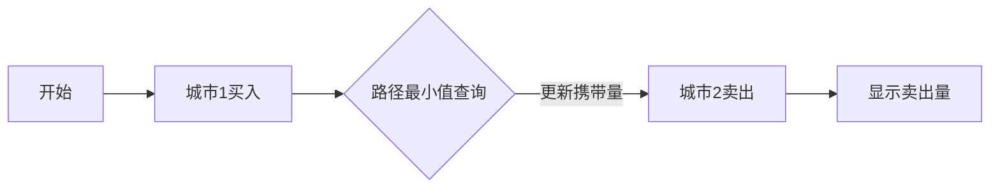

# 题目信息

# [SCOI2013] 摩托车交易

## 题目描述

mzry1992 在打完吊针出院之后，买了辆新摩托车，开始了在周边城市的黄金运送生意。在 mzry1992 生活的地方，城市之间是用双向高速公路连接的。另外，每条高速公路有一个载重上限，即在不考虑驾驶员和摩托车重量的情况下，如果所载货物的量超过某个值，则不能驶上该条高速公路。

今年，mzry1992 一共收到了来自 $n$ 个不同城市的 $n$ 份定订单，每个订单要求卖出上限为一定量的黄金，或是要求买入上限为一定量的黄金。由于订单并不是同时发来的，为了维护生意上的名声，mzry1992 不得不按照订单发来的顺序与客户进行交易。他与第i 个客户进行交易的具体步骤是：

1. 前往第 $i$ 个客户所在城市。当然，中途是完全允许经过其他城市的。 
2. 与第 $i$ 个客户进行交易，在此过程中他希望有限制的让交易额尽量大。具体的限制有两个：    
(a) 他希望与最后一个客户完成交易后，手上没有剩余黄金。  
(b) 由于黄金是很贵重的物品，不能出现因为买入过多黄金而造成在以后的运送过程中不得不丢弃黄金的情况。

一开始，mzry1992 位于第一个订单客户所在的城市。现在有一个好消息，有人提供了 mzry1992 免费试用周边城市的列车系统的资格。具体来讲，如果mzry1992希望从 $A$ 城市到达 $B$ 城市，且 $A$、$B$ 城市均有列车站的话，他可以携带着黄金与摩托车从 $A$ 城市乘坐列车到 $B$ 城市，这里假定乘坐列车没有载重限制。

现在已知城市间的交通系统情况和订单情况，请帮助 mzry1992 计算每个向 mzry1992 购买黄金的客户的购买量。


## 说明/提示

### 样例解释

第一组样例：其中一种合法的方案是最初从 $2$ 号城市买入 $5$ 单位的黄金，先走第三条高速公路到 $1$ 号城市，然后再坐列车到 $3$ 号城市，在 $3$ 号城市卖出 $3$ 单位的黄金，然后乘坐列车到 $1$ 城市，在 $1$ 号城市卖出 $2$ 单位的黄金。


第二组样例：其中一种合法的方案是最初从 $1$ 号城市买入 $4$ 单位的黄金，走第一条高速公路，在 $2$ 号城市买入 $3$ 单位的黄金，走第二条高速公路，在三城市点卖出 $6$ 单位的黄金，走第三条高速公路，在 $4$ 号城市卖出 $1$ 单位的黄金。

### 数据范围与约定

- 对于 $20\%$ 数据，$n \le 100$，$m \le 200$。
- 对于 $50\%$ 数据，$n \le 3000$，$m \le 6000$。
- 对于 $100\%$ 数据，$1 \le n \le 10^5$，$n - 1 \le m \le 2\times 10^5$，$0 \le q \le n$，$0 < |b_i| < 10^9$，$0 < w < 10^9$，保证任意两个城市之间是通过高速公路连通的。


## 样例 #1

### 输入

```
3 3 2
2 3 1
-6 5 -3
1 3 5
2 3 2
2 1 6
1 3
```

### 输出

```
3
2

```

## 样例 #2

### 输入

```
4 4 0
1 2 3 4
5 4 -6 -1
1 2 4
2 3 100
3 4 1
4 1 4```

### 输出

```
6
1 
```

# AI分析结果


# 💡 Kay的C++算法解析：摩托车交易 深入学习指南 💡

## 1. 题目解读与核心算法识别

✨ **本题主要考察**：图论建模与最大生成树（Kruskal重构树）

🗣️ **初步分析**：
> 解决摩托车交易问题的关键在于**贪心策略**与**图结构优化**。想象你是一名快递员，需要在城市间运输黄金包裹，高速公路有承重限制（像不同承重的桥梁），而火车站则是任意通行的地下隧道。我们的目标是：在每个城市尽量多买黄金，遇到道路限制时丢弃多余黄金，卖出时则尽量多卖。

> - **贪心策略**：买入时全买（相当于预支额度），运输中丢弃超重部分（相当于调整购买量），卖出时全卖（输出实际卖出量）
> - **图优化**：将火车站用∞边权连接，构建最大生成树（Kruskal重构树）确保路径最小边权最大化
> - **核心流程**：
>   1. 处理火车站（缩点或∞边连接）
>   2. 构建最大生成树
>   3. 倍增预处理LCA和路径最小值
>   4. 顺序模拟交易（取min(当前黄金，路径最小值)）

> **可视化设计**：采用8位像素风格（类似FC游戏）展示城市网格。关键元素：
> - 黄金量用金色方块堆叠表示
> - 路径最小值用闪烁红框高亮
> - 火车移动时播放"叮当"音效，超重丢弃时播放碎裂音效
> - 控制面板支持步进/自动播放（调速滑块）

---

## 2. 精选优质题解参考

**题解一：(来源：Azazеl)**
* **点评**：思路清晰直击核心，用Kruskal重构树优雅处理路径查询。代码规范（`f[][]`数组含义明确），算法高效（O(n log n)）。亮点：
  - 巧妙忽略题目冗余限制，聚焦核心问题
  - 重构树实现简洁，LCA查询路径最小值逻辑严谨
  - 边界处理完整（如`INF=1e18`防溢出）

**题解二：(来源：欧鹰)**
* **点评**：树剖实现独特，最大生成树构建完整。亮点：
  - 树剖实现路径最小值查询（`Query()`函数规范）
  - 火车处理采用统一连接点技巧
  - 包含调试经验分享（"数组开大防RE"实用建议）

**题解三：(来源：TEoS)**
* **点评**：问题分析透彻，教学性强。亮点：
  - 分步解析清晰（建树→预处理→模拟）
  - 引入"丢弃等价于少买"的生动比喻
  - 完整代码包含详细注释

---

## 3. 核心难点辨析与解题策略

1. **难点1：铁路站点的特殊处理**
   * **分析**：铁路站点间运输无限制，等价于边权∞。优质解法通过：
     - 建立虚拟中心点连接所有火车站（TEoS）
     - 或直接缩点（asuldb）
   * 💡 **学习笔记**：特殊点统一处理可简化图结构

2. **难点2：路径最小值的快速查询**
   * **分析**：需高效查询任意两点间最小边权。解法：
     - Kruskal重构树：LCA点权即路径最小值（Azazеl）
     - 树剖+线段树：DFS序转化区间查询（欧鹰）
   * 💡 **学习笔记**：重构树更简洁，树剖更通用

3. **难点3：交易过程的边界处理**
   * **分析**：买入/卖出时需同步更新携带量并处理超限：
     ```python
     # 伪代码示例
     gold = min(gold, path_limit)  # 丢弃超重部分
     if 当前城市为买入: gold += 可买入量
     else: 
         卖出量 = min(gold, 可卖出量)
         gold -= 卖出量
         print(卖出量)
     ```
   * 💡 **学习笔记**：贪心策略保证全局最优

### ✨ 解题技巧总结
- **技巧1：问题等价转换**（丢弃黄金=少买）
- **技巧2：特殊点统一处理**（∞边权缩点）
- **技巧3：重构树优化查询**（LCA直接得路径最小值）
- **技巧4：边界防御性编程**（`LLONG_MAX`防溢出）

---

## 4. C++核心代码实现赏析

**本题通用核心C++实现参考**
* **说明**：综合优质题解思路，采用Kruskal重构树+倍增LCA
* **完整核心代码**：
```cpp
#include<bits/stdc++.h>
#define int long long
using namespace std;
const int N=5e5+10;
const int INF=1e18;

struct Edge { int u,v,w; } e[N];
bool cmp(Edge a, Edge b) { return a.w > b.w; }

int n,m,q,cnt,tot;
int fa[N],val[N],f[N][20],dep[N];
vector<pair<int,int>> G[N];

int find(int x) { 
    return fa[x]==x ? x : fa[x]=find(fa[x]); 
}

void kruskal() {
    sort(e+1,e+m+1,cmp);
    for(int i=1;i<=n*2;i++) fa[i]=i;
    cnt=n;
    for(int i=1;i<=m;i++) {
        int u=find(e[i].u), v=find(e[i].v);
        if(u==v) continue;
        val[++cnt]=e[i].w;
        G[cnt].push_back({u,0});
        G[u].push_back({cnt,0});
        G[cnt].push_back({v,0});
        G[v].push_back({cnt,0});
        fa[u]=fa[v]=cnt;
    }
}

void dfs(int x,int fa) {
    dep[x]=dep[fa]+1;
    f[x][0]=fa;
    for(int i=1;i<=19;i++) 
        f[x][i]=f[f[x][i-1]][i-1];
    for(auto [v,w]:G[x]) 
        if(v!=fa) dfs(v,x);
}

int lca(int x,int y) {
    if(dep[x]<dep[y]) swap(x,y);
    for(int i=19;i>=0;i--)
        if(dep[f[x][i]]>=dep[y]) x=f[x][i];
    if(x==y) return val[x];
    for(int i=19;i>=0;i--)
        if(f[x][i]!=f[y][i]) 
            x=f[x][i], y=f[y][i];
    return val[f[x][0]];
}

signed main() {
    cin>>n>>m>>q;
    vector<int> city(n+1), gold(n+1);
    for(int i=1;i<=n;i++) cin>>city[i];
    for(int i=1;i<=n;i++) cin>>gold[i];
    
    // 处理火车（建立虚拟边）
    int train_root=0;
    if(q) {
        cin>>train_root;
        for(int i=1;i<q;i++) {
            int x; cin>>x;
            e[++m]={train_root,x,INF};
        }
    }
    
    // 读普通边
    for(int i=1;i<=m;i++) 
        cin>>e[i].u>>e[i].v>>e[i].w;
    
    kruskal();      // 构建重构树
    dfs(cnt,0);     // 倍增预处理
    
    // 模拟交易
    int cur=gold[city[1]];
    if(cur<0) cout<<"0\n", cur=0;
    
    for(int i=1;i<n;i++) {
        int u=city[i], v=city[i+1];
        cur = min(cur, lca(u,v));   // 丢弃超重黄金
        if(gold[v]>0) cur += gold[v];
        else {
            int sell = min(cur, -gold[v]);
            cout<<sell<<"\n";
            cur -= sell;
        }
    }
    return 0;
}
```
* **代码解读概要**：
  1. **输入处理**：读城市顺序/黄金量，火车点用∞边连接
  2. **重构树构建**：按边权降序合并，新节点存储边权
  3. **倍增预处理**：DFS计算深度和祖先关系
  4. **交易模拟**：
     - 每移动先更新携带量（`cur = min(cur,路径最小值)`)
     - 买入时直接累加，卖出时输出`min(携带量,可卖量)`

---

## 5. 算法可视化：像素动画演示

**主题**："黄金快递员"像素冒险（FC复古风格）

**核心演示**：


**动画帧设计**：
1. **初始化**：像素化城市网格（棕色地块），火车站标记为🔴
2. **建树过程**：边按权重从大到小加入，播放"连接"音效
3. **移动演示**：
   - 摩托车从`city[i]`移动到`city[i+1]`
   - 路径最小值用闪烁红框标注，超重黄金像素块碎裂消失
4. **交易事件**：
   - 买入：金色方块↑ + "金币"音效
   - 卖出：显示卖出量 + "收银"音效
5. **控制面板**：步进/播放/速度滑块，支持暂停观察状态

**交互设计**：
- 关键操作音效：移动（轮胎声）、丢弃（碎裂声）
- 过关机制：每完成一个城市交易点亮⭐
- 数据同步：实时显示携带黄金量/路径限制值

---

## 6. 拓展练习与相似问题思考

**通用技巧迁移**：
1. **路径最小值模型**：适用于网络可靠性问题（如[P1967 货车运输](https://www.luogu.com.cn/problem/P1967)）
2. **重构树应用**：处理瓶颈路问题（如[P4768 [NOI2018] 归程](https://www.luogu.com.cn/problem/P4768)）
3. **贪心模拟**：资源调度问题（如[P1080 国王游戏](https://www.luogu.com.cn/problem/P1080)）

**洛谷推荐**：
1. **P1967 货车运输**  
   🗣️ 最大生成树模板题，巩固路径最小值查询
2. **P4768 [NOI2018] 归程**  
   🗣️ 重构树进阶应用，结合最短路与最小边权
3. **P3275 [SCOI2011] 糖果**  
   🗣️ 贪心策略训练，理解约束传递

---

## 7. 学习心得与经验分享

> **参考经验**（来自Azazеl题解）：  
> "数组要开够大，否则可能爆WA而不是RE——重构树节点数可达2n"

> **Kay的总结**：  
> 调试时特别注意：
> 1. 重构树节点数开`2*n`
> 2. 无穷大取值`1e18`防溢出
> 3. LCA查询跳过根节点的边界处理

> 黄金交易本质是**资源约束下的贪心决策**，掌握核心三点：  
> - 图优化（最大生成树）  
> - 高效查询（倍增/树剖）  
> - 实时调整（取min丢弃）  

--- 

本次关于"摩托车交易"的C++解题分析就到这里。记住，算法能力的提升在于持续思考和勇于实践。下次我们再一起探索新的编程挑战！💪

---
处理用时：150.09秒