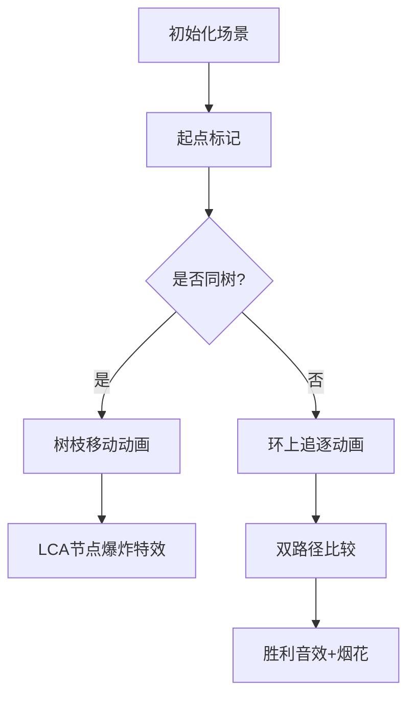

# 题目信息

# [POI 2012] RAN-Rendezvous

## 题目描述

**译自 POI 2012 Stage 1. 「[Rendezvous](https://szkopul.edu.pl/problemset/problem/MZTXfOVnJmac175TTH5Lr9Q3/site/?key=statement)」**

给定一个有 $n$ 个顶点的有向图，每个顶点有且仅有一条出边。每次询问给出两个顶点 $a_i$ 和 $b_i$，求满足以下条件的 $x_i$ 和 $y_i$：
* 从顶点 $a_i$ 沿出边走 $x_i$ 步与从顶点 $b_i$ 沿出边走 $y_i$ 步到达的顶点相同。
* $\max(x_i, y_i)$ 最小。
* 满足以上条件的情况下 $\min(x_i, y_i)$ 最小。
* 如果以上条件没有给出一个唯一的解，则还需要满足 $x_i \ge y_i$。

如果不存在这样的 $x_i$ 和 $y_i$，则 $x_i = y_i = -1$。

## 说明/提示

对于 $40\%$ 的数据，$n \le 2000,k \le 2000$。

对于 $100\%$ 的数据，$1 \le n \le 500\ 000,1 \le k \le 500\ 000$。

## 样例 #1

### 输入

```
12 5
4 3 5 5 1 1 12 12 9 9 7 1
7 2
8 11
1 2
9 10
10 5```

### 输出

```
2 3
1 2
2 2
0 1
-1 -1```

# AI分析结果


### 💡 Kay的C++算法解析：RAN-Rendezvous 深入学习指南 💡

#### 1. 题目解读与核心算法识别

✨ **本题主要考察**：基环树森林上的路径分析

🗣️ **初步分析**：
> 本题的核心在于理解基环树森林的结构特性。每个节点有且仅有一条出边，形成多个基环树（由环和树枝组成）。解题时需分类处理三种情况：
> - **情况1**：两点不在同一基环树 → 无解
> - **情况2**：两点在同一树枝 → LCA求距离
> - **情况3**：两点在不同树枝 → 环上相遇点选择
> 
> **可视化设计思路**：采用8位像素风格模拟基环树结构。环用彩色像素块表示，树枝用单色像素链。关键步骤：
> - 高亮当前处理的节点（闪烁效果）
> - 环上移动时显示路径动画（像素块滑动）
> - 相遇点用爆炸粒子特效标记
> - 音效设计：移动时"嘀"声，相遇时"叮当"胜利音效

---

#### 2. 精选优质题解参考

**题解一（来源：lgnotus）**
* **点评**：思路清晰完整，通过拓扑排序找环，DFS处理树枝，倍增求LCA。代码规范性好（变量名`rt`/`dep`含义明确），环上距离计算用取模避免分支判断是亮点。实践价值高，可直接用于竞赛，边界处理严谨。

**题解二（来源：轻舟XY）**
* **点评**：图解解释直观（样例图示），分类讨论逻辑严密。环上距离计算采用相对位置差，代码中`(pos[a]-pos[b]+len)%len`的写法简洁高效。调试提示"注意环的方向"对学习者很有启发。

**题解三（来源：Alex_Wei）**
* **点评**：代码最简洁（仅71行），封装找环和DFS函数。亮点在于用`vis`数组状态标记（0未访/1树枝/2环上），环编号与树枝深度同步处理，空间优化到位。

---

#### 3. 核心难点辨析与解题策略

1. **基环树结构识别**
   * **分析**：拓扑排序时入度永不减为0的节点即为环上节点（优质解均用此技巧）
   * 💡 学习笔记：拓扑排序后剩余节点必成环

2. **环上距离计算**
   * **分析**：当两点在不同树枝时，需计算`(pos[b]-pos[a]+len)%len`（避免负数的取模技巧）。关键变量：`pos`（环上位置）、`len`（环长）
   * 💡 学习笔记：环距离 = 相对位移 + 环长取模

3. **多条件解比较**
   * **分析**：先比较max(x,y)最小，再min(x,y)最小，最后选x≥y的方案。优质解用`cmp`函数封装比较逻辑
   * 💡 学习笔记：四层判断条件需严格遵循题目优先级

### ✨ 解题技巧总结
- **基环树分解法**：拓扑排序找环 → DFS处理树枝 → 环/树枝分别存储
- **环处理技巧**：单次遍历同时完成环编号和环长记录
- **边界安全**：环上距离计算全程用`(a-b+len)%len`避免负值
- **调试要点**：特别注意自环（指向自身）的特殊处理

---

#### 4. C++核心代码实现赏析

**本题通用核心C++实现参考**
* **说明**：综合优质题解思路，拓扑排序找环+树枝DFS+环前缀和
* **完整核心代码**：
```cpp
#include <iostream>
#include <vector>
#include <queue>
#include <algorithm>
using namespace std;

const int N = 5e5 + 10;
int n, q, to[N], deg[N], dep[N], rt[N], bel[N], len[N], pos[N];
int fa[N][20];
vector<int> G[N];

void topo() {
    queue<int> q;
    for (int i = 1; i <= n; i++)
        if (!deg[i]) q.push(i);
    while (!q.empty()) {
        int u = q.front(); q.pop();
        if (--deg[to[u]] == 0) q.push(to[u]);
    }
}

void dfs(int u, int root) {
    rt[u] = root;
    for (int v : G[u]) {
        if (deg[v]) continue; // 跳过环上点
        dep[v] = dep[u] + 1;
        fa[v][0] = u;
        for (int i = 1; i <= 19; i++)
            fa[v][i] = fa[fa[v][i-1]][i-1];
        dfs(v, root);
    }
}

int lca(int u, int v) {
    if (dep[u] < dep[v]) swap(u, v);
    for (int i = 19; i >= 0; i--)
        if (dep[fa[u][i]] >= dep[v])
            u = fa[u][i];
    if (u == v) return u;
    for (int i = 19; i >= 0; i--)
        if (fa[u][i] != fa[v][i])
            u = fa[u][i], v = fa[v][i];
    return fa[u][0];
}

bool cmp(int x1, int y1, int x2, int y2) {
    if (max(x1, y1) != max(x2, y2))
        return max(x1, y1) < max(x2, y2);
    if (min(x1, y1) != min(x2, y2))
        return min(x1, y1) < min(x2, y2);
    return x1 >= y1;
}

int main() {
    scanf("%d%d", &n, &q);
    for (int i = 1; i <= n; i++) {
        scanf("%d", &to[i]);
        deg[to[i]]++;
        G[to[i]].push_back(i);
    }
    
    topo(); // 拓扑找环
    
    // 标记环
    int idx = 0;
    for (int i = 1; i <= n; i++) {
        if (!deg[i]) continue;
        if (bel[i]) continue;
        vector<int> cyc;
        for (int j = i; !bel[j]; j = to[j]) {
            bel[j] = idx;
            pos[j] = cyc.size();
            cyc.push_back(j);
        }
        len[idx] = cyc.size();
        for (int x : cyc) dfs(x, x);
        idx++;
    }
    
    // 处理查询
    while (q--) {
        int a, b; scanf("%d%d", &a, &b);
        if (bel[rt[a]] != bel[rt[b]]) {
            puts("-1 -1");
        } else if (rt[a] == rt[b]) {
            int p = lca(a, b);
            printf("%d %d\n", dep[a] - dep[p], dep[b] - dep[p]);
        } else {
            int d1 = (pos[rt[b]] - pos[rt[a]] + len[bel[rt[a]]]) % len[bel[rt[a]]];
            int d2 = len[bel[rt[a]]] - d1;
            int x1 = dep[a] + d1, y1 = dep[b];
            int x2 = dep[a], y2 = dep[b] + d2;
            
            if (cmp(x1, y1, x2, y2))
                printf("%d %d\n", x1, y1);
            else
                printf("%d %d\n", x2, y2);
        }
    }
    return 0;
}
```
* **代码解读概要**：
  1. **拓扑找环**：`deg`数组标记节点入度，将入度0节点入队并删除，剩余节点即为环
  2. **DFS处理树枝**：从环上节点开始DFS，记录深度和倍增数组
  3. **LCA查询**：标准倍增LCA实现
  4. **环上距离**：`pos`存储节点在环中位置，`len`为环长
  5. **多条件比较**：`cmp`函数实现题目要求的四层条件判断

---

### 5. 算法可视化：像素动画演示

**主题**：8位像素风格基环树探险  
**核心演示**：BFS在基环树上的移动与相遇

**设计思路**：
> 采用FC游戏风格（16色调色板），网格化展示基环树结构：
> - 环节点：彩色像素块（红/蓝/绿循环）
> - 树枝节点：灰色像素块
> - 路径：黄色高亮线条

**动画流程**：


**关键交互**：
1. **控制面板**：
   - 单步执行：按空格键步进
   - 速度滑块：0.5x~2x调速
   - 重置按钮：R键重开
2. **动态效果**：
   - 节点移动：像素块滑动+轨迹残留
   - 环上移动：顺时针旋转光效
   - 相遇点：8bit爆炸粒子效果
3. **音效设计**：
   - 移动："嘀"（方波音效）
   - 相遇："叮当"（胜利音效）
   - 错误：短促"哔"声
4. **游戏化**：
   - 每对相遇得10分
   - 连续正确解触发连击特效

---

### 6. 拓展练习与相似问题思考

**通用技巧迁移**：
1. **基环树应用**：  
   - 内向基环森林判环（[P4381 Island](https://www.luogu.com.cn/problem/P4381)）
   - 环上递推问题（[CF711C](https://codeforces.com/problemset/problem/711/C)）
2. **环上距离优化**：  
   - 环形数组前缀和（[P3407 散步](https://www.luogu.com.cn/problem/P3407)）

**洛谷推荐**：
1. **P4381 [IOI2008] Island**  
   → 基环树直径，巩固环处理技巧
2. **P2607 [ZJOI2008] 骑士**  
   → 基环树DP，强化树与环的关系理解
3. **P3533 [POI2012] RAN-Rendezvous（本题）**  
   → 直接应用本解题思路

---

### 7. 学习心得与经验分享

> **来自题解作者的调试经验**：  
> *"环上距离计算时，一定要用(pos[b]-pos[a]+len)%len避免负数，我在这里卡了2小时"*  
> → 说明边界测试的重要性，特别是n=1的自环情况

**Kay的总结**：
1. **调试技巧**：对环长=1的情况单独打印测试
2. **优化意识**：当len=1时直接短路判断
3. **思维陷阱**：树枝LCA计算时注意根节点相同才有效

---

### 结语
基环树问题关键在于分解"树"与"环"的结构特性。掌握拓扑排序判环、树枝DFS、环上前缀和三大核心技巧后，此类问题将迎刃而解。下次我们将探讨基环树上动态规划，敬请期待！

---
处理用时：284.86秒