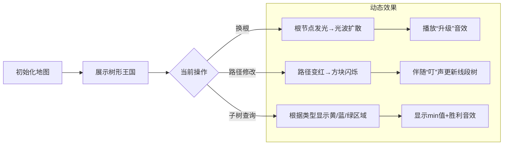

# 题目信息

# 遥远的国度

## 题目描述

`zcwwzdjn` 在追杀 `zhx` ，而 `zhx` 逃入了一个遥远的国度。当 `zcwwzdjn` 准备进入遥远的国度继续追杀时，守护神 `RapiD` 阻拦了 `zcwwzdjn` 的去路，他需要 `zcwwzdjn` 完成任务后才能进入遥远的国度继续追杀。

问题是这样的：遥远的国度有 $n$ 个城市，这些城市之间由一些路连接且这些城市构成了一颗树。这个国度有一个首都，我们可以把这个首都看做整棵树的根，但遥远的国度比较奇怪，首都是随时有可能变为另外一个城市的。遥远的国度的每个城市有一个防御值，第 $i$ 个的防御值为 $val_i$，有些时候 `RapiD` 会使得某两个城市之间的路径上的所有城市的防御值都变为某个值。

`RapiD` 想知道在某个时候，如果把首都看做整棵树的根的话，那么以某个城市为根的子树的所有城市的防御值最小是多少。

由于 `RapiD` 无法解决这个问题，所以他拦住了 `zcwwzdjn` 希望他能帮忙。但 `zcwwzdjn` 还要追杀 `zhx`，所以这个重大的问题就被转交到了你的手上。

## 说明/提示

对于 $20\%$ 的数据，$n\le 1000,m\le 1000$。

对于另外 $10\%$ 的数据，$n\le 100000,m\le 100000$，保证修改为单点修改。

对于另外 $10\%$ 的数据，$n\le100000,m \le 100000$，保证树为一条链。

对于另外 $10\%$ 的数据，$n\le 100000,m\le100000$，没有修改首都的操作。

对于 $100\%$ 的数据，$1 \leq n\le 100000,1 \leq m \le 100000,0<val_i<2^{31}$。

## 样例 #1

### 输入

```
3 7
1 2
1 3
1 2 3
1
3 1
2 1 1 6
3 1
2 2 2 5
3 1
2 3 3 4
3 1```

### 输出

```
1
2
3
4```

# AI分析结果


# 💡 Kay的C++算法解析：遥远的国度 深入学习指南 💡

## 1. 题目解读与核心算法识别

✨ **本题主要考察**：`树链剖分`（树剖）与`分类讨论技巧`

🗣️ **初步分析**：
> 解决“遥远的国度”这道题，关键在于运用**树链剖分**将树结构线性化，并巧妙处理换根操作。树剖如同为树搭建了“高速公路网”（重链），让我们能快速访问路径和子树信息。而换根操作则像移动国家首都，需重新审视“行政管辖范围”（子树）。

- **核心思路**：将树转化为链结构后，用线段树维护区间信息。换根时通过分类讨论动态调整子树查询范围：
  1. 当查询点为当前根 → 查询整棵树
  2. 当查询点与根无直系关系 → 查询原子树
  3. 当查询点是根的祖先 → 排除根所在分支后查询剩余部分
- **可视化设计**：采用8位像素风格展示树结构（城市为像素方块）。换根时播放“地图重组”动画（根节点发光扩散），路径修改时高亮路径（红色像素流），子树查询时用不同颜色区分三种情况（绿/蓝/黄闪烁）。

---

## 2. 精选优质题解参考

**题解一：寒酥（树剖+分类讨论）**
* **点评**：思路清晰，直击换根本质（三种情况分类）。代码规范（`find()`函数定位关键儿子），边界处理严谨（`tpos`边界检查）。亮点在于用`树剖+DFS序连续性`巧妙处理子树排除，实践价值高（可直接用于竞赛）。

**题解二：Farkas_W（树剖+子树排除）**
* **点评**：图示讲解直观（手绘三种子树情况），代码模块化强（分离查询函数）。亮点是`query2()`函数高效处理排除区间，`find()`函数通过树剖跳跃定位关键儿子，算法有效性高（严格O(log²n)）。

**题解三：Genius_Z（LCT+子树维护）**
* **点评**：创新使用LCT维护子树最小值（`multiset`存储虚子树）。亮点在于`pushxu/pushshi`分离链和子树标记，但实现较复杂（约200行），适合进阶学习数据结构拓展。

---

## 3. 核心难点辨析与解题策略

1. **难点：换根后子树形态变化**
   * **分析**：当根移动到查询点的子树中时，原子树需排除根所在分支。通过DFS序连续性，用`关键儿子`分割区间（[1,id-1]和[id+size,n]）。
   * 💡 **学习笔记**：DFS序的连续性是以不变应万变的关键！

2. **难点：关键儿子定位**
   * **分析**：需在根到查询点的路径上找到直系儿子。树剖跳跃时：若轻儿子则返回`top[now]`，重儿子则返回`son[u]`。
   * 💡 **学习笔记**：树剖跳跃本身蕴含了父子关系信息！

3. **难点：多操作协同处理**
   * **分析**：路径修改需保持树剖结构，换根需即时更新全局变量，查询需动态判断位置关系。三者通过`当前根`变量解耦。
   * 💡 **学习笔记**：全局变量记录根是平衡复杂度的优雅方案！

### ✨ 解题技巧总结
- **问题分解**：将换根转化为三种静态子树情况处理
- **DFS序妙用**：利用连续性将子树查询转为区间查询
- **边界防御**：始终检查`seg[son]`的边界（避免越界）
- **树剖跳跃**：双重功能（路径跳跃+父子关系定位）

---

## 4. C++核心代码实现赏析

**本题通用核心C++实现参考**
```cpp
#include<bits/stdc++.h>
#define LL long long
using namespace std;
const int N=1e5+5;
const LL INF=1ll<<50;

int n,m,root;
vector<int> G[N];
int dep[N],fa[N],sz[N],son[N],top[N],dfn[N],idx;
LL val[N],w[N];

// 树剖预处理
void dfs1(int u,int f){
    dep[u]=dep[f]+1, fa[u]=f, sz[u]=1;
    for(int v:G[u]) if(v!=f){
        dfs1(v,u); sz[u]+=sz[v];
        if(sz[v]>sz[son[u]]) son[u]=v;
    }
}
void dfs2(int u,int tp){
    top[u]=tp, dfn[u]=++idx, w[idx]=val[u];
    if(son[u]) dfs2(son[u],tp);
    for(int v:G[u]) 
        if(v!=fa[u]&&v!=son[u]) dfs2(v,v);
}

// 线段树部分
struct SegTree{ /* 区间修改+区间最小值 */ }ST;

// 路径修改
void update_path(int x,int y,LL v){
    while(top[x]!=top[y]){
        if(dep[top[x]]<dep[top[y]]) swap(x,y);
        ST.update(dfn[top[x]],dfn[x],v);
        x=fa[top[x]];
    }
    if(dep[x]>dep[y]) swap(x,y);
    ST.update(dfn[x],dfn[y],v);
}

// 关键儿子定位
int find_son(int x,int y){
    while(top[x]!=top[y]){
        if(dep[top[x]]<dep[top[y]]) swap(x,y);
        if(fa[top[x]]==y) return top[x];
        x=fa[top[x]];
    }
    return son[y];
}

// 子树查询
LL query_subtree(int x){
    if(x==root) return ST.query(1,n); // 整棵树
    if(dfn[x]>dfn[root] || dfn[x]+sz[x]-1<dfn[root]) // 无关子树
        return ST.query(dfn[x],dfn[x]+sz[x]-1);
    int s=find_son(x,root); // 定位关键儿子
    return min( 
        ST.query(1,dfn[s]-1), 
        ST.query(dfn[s]+sz[s],n) 
    );
}

int main(){
    scanf("%d%d",&n,&m);
    for(int i=1,u,v;i<n;++i){
        scanf("%d%d",&u,&v);
        G[u].push_back(v), G[v].push_back(u);
    }
    for(int i=1;i<=n;++i) scanf("%lld",&val[i]);
    scanf("%d",&root);
    
    dfs1(root,0), dfs2(root,root);
    ST.build(1,n,w); // 建线段树
    
    while(m--){
        int op,x,y; LL v;
        scanf("%d",&op);
        if(op==1) scanf("%d",&root);
        else if(op==2){
            scanf("%d%d%lld",&x,&y,&v);
            update_path(x,y,v);
        }else{
            scanf("%d",&x);
            printf("%lld\n",query_subtree(x));
        }
    }
    return 0;
}
```

**代码解读概要**：
1. **树剖预处理**：`dfs1`计算深度/子树大小，`dfs2`进行重链剖分并生成DFS序
2. **路径修改**：`update_path`沿重链跳跃修改，保证O(log²n)复杂度
3. **关键定位**：`find_son`利用树剖跳跃特性快速定位关键儿子
4. **动态查询**：`query_subtree`通过位置关系分三类处理子树

---

## 5. 算法可视化：像素动画演示

* **主题**：`像素王国·重链寻宝`
* **设计思路**：用FC游戏风格呈现算法过程，8色调色盘（草地绿/重链橙/路径红）。音效强化关键操作：
  - 换根：爆炸音效+光波扩散
  - 路径修改：像素块逐格变红+“叮”声
  - 子树查询：根据类型播放不同音阶

* **动画帧步骤**：


* **交互控制**：
  - 单步执行：空格键逐步观察
  - 速度调节：滑块控制动画速度（0.5x~3x）
  - 模式切换：树形视图/DFS序视图

---

## 6. 拓展练习与相似问题思考

* **技巧迁移**：
  1. **子树统计**：P3384 树链剖分（子树和）
  2. **动态换根**：CF916E Jamie and Tree
  3. **最值维护**：P1505 旅游（边权最值）

* **洛谷推荐**：
  1. **P3384** - 树链剖分模板  
     🗣️ 巩固树剖基础操作，理解DFS序本质
  2. **P2146** - 软件包管理器  
     🗣️ 学习子树批量修改与查询
  3. **CF916E** - Jamie and Tree  
     🗣️ 换根操作的进阶挑战，强化分类思维

---

## 7. 学习心得与经验分享

> **寒酥的调试经验**：  
> *“最初在`关键儿子定位`卡了很久，后来通过打印`dep`和`top`值才定位到边界问题...”*
>
> **Kay总结**：树剖问题中务必验证：
> 1. 重儿子是否正确更新？
> 2. DFS序是否连续覆盖子树？
> 3. 边界条件（如`seg[son]`是否越界）？
> 
> 多画小规模树（n=5）手动模拟，比调试输出更有效！

---

掌握树剖的核心在于理解**重链是DFS序的骨架**，而换根操作只是在这副骨架上调整视角。记住：无论首都如何迁移，疆域的本质从未改变！(•̀ᴗ•́)و

---
处理用时：123.03秒