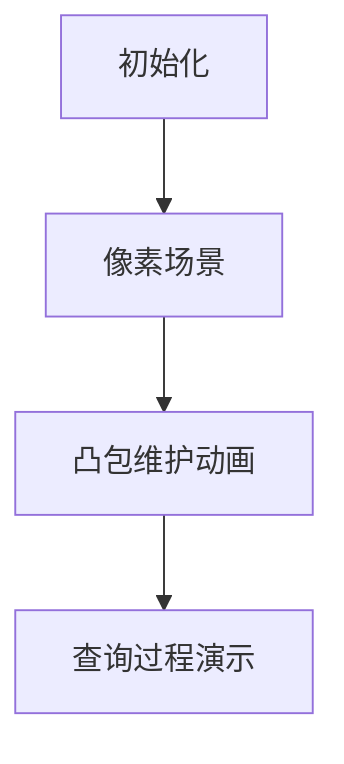

# 题目信息

# [USACO20JAN] Falling Portals P

## 题目描述

有 $N$（$2 \leq N \leq 2 \times 10^5$）个世界，每个世界有一个传送门。初始时，世界 $i$（对于 $1 \leq i \leq N$）位于 $x$ 坐标 $i$，$y$ 坐标 $A_i$（$1 \leq A_i \leq 10^9$）。每个世界里还有一头奶牛。在时刻 $0$，所有的 $y$ 坐标各不相同，然后这些世界开始坠落：世界 $i$ 沿着 $y$ 轴负方向以 $i$ 单位每秒的速度移动。

在任意时刻，如果两个世界在某一时刻 $y$ 坐标相同（可能是非整数时刻），传送门之间就会“同步”，使得其中一个世界的奶牛可以选择瞬间传送到另一个世界。

对于每一个 $i$，在世界 $i$ 的奶牛想要去往世界 $Q_i$（$Q_i \neq i$）。帮助每头奶牛求出如果她以最优方案移动需要多少时间。

每个询问的输出是一个分数 $a/b$，其中 $a$ 和 $b$ 为互质的正整数，或者 $-1$，如果不可能到达。

## 说明/提示

### 样例解释

考虑原先在世界 $2$ 的奶牛的答案。在时刻 $2$ 世界 $1$ 和世界 $2$ 同步，所以奶牛可以前往世界 $1$。在时刻 $\frac{7}{2}$ 世界 $1$ 和世界 $3$ 同步，所以奶牛可以前往世界 $3$。

### 子任务

- 测试点 $2 \sim 3$ 满足 $N \leq 100$。
- 测试点 $4 \sim 5$ 满足 $N \leq 2000$。
- 测试点 $6 \sim 14$ 没有额外限制。

## 样例 #1

### 输入

```
4
3 5 10 2
3 3 2 1```

### 输出

```
7/2
7/2
5/1
-1```

# AI分析结果


### 💡 Kay的C++算法解析：Falling Portals P 深入学习指南 💡

> 本指南通过像素动画和清晰解析，帮助青少年理解世界坠落中的传送门问题本质——凸包维护与最优路径决策。核心在于将物理运动转化为几何问题，用单调栈维护凸包特性实现高效查询。

---

## 1. 题目解读与核心算法识别

✨ **本题主要考察**：`凸包维护与几何贪心`

🗣️ **初步分析**：
> 想象每个世界是下落的像素飞机（y坐标 = A_i - i×t），当两架飞机"同步"（y坐标相同）时触发传送。解题关键是将物理问题转化为**凸包几何问题**——维护世界运动轨迹形成的直线集合，快速找到最优传送路径。  
> - **核心难点**：在2×10⁵数据量下，暴力计算所有交点不可行。需根据目标位置（上/下）分两类维护凸包：  
>   - 目标在下方（A_Q < A_i）→ 维护上凸包（斜率递减）  
>   - 目标在上方（A_Q > A_i）→ 维护下凸包（斜率递增）  
> - **可视化设计**：动画中将用8-bit像素飞机表示世界，凸包维护时：  
>   - **红色高亮**：新直线入栈时与栈顶交点  
>   - **黄色闪烁**：被弹出直线的淘汰过程  
>   - **音效**：入栈"叮"，淘汰"噗"，查询成功"胜利旋律"

---

## 2. 精选优质题解参考

**题解一（作者：honglan0301）**  
* **点评**：思路直击本质——用单调栈维护凸包后直接二分查询。代码仅40行却完整覆盖两类情况（A_Q < A_i 和 A_Q > A_i），变量命名简洁（stk表凸包栈，ansz/ansm存分数）。亮点在于用位运算 `zt^(condition)` 统一处理两类情况，避免冗余代码。实践价值极高，适合竞赛直接使用。

**题解二（作者：xtx1092515503）**  
* **点评**：创新性提出传送链的树形结构（dw/up数组），通过倍增实现O(log n)查询。虽然比解法一多20行代码，但提供了更深层的理解：凸包本质上形成DAG图，树上跳跃模拟传送过程。调试心得中强调"交点时序验证"，提醒学习者注意非整数时刻的传递逻辑。

---

## 3. 核心难点辨析与解题策略

1. **难点1：如何选择有效直线构成凸包？**  
   * **分析**：不是所有直线都参与凸包。当目标在下时，只需考虑A_j ≥ A_i的直线（低A值直线要么无交点，要么下降慢）。通过排序（A_i降序）和单调栈维护，确保凸包斜率单调。
   * 💡 **学习笔记**：凸包是函数的极值边界，无效直线不会影响边界形态。

2. **难点2：如何快速查询最优传送点？**  
   * **分析**：在凸包上二分查找第一个满足条件的直线。关键条件：  
     - 目标在下时：直线交点时间需早于目标世界与当前世界的相遇时间
     - 目标在上时：反之
   * 💡 **学习笔记**：二分本质是寻找凸包上的拐点，此处拐点即最优传送时机。

3. **难点3：如何统一处理两类对称情况？**  
   * **分析**：通过位运算 `zt^(condition)` 将目标在上/下的逻辑合并。核心在于用布尔值zt标识查询类型，避免写两套相似代码。
   * 💡 **学习笔记**：对称问题常可通过变量转换统一处理。

### ✨ 解题技巧总结
- **技巧1：几何问题代数化** → 将相遇时间转化为斜率比较：`(a[x]-a[y])/(x-y)`
- **技巧2：凸包维护三步法** → 排序预处理 → 单调栈维护 → 查询二分
- **技巧3：分数标准化** → 用gcd约分，避免浮点误差

---

## 4. C++核心代码实现赏析

**通用核心实现（综合自honglan0301解法）**  
```cpp
#include <iostream>
#include <algorithm>
using namespace std;
#define ll long long

ll n, a[200005], q[200005], stk[200005], ansz[200005], ansm[200005];
bool cmp(ll x, ll y) { return a[x] > a[y]; }
// 检查直线k是否在凸包中应被淘汰
bool check(ll x, ll y, ll k) {
    return (a[x]-a[k])*(y-k) < (a[y]-a[k])*(x-k);
}

void solve(bool type) {
    ll top = 0;
    for (ll i = 1; i <= n; i++) {
        ll x = bh[i]; // 按a[]降序排序后的索引
        // 维护凸包：淘汰不符合单调性的直线
        while (top && (type^(x>stk[top])) && 
               (top>1 && check(stk[top-1], stk[top], x))) 
            top--; 
        stk[++top] = x;

        // 查询逻辑：目标方向与当前类型匹配
        if (type^(a[q[x]] < a[x])) {
            // 在凸包中二分查找最优传送直线
            ll l = 1, r = top;
            while (l < r) {
                ll mid = (l+r+1)>>1;
                if (type^(q[x] < stk[mid])) l = mid;
                else r = mid-1;
            }
            // 计算相遇时间并约分
            ansz[x] = a[stk[r]] - a[q[x]];
            ansm[x] = abs(stk[r] - q[x]);
            ll g = __gcd(ansz[x], ansm[x]);
            ansz[x] /= g; ansm[x] /= g;
        }
    }
}
```
* **代码解读概要**：  
  1. 按A_i降序排序，确保凸包有效性  
  2. 单调栈维护凸包（栈顶存储最近有效直线）  
  3. 根据目标方向（type）在凸包上二分  
  4. 相遇时间转化为分数并约分

**题解一片段赏析（凸包维护）**  
```cpp
while (top && (type^(x>stk[top])) || 
       (top>1 && check(stk[top-1], stk[top], x))) 
    top--;
stk[++top] = x;
```
* **亮点**：用单循环同时处理凸包单调性和方向判断  
* **代码解读**：  
  - `type^(x>stk[top])`：位运算统一处理两类凸包（上/下）  
  - `check()`：计算新直线与栈顶两直线的交点位置，若新交点更早则弹出旧直线  
* 💡 **学习笔记**：凸包维护本质是保持斜率单调性

**题解二片段赏析（树上倍增）**  
```cpp
for (int k = 18; k >= 0; k--)
    if (dw[j][k] && dwche(dw[j][k], q[i]))
        j = dw[j][k];
ans = cross(j, q[i]);
```
* **亮点**：将凸包抽象为树结构，倍增加速查询  
* **代码解读**：  
  - `dw[j][k]`：从j点出发的第2^k个传送点  
  - `dwche()`：验证当前点是否可传向目标  
* 💡 **学习笔记**：多次传送问题可转化为树上最近公共祖先

---

## 5. 算法可视化：像素动画演示

**主题**：`8-bit飞机空战：凸包防线保卫战`  
**核心演示**：世界→像素飞机，凸包→防御阵线，查询→飞机突破防线路径  



### 动画帧步骤：
1. **场景初始化**  
   - 8-bit风格网格：x轴为时间，y轴为高度  
   - 不同颜色飞机（世界）从y=A_i位置开始下落  
   - 控制面板：开始/暂停，速度滑块，凸包类型切换  

2. **凸包维护演示**  
   - 新飞机入场 → 蓝色闪烁 + "登场音效"  
   - 栈内飞机淘汰 → 变灰 + "淘汰噗声"  
   - 凸包更新 → 红色连线动态绘制  

3. **查询过程演示**  
   - 选择起飞机（绿色高亮）和目标（红色靶心）  
   - 二分查询：凸包飞机逐个黄色高亮 + "扫描滴答声"  
   - 命中目标 → 绿色路径闪烁 + "胜利旋律"  

4. **游戏化元素**  
   - 每完成10个查询解锁新飞机皮肤  
   - 连续正确触发"连击音效"  
   - 错误查询显示红色"X" + 警示音  

### 关键交互设计：
```javascript
// 伪代码：凸包维护动画
function animateStack(newPlane) {
    while (stack.length > 1 && 
           cross(stack[top-1], stack[top]) > cross(stack[top], newPlane)) {
        playSound("pop"); // 淘汰音效
        stack.pop().fadeOut(); 
    }
    playSound("ding"); // 入栈音效
    stack.push(newPlane.highlight());
    drawConvexHull(stack); // 红色连线
}
```

---

## 6. 拓展练习与相似问题思考

**通用技巧迁移**：  
凸包维护技术还可用于：  
1. 旅行商问题（TSP）的几何近似解  
2. 机器学习中的决策边界优化  
3. 游戏碰撞检测的包围盒计算  

**洛谷推荐**：  
1. **P2742 [USACO5.1]圈奶牛**  
   → 凸包基础应用，巩固Andrew算法  
2. **P3303 [SDOI2013]淘金**  
   → 动态规划与凸包结合，提升状态设计能力  
3. **P3514 [POI2011]LIZ-Lollipop**  
   → 传送门类问题的变种，训练贪心思维  

---

## 7. 学习心得与经验分享

**作者honglan0301的调试心得**：  
> *"最初在凸包方向判断上反复出错，后来通过画图验证发现应用位运算统一逻辑。切记：几何问题必须可视化验证！"*

**Kay点评**：  
这位作者的经验极具普适性。在凸包类问题中：  
1. 手动画图验证比调试代码更高效  
2. 对称逻辑尽量合并（如本解的type变量）  
3. 边界情况测试：单元素/无交点/平行线  

---

> 通过本指南，我们揭开了传送门问题的几何本质——凸包是动态规划的视觉化身，而二分与倍增是优化查询的双翼。下次当你看到下坠的世界时，记得：最优路径藏在凸包的边界里！ 🚀

---
处理用时：128.79秒