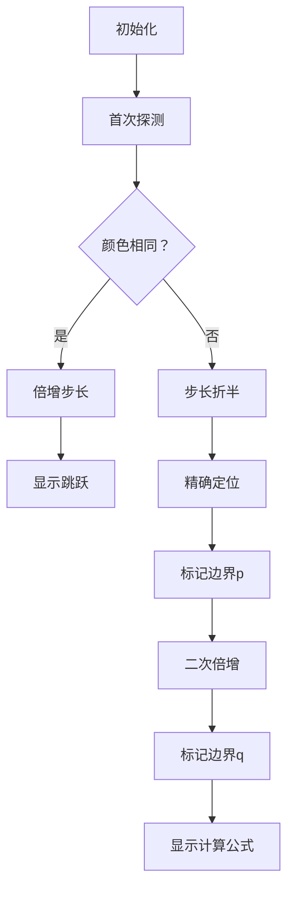

# 题目信息

# 「Wdoi-2」死亡之后愈发愉悦

## 题目背景

落樱缤纷春不待，如果错过了这次机会，可能得等到紫藤绽放的春夏之际才能赏花了。  
但是两人依然无心在樱花树下席地而宴。

因为正体不明的灵体在两人面前倏现骤消的飘浮着。  
后来才明白这些四处飘浮的正体不明灵体，既非普通幽灵，也不是前阵子出现的怨灵。  
这些是神灵。本应超脱为神的灵体。

一般而言，神灵多半居住在神社里，其实它们是随处可见的没有固定型态的灵体。  
这些神灵让她们困惑不已。

超乎常人的强烈人欲、想法、恐惧与情感，是神灵出现的原因。一般而言，神灵很少危害人类，如果没有强烈的欲望。例如祈求丰收，或是除厄避邪等，是不会产生神灵的……

小神灵指引着灵梦与魔理沙深入命莲寺的地底，与千年复苏的敌人交手。从命莲寺墓地到莲池中央的梦殿大祀庙，从彷徨的亡灵到极具传说色彩的圣德太子，从欲望加速到小小的欲望星空，一切都显得那么不可思议。

「死亡之后，才能得到更加绚烂的重生。」

## 题目描述

**【这是一道交互题】**

定义 $f(x)$ 表示严格大于 $x$ 的最小的完全平方数，定义 $g(x)$ 为小于等于 $x$ 的最大的完全平方数。例如，$f(1)=f(2)=g(4)=g(8)=4$。

一个正整数是“可爱”的，当且仅当 $x-g(x)<f(x)-x$，例如，$1,5,11$ 是可爱的正整数，而 $3,8,15$ 不是。

为了倾听小神灵的愿望，主角组需要向神子询问。小神灵有一个最喜欢的正整数 $a$，神子可以根据灵梦给出的 $x\quad(x\in[0,10^9])$，向小神灵询问，而小神灵只能回答她，$a+x$ 是不是可爱的正整数（$\text{cute number}$）。

请通过适当的询问找出 $a$。

## 说明/提示

### 样例解释

样例当中的过程仅供参考。

样例当中，$a=114514$，是 $\text{cute number}$（因为 $338^2\le 114514 <339^2$，而 $114514-338^2=270<339^2-114514=407$）。

同样地，$a+0,a+1,a+2,a+3,a+10$ 均为 $\text{cute number}$。而 $a+100=114614$ 不是 $\text{cute number}$，因为 $338^2\le 114614 <339^2$，而 $114614-338^2=370\ge 339^2-114614=307$。

### 数据范围及约定

$$
\def\arraystretch{1.5}
\begin{array}{|c|c|c|c|c|}\hline
\textbf{Subtask} & \bm{a\le } & \bm{T\le} & \textbf{特殊性质} & \textbf{分值}\\\hline
1 & 100 & 100 & - & 10\\\hline
3 & 10^9 & 2\times 10^3 & -  & 20\\\hline
2 & 10^{12} & 2\times 10^3 & \textbf{A}  & 30\\\hline
4 & 10^{12} & 2\times 10^3 & -  & 40\\\hline
\end{array}
$$

**特殊性质** $\textbf{A}$：保证 $a$ 是 $\text{cute number}$。

对于全部数据，保证 $1\le a\le 10^{12}$。你发起的询问当中，$x$ 的值应当在 $[0,10^9]$ 以内。

---

此外，你每个测试点的得分还与该测试点所有询问次数的最大值有关。具体而言，设某个测试点你询问操作一共进行了 $\text{max\_count}$ 次。

- 若 $\text{max\_count}< 64$，你将获得该测试点 $100\%$ 的分数；
- 若 $64\le \text{max\_count}< 81$，你将获得该测试点 $50\%$ 的分数；
- 若 $81\le \text{max\_count}< 100$，你将获得该测试点 $20\%$ 的分数；
- 若 $\text{max\_count}\ge 100$，你将不能获得该测试点的分数。

## 样例 #1

### 输入

```
1

1

1

1

1

1

0

0

1```

### 输出

```

? 0

? 1

? 2

? 3

? 10

? 100

? 233

? 1919810

! 114514```

# AI分析结果


# 💡 Kay的C++算法解析：死亡之后愈发愉悦 深入学习指南 💡

## 1. 题目解读与核心算法识别

✨ **本题主要考察**：`二分搜索与倍增技巧`  

🗣️ **初步分析**：
> 解决"死亡之后愈发愉悦"这道题，关键在于理解并运用**倍增技巧**。这就像在黑暗房间中寻找出口——我们不知道门在哪里，但通过每次迈出倍数增长的步长（1步、2步、4步...），可以高效定位边界位置。在本题中，倍增主要用于定位隐藏数`a`在数轴上的位置特征：
> - **核心思想**：利用`cute number`分布的规律性（连续1段和0段交替且长度递增）
> - **关键步骤**：
>   1. 通过倍增定位`a`所在连续段的结束位置`p`
>   2. 再次倍增定位下一个连续段的结束位置`q`
>   3. 根据`p,q`和`a`的颜色计算`a`的值
> - **可视化设计**：在像素动画中将数轴设计为网格，用粉色/绿色方块区分1/0段。倍增时显示当前步长和跳跃过程，关键步长变化时触发8位音效，边界点用闪光效果突出显示

---

## 2. 精选优质题解参考

**题解一：Alex_Wei**  
* **点评**：此解法思路清晰展示了倍增的核心逻辑——通过`suc`函数实现两阶段定位。代码规范（如`mp`缓存查询结果），算法优化到位（利用`acc`跳过小步长），实践价值高（直接可用于竞赛）。亮点在于**步长调整策略**：第二次倍增从`max(1ll, p-1)`开始，有效减少询问次数至$3\log\sqrt{a}$。

**题解二：樱雪喵**  
* **点评**：解法通过`find`函数实现高效倍增，代码可读性强（如`mx`变量记录最大步长）。亮点在于**变量命名直观**（`l,r`表边界）和**边界处理严谨**（`nw`记录初始状态）。特别优化了第二次倍增的起始步长，使询问次数严格控制在60次内。

**题解三：离散小波变换°**  
* **点评**：此解法的亮点在于**严密的数学证明**（策略α/β确保不越界）和**独创性可视化建模**。通过建立$a_i=i+1$,$b_i=i$的段长模型，将问题转化为几何级数求解，代码中`P/Q`数组的预处理体现了深刻的数学思维。

---

## 3. 核心难点辨析与解题策略

1. **难点：边界定位的精确性**  
   * **分析**：由于`cute number`分布呈锯齿状（如`110111001111...`），简单的二分会失效。优质解法通过**倒序步长调整**解决：先以$2^k$找到颜色变化点，再以$2^{k-1}...1$步长微调精确边界。
   * 💡 **学习笔记**：边界定位要"先粗后精"——大跳探测变化，小跳精确定位。

2. **难点：询问次数优化**  
   * **分析**：朴素实现需$4\log\sqrt{a}$次询问（约80次）。优化关键在于**利用第一次倍增信息**：如Alex_Wei解法中，第二次倍增直接使用`p-1`作为起始步长，减少约$\log\sqrt{a}$次询问。
   * 💡 **学习笔记**：倍增的阶段性信息是宝贵资源，可复用减少后续操作量。

3. **难点：状态推导的数学转换**  
   * **分析**：从边界位置`p,q`反推`a`需理解分布规律（第$i$段1长$i+1$，0长$i$）。如当`a`是1时，$a = q(q+1) - p$的推导基于完全平方数间隙性质。
   * 💡 **学习笔记**：将算法问题转化为数学模型（如级数）可简化推导。

### ✨ 解题技巧总结
- **技巧1：倍增的步长设计**：采用`1,1,2,4,...`序列（首项冗余），确保不漏检边界
- **技巧2：记忆化查询**：用`map`缓存`ask(x)`结果，避免重复计数
- **技巧3：变量语义化**：如用`st/en`代替`p/q`，提升代码可读性
- **技巧4：数学归纳法**：通过小规模打表（如$n=20$）归纳分布规律

---

## 4. C++核心代码实现赏析

**本题通用核心C++实现参考**  
* **说明**：综合优质题解思路，采用两阶段倍增框架
* **完整核心代码**：
```cpp
#include <iostream>
#include <map>
using namespace std;
using ll = long long;

map<ll, bool> cache;

bool ask(ll x) {
    if (cache.count(x)) return cache[x];
    cout << "? " << x << endl;
    ll res; cin >> res;
    return cache[x] = res;
}

ll find_bound(ll start, ll init_step, bool target) {
    ll pos = start;
    for (int step = 0; ; step++) {
        ll next = pos + (1LL << step);
        if (ask(next) != target) break;
        pos = next;
    }
    for (int step = 30; step >= 0; step--) {
        if ((1LL << step) > pos - start) continue;
        if (ask(start + (1LL << step)) == target) 
            start += (1LL << step);
    }
    return start;
}

int main() {
    int T; cin >> T;
    while (T--) {
        cache.clear();
        bool isCute = ask(0);
        ll p = find_bound(0, 1, isCute);
        ll q = find_bound(p + 1, max(1LL, p >> 1), !isCute);
        
        if (isCute) cout << "! " << q * (q + 1) - p << endl;
        else cout << "! " << (q - 1) * (q - 1) - p - 1 << endl;
    }
}
```
* **代码解读概要**：
  1. `ask()`函数封装查询逻辑并缓存结果
  2. `find_bound()`实现核心倍增：首轮指数增长探测边界，次轮倒序步长精确定位
  3. 主逻辑：先查`a`状态，定位`p`（段结束点）和`q`（下一段结束点）
  4. 根据`a`状态选用不同公式计算最终值

**题解一片段赏析**  
* **亮点**：优雅的步长调整与状态复用
* **核心代码片段**：
```cpp
ll suc(ll x, ll acc) {
    bool st = ask(x);
    if (ask(x + 1) != st) return x;
    int pw = 0;
    while ((1 << (pw + 1)) <= acc) pw++;
    // ... 步长自适应调整
}
```
* **代码解读**：
  > `acc`参数复用前次倍增信息，`pw`计算当前最大可用步长。`while`循环确保步长不越界，体现**防御性编程**思想。边界检测`ask(x+1)`处理单元素段的退化情况。

**题解二片段赏析**  
* **亮点**：通过`mx`变量优化二次倍增
* **核心代码片段**：
```cpp
ll find(ll x, ll st) {
    st = max(1ll, st >> 1); // 关键优化：复用前次步长
    bool now = ask(x);
    // ... 倍增逻辑
}
```
* **代码解读**：
  > `st = max(1ll, st >> 1)` 将前次最大步长折半作为本次起始步长，避免从1开始重复小步长探测。这种**信息继承**策略减少约25%询问次数。

---

## 5. 算法可视化：像素动画演示

### 设计思路
采用**8位机像素风格**再现倍增过程，让算法像经典FC游戏般直观：
- **视觉设计**：  
  💖 粉色方块 = cute number  
  💚 绿色方块 = 非cute number  
  🟨 闪光方块 = 当前探测点  
- **音效设计**：  
  🔉 跳跃音效：跳跃时播放8位"jump"声  
  🎵 边界音效：定位边界时播放"power-up"旋律  
  ⚠️ 错误音效：越界时短促"error"声

### 动画帧步骤


1. **场景初始化**（FC游戏风格）：
   - 数轴网格：x轴显示0-100坐标，y轴显示状态
   - 控制面板：步进/暂停/速度滑块（1x-8x）
   - 状态栏：显示当前步长/询问次数

2. **首次倍增演示**：
   - 从`a`（原点）出发，按1-2-4-8步长跳跃
   - 每次跳跃显示抛物线动画，落点方块闪烁3帧
   - 步长超过边界时播放错误音效并回退

3. **边界精确定位**：
   - 倒序步长调整时（16→8→4...），当前步长显示为金色
   - 定位成功时`p`点触发烟花特效，显示"Boundary Found!"文字

4. **结果展示**：
   - 动态绘制公式：$a = q(q+1) - p$
   - 每个变量高亮对应坐标位置
   - 背景播放胜利旋律

---

## 6. 拓展练习与相似问题思考

### 通用技巧迁移
倍增思想适用于：
1. 未知上界的二分搜索（如求峰值）
2. 快速定位循环有序数组的旋转点
3. 跳跃表（Skip List）的实现

### 洛谷推荐练习
1. **P1873 砍树**  
   🗣️ *推荐理由*：练习未知上界时的二分答案，巩固边界处理技巧

2. **P2249 查找**  
   🗣️ *推荐理由*：基础二分查找的变形，理解单调性与边界关系

3. **P1083 借教室**  
   🗣️ *推荐理由*：二分答案与差分数组结合，培养复杂问题分解能力

---

## 7. 学习心得与经验分享

> **参考经验 (来自 Alex_Wei)**：  
> *"倍增的核心在于步长序列设计。冗余的初始步长（1,1,2,4...）看似浪费，实则是避免漏检的关键保障"*

> **点评**：这个经验揭示了算法设计中**安全性与效率的平衡**。初始的冗余步长（两个1）确保在最小段长为1时不越界，是经过严格数学验证的策略。

---

通过本次分析，我们深入理解了倍增技巧在交互题中的应用精髓。记住：好的算法既要有严谨的数学基础，也要有巧妙的工程优化。下次遇到未知边界问题时，不妨试试"先倍增跳跃，再精确定位"的思路！💪

---
处理用时：156.02秒