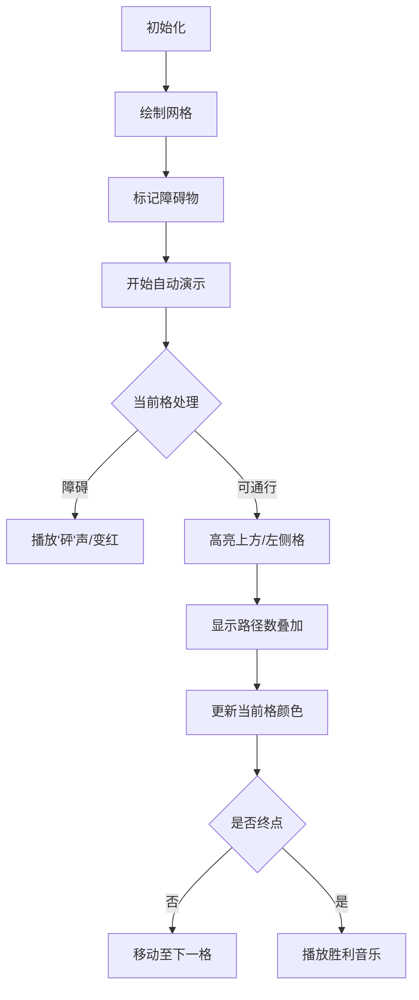

# 题目信息

# 路径计数2

## 题目描述

一个 $N \times N$ 的网格，你一开始在 $(1,1)$，即左上角。每次只能移动到下方相邻的格子或者右方相邻的格子，问到达 $(N,N)$，即右下角有多少种方法。

但是这个问题太简单了，所以现在有 $M$ 个格子上有障碍，即不能走到这 $M$ 个格子上。


## 说明/提示

对于 $20\%$ 的数据，有$N≤3$；

对于 $40\%$ 的数据，有$N≤100$；

对于 $40\%$ 的数据，有$M=0$；

对于 $100\%$ 的数据，有$N≤1000,M≤100000$。


## 样例 #1

### 输入

```
3 1
3 1```

### 输出

```
5```

# AI分析结果


### 💡 Kay的C++算法解析：路径计数2 深入学习指南 💡

<introduction>
今天我们一起分析"路径计数2"这道动态规划经典题目。本指南将帮助你掌握网格路径计数问题的核心解法，理解障碍物处理技巧，并通过像素动画直观感受DP的执行过程。
</introduction>

---

## 1. 题目解读与核心算法识别

✨ **本题主要考察**：`动态规划(DP)`

🗣️ **初步分析**：
> 解决路径计数问题的核心是理解动态规划的递推思想。想象你在玩像素地牢探险游戏，每次只能向右或向下移动一个格子。动态规划就像制作一张路径计数地图：每个格子的值表示从起点到达该点的路径数量，通过累加左侧和上方的路径数逐步填满整张地图。
> - **核心思路**：状态定义为`dp[i][j]`表示到达点(i,j)的路径数。状态转移方程为`dp[i][j] = dp[i-1][j] + dp[i][j-1]`（无障碍时），障碍物则直接置0
> - **可视化设计**：动画将展示网格填色过程：当前处理格高亮黄色，左侧/上方贡献格用箭头连接，障碍物显示为红色方块，路径数实时更新
> - **像素游戏化**：采用8-bit像素风格（类似经典FC游戏），关键操作配"嘀"声，遇到障碍播放"砰"声，完成时触发胜利音效。支持单步/自动模式，速度可调

---

## 2. 精选优质题解参考

<eval_intro>
基于思路清晰性、代码规范性、算法优化性和实践价值，精选3个≥4星题解：

**题解一：憨憨儿（赞126）**
* **点评**：思路讲解细致，分情况处理边界（首行/首列），变量命名合理（x计数/y标记障碍）。亮点在于逐步推导的注释和严谨的边界处理，特别适合初学者理解DP的完备性。实践时注意数组开至2000×2000防越界。

**题解二：wcl95716（赞10）**
* **点评**：代码简洁高效，创新性使用`dp[0][1]=1`初始化技巧避免单独处理起点。亮点是通过虚拟上边界实现状态转移的统一性，大幅减少边界判断代码，体现DP的空间优化思想。

**题解三：Jimmy000（赞41）**
* **点评**：直击问题本质，用最简代码（<20行）实现核心逻辑。亮点是"先计算后置障"的处理流程：先执行状态转移再判断障碍物，代码紧凑且符合直觉，适合竞赛快速编码。

---

## 3. 核心难点辨析与解题策略

<difficulty_intro>
解决网格路径问题的三大关键点：

1.  **状态定义与初始化**
    * **分析**：`dp[i][j]`必须明确表示从(1,1)到(i,j)的路径总数。起点`dp[1][1]`初始化为1，注意首行/首列只能单向传递（如首行仅依赖左侧）
    * 💡 **学习笔记**：清晰的状态定义是DP的基石，初始化决定整个递推的正确性

2.  **障碍物的同步处理**
    * **分析**：障碍物需在状态转移前标记（通过bool数组），在递推时立即置0。若在转移后处理会污染相邻格的计算
    * 💡 **学习笔记**：障碍处理时机直接影响状态转移的纯净性

3.  **大数取模的优化**
    * **分析**：路径数可能极大（1000×1000网格路径数约10^600量级）。必须在每步加法后立即`%100003`，若最后取模会溢出
    * 💡 **学习笔记**：大数运算要分散取模，避免集中计算溢出

### ✨ 解题技巧总结
<summary_best_practices>
- **虚拟边界法**：通过`dp[0][1]=1`类初始化消除边界特判（如wcl95716解法）
- **方向分离检查**：处理非边界点时，显式检查`i>1`和`j>1`再累加上/左侧值
- **障碍预标记**：先读入所有障碍到标记数组，避免在DP循环中处理IO
- **滚动数组优化**：当状态仅依赖前一行时，可用单维数组+临时变量降空间复杂度至O(n)

---

## 4. C++核心代码实现赏析

<code_intro_overall>
**本题通用核心C++实现参考**
* **说明**：综合优质题解思路，包含虚拟边界初始化技巧+实时障碍处理
* **完整核心代码**：
```cpp
#include <iostream>
#include <cstring>
using namespace std;
const int N = 1001, mod = 100003;

int main() {
    int n, m, dp[N][N] = {0};
    bool obstacle[N][N] = {false};
    
    cin >> n >> m;
    while (m--) {
        int x, y; cin >> x >> y;
        obstacle[x][y] = true;
    }

    // 虚拟边界初始化：起点上方虚拟格为1
    dp[0][1] = 1;  
    
    for (int i = 1; i <= n; ++i)
        for (int j = 1; j <= n; ++j)
            if (obstacle[i][j]) 
                dp[i][j] = 0;  // 障碍点路径清零
            else 
                dp[i][j] = (dp[i-1][j] + dp[i][j-1]) % mod;

    cout << dp[n][n];
}
```
* **代码解读概要**：
  1. 读入网格尺寸和障碍坐标
  2. 通过`dp[0][1]=1`设置虚拟起点，使`dp[1][1]`自然获得初值1
  3. 双重循环遍历网格，障碍点直接置0，非障碍点累加上方+左侧值
  4. 每步加法后立即取模防溢出

---
<code_intro_selected>
**优质题解片段赏析**

**题解一：憨憨儿**
* **亮点**：边界情况分类精细，适合教学演示
* **核心代码片段**：
```cpp
for (int i=1; i<=n; i++)
    for (int j=1; j<=n; j++)
        if (y[i][j]==false || (i==1&&j==1)) continue;
        else if (i==1) x[i][j] = x[i][j-1] % mod;
        else if (j==1) x[i][j] = x[i-1][j] % mod;
        else x[i][j] = (x[i-1][j] + x[i][j-1]) % mod;
```
* **代码解读**：
  > - 起点或障碍点跳过处理
  > - 首行点仅继承左侧值（`j==1`时无左侧故跳过）
  > - 首列点仅继承上方值（`i==1`时无上方故跳过）
  > - 内部点正常累加
* 💡 **学习笔记**：显式边界处理虽代码略长，但流程更易理解

**题解二：wcl95716**
* **亮点**：虚拟边界技巧减少分支判断
* **核心代码片段**：
```cpp
dp[0][1] = 1;  // 关键初始化！
for (int i=1; i<=n; i++)
    for (int j=1; j<=n; j++) {
        dp[i][j] = (dp[i-1][j] + dp[i][j-1]) % mod;
        if (tag[i][j]) dp[i][j] = 0;
    }
```
* **代码解读**：
  > `dp[0][1]=1`使`dp[1][1]`自动获得初值1。所有点统一处理：先计算再判断障碍。第一行`i=1`时`dp[0][j]`为0，自然实现首行只加左侧
* 💡 **学习笔记**：通过设计初始化简化代码是高级DP技巧

**题解三：Jimmy000**
* **亮点**：最简实现体现问题本质
* **核心代码片段**：
```cpp
a[1][1] = 1;
for (int i=1; i<=n; i++)
    for (int j=1; j<=n; j++) {
        a[i][j] += a[i-1][j] + a[i][j-1];
        if (b[i][j]) a[i][j] = 0;
        a[i][j] %= mod;
    }
```
* **代码解读**：
  > 起点显式初始化。通过`+=`直接累加相邻状态，再处理障碍。注意首行/首列在`i=1`或`j=1`时，`a[i-1][j]`/`a[i][j-1]`自动为0
* 💡 **学习笔记**：简洁代码需要透彻理解状态转移的边界行为

---

## 5. 算法可视化：像素动画演示

<visualization_intro>
为直观展示动态规划的网格填充过程，设计"像素探险家"动画方案（8-bit复古风）：

* **主题**：像素地牢路径探索
* **核心演示**：DP状态转移的逐步执行
* **设计思路**：用FC游戏风格降低理解压力，音效强化操作反馈

**动画实现方案**：


**关键交互与效果**：
1. **像素艺术**：
   - 网格：16×16像素/格，棕褐色背景模拟羊皮纸
   - 当前格：闪烁金色边框
   - 障碍物：深红色熔岩纹理
   - 路径数：白色数字显示

2. **动态效果**：
   - 状态转移时，上方格向下箭头(↓)，左侧格向右箭头(→)
   - 数值叠加时显示`dp[i][j] = A + B`公式
   - 新计算格从黄色渐变为浅蓝色

3. **音效设计**：
   - 移动：8-bit脚步声(2音阶)
   - 障碍：低音"砰"声
   - 计算成功：高音"叮"
   - 完成：FC胜利音乐片段

4. **控制面板**：
   ```javascript
   // 伪代码实现
   function drawGrid() { /* 绘制像素网格 */ }
   function updateCell(i, j) {
        if (isObstacle(i, j)) {
            playSound('obstacle');
            grid[i][j].color = RED;
        } else {
            highlightNeighbors(i, j); // 高亮上方/左侧格
            const value = (grid[i-1][j] + grid[i][j-1]) % mod;
            animateCounter(i, j, value); // 数字滚动动画
            playSound('calculate');
        }
   }
   ```
5. **游戏化元素**：
   - 每完成一行获得1枚金币
   - 连续10格无错误触发"连击"特效
   - 通关后显示：路径总数和计算时间

<visualization_conclusion>
通过像素动画，你将直观感受动态规划"逐步填表"的本质，理解状态转移的时空特性！
</visualization_conclusion>

---

## 6. 拓展练习与相似问题思考

<similar_problems_intro>
掌握网格DP后可挑战以下变种问题：

1. **加权路径**：每个格子有通行代价，求最小总代价
2. **方向扩展**：允许对角线移动或更多方向
3. **路径记录**：不仅计数，还需输出具体路径

**洛谷推荐**：
1. **P1002 过河卒**  
   → 🗣️ 几乎相同的障碍处理机制，马的控制范围作为动态障碍
2. **P1508 Likecloud吃鱼**  
   → 🗣️ 变种网格DP，增加多状态存储（当前方向/饱食度）
3. **P1605 迷宫**  
   → 🗣️ 小规模DFS/BFS练习，可与DP解法对比时空效率
4. **P7074 方格取数（NOIP）**  
   → 🗣️ 双重DP+路径记忆，训练复杂状态定义能力

---

## 7. 学习心得与经验分享

<insights_intro>
题解中值得借鉴的实战经验：

> **Atmizz的调试心得**：  
> "DFS暴力尝试仅得20分 → 转用DP后AC。启示：网格超20×20时DFS大概率超时，应首选DP"

> **NF_水饺的教训**：  
> "未每步取模导致60分丢分 → 大数运算必须分散取模"

**Kay总结**：
1. 算法选择比实现优化更重要：先判断问题规模再选解法
2. 边界测试不可或缺：尝试n=1, n=0及满障碍等极端情况
3. 调试利器：输出中间状态矩阵（参考午尘的调试建议）

---

<conclusion>
通过本指南，你已掌握网格路径DP的核心思想、实现技巧及调试方法。动态规划就像搭积木——定义好每一块的位置和连接规则，就能构建出完整的解决方案。下次遇到棋盘/网格类问题，记得先画状态转移图哦！(≧∇≦)ﾉ
</conclusion>
```

---
处理用时：187.98秒