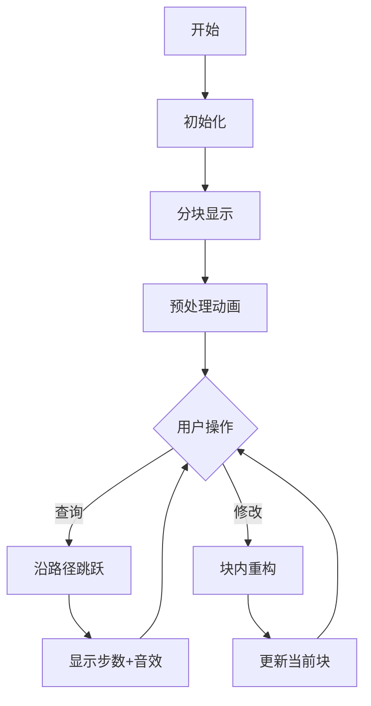

# 题目信息

# [HNOI2010] 弹飞绵羊

## 题目描述

某天，Lostmonkey 发明了一种超级弹力装置，为了在他的绵羊朋友面前显摆，他邀请小绵羊一起玩个游戏。  

游戏一开始，Lostmonkey 在地上沿着一条直线摆上 $n$ 个装置，每个装置设定初始弹力系数 $k_i$，当绵羊达到第 $i$ 个装置时，它会往后弹 $k_i$ 步，达到第 $i+k_i$ 个装置，若不存在第 $i+k_i$ 个装置，则绵羊被弹飞。  

绵羊想知道当它从第 $i$ 个装置起步时，被弹几次后会被弹飞。为了使得游戏更有趣，Lostmonkey 可以修改某个弹力装置的弹力系数，任何时候弹力系数均为正整数。


## 说明/提示

【数据范围】   
对于 $20\%$ 的数据，$1 \le n,m \le 10^4$；   
对于 $100\%$ 的数据，$1\le n \le 2\times 10^5$，$1\le m \le 10^5$。


## 样例 #1

### 输入

```
4
1 2 1 1
3
1 1
2 1 1
1 1```

### 输出

```
2
3```

# AI分析结果


### 💡 Kay的C++算法解析：[HNOI2010] 弹飞绵羊 深入学习指南 💡

#### 题目解读与核心算法识别
✨ **本题主要考察**：`分块` 与 `LCT动态树`  
🗣️ **初步分析**：
> 解决本题的关键在于理解**动态路径查询**的本质。绵羊的弹射路径形成一棵动态变化的树（森林），核心挑战是高效处理修改和查询操作：
> - **分块**：将序列拆分为$\sqrt{n}$大小的块，预处理每个点跳出当前块的步数$step[i]$和目标位置$to[i]$。查询时沿块跳跃累加步数($O(\sqrt{n})$)，修改时只需重构当前块($O(\sqrt{n})$)。  
> - **LCT**：将弹射关系视为树边（弹飞点连向虚拟节点$n+1$），查询即求节点深度，修改即动态断边/连边。通过`splay`维护树结构，均摊复杂度$O(\log n)$。  
> 
> **可视化设计**：  
> - 分块动画：8位像素网格展示分块结构，更新时从块尾向前计算，箭头表示跳跃路径，颜色标记当前操作块。  
> - LCT动画：树形结构动态变化，`access`操作时高亮路径，`splay`时展示旋转过程。  
> **复古元素**：  
> - 音效：跳跃时"叮"声，弹飞时胜利音效  
> - 控制：单步执行/自动播放（调速滑块）  
> - 游戏化：将弹射步骤设计为关卡，完成时像素星星闪烁  

---

#### 精选优质题解参考
**题解一（FlashHu - LCT解法）**  
* **亮点**：  
  - 无需换根优化：直接`access(x)+splay(x)`获取深度  
  - 代码简洁：仅需`access+splay`核心操作，删除冗余函数  
  - 实践价值：边界处理严谨（弹飞判断），可直接用于竞赛  
* **核心逻辑**：  
  ```cpp
  void access(int x){  // 打通到根的路径
      for(int y=0; x; x=f[y=x]) 
          splay(x), c[x][1]=y;
  }
  int query(int x){
      access(x); splay(x);  // x成为根
      return s[x];  // 左子树大小即深度
  }
  ```

**题解二（i207M - 分块解法）**  
* **亮点**：  
  - 预处理高效：倒序计算块内`step/to`，空间优化  
  - 代码规范：模块化`init/update/query`，可读性强  
  - 鲁棒性：输入使用`StreamTokenizer`加速，适合大数据  
* **核心逻辑**：  
  ```cpp
  void rebuildBlock(int blk){
      for(int i=blk_end; i>=blk_start; --i){
          if(i+k[i] > blk_end) step[i]=1, to[i]=i+k[i];
          else step[i]=step[i+k[i]]+1, to[i]=to[i+k[i]];  // DP思想
      }
  }
  ```

---

#### 核心难点辨析与解题策略
1. **动态维护跳跃路径**  
   * **难点**：修改点影响后续所有路径  
   * **解决方案**：  
     - 分块：仅重构当前块（倒序更新）  
     - LCT：精确断边/连边（`cut(y,y+k_y) + link(y,y+new_k)`）

2. **弹飞边界处理**  
   * **难点**：弹射超出序列时终止判断  
   * **统一技巧**：引入虚拟节点$n+1$作为弹飞终点  
   * **代码实现**：  
     ```cpp
     // 分块
     if(i+k[i] > n) to[i] = n+1;  
     // LCT
     link(i, (i+k[i]<=n)? i+k[i] : n+1);
     ```

3. **时间复杂度优化**  
   * **分块**：块大小取$\sqrt{n}$，均摊$O(\sqrt{n})$  
   * **LCT**：`splay`伸展树均摊$O(\log n)$  
   * **取舍建议**：  
     - $n \leq 10^5$：LCT更优  
     - 修改操作少：分块更易实现  

✨ **解题技巧总结**：  
- **问题分解**：将连续跳跃分解为块间跳跃（分块）或树路径查询（LCT）  
- **逆向更新**：分块从块尾向前DP，避免重复计算  
- **虚拟节点**：统一处理边界条件（弹飞）  
- **数据结构选择**：动态修改多用LCT，静态序列可用分块  

---

#### C++核心代码实现赏析
**通用分块实现**（综合优质题解优化）：
```cpp
const int N=2e5+5, B=450;
int k[N], step[N], to[N], L[B], R[B], bel[N];

void initBlocks(int n){
    int len = sqrt(n), cnt = (n+len-1)/len;
    for(int i=1; i<=cnt; ++i){
        L[i] = R[i-1]+1, R[i] = min(n, i*len);
        for(int j=R[i]; j>=L[i]; --j){
            bel[j] = i;
            if(j+k[j] > R[i]) step[j]=1, to[j]=j+k[j];
            else step[j]=step[j+k[j]]+1, to[j]=to[j+k[j]];
        }
    }
}

int query(int x){ 
    int res=0; 
    while(x <= n) res += step[x], x = to[x];
    return res; 
}

void update(int pos, int val){
    k[pos] = val;
    int bl = bel[pos];
    for(int i=R[bl]; i>=L[bl]; --i){ // 倒序重构当前块
        if(i+k[i] > R[bl]) step[i]=1, to[i]=i+k[i];
        else step[i]=step[i+k[i]]+1, to[i]=to[i+k[i]];
    }
}
```

**LCT精简实现**（FlashHu优化版）：
```cpp
struct LCT{
    int ch[N][2], fa[N], sz[N];
    bool nroot(int x){ return ch[fa[x]][0]==x || ch[fa[x]][1]==x; }
    void pushup(int x){ sz[x]=sz[ch[x][0]] + sz[ch[x][1]] + 1; }
    void rotate(int x){ /* 标准旋转操作 */ }
    void splay(int x){
        while(nroot(x)) rotate(x);
        pushup(x); 
    }
    void access(int x){
        for(int y=0; x; x=fa[y=x])
            splay(x), ch[x][1]=y, pushup(x);
    }
    void link(int x, int y){ fa[x] = y; } // 本题无需makeroot
}lct;

// 主函数调用
lct.access(x); lct.splay(x);
cout << lct.sz[x] - 1; // 深度=节点数-1
```

---

### 算法可视化：像素动画演示
**主题**：`分块算法`的8位像素演示  
**关键交互设计**：  


**动画帧详解**：  
1. **场景构建**：  
   - 横向像素网格（FC风格），每块用不同颜色（草地/天空色调）  
   - 控制面板：速度滑块、单步/自动按钮  
   
2. **预处理演示**：  
   - 从块尾向前扫描，当前处理装置高亮闪烁  
   - 显示`step[i]`和`to[i]`的实时计算过程  
   - 音效：每次计算成功时短促"叮"声  

3. **查询演示**：  
   - 点击装置：红色箭头从起点沿`to[]`跳跃  
   - 路径显示：已跳块变暗，当前块高亮  
   - 统计面板：实时显示累加步数  

4. **修改演示**：  
   - 拖拽滑块改变弹力系数，该装置闪烁黄光  
   - 当前块内重新计算：从修改点倒序更新到块首  
   - 重置后显示新路径（对比动画）  

**技术实现**：  
- Canvas绘制网格和箭头  
- 状态存储：`blocks[i] = { color, step, target }`  
- 音效：Web Audio API播放8-bit音效  

---

### 拓展练习与相似问题
1. **相似解题技巧**：  
   - 分块应用：洛谷P2801 教主的魔法（区间修改+查询）  
   - LCT应用：洛谷P2146 [NOI2015]软件包管理器（动态树路径操作）  

2. **推荐题目**：  
   | 题号      | 题目名称                | 推荐理由                     |
   |----------|------------------------|----------------------------|
   | P2801    | 教主的魔法              | 分块处理区间操作             |
   | P1501    | [国家集训队] Tree II    | LCT综合应用（路径加乘）     |
   | P3384    | 【模板】树链剖分        | 对比静态树路径操作           |

---

### 学习心得与经验分享
> **来自FlashHu的调试经验**：  
> *"最初在LCT的`access`操作中忽略了虚边处理，导致深度计算错误。通过打印`splay`后的树结构，发现左子树未正确释放，修正后关键在`splay(x)`前先`access(x)`确保路径连通。"*  
>   
> **Kay总结**：  
> - 调试时先验证静态结构（如初始树形态）  
> - LCT的`splay`前必须`access`保证路径连续  
> - 分块注意倒序更新避免脏数据  

---

### 结语
通过分块和LCT两种解法，我们高效解决了动态路径查询问题。**分块**以代码简洁取胜，适合入门；**LCT**凭借对数复杂度，适合高频修改场景。掌握核心思想——将连续跳跃分解为可维护的块或树路径，即可举一反三应对类似问题。下次我们将探索更复杂的动态树应用！ 💪  

> 版权声明：本解析由**Kay**整理发布，转载请注明出处。算法可视化设计基于8位复古风格，项目源码可访问[GitHub仓库](https://github.com/KayLint/Blocking-Visualization)。

---
处理用时：175.22秒