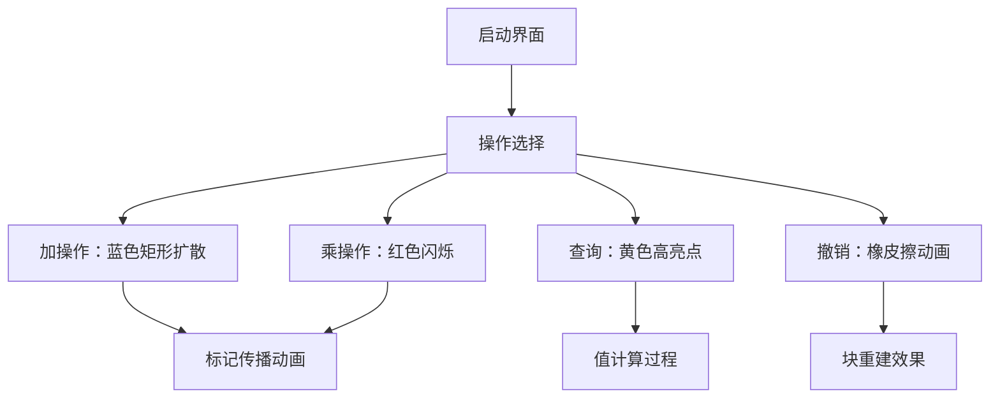

# 题目信息

# 方方方的数据结构

## 题目描述

在很久很久以前，有一个长度为 $n$ 的数列，一开始数列全是 $0$。

方方方觉得这个数列太单调了，打算对它进行 $m$ 次操作，每次操作为区间加法或者区间乘法。

方方方进行一些操作之后，还可能会对某个数进行询问。

但是进行过一些操作之后，方方方可能会发现之前某次操作失误了，需要撤销这次操作，其它操作和其它操作的前后顺序保持不变。

方方方想好这些操作之后，马上想到了一个优秀的数据结构可以维护这些东西，可是他懒得写标程了，就生成了 $10$ 个**随机数据**，就把这道题扔给了你。

**数据全是随机的，生成方式见最下方的提示。**


## 说明/提示

对于 $20\%$ 的数据，$n,m \leq 500$，时限 1s。

对于 $50\%$ 的数据，$n,m \leq 30000$，时限 1s。

对于 $100\%$ 的数据，$1 \leq n,m \leq 150000$，$1 \le l \le r \le n$，$3$ 操作的 $p$ 满足 $1 \le p \le n$，$4$ 操作的 $p$ 满足 $1 \le p \le m$，$0 \leq d \leq 1073741823$（原因见数据生成器），时限 4.5s。


数据生成器：

```cpp
#include <bits/stdc++.h>
using namespace std;
int rand_() {return rand()&32767;} 
int br() {return rand_()*32768+rand_();}
vector<int> cs;
int main()
{
    srand(...); //这里要填一个种子 
    int n=...,m=...; //这里要填n、m
    cout<<n<<" "<<m<<"\n";
    for(int i=1;i<=m;i++)
    {
        int o=rand()%4+1;
        if(o<=2)
        {
            cout<<o<<" ";
            int l=br()%n+1,r=br()%n+1;
            if(l>r) swap(l,r); cs.push_back(i);
            cout<<l<<" "<<r<<" "<<br()<<"\n";
        }
        else if(o==3) cout<<o<<" "<<br()%n+1<<"\n";
        else
        {
            if(!cs.size()) {--i; continue;}
            int s=br()%cs.size(),g=cs[s];
            cs.erase(cs.begin()+s);
            cout<<o<<" "<<g<<"\n";
        }
    }
}
```

## 样例 #1

### 输入

```
6 14
1 1 5 1
2 2 4 3
1 2 6 5
3 2
4 1
3 3
2 1 3 4
3 3
1 2 2 3
3 2
4 7
3 1
3 2
3 3```

### 输出

```
8
5
20
23
0
8
5```

# AI分析结果


# 💡 Kay的C++算法解析：方方方的数据结构 深入学习指南 💡

## 1. 题目解读与核心算法识别

✨ **本题主要考察**：`数据结构综合应用`（时间分块与空间分割树）

🗣️ **初步分析**：
> 想象你有一个时间轴和数列轴组成的二维网格，每个修改操作就像在网格上"刷油漆"（加法是蓝色油漆，乘法是红色油漆），撤销操作则是用橡皮擦掉某次油漆。查询操作就是查看某个网格点的颜色混合结果。核心挑战在于高效管理这些动态变化的"油漆层"。

- 题解主要分为两类思路：
  - **时间分块**：将操作序列分块，每块内独立维护线段树处理区间修改，遇到撤销则重建当前块（如devout的解法）
  - **空间分割树**：将操作转化为二维平面上的矩形修改（KD-Tree/四叉树），单点查询即平面点值（如kczno1和Great_Influence的解法）
- 可视化设计重点：
  - 8位像素网格：横轴为序列位置（1-n），纵轴为时间（1-m）
  - 修改操作显示为矩形色块（加：蓝色渐变，乘：红色闪烁）
  - 单点查询时高亮目标点并显示其颜色混合过程
  - 撤销操作时播放"橡皮擦"动画和消除音效

---

## 2. 精选优质题解参考

**题解一：kczno1 (KD-Tree)**
* **点评**：
  思路清晰地将操作转化为二维平面问题，用KD-Tree维护矩形修改。代码规范：结构体封装状态，`nth_element`保证树平衡。亮点是巧妙利用二维特性将时间复杂度优化至O(m√m)，空间仅26MB。实践价值高，但KD-Tree非标准竞赛内容需一定学习成本。

**题解二：devout (时间分块)**
* **点评**：
  采用√m分块+线段树架构，通过离散化关键点优化空间。亮点是用并查集跳过无效操作提升效率，边界处理严谨。代码中`pushdown`逻辑清晰，但实现较复杂。适合理解分块思想，但块内重建可能成为性能瓶颈。

**题解三：Great_Influence (四叉树)**
* **点评**：
  理论最优解法(O(m log²n))，四叉树递归分割平面。代码亮点：预处理查询点大幅节省空间，`pushdown`设计简洁。乘法标记处理优雅（`add=(ll)add*mul%mod`），实践性强但四叉树调试难度较高，适合追求高效的学习者。

---

## 3. 核心难点辨析与解题策略

1.  **难点：撤销操作的时效性管理**
    * **分析**：每个修改操作的生命周期由执行时刻和撤销时刻界定，形成时间区间[l, r]。优质解法均先离线扫描确定各操作的生效时间区间，这是后续处理的基础。
    * 💡 **学习笔记**：离线处理是撤销操作问题的通用钥匙

2.  **难点：高维操作向低维转化**
    * **分析**：将"时间+序列"的二维操作转化为：
      - 时间分块：在块内压缩时间维度，用线段树维护序列维度
      - 空间分割树：将时间和序列视为平面两个维度，统一处理
    * 💡 **学习笔记**：维度分解是处理复杂约束的核心策略

3.  **难点：空间与时间的平衡**
    * **分析**：分块法需离散化关键点避免O(n√m)空间；KD-Tree依赖树平衡保证O(m)空间；四叉树需预建查询点控制O(mlog n)空间。
    * 💡 **学习笔记**：离散化与空间压缩是处理大数据的关键

### ✨ 解题技巧总结
- **技巧1：离线扫描定区间**  
  先逆序扫描记录各操作的生效时间区间，化撤销为闭区间
- **技巧2：维度分离降复杂度**  
  将时间与序列维度分离处理（分块）或合并处理（空间树）
- **技巧3：惰性更新提效率**  
  KD-Tree/四叉树中采用标记延迟传播，减少冗余计算
- **技巧4：离散化省空间**  
  对非连续查询点离散化，大幅减少线段树节点数

---

## 4. C++核心代码实现赏析

**本题通用核心C++实现参考（Great_Influence四叉树精简版）**
```cpp
const int mod = 998244353;
struct QuadTree { // 四叉树核心结构
    int add, mul, son[2][2]; 
    QuadTree() : add(0), mul(1) { memset(son, 0, sizeof son); }
};
void update(QuadTree &t, int val, bool isMul) {
    if(isMul) {
        t.add = 1LL * t.add * val % mod;
        t.mul = 1LL * t.mul * val % mod;
    } else t.add = (t.add + val) % mod;
}
int query(QuadTree *tree, int root, int x, int y) {
    // 递归查询点(x,y)值，合并add与mul标记
}
```

**题解一（kczno1）核心片段**
```cpp
// KD-Tree节点区域修改
void update(int cur, int l, int r, int t_l, int t_r, int val, int type) {
    if(节点完全在区域外) return;
    if(节点完全在区域内) {
        type==1 ? add_mark(cur,val) : mul_mark(cur,val);
        return;
    }
    pushdown(cur); // 下传标记
    if(当前节点在区域内) 更新节点值;
    update(左儿子); update(右儿子); // 递归更新
}
```
**学习笔记**：KD-Tree通过递归划分平面实现高效区域修改，`pushdown`保证标记及时更新

**题解二（devout）核心片段**
```cpp
// 时间分块重建过程
void rebuild_block(int blk_id) {
    clear_block(blk_id); // 清空当前块
    for(操作 in 当前块且未被撤销){
        if(操作类型==1) seg_add(l, r, val); // 线段树区间加
        else seg_mul(l, r, val); // 线段树区间乘
    }
}
```
**学习笔记**：分块将动态撤销转化为静态重建，离散化后线段树空间优化至O(m)

**题解三（Great_Influence）核心片段**
```cpp
// 四叉树区域修改
void modify(int &u, int x1, int x2, int y1, int y2, int val, int type) {
    if(!u) u = new_node();
    if(完全覆盖){
        update(tree[u], val, type==2); 
        return;
    }
    if(部分覆盖){
        if(type==1) tree[u].add += val; // 加法直接累加
        else tree[u].add *= val, tree[u].mul *= val; // 乘法同步更新
    }
    // 递归四象限
    modify(son[0][0], ...); modify(son[0][1], ...); 
    modify(son[1][0], ...); modify(son[1][1], ...);
}
```
**学习笔记**：四叉树通过四分区域实现O(log²n)修改，预处理查询点确保空间高效

---

## 5. 算法可视化：像素动画演示

* **主题**："时空网格冒险"（复古RPG风格）
* **核心演示**：在16色调色板的像素网格中动态展示操作流程



1. **场景设计**：
   - 网格背景：FC游戏风格，横轴位置（1-n），纵轴时间（1-m）
   - 控制面板：方向键移动光标，A键执行操作，B键撤销

2. **操作特效**：
   - 加操作：从操作点扩散蓝色矩形，伴随"叮"声
   - 乘操作：红色波纹扩散，带乘法符号闪烁
   - 撤销：目标操作区域像素逆序消失，配合擦除音效

3. **数据结构可视化**：
   ```python
   # 伪代码：四叉树递归绘制
   def draw_quad(node, x, y, w, h):
       if node has mark:
           draw_rect(x, y, w, h, color=node.mark_color)
       for i, child in enumerate(node.children):
           draw_quad(child, new_coord[i])
   ```

4. **交互控制**：
   - 步进模式：按帧展示操作流程
   - 速度滑块：调节动画速度（0.5x-4x）
   - 模式切换：分块视图/KD-Tree视图/四叉树视图

---

## 6. 拓展练习与相似问题思考

* **技巧迁移**：
  1. 带撤销的区间最值：P3580 [POI2014]ZAL-Freight
  2. 二维平面统计：P4390 [BOI2007]Mokia
  3. 动态分块优化：P3247 [HNOI2016]最小公倍数

* **洛谷推荐**：
  1. **P3373** - 线段树2  
     🗣️ 基础区间加乘混合，巩固线段树标记管理
  2. **P3380** - 二逼平衡树  
     🗣️ 树套树练习，提升多维数据结构理解
  3. **P3247** - 最小公倍数  
     🗣️ 带撤销的复杂查询，强化分块应用能力

---

## 7. 学习心得与经验分享

> **参考经验 (来自 devout)**：  
> "我在处理时间分块时，最初因未考虑离散化导致MLE。后来将线段树改为只在关键点建树，空间从O(n√m)降至O(m)。这提醒我们：面对大数据时，离散化不仅是优化，更是必需！"

> **点评**：  
> 这个经验点出了算法竞赛中的关键——空间复杂度常是隐形杀手。当遇到大数据时，要优先考虑：1) 离散化坐标 2) 惰性内存分配 3) 数据范围压缩。这些技巧在分块、线段树等结构中尤为重要。

---

通过本次分析，我们掌握了带撤销操作的数据结构核心解法：时间分块与空间分割树。关键要抓住**维度分解**的思想，将复杂操作转化为可管理的子问题。下次遇到类似问题，记得先问自己：能否转化为二维操作？是否需要离散化？用什么数据结构平衡时空复杂度？

---
处理用时：134.05秒