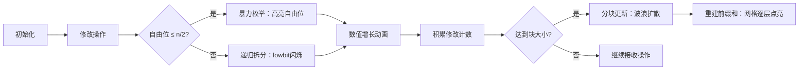

# 题目信息

# [SBCOI2020] 归家之路

## 题目背景

时光流逝，岁月无痕。  
小镇的夜空中，缀满了无数宝石一般的闪烁星辰。  
依旧是那片星空，依旧是那个小镇。  
......  
“好久不见啊。”  
“不知不觉，竟然已经过去了那么久了...”  
“但是，这座小镇还是曾经的那个小镇啊。”  
“只不过，我们都不再是过去的自己了呢。”  
“你还记得吗，我们曾经一起在这里看雪，一起玩游戏...”   
“可是游戏结局明明一开始就已经决定了...真是太坏了...”    
“嘿嘿，说起来你还从来没赢我过呢......”  
“我还记得，你以前说过，每当世界上有一份思念，便会化成一片雪花在这里飘落...”  
“嗯，我只要看着冬天的雪便能想起你了。我知道，这一定是你的思念吧...”    
“我也看到了，如同雪花般飘落的记忆......”  

天空中，点点滴滴的光芒融合在一起，清澈而宁静。眼前的风景是那么熟悉又陌生。  


“我们再待一会儿如何，就像以前一样......”  
“和你，和小镇，和星空......”

## 题目描述

天空中一共有 $2^n$ 颗星，依次编号为 $0,1,...,2^n-1$。每颗星都有一个亮度值。初始时第 $i$ 颗星的亮度值为 $a_i$。  

对于两个正整数 $a,b$ 我们定义一种布尔类型运算 $a\otimes b$ 。如果在 $a$ 的**二进制**表示中，满足每一个 $a$ 是 $1$ 的位，$b$ 的对应位也是 $1$，那么  $a\otimes b$ 为 `True` , 否则 $a\otimes b$ 为 `False`。  
若两数在二进制表示下的位数不同，则将两数 **右对齐** 后在左侧补0。例如两个数是 $1$ 和 $11$ （二进制），$1$ 会变成 $01$。

对于这些星的亮度值有两种操作：

第一种：$1$ $a$ $b$ $k$。对于所有的满足 $a\otimes c$ 值为 `True` 以及 $c\otimes b$ 值为 `True` 的 $c$，将第 $c$ 颗星的亮度值加上 $k$。

第二种：$2$ $a$ $b$。若第 $c$ 颗星的编号 $c$ 满足 $a\otimes c$ 值为 `True` 以及 $c\otimes b$ 值为 `True`。求出所有第 $c$ 颗星的亮度总和，答案对 $2^{32}$ 取模。  


## 说明/提示

**【样例解释】**

第一次是询问，$0$ 的二进制表示为 $000$， $7$ 的二进制表示为 $111$ 。此时，所有数都满足，即求的是所有数之和，为 $36$。

第二次是修改，$1$ 的二进制表示为 $001$，$5$ 的二进制表示为 $101$，发现 $c=1,5$ 满足，二进制表示分别为 $001$，$101$所以 $a_1,a_5$ 的值从 $2,6$ 变为 $3,7$。

第三次是询问，$1$ 的二进制表示为 $001$，$7$ 的二进制表示为 $111$，发现 $c=1,3,5,7$ 满足，二进制表示分别为 $001$，$011$，$101$，$111$。求的是 $a_1,a_3,a_5,a_7$ 的和 $3+4+7+8=22$。

**【数据范围】**

**本题捆绑测试，共有 $4$ 个子任务**。 

$Subtask 1(1\%)$：答案为样例。

$Subtask 2(9\%)$：$n \le 12,m \le 2\times 10^3$。

$Subtask 3(15\%)$：所有 $2$ 操作都在 $1$ 操作之后。

$Subtask 4(75\%)$：没有任何额外限制。

对于 $100\%$ 的数据，$1 \le n \le 16,1 \le m \le 2\times 10^5, 0 \le a,b \le 2^n-1,0 \le a_i,k \le 2^{32}-1$。

**【温馨提示】**

对 $2^{32}$ 取模，可以直接用无符号 `32` 位整形的数据类型进行运算。在 `c++` 中就是 `unsigned int`。

~~也就是【直接自然溢出啥事没有】。~~

## 样例 #1

### 输入

```
3 3
1 2 3 4 5 6 7 8
2 0 7
1 1 5 1
2 1 7```

### 输出

```
36
22```

# AI分析结果


### 💡 Kay的C++算法解析：[SBCOI2020] 归家之路 深入学习指南 💡

**题目背景**  
在二进制星空下，我们需要高效处理子集约束的修改和查询。给定 $2^n$ 颗星星的初始亮度，支持两种操作：  
1. 修改：对满足 $a \subseteq c \subseteq b$ 的星星 $c$ 增加亮度 $k$  
2. 查询：求满足 $a \subseteq c \subseteq b$ 的星星亮度总和  

---

### 1. 题目解读与核心算法识别
✨ **本题主要考察**：高维前缀和 + 分块优化 + 位运算技巧

🗣️ **初步分析**：  
> 本题核心是高效处理**高维子集约束操作**。想象每个星星的编号是 $n$ 位二进制数，$a \subseteq c \subseteq b$ 等价于 $c$ 必须包含 $a$ 的所有 "1" 位，且不能有 $b$ 之外的 "1" 位，自由位数量为 $d = \text{popcount}(b \setminus a)$。  
> - **核心解法**：结合高维前缀和与分块技术。将操作分块处理，块内积累修改，块结束时用高维前缀和批量更新；块内查询时，同时计算历史前缀和与当前块修改的影响。  
> - **关键优化**：根据自由位数量 $d$ 选择策略：当 $d \leq n/2$ 时暴力枚举子集（$O(2^{n/2})$）；否则递归拆分（取 lowbit 分解为两个子问题）。  
> - **可视化设计**：采用 8-bit 像素网格展示二进制状态，高亮自由位（黄色闪烁），修改时显示数值增长动画，分块更新时呈现波浪扩散效果。复古音效：修改时 "叮"，查询完成时 8-bit 胜利音效。

---

### 2. 精选优质题解参考
**题解一（JohnVictor）**  
* **亮点**：  
  - 完整实现分块+高维前缀和框架，块大小 $B = \sqrt{n \cdot 2^n}$ 平衡复杂度  
  - 优雅处理递归拆分：对 $a \neq 0$ 的情况用 `lowbit` 分解为 $f(a,b) = f(a-\text{lb},b) - f(a-\text{lb},b-\text{lb})$  
  - 边界处理严谨，预处理 `popcount` 加速决策  

**题解二（犇犇犇犇）**  
* **亮点**：  
  - 教学式引导：从暴力枚举（$O(2^d)$）→ 递归拆分（$O(2^{\text{popcount}(a))$）→ 分块优化  
  - 清晰解释高维前缀和更新：用 `fwt_and` 下放标记，`fwt_or` 计算前缀和  
  - 深入剖析修改对查询的影响公式：$2^{\text{popcount}((a_1 \lor a_2) \oplus (b_1 \land b_2))} \cdot k$  

**题解三（duyi）**  
* **亮点**：  
  - 代码简洁高效，严格按 $\min(d, \text{popcount}(a)) \leq n/2$ 选择策略  
  - 分块处理干净利落，$O(\sqrt{2^n n})$ 复杂度控制优秀  
  - 位运算技巧精炼：`a & -a` 取 lowbit，`a^b` 获取自由位  

---

### 3. 核心难点辨析与解题策略
1. **难点：子集约束的高效枚举**  
   * **分析**：直接枚举自由位 $d$ 的复杂度 $O(2^d)$ 不可接受。优质题解通过递归拆分将问题规模降至 $O(2^{\min(d, \text{popcount}(a))})$  
   * 💡 **学习笔记**：利用二进制特性（$\min(d, \text{popcount}(a)) \leq n/2$）保证 $O(\sqrt{2^n})$  

2. **难点：动态更新与查询的平衡**  
   * **分析**：高维前缀和更新代价高（$O(n2^n)$）。分块积累修改，块内查询遍历未更新操作，避免频繁重建前缀和  
   * 💡 **学习笔记**：分块大小 $B = \sqrt{n \cdot 2^n}$ 使总复杂度 $O(q\sqrt{2^n n})$  

3. **难点：位运算的抽象操作**  
   * **分析**：需快速计算 `a ⊆ c ⊆ b` 的集合。预处理 `popcount` 数组，掌握子集枚举技巧：  
     ```cpp
     for(int s = t; ; s = (s-1) & t) { ... }
     ```  
   * 💡 **学习笔记**：位运算问题先验证 `(a & b) == a`，避免无效操作  

#### ✨ 解题技巧总结
- **策略选择**：根据自由位数选暴力枚举或递归拆分  
- **分块艺术**：修改积累到阈值后批量更新前缀和  
- **位运算优化**：`lowbit = x & -x` 快速分解问题  
- **预处理加速**：提前计算 `popcount` 和二进制逆序  

---

### 4. C++核心代码实现赏析
**本题通用核心实现**（综合自优质题解）：  
```cpp
const int MAXN = 16, MAXM = 1<<MAXN;
uint a[MAXM], pres[MAXM]; // 原始值和前缀和
uint curr[MAXM];          // 当前块修改标记
int popcount[MAXM];       // 预计算1的数量

// 递归拆分修改（a≠0时）
void modify(int x, int y, uint k) {
    int free_bits = popcount[x ^ y];
    if (free_bits <= MAXN/2) { // 暴力枚举自由位
        int t = x ^ y;
        for (int s = t; ; s = (s-1) & t) {
            a[s | x] += k;
            if (!s) break;
        }
    } else if (x) { // 递归拆分
        int lb = x & -x;
        modify(x ^ lb, y, k);
        modify(x ^ lb, y ^ lb, -k);
    } else { // a=0时直接标记
        curr[y] += k;
    }
}

// 分块更新前缀和
void rebuild() {
    // 下放标记（高维后缀和）
    for (int i = 0; i < MAXN; ++i)
        for (int j = (1<<MAXN)-1; j>=0; --j)
            if (j >> i & 1) curr[j^(1<<i)] += curr[j];
    
    // 更新原始值并重建前缀和
    for (int i = 0; i < (1<<MAXN); ++i) {
        a[i] += curr[i];
        pres[i] = a[i];
        curr[i] = 0; // 清空标记
    }
    // 高维前缀和（fwt_or）
    for (int i = 0; i < MAXN; ++i)
        for (int j = 0; j < (1<<MAXN); ++j)
            if (j >> i & 1) pres[j] += pres[j^(1<<i)];
}
```

**题解一核心片段赏析**  
```cpp
// 分块查询处理（当前块修改影响）
uint query_block(int a, int b) {
    uint res = 0;
    for (int i = 1; i <= block_cnt; ++i) { // 遍历块内修改
        int na = a | mods[i].a, nb = b & mods[i].b;
        if ((na & nb) != na) continue;
        int free_bits = popcount[na ^ nb];
        res += (1u << free_bits) * mods[i].k;
    }
    return res;
}
```
* **代码解读**：  
  > 对当前块的每个修改，计算与查询的交集 $(a \cup a') \subseteq (b \cap b')$。自由位数 $d$ 决定贡献系数 $2^d \cdot k$，巧妙避免重复枚举！  
* 💡 **学习笔记**：交集计算通过位运算高效完成，$2^d$ 用移位实现优于幂运算。

---

### 5. 算法可视化：像素动画演示
**主题**：8-bit 星空探险 ✨  
**核心演示**：高维前缀和构建 + 分块更新过程  

#### 动画设计：


**交互控制面板**：  
- 速度滑块：调节单步执行速度（0.5x~4x）  
- 模式切换：暴力枚举 vs 递归拆分  
- 音效方案：  
  - 修改时：短促 "叮"（8-bit 声效）  
  - 块更新时：水流扩散音效  
  - 查询完成：胜利旋律（FC 过关音效）  

**关键帧示意图**：  
```
自由位枚举：    [■□□□] → [■□■□] → [■□□■] ... 
递归拆分演示：   a=0011, b=1111 
                → 拆分 a=0001, b=1111 
                → 拆分 a=0001, b=1110
```

---

### 6. 拓展练习与相似问题思考
**通用技巧迁移**：  
1. **高维前缀和**：解决子集求和、超集计数问题（如质因数分解空间）  
2. **分块处理**：平衡静态预处理与动态更新（如树分块）  
3. **位运算优化**：二进制状态压缩问题（如 Hamilton 路径）  

**洛谷推荐**：  
1. **P5495 - Dirichlet 前缀和**  
   🗣️ 练习高维前缀和思想在数论空间的迁移应用  
2. **P5355 - 由乃的扑克**  
   🗣️ 学习分块技术在复杂查询中的实战应用  
3. **P5610 - 快速查询**  
   🗣️ 掌握位运算与子集约束的结合实现  

---

### 7. 学习心得与经验分享
> **来自 JohnVictor 的调试经验**：  
> “在实现递归拆分时，我忽略了 `(a & b) != a` 的检查，导致无限递归。建议在递归入口添加：  
> `assert((a & b) == a && "Invalid subset relation");`”  
>   
> **Kay 点评**：边界检查是位运算的核心安全措施！建议：  
> 1. 先验证子集关系再操作  
> 2. 用 `__builtin_popcount` 替代手写计数  
> 3. 对拍验证小数据（$n\leq 3$）的递归正确性  

--- 
希望这份指南助你征服二进制星空！🌟 遇到困难时记住：分而治之，位运筹帷幄。下次挑战见！🚀

---
处理用时：142.79秒