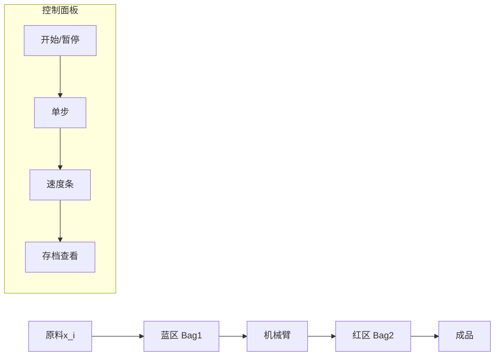

# 题目信息

# 「Wdsr-2.5」未来水妖集市

## 题目背景

每年，河城荷取（河童）都要为未来水妖集市准备展品，以及用于销售的商品。于是河童会生产大批量的产品。

为了提高生产效率，河童决定搭建一条生产线。具体而言，河童会利用她的机械臂，构建出一长串的机器。每个机器只会对原材料进行若干次加工，最终输出成品。

由于河童需要调试设备，于是机械臂每次操作后，河童会用一些询问确定这条生产线目前的性能如何。为了顺利完成生产任务，河童找到了你，希望你写一个程序告诉她每次操作后生产线的性能。

## 题目描述

初始时原材料会有一个初始权值 。然后它会经过若干个机器的加工，花费若干点**加工指数**，得到最终产品。

河童的机器有两种：

- 0 型：每次加工花费 $v_i$ 的加工指数，让材料的附加值增加 $w_i$ 。材料经过时**最多只能加工一次**。
- 1 型：每次加工花费 $v_i$ 的加工指数，让材料的附加值增加 $w_i$ 。材料经过时**加工次数无限制**。

现在河童会利用一个机械臂来设计这套工艺流程。初始时，流水线上没有一台机器，机械臂放在位置 $0$。机器的位置编号是从 $1$ 开始的。现在河童会告诉你加工指数的最大值 $v$ ，然后她会下达 $q$ 个命令。不妨设每个指令执行前，机械臂的位置在 $p$ 。

每个指令的格式为 $\colorbox{#f0f0f0}\verb!opt ti vi wi xi yi!$ ，其中 $opt$ 表示操作的种类。共有如下几种：

1. **右移**：将机械臂向右移动一格，即 $p\gets p+1$。
2. **左移**：将机械臂向左移动一格，即 $p\gets p-1$。
3. **插入机器**：在机械臂当前位置插入一个机器，它的类型为 $t_i$ ，每次消耗的加工指数为 $v_i$ ，材料的附加值会增加 $w_i$ ，插入的机器的位置为 $p+1$ 。机械臂位置不变，但是被插入的机器右侧的机器都会向右移动一格。
4. **删除机器**：在机械臂当前位置移除一个机器，移除的机器位置为 $p+1$ 。移除机器后机械臂位置不变，但是被移除的机器右侧的机器都会向左移动一格。
5. **修改机器**：在机械臂当前位置修改一个机器的参数。即修改的机器的位置为 $p+1$ 。

对于操作 1, 2, 4，请忽略参数 $\colorbox{#f0f0f0}\verb!ti vi wi!$ 。

每次操作完，河童会询问你，如果一个初始权值为 $x_i$ 的物品从左侧起第一个机器进去，直到从右边机器出来，依次加工，消耗最多 $y_i$ 点加工点数（ $y_i\le v$ ），这个物品可以获得的最大权值。特别地，如果此时没有一台机器，此物品权值不变。

假设某一时刻共有 $u$ 台机器，那么数据保证在此时刻机械臂的位置必然在 $[0,u]$ 内。

## 说明/提示

#### 样例 1 说明

解码后的输入数据：

```plain
6 10
3 0 4 5 1000 7
1 0 1 1 1000 8
3 1 5 10 1000 10
5 1 3 3 1000 7
4 1 1 1 1000 10
2 1 1 1 1000 8
```

#### 样例 2, 3

见下发附件。

#### 数据规模与约定

- 对于 $10\%$ 的数据，满足 $q,v\le 10$ 。
- 对于另外 $20\%$ 的数据，满足 $v\le 100$ 。
- 对于另外 $20\%$ 的数据，满足 $q,v\le 2\times 10^3$ 。
- 对于 $100\%$ 的数据， 满足 $1\le q\le 3\times 10^4;1\le v\le 2\times 10^4;1\le x_i,y_i,w_i\le 4\times 10^4$ 。

## 样例 #1

### 输入

```
6 10
3 0 4 5 1000 7
1004 1005 1004 1004 5 997
1006 1004 1000 999 5 999
1017 1021 1023 1023 20 1019
1012 1009 1009 1009 24 1018
1007 1004 1004 1004 5 997
```

### 输出

```
1005
1005
1020
1008
1005
1005
```

# AI分析结果


### 💡 Kay的C++算法解析：未来水妖集市 深入学习指南 💡

#### 1. 题目解读与核心算法识别
✨ **本题主要考察**：`动态规划 + 分块优化`  
🗣️ **初步分析**：  
> 本题核心是背包问题的动态变形，但难点在于需要动态维护不断变化的机器序列。想象两个背包（Bag1和Bag2）就像传送带上的两个加工站，机械臂移动相当于在站点间传递零件。分块优化则像把零件分类存放——常用零件放手边（滑动窗口），不常用的存档（关键点）。  
> - **核心难点**：动态维护序列背包状态，空间优化是破局关键  
> - **可视化设计**：像素动画将展示两个背包区域（左蓝右红），机械臂移动时零件在区域间跳动，关键点存档时出现"💾"图标，加工点数分配用进度条动态展示  
> - **复古元素**：8-bit音效（移动"滴"、插入"咔"、存档"叮"），关卡式设计（每完成√q次操作解锁新存档点）

---

#### 2. 精选优质题解参考
**题解（作者：囧仙）**  
* **亮点**：  
  - 创新性分块优化（空间O(v√q)突破传统背包限制  
  - 双背包对顶结构完美匹配机械臂移动操作  
  - 关键点存档机制实现查询/更新的高效平衡  
  - 工业级代码规范（模块化Bag类+位运算解密输入）

---

#### 3. 核心难点辨析与解题策略
1. **动态序列背包维护**  
   * **分析**：传统背包无法支持随机插入/删除。解法采用双背包结构（Bag1左/Bag2右），机械臂移动转化为背包间元素传递  
   * 💡 **学习笔记**：对顶堆思想可迁移至任何需要动态维护序列的问题  

2. **空间复杂度优化**  
   * **分析**：分块存储DP状态（滑动窗口存最近√q个物品，关键点存每√q的完整状态）。当越界时用关键点重建窗口  
   * 💡 **学习笔记**：空间换时间是优化核心，分块大小取√q达到理论最优  

3. **实时合并查询**  
   * **分析**：合并双背包答案需枚举加工点分配：`max{ Bag1(i) + Bag2(y-i) }`  
   * 💡 **学习笔记**：双序列贡献分离是经典优化手段  

✨ **解题技巧总结**  
- **分块存档法**：定期存储完整状态避免历史回溯  
- **滑动窗口DP**：仅维护活动区域降低空间消耗  
- **贡献分离查询**：分解复合问题为独立子问题  

---

#### 4. C++核心代码实现赏析
```cpp
// 分块背包类核心逻辑
void Bag::add(Node e) {
    if(t-1 == r) {                     // 窗口右移触发存档
        memcpy(W[j], W[j+s], sizeof(W[0])); 
        l += s; r += s;
    }
    dn(v, e.x, j)                     // 滚动更新DP
        W[t-l][j] = max(W[t-l][j], W[t-l][j-e.x] + e.y);
    if(t % s == 0) memcpy(M[t/s], W[t-l], sizeof(M[0])); // 关键点存档
}

int slv(int y) {                      // 双背包合并查询
    int res = 0;
    up(0, y, i) res = max(res, B1.val(i) + B2.val(y-i));
    return res;
}
```

**代码解读**：  
> 1. `add()`中`t-1==r`检测窗口越界，触发滑动窗口右移（像素动画中背包区域闪烁红光）  
> 2. `dn(v,e.x,j)`实现倒序更新（0型机器），正序更新则用于1型机器  
> 3. `t%s==0`时存档关键点（像素动画显示"💾存档完成"）  
> 4. `slv()`通过枚举加工点分配方案，合并双背包最优解  

---

#### 5. 算法可视化：像素动画演示
**主题**：`传送带工厂模拟`  
**核心交互设计**：  


**动画关键帧**：  
1. **初始化**：8-bit工厂背景（传送带+机械臂），控制面板显示v值  
2. **插入机器**：  
   - 红区掉落新机器像素块（"咔"音效）  
   - 右侧DP数组对应列亮起黄光  
3. **机械臂移动**：  
   - 机器从红区弹至蓝区（抛物线动画+"滴"音效）  
   - 加工点数分配进度条动态重组  
4. **存档触发**：  
   - 窗口满时红区闪烁红光  
   - 关键点存档显示"💾"图标（"叮"音效）  
5. **查询展示**：  
   - 原料x_i从左进入，y_i点数进度条实时消耗  
   - 最优路径高亮显示，成品弹出时播放胜利音效  

---

#### 6. 拓展练习与相似问题
1. **洛谷 P1776** - 宝物筛选  
   → 练习多重背包分块优化  
2. **洛谷 P1858** - 多人背包  
   → 强化双序列贡献分离思想  
3. **洛谷 P2320** - 鬼谷子的钱袋  
   → 分块技术在数学问题中的应用  

---

#### 7. 学习心得与经验分享
> **作者调试经验**：  
> “分块大小`S=√q`需反复调整——太小则频繁重建，太大则内存溢出”  
>   
> **Kay总结**：空间优化类问题需平衡：  
> - 理论复杂度：`O(v√q)`  
> - 硬件限制：cache大小制约分块上限  
> - 操作分布：根据移动频率动态调整S值  

通过本解法的精妙设计，我们不仅解决了动态背包问题，更掌握了工业级算法优化思想！ 🚀

---
处理用时：88.12秒