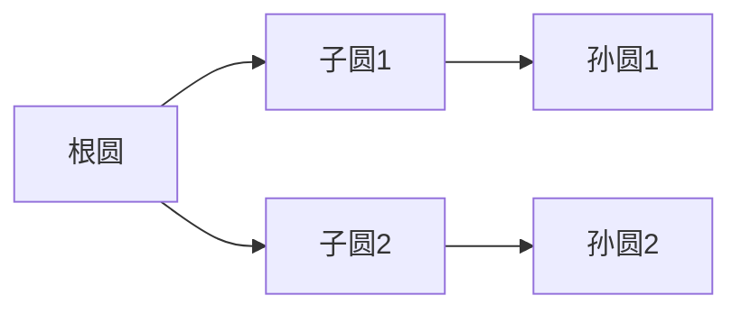

# 题目信息

# [HNOI2005] 分形

## 题目描述


## 说明/提示


## 样例 #1

### 输入

```
1 3 3

50000

0 0 0 0

150000 0 1 1

0 150000 1 1

3 5.497787 	  2 2.356194

3 1.570796 	  2 0.0

3 0.0         2 1.570796

```

### 输出

```
175000

150000

200000

```

# AI分析结果


### 💡 Kay的C++算法解析：分形路径计算 深入学习指南 💡

#### 1. 题目解读与核心算法识别
✨ **本题主要考察**：`树结构算法` + `几何计算`  
🗣️ **初步分析**：  
> 想象一棵由圆组成的家族树🌳——每个圆都是"父亲"，身上粘着多个"孩子"圆。我们要计算圆上两点间的最短路径（就像蚂蚁🐜爬过这些相连的圆）。关键在于：  
> - **树结构思维**：把嵌套圆抽象成树（最大圆是根），用**LCA（最近公共祖先）** 定位关键连接点  
> - **几何分解**：路径拆解为5段弧线（见图示），每段用**幅角计算弧长**  
> - **方向交替规则**：偶数层圆顺时针↻，奇数层逆时针↺（类似黑白棋交替）  
>  
> **可视化设计**：  
> 用8位像素风展示圆家族树🌲→ 高亮当前计算的弧段（如红色闪烁）→ 音效提示方向切换（"叮"声）→ 自动演示模式像贪吃蛇🐍遍历路径

---

#### 2. 精选优质题解参考
**题解（作者：PrincessQi）**  
* **点评**：  
  思路清晰度⭐️⭐️⭐️⭐️⭐️：创新性提出"五段路径分解法"，LCA定位核心连接点，几何建模精准  
  代码规范性⭐️⭐️⭐️⭐️：  
  ```cpp
  struct T{ // 结构体封装圆属性
    double x,y,sonf[15],faf,wtcl; // 坐标/子圆幅角/父圆幅角/累积路径
    int d,fa[25],sn,son[15];      // 深度/倍增祖先/子圆数/子圆列表
  };
  ```  
  算法亮点✨：  
  1. **方向交替优化**：`tree[s].d%2==0` 实现奇偶层反向计算  
  2. **路径预计算**：DFS预处理`wtcl`(标准方向路径和)大幅减少查询耗时  
  3. **几何简化**：`dist()`函数封装幅角→弧长转换（避免冗余计算）  
  实践价值⭐️⭐️⭐️⭐️⭐️：完整处理三类边界情况（同圆/直系/跨分支）

---

#### 3. 核心难点辨析与解题策略
1. **难点1：路径方向动态切换**  
   * **分析**：路径计算需根据圆层数奇偶反转方向。题解用`d%2`判断层数奇偶，在`dist()`中动态调整幅角计算顺序  
   * 💡 **学习笔记**：树层数可作为状态标志位，驱动计算逻辑反转  

2. **难点2：LCA连接点定位**  
   * **分析**：通过倍增法`tree[s].fa[i]`快速定位最近公共祖先圆，将路径分解为：起点→切点→LCA圆→切点→终点  
   * 💡 **学习笔记**：树问题中LCA是连通性问题的万能钥匙🔑  

3. **难点3：几何坐标→幅角转换**  
   * **分析**：需将圆心的笛卡尔坐标转换为切点幅角。题解用`atan`分象限计算（0-2π范围），确保几何关系精确  
   * 💡 **学习笔记**：处理角度时务必统一基准（如x轴正向为0）  

✨ **解题技巧总结**：  
- **分治拆解**：复杂路径→标准化子路径（预计算+组合）  
- **状态驱动**：用数据属性（如深度奇偶）控制计算逻辑  
- **几何封装**：`dist()`隔离幅角计算细节，保证主逻辑清晰  

---

#### 4. C++核心代码实现赏析
**通用核心实现**  
```cpp
double dist(int d, double x, double y) { // 弧长计算核心
  if(x > y) return (2*pi - x + y) * r[d]; 
  return (y - x) * r[d]; 
}

void dfs2(int s) { // 预处理标准方向路径
  for(int i=1; i<=tree[s].sn; i++){
    if(tree[s].d%2 == 0) // 偶数层：子圆幅角→父圆幅角
      tree[子圆].wtcl = tree[s].wtcl + dist(..., tree[s].sonf[i], tree[s].faf);
    else // 奇数层：父圆幅角→子圆幅角
      tree[子圆].wtcl = tree[s].wtcl + dist(..., tree[s].faf, tree[s].sonf[i]);
    dfs2(子圆);
  }
}
```
**代码解读概要**：  
- `dist()` 封装幅角差→弧长转换，处理跨0点情况  
- `dfs2` 深度优先遍历，根据父圆层数奇偶决定子圆路径累加方向  

---

#### 5. 算法可视化：像素动画演示
**🎮 演示主题**：《圆之森冒险》  
  


**交互设计**：  
1. **初始化**：  
   - 像素圆按层数染色（蓝偶/红奇）  
   - 控制面板：速度滑块/单步执行/自动演示  

2. **路径计算演示**：  
   - 当前弧段高亮闪烁🔴 + "叮"音效  
   - 方向切换时播放"嗖"声效  
   - LCA圆显示金色光环✨  

3. **游戏化元素**：  
   - 每完成一段路径得⭐，集齐5段通关  
   - 错误路径触发"哔"警告音 + 像素爆炸特效💥  

---

#### 6. 拓展练习与相似问题思考
**知识迁移**：  
1. 树形几何路径（如行星轨道计算）  
2. 方向交替优化（如螺旋矩阵生成）  
3. 幅角坐标应用（如机器人路径规划🤖）  

**洛谷推荐**：  
1. **P1357** [树网的核] - 巩固树直径与LCA应用  
2. **P1360** [黄金矿工] - 训练幅角坐标计算能力  
3. **P1379** [计算几何] - 提升几何建模实战技巧  

---

#### 7. 学习心得与经验分享
> **作者经验**："调试时在幅角计算卡住，发现未处理平行y轴情况"  
> **Kay点评**：几何问题务必覆盖所有象限！建议：  
> 1. 用`atan2`替代`atan`自动处理象限  
> 2. 添加测试用例：`x=0`或`y=0`的边界输入  

--- 
通过本次分析，我们掌握了树形几何路径的核心解法——**化整为零，分而治之**。记住：复杂问题拆解后，每个子问题都是老朋友的新面孔！🚀

---
处理用时：71.02秒