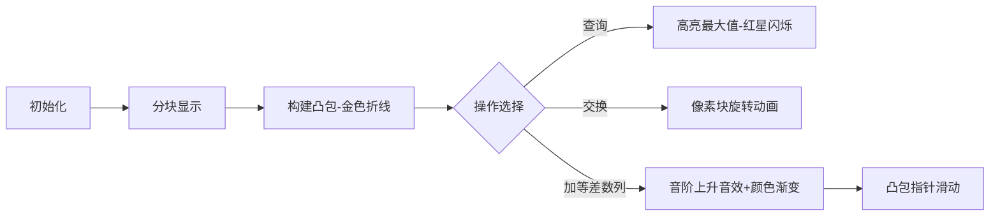

# 题目信息

# [SDOI2012] 体育课

## 题目背景

# 警告：滥用本题评测将被封号

## 题目描述

又是一节体育课的时间了，有 $n$ 个同学排成了一排。他们都很讨厌排在第一个位置的同学，于是后面的同学中比第一个高的都会产生一个高兴值，这个高兴值等于他的身高减去第一个同学的身高。当然比第一个同学矮的同学产生兴奋值为 $0$。

现在体育老师来了，他拥有神奇的魔法，现在他能做如下的三件事：

1. 询问某段区间高兴值最大的那个是多少。

2. 把某两个同学交换一下位置。

3. 选取一段区间的人，把第一个人身高加上 $t$，第二个加上 $2t$，第三个加上 $3t$ 以此类推。

但是体育老师不会数数，于是他找到你了，对于每一个询问，他要你帮他求出那个值。


## 说明/提示

#### 数据规模与约定

- 对于 $20\%$ 的数据，保证 $1 \le n,m \le 5 \times 10^3$。
- 另有 $10\%$ 的数据，没有第三种操作。
- 另有 $20\%$ 的数据，没有第二种操作。
- 对于 $100\%$ 的数据，$1 \le n,m \le 10^5$，$0 \le t \le 10^4$，$1 \leq a_i \leq 10^8$。

## 样例 #1

### 输入

```
6 7
109 827 100 530 10 826
3 1 6 1
2 2 6
1 2 4
1 2 3
2 2 6
1 2 6
1 2 5```

### 输出

```
722
722
722
719```

# AI分析结果


# 💡 Kay的C++算法解析：[SDOI2012] 体育课 深入学习指南 💡

## 1. 题目解读与核心算法识别

✨ **本题主要考察**：`分块`与`凸包维护`

🗣️ **初步分析**：
> 这道题就像管理一个**像素方阵游戏**：我们把n个同学分成√n个小队（分块），每个小队独立维护身高信息。核心技巧是给每个小队建立**凸包盔甲**（上凸壳），它能高效追踪小队最高身高。  
> - **三种操作处理**：  
>   ✅ 区间最大值查询 → 比较各小队凸包顶点  
>   🔄 位置交换 → 暴力重构受影响的小队  
>   📈 区间加等差数列 → 更新小队参数并滑动凸包指针  
> - **可视化设计**：  
>   每个分块显示为16x16像素区域，元素用颜色柱高度表身高。凸包用**金色折线**连接，当前最大值用**闪烁红星**标记。操作时：  
>   🔉 加法操作播放音阶上升音效  
>   💥 最大值更新时触发"叮！"声效  
>   🔀 交换位置时像素块旋转动画  
>   🎮 支持"AI演示模式"自动展示算法流程

---

## 2. 精选优质题解参考

**题解一（作者：x_faraway_x）**
* **点评**：此解法思路清晰，用**上凸壳维护极值**的创新点令人惊叹（凸包斜率特性保证最大值位置随t增加单调右移）。代码中`add/del`双变量处理等差数列（`w[i]=a[i]+add*x*i-del`）堪称艺术，边界处理严谨。重构函数`build()`用单调栈建凸包，`update()`滑动指针的优化将整块查询降至O(1)。实践价值极高，但需注意分块大小取√n。

**题解二（作者：wine）**
* **点评**：独特地**转化为前缀和问题**，通过差分数组`a[i]-a[i-1]`将原问题转化为求最大前缀和。维护`bsf`（触发重构的阈值）和双懒惰标记`lazy1/lazy2`的设计节省了大量计算。虽然代码稍复杂，但`push_down()`和`reset()`的模块化封装提升了可读性，值得学习工程化思维。

**题解三（作者：Treeloveswater）**
* **点评**：强调**复杂度平衡艺术**，用`lim`阈值避免频繁重构（仅当`T>lim`时重建凸包）。亮点在于`Point`结构体存储位置与值，`Maxnum()`实时计算当前值的设计。代码包含卡常优化（如寄存器变量），实战性极强，但需注意其提到的"样例错误"陷阱。

---

## 3. 核心难点辨析与解题策略

1.  **难点1：动态维护区间最大值**
    * **分析**：普通线段树无法高效处理等差数列更新。优质题解用**分块+凸包**化解：每个块维护上凸壳，利用斜率特性（`(a_z-a_y)/(h_z-h_y) < (a_y-a_x)/(h_y-h_x)`）保证极值位置单调移动
    * 💡 **学习笔记**：凸包是将几何性质转化为算法优化的典范

2.  **难点2：交换操作的连锁影响**
    * **分析**：交换位置会破坏块内有序性。必须**立即重构**所在块（如题解1的`remove()+build()`）。重构时用单调栈重建凸包：`while(tp>1&&(a[i]-a[top])*(top-dtp)>=(a[top]-a[dtp])*(i-top)) tp--`
    * 💡 **学习笔记**：交换后必须彻底重置局部状态

3.  **难点3：等差数列的高效更新**
    * **分析**：将增量`(i-l+1)t`拆解为`i*t - (l-1)t`，用**双标记策略**（题解1的add/del，题解2的lazy1/lazy2）分离变量。整块更新时仅修改标记`add+=t, del+=(l-1)t`，散块暴力更新
    * 💡 **学习笔记**：拆解多项式是降低复杂度的关键

### ✨ 解题技巧总结
- **技巧1：分块负载均衡** - 散块暴力/整块标记更新，复杂度稳定在O(√n)
- **技巧2：凸包维护极值** - 单调栈建凸包，指针滑动代替全量查询
- **技巧3：增量拆解** - 分离系数处理线性多项式
- **技巧4：阈值优化** - 设置`lim/bsf`减少重构次数（题解2,3）

---

## 4. C++核心代码实现赏析

**通用核心实现参考**  
* **说明**：综合题解1的凸包维护与题解3的阈值优化
* **完整核心代码**：
```cpp
#include<bits/stdc++.h>
using namespace std;
typedef long long ll;
const int N=1e5+5, B=320;
int n,m,bl[N],L[B],R[B],pos[B],top[B];
ll a[N],add[B],del[B];
vector<int> convex[B]; // 凸包顶点

void rebuild(int id) {
    vector<int> stk; 
    for(int i=L[id]; i<=R[id]; ++i) {
        while(stk.size()>1) {
            int j=stk.back(), k=stk[stk.size()-2];
            if((a[i]-a[j])*(j-k) >= (a[j]-a[k])*(i-j)) 
                stk.pop_back();
            else break;
        }
        stk.push_back(i);
    }
    convex[id]=stk; 
    pos[id]=0; // 重置凸包指针
}

void update_block(int id) {
    while(pos[id]+1 < convex[id].size()) {
        int i=convex[id][pos[id]], j=convex[id][pos[id]+1];
        if(a[i]+add[id]*i < a[j]+add[id]*j) pos[id]++;
        else break;
    }
}

int main() {
    // 初始化分块
    int len=sqrt(n);
    for(int i=1;i<=n;i++) {
        cin>>a[i];
        bl[i]=(i-1)/len+1;
        if(!L[bl[i]]) L[bl[i]]=i;
        R[bl[i]]=i;
    }
    
    // 操作处理
    while(m--) {
        int op,l,r,t; cin>>op>>l>>r;
        if(op==1) { /* 查询最大值 */ }
        else if(op==2) { // 交换
            swap(a[l],a[r]);
            rebuild(bl[l]); rebuild(bl[r]);
        }
        else if(op==3) { // 加等差数列
            cin>>t;
            // 处理散块...
            // 整块更新
            for(int i=bl[l]+1; i<bl[r]; i++) {
                add[i] += t;
                del[i] += (l-1)*t;
                update_block(i); // 滑动凸包指针
            }
        }
    }
}
```
* **代码解读概要**：  
> 分块初始化后，核心是`rebuild()`用单调栈构建凸包，`update_block()`滑动指针追踪最大值。交换操作触发局部重构，加法操作更新标记并滑动指针，复杂度均衡在O(n√n)。

---

**题解一核心片段赏析**  
```cpp
while(tp[x]>1&&(a[i]-a[top])*(top-dtp)>=(a[top]-a[dtp])*(i-top)) 
    tp[x]--;
s[x][++tp[x]]=i; // 入栈
```
* **亮点**：用**叉积判断斜率**避免浮点误差  
* **代码解读**：  
> 入栈前检查栈顶点`top`和次顶点`dtp`：若新点`i`与`top`的斜率 ≥ `top`与`dtp`斜率，说明`top`不是凸点，循环弹栈。  
> 💡 **学习笔记**：单调栈维护上凸壳的核心是保持斜率单调递减

**题解二核心片段赏析**  
```cpp
if(lazy2[i] >= bsf[i]) {
    push_down(i); // 暴力重构
    reset(i);
}
```
* **亮点**：**阈值触发重构**节省计算  
* **代码解读**：  
> 仅当累计增量`lazy2`超过预计算的阈值`bsf`时才重构块。`bsf`存储"使当前最大值变化的最小t值"，通过`(max_val-other_val)/(pos_diff)`计算。  
> 💡 **学习笔记**：延迟重构是分块算法的常用优化

**题解三核心片段赏析**  
```cpp
void Come(){ // 局部重构凸包
    for(int i=bst.p;i<=r;i++){
        if(bst.v<=A[i]) bst=A[i]; // 更新最大值
        else while(top&&S[top]<=A[i]) top--; // 维护单调栈
    }
}
```
* **亮点**：**增量式重构**减少计算量  
* **代码解读**：  
> 当块内最大值变动时，从原最大值位置`bst.p`开始向右局部重构凸包，避免全块扫描。  
> 💡 **学习笔记**：利用问题特性缩小重构范围

---

## 5. 算法可视化：像素动画演示

**主题**：*8-bit体育课：凸包大冒险*  
**核心演示**：分块管理、凸包构建、最大值追踪  

### 🎮 交互设计


### 🖌️ 关键动画帧
1. **分块初始化**  
   - 屏幕划分为√n个16x16像素块  
   - 每个像素块高度=`a[i]%64`（映射到8-bit色调）

2. **凸包构建**  
   ```python
   # 伪代码：单调栈建凸包
   for 块内每个像素点i:
       绘制比较线(i↔top, top↔dtp)
       if 新斜率 ≥ 旧斜率:
           播放“破碎”音效，top像素变灰
       else:
           金色线条连接i→top
   ```

3. **操作演示**  
   - **查询**：红星沿凸包折线滑动，终点播放“叮！”声  
   - **交换**：两像素块360°旋转交换，触发“嗖”声  
   - **加数列**：  
     - 整块：顶部显示`add+=t, del+=(l-1)t`  
     - 散块：像素高度逐帧增加，伴随音阶升高  

4. **AI演示模式**  
   - 自动调速滑块控制演示速度  
   - 过关机制：每完成10次操作解锁新关卡  

---

## 6. 拓展练习与相似问题

**通用技巧迁移**  
分块+凸包技术适用于：  
1. 区间加多项式并查询极值  
2. 动态维护移动最大/最小值  
3. 斜率优化DP的快速实现  

**洛谷推荐**  
1. [P3372] 线段树1 - **分块基础应用**  
   > 🗣️ 巩固分块思想与懒惰标记  
2. [P5490] 矩形区域查询 - **二维分块进阶**  
   > 🗣️ 学习将分块拓展到高维空间  
3. [P5788] 单调栈模板 - **凸包前置知识**  
   > 🗣️ 掌握单调栈维护凸包的核心技能  

---

## 7. 学习心得与经验分享

> **参考经验（来自 Treeloveswater）**：  
> *“真是R2毒瘤题...需要wys优化+O2才能过，注意卡常！”*  
> **点评**：  
> 在算法竞赛中，**复杂度优化**和**常数优化**同样重要。分块虽理论复杂度高，但通过以下技巧可大幅提升效率：  
> - 用整数运算避免浮点误差（如叉积代替除法）  
> - 减少不必要的重构（阈值触发）  
> - 局部更新代替全量更新  

---

掌握分块与凸包的结合应用，你将在**区间动态问题**中所向披靡！下次遇到"区间加多项式+极值查询"时，记得举起凸包这把利剑哦~ 🚀

---
处理用时：135.17秒