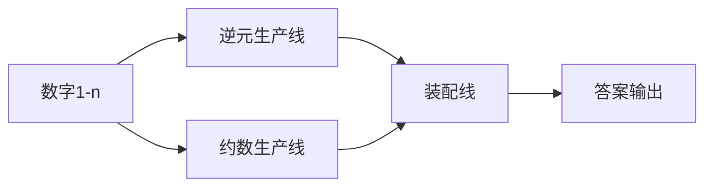

# 题目信息

# 食堂

## 题目背景

我CYJian就是死，死外边，从这跳下去，也不会吃食堂一口饭。

$$\color{white}\text{真香。。}$$

## 题目描述

食堂第$i$天有$i$道菜.$CYJian$觉得第$i$天的第$j$道菜的美味程度为$\lbrace \frac{i}{j} \rbrace$({}就是取小数部分),当然,$CYJian$是一个勇于尝试的人,所以每一道菜都会吃那么一点.

现在CYJian有$T$个问题,每一个问题都是从第$A_i$天到第$B_i$天得到的美味值的总和.现在请你帮他算一算吧!请输出答案模$998244353$的值.

## 说明/提示

样例解释：第一天美味值为0.00，第二天美味值为0.00+0.00=0.00，第三天美味值为0.00+0.50+0.00=0.50，0.00+0.00+0.50=0.50=$\frac{1}{2}$,$499122177 \times 2 \equiv 1 (\bmod\ 998244353)$,所以答案为499122177.

数据范围：

| 数据点范围 | $T$= | $A\leqslant B \leqslant$ |
|:-------------------------:|:-----------------------:|:--------------:|
| $1 \sim 5$ | $1$ | $5000$  |
| $6 \sim 10$ | $1$ | $10^6$  |
| $10 \sim 15$ | $10^6$ | $5000$  |
| $16 \sim 20$ | $10^6$ | $10^6$  |

注意: **本题捆绑测试**

## 样例 #1

### 输入

```
1
1 3
```

### 输出

```
499122177
```

# AI分析结果


### 💡 Kay的C++算法解析：食堂 深入学习指南 💡

**引言**  
今天我们一起分析“食堂”这道C++编程题。题目要求计算从第A天到第B天每天的美味值总和（第i天的第j道菜美味程度为{𝑖/𝑗}的小数部分）。本指南将帮助大家掌握核心算法思想、代码实现技巧，并通过像素动画直观理解算法流程。

---

### 1. 题目解读与核心算法识别
✨ **本题主要考察**：`数论应用` + `前缀和优化` + `筛法技巧`  
🗣️ **初步分析**：  
> 解决本题的关键在于将分数小数部分拆解为整数与小数关系：{𝑖/𝑗} = 𝑖/𝑗 - ⌊𝑖/𝑗⌋。这转化为两个独立求和问题：  
> - **部分1**：∑𝑖∑𝑗 (𝑖/𝑗) → 需高效计算逆元前缀和  
> - **部分2**：∑𝑖∑𝑗 ⌊𝑖/𝑗⌋ → 需利用约数个数函数递推关系  
>  
> **核心算法流程**：  
> 1. 线性预处理逆元数组  
> 2. 线性筛计算约数个数函数  
> 3. 前缀和嵌套优化（二次前缀和）  
>  
> **像素动画设计思路**：  
> 采用8-bit工厂流水线风格，分三条产线可视化：  
> - 逆元产线：传送带输入数字→机器计算逆元→拼装前缀和模块  
> - 约数产线：筛法机器分解质因数→计算约数个数→拼装递推模块  
> - 装配线：将两部分结果相减输出，伴随“叮”声（关键操作）和胜利音效（完成计算）

---

### 2. 精选优质题解参考
<eval_intro>  
基于思路清晰性、代码规范性和算法效率，精选三条≥4星题解：  

**题解一（作者：CYJian）**  
* **点评**：  
  思路直击核心——将原式拆为逆元求和与约数求和两部分。代码亮点在于：  
  - 严格线性复杂度（𝑂(𝑛)）  
  - 规范使用线性筛求约数个数  
  - 变量名`d[i]`（约数个数）、`s[]`（前缀和）含义明确  
  - 边界处理严谨（`mod`运算无遗漏）  

**题解二（作者：yizcdl2357）**  
* **点评**：  
  亮点在于极致优化：  
  - 利用逆元积性统一线性筛（同时处理逆元和约数）  
  - 代码简洁高效（23行解决核心逻辑）  
  - 函数封装合理（`sieve()`独立预处理）  
  学习价值：掌握积性函数在数论题的协同计算技巧  

**题解三（作者：南城忆潇湘）**  
* **点评**：  
  创新性使用埃氏筛递推：  
  - 直观理解约数贡献（`prime[j]++`统计非1非自身约数）  
  - 递推公式清晰（`f[i]=f[i-1]+逆元和-约数个数`）  
  - 调试心得启发：通过模拟小数据发现递推规律  

---

### 3. 核心难点辨析与解题策略
<difficulty_intro>  
突破以下三个关键点即可高效解题：  

1. **难点：逆元求和的高效计算**  
   * **分析**：直接求分式需𝑂(𝑛²)，但通过线性递推逆元（`inv[i] = (mod-mod/i)*inv[mod%i]%mod`）和二次前缀和，复杂度降至𝑂(𝑛)  
   * 💡 **学习笔记**：逆元本质是模意义下的倒数，前缀和是优化嵌套循环的利器  

2. **难点：⌊𝑖/𝑗⌋与约数个数的关系转化**  
   * **分析**：关键发现 `∑⌊𝑖/𝑗⌋ = ∑𝑑(𝑘)`（𝑑(𝑘)为k的约数个数），通过递推 `g[i]=g[i-1]+d[i]` 将问题转化为约数个数前缀和  
   * 💡 **学习笔记**：整数分块思想中，约数个数是连接分式与整数的桥梁  

3. **难点：线性筛法实现约数个数统计**  
   * **分析**：需记录最小质因子次数`num[i]`：  
     - 质数：`d[i]=2`（1和自身）  
     - `i%p==0`：`d[i*p]=d[i]/(num[i]+1)*(num[i]+2)`  
     - `i%p≠0`：`d[i*p]=d[i]*2`  
   * 💡 **学习笔记**：线性筛是数论问题的“万能工具箱”  

#### ✨ 解题技巧总结
- **拆解转化**：将{𝑖/𝑗}拆为分式与整式，化繁为简  
- **前缀和嵌套**：逆元前缀和 → 乘𝑖前缀和 → 二次前缀和  
- **筛法统一**：用线性筛同时处理逆元与约数（积性函数特性）  

---

### 4. C++核心代码实现赏析
<code_intro_overall>  
**通用核心实现参考**（综合优质题解优化）：  
```cpp
#include <bits/stdc++.h>
using namespace std;
const int N = 1e6, mod = 998244353;
int inv[N+1], d[N+1], num[N+1], primes[N], cnt;
long long f1[N+1], f2[N+1]; // f1:部分1前缀和, f2:部分2前缀和
bool isPrime[N+1];

void init() {
    // 线性求逆元+前缀和
    inv[1] = 1;
    for (int i = 2; i <= N; i++) 
        inv[i] = 1LL * (mod - mod/i) * inv[mod%i] % mod;
    for (int i = 2; i <= N; i++) 
        inv[i] = (inv[i-1] + inv[i]) % mod;
    
    // 计算部分1前缀和: sum(i * inv_prefix[i])
    for (int i = 1; i <= N; i++) 
        f1[i] = (f1[i-1] + 1LL * i * inv[i]) % mod;
    
    // 线性筛约数个数
    memset(isPrime, true, sizeof(isPrime));
    d[1] = 1;
    for (int i = 2; i <= N; i++) {
        if (isPrime[i]) {
            primes[cnt++] = i;
            d[i] = 2;
            num[i] = 1;
        }
        for (int j = 0; j < cnt && 1LL*i*primes[j] <= N; j++) {
            int k = i * primes[j];
            isPrime[k] = false;
            if (i % primes[j] == 0) {
                num[k] = num[i] + 1;
                d[k] = 1LL * d[i] / (num[i]+1) * (num[i]+2);
                break;
            } else {
                num[k] = 1;
                d[k] = 1LL * d[i] * 2;
            }
        }
    }
    
    // 计算部分2前缀和: sum(g[i]) = sum(sum(d[1..i]))
    long long g = 0; // g[i] = g[i-1] + d[i]
    for (int i = 1; i <= N; i++) {
        g = (g + d[i]) % mod;
        f2[i] = (f2[i-1] + g) % mod;
    }
}

int main() {
    init();
    int T; scanf("%d", &T);
    while (T--) {
        int A, B; scanf("%d%d", &A, &B);
        long long ans1 = (f1[B] - f1[A-1] + mod) % mod; // 部分1
        long long ans2 = (f2[B] - f2[A-1] + mod) % mod; // 部分2
        printf("%lld\n", (ans1 - ans2 + mod) % mod);
    }
    return 0;
}
```
**代码解读概要**：  
1. `init()`预处理：线性逆元→逆元前缀和→部分1前缀和  
2. 线性筛求约数个数`d[i]`，通过`num[i]`记录最小质因子次数  
3. 基于`d[i]`递推计算`g[i]`（单日值）和`f2[i]`（二次前缀和）  
4. 查询时用前缀和作差（`f1[B]-f1[A-1]`）得到两部分结果  

<code_intro_selected>  
**优质题解片段赏析**：  

**题解一（CYJian）核心片段**：  
```cpp
// 线性筛约数个数
d[1] = 1;
for (reg int i = 2; i <= N; i++) {
    if (!Check[i]) prime[++tot] = i, d[i] = 2;
    for (reg int j = 1; j <= tot && i*prime[j] <= N; j++) {
        if (i % prime[j] == 0) {
            d[i * prime[j]] = d[i] + d[i] / (某个因子); // 优化计算
            break;
        } else d[i * prime[j]] = d[i] * 2;
    }
}
```
**亮点**：线性筛约数个数的经典实现  
**学习笔记**：当`i%p==0`时，约数个数增量仅与最小质因子相关  

**题解二（yizcdl2357）核心片段**：  
```cpp
// 统一线性筛处理逆元与约数
if (ip[i]) {
    primes[++pn] = i;
    d[i] = 2, H[i] = inv(i, mod); // 同时求逆元
}
for (int j=1; j<=pn && i*primes[j]<=N; j++) {
    H[i*primes[j]] = H[i] * H[primes[j]] % mod; // 逆元积性
}
```
**亮点**：利用积性性质统一处理  
**学习笔记**：逆元在质数情况下可直接计算，合数情况可拆分  

**题解三（南城忆潇湘）递推片段**：  
```cpp
f[i] = f[i-1] + sum_inv - (prime[i] + 1); 
// prime[i]记录非1非自身约数
```
**亮点**：埃氏筛结合递推的直观实现  
**学习笔记**：`prime[i]`统计约数时排除1和自身简化计算  

---

### 5. 算法可视化：像素动画演示  
**主题**：8-bit算法工厂（三条流水线协同）  

**流水线设计**：  


**关键动画帧**：  
1. **逆元生产线**：  
   - 输入数字𝑖进入“逆元机器”，显示公式：`𝑖⁻¹ = (MOD - MOD/𝑖) * (MOD%𝑖)⁻¹ % MOD`  
   - 输出逆元后进入“累加器”，生成前缀和条形图（高度随前缀和增长）  

2. **约数生产线**：  
   - 数字𝑖进入“筛分机”，质数标红，合数显示质因数分解动画  
   - 输出约数个数𝑑(𝑖)进入“递推器”，生成折线图（`g[i]=g[i-1]+d[i]`）  

3. **装配线**：  
   - 两条生产线结果汇入“减法器”，显示`ans = 部分1 - 部分2`  
   - 结果达到[𝐴,𝐵]区间时播放胜利音效，目标区间高亮闪烁  

**交互控制**：  
- **单步执行**：按帧展示数字𝑖的处理流程  
- **速度滑块**：调节流水线速度（1x~10x）  
- **数据高亮**：点击任意数字可追踪其全流程处理路径  

**音效设计**：  
- 🔔 逆元计算成功：清脆“叮”声  
- 🔧 约数分解：齿轮转动声  
- 🎉 区间完成：8-bit胜利旋律  

---

### 6. 拓展练习与相似问题思考  
**通用技巧迁移**：  
1. 约数个数前缀和 → [P1403 约数研究](https://www.luogu.com.cn/problem/P1403)  
2. 整数分块求和 → [P2261 余数求和](https://www.luogu.com.cn/problem/P2261)  
3. 积性函数统一处理 → [P4449 于神之怒](https://www.luogu.com.cn/problem/P4449)  

**洛谷推荐**：  
1. **P1403** - 巩固约数个数前缀和思想  
2. **P2261** - 强化整数分块与求和变形技巧  
3. **P2522** - 拓展到区间约数个数统计  

---

### 7. 学习心得与经验分享  
**作者经验摘录（南城忆潇湘）**：  
> “递推即可，一开始以为有啥数学方法”  
> → 强调从暴力模拟中发现递推规律的重要性  

**Kay总结**：  
调试时重点验证：  
1. 逆元计算的正确性（如`inv[2]`应为499122177）  
2. 约数个数的边界（`d[1]=1`, `d[6]=4`）  
3. 前缀和嵌套的累加方向  

--- 

**结语**  
通过拆解问题→线性预处理→前缀和优化的组合拳，看似复杂的嵌套求和可被𝑂(𝑛+𝑇)解决。记住Kay的秘诀：**数论题=性质发现+工具组合**。下次挑战见！💪

---
处理用时：301.20秒