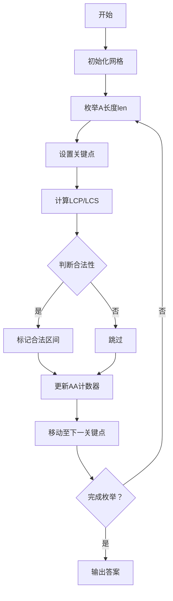

# 题目信息

# [NOI2016] 优秀的拆分

## 题目描述

如果一个字符串可以被拆分为 $\text{AABB}$ 的形式，其中 $\text{A}$ 和 $\text{B}$ 是任意**非空**字符串，则我们称该字符串的这种拆分是优秀的。  
例如，对于字符串 $ \texttt{aabaabaa} $ ，如果令 $\text{A}=\texttt{aab}$，$\text{B}=\texttt{a}$，我们就找到了这个字符串拆分成 $\text{AABB}$ 的一种方式。

一个字符串可能没有优秀的拆分，也可能存在不止一种优秀的拆分。  
比如我们令 $\text{A}=\texttt{a}$，$\text{B}=\texttt{baa}$，也可以用 $\text{AABB}$ 表示出上述字符串；但是，字符串 $\texttt{abaabaa}$ 就没有优秀的拆分。

现在给出一个长度为 $n$ 的字符串 $S$，我们需要求出，在它所有子串的所有拆分方式中，优秀拆分的总个数。这里的子串是指字符串中连续的一段。

以下事项需要注意：

1. 出现在不同位置的相同子串，我们认为是不同的子串，它们的优秀拆分均会被记入答案。
2. 在一个拆分中，允许出现 $\text{A}=\text{B}$。例如 $\texttt{cccc}$ 存在拆分 $\text{A}=\text{B}=\texttt{c}$。
3. 字符串本身也是它的一个子串。

## 说明/提示

### 样例解释

我们用 $S[i, j]$ 表示字符串 $S$ 第 $i$ 个字符到第 $j$ 个字符的子串（从 $1$ 开始计数）。

第一组数据中，共有三个子串存在优秀的拆分：  
$S[1,4]=\texttt{aabb}$，优秀的拆分为 $\text{A}=\texttt{a}$，$\text{B}=\texttt{b}$；  
$S[3,6]=\texttt{bbbb}$，优秀的拆分为 $\text{A}=\texttt{b}$，$\text{B}=\texttt{b}$；  
$S[1,6]=\texttt{aabbbb}$，优秀的拆分为 $\text{A}=\texttt{a}$，$\text{B}=\texttt{bb}$。  
而剩下的子串不存在优秀的拆分，所以第一组数据的答案是 $3$。

第二组数据中，有两类，总共四个子串存在优秀的拆分：  
对于子串 $S[1,4]=S[2,5]=S[3,6]=\texttt{cccc}$，它们优秀的拆分相同，均为 $\text{A}=\texttt{c}$，$\text{B}=\texttt{c}$，但由于这些子串位置不同，因此要计算三次；  
对于子串 $S[1,6]=\texttt{cccccc}$，它优秀的拆分有两种：$\text{A}=\texttt{c}$，$\text{B}=\texttt{cc}$ 和 $\text{A}=\texttt{cc}$，$\text{B}=\texttt{c}$，它们是相同子串的不同拆分，也都要计入答案。  
所以第二组数据的答案是 $3+2=5$。

第三组数据中，$S[1,8]$ 和 $S[4,11]$ 各有两种优秀的拆分，其中 $S[1,8]$ 是问题描述中的例子，所以答案是 $2+2=4$。

第四组数据中，$S[1,4]$，$S[6,11]$，$S[7,12]$，$S[2,11]$，$S[1,8]$ 各有一种优秀的拆分，$S[3,14]$ 有两种优秀的拆分，所以答案是 $5+2=7$。

### 数据范围

对于全部的测试点，保证 $1 \leq T \leq 10$。以下对数据的限制均是对于单组输入数据而言的，也就是说同一个测试点下的 $T$ 组数据均满足限制条件。

我们假定 $n$ 为字符串 $S$ 的长度，每个测试点的详细数据范围见下表：

| 测试点编号   | $n \leq$  | 特殊性质           |
| ------------ | --------- | ------------------ |
| $1 \sim 2$   | $300$     | $S$ 中所有字符相同 |
| $3 \sim 4$   | $2\,000$  | $S$ 中所有字符相同 |
| $5 \sim 6$   | $10$      |                    |
| $7 \sim 8$   | $20$      |                    |
| $9 \sim 10$  | $30$      |                    |
| $11 \sim 12$ | $50$      |                    |
| $13 \sim 14$ | $100$     |                    |
| $15$         | $200$     |                    |
| $16$         | $300$     |                    |
| $17$         | $500$     |                    |
| $18$         | $1\,000$  |                    |
| $19$         | $2\,000$  |                    |
| $20$         | $30\,000$ |                    |

## 样例 #1

### 输入

```
4
aabbbb
cccccc
aabaabaabaa
bbaabaababaaba
```

### 输出

```
3
5
4
7
```

# AI分析结果


# 💡 Kay的C++算法解析：优秀的拆分 深入学习指南 💡

> 今天我们来分析「优秀的拆分」这道C++编程题。本指南将帮助大家梳理题目思路，理解核心算法，并掌握解题技巧。

## 1. 题目解读与核心算法识别

✨ **本题主要考察**：`字符串匹配与后缀数组应用`

🗣️ **初步分析**：
> 解决「优秀的拆分」这道题，关键在于高效统计所有AABB形式的子串。我们可以将其拆解为两个核心问题：
> - **问题转化**：将AABB拆分为两个AA串的拼接
> - **高效统计**：利用后缀数组(SA)快速计算最长公共前缀(LCP)和最长公共后缀(LCS)
> 
> **核心算法流程**：
> 1. 定义f[i]表示以i结尾的AA串数量，g[i]表示以i开头的AA串数量
> 2. 答案 = ∑(f[i] * g[i+1])，枚举所有拼接点
> 3. 枚举A的长度len，设置关键点(i, i+len)
> 4. 计算相邻关键点的LCP和LCS
> 5. 若LCP+LCS≥len，则存在跨关键点的AA串，用差分更新f和g
>
> **可视化设计思路**：
> - 像素网格展示字符串，关键点用红色标记
> - 动画演示LCP（向右绿色延伸）和LCS（向左蓝色延伸）
> - 当满足条件时，紫色方块表示合法AA串区间
> - 控制面板支持步进/调速，音效提示关键操作

---

## 2. 精选优质题解参考

> 我们从思路清晰度、代码规范性、算法效率和实践价值等维度，筛选出以下优质题解：

**题解一：后缀数组+差分法（作者：Gypsophila）**
* **点评**：
  - 思路清晰：将问题转化为AA串统计，利用关键点+调和级数枚举
  - 代码规范：结构清晰，差分处理巧妙
  - 算法优化：O(n log n)复杂度，ST表加速LCP/LCS查询
  - 实践价值：可直接用于竞赛，边界处理严谨
  > *亮点：图示辅助解释LCP/LCS作用，形象展示合法区间推导*

**题解二：哈希+二分法（作者：bztMinamoto）**
* **点评**：
  - 思路创新：用哈希替代后缀数组，避免复杂数据结构
  - 代码简洁：双哈希避免冲突，差分处理高效
  - 实现技巧：调和级数枚举+二分查找LCP/LCS
  > *亮点：95分暴力+5分优化策略，渐进式解题思路易理解*

**题解三：后缀自动机应用（作者：Jμdge）**
* **点评**：
  - 数据结构运用：SAM求LCS，配合树上统计
  - 扩展性强：提供SAM学习路线图
  > *亮点：展示不同数据结构解法，拓宽解题视野*

---

## 3. 核心难点辨析与解题策略

### 难点1：如何高效统计AA串？
**分析**：  
直接枚举所有子串需O(n²)，不可行。优质题解通过：
1. 枚举A的长度len（调和级数O(n log n)）
2. 在关键点i和j=i+len处计算LCP(suf(i), suf(j))和LCS(pre(i-1), pre(j-1))
3. 当LCP+LCS≥len时，存在跨关键点的AA串

💡 **学习笔记**：关键点设置是化整为零的核心技巧

### 难点2：如何避免重复计数？
**分析**：  
差分数组精准标记合法区间：
```math
f[i-y+1]++ , f[i-y+1+t]--
g[j+x-t]++ , g[j+x+1]--
```
其中t = LCP+LCS-len+1为连续区间长度

💡 **学习笔记**：差分法实现区间更新是降低复杂度的关键

### 难点3：如何快速计算LCP/LCS？
**分析**：
- 后缀数组+ST表：O(n log n)预处理，O(1)查询
- 哈希+二分：O(log n)查询，实现更简单

💡 **学习笔记**：根据问题规模选择数据结构，30000以内SA更优

### ✨ 解题技巧总结
- **问题分解**：将AABB拆解为AA+BB，分别求解
- **调和级数枚举**：O(n log n)枚举长度，避免暴力
- **差分技巧**：O(1)复杂度完成区间标记
- **双后缀数组**：正反串处理，同时支持LCP和LCS查询

---

## 4. C++核心代码实现赏析

### 通用核心实现（后缀数组+差分法）
```cpp
#include <bits/stdc++.h>
using namespace std;
const int MAXN = 3e4+5;

struct SA {
    // 后缀数组实现（省略）
    int query(int x, int y); // LCP查询
};

int main() {
    int T; cin >> T;
    while (T--) {
        string s; cin >> s;
        int n = s.size();
        vector<ll> f(n+2), g(n+2); // f[i]:以i结尾的AA数, g[i]:以i开头的AA数
        
        // 正反串SA初始化
        SA sa1, sa2; 
        sa1.build(s); 
        reverse(s.begin(), s.end());
        sa2.build(s);
        
        // 枚举A长度len
        for (int len = 1; len <= n/2; len++) {
            for (int i = len, j = i+len; j < n; i += len, j += len) {
                int lcp = min(len, sa1.query(i, j));
                int lcs = min(len-1, sa2.query(n-i, n-j));
                
                if (lcp + lcs >= len) {
                    int cnt = lcp + lcs - len + 1;
                    // 差分更新
                    f[i-lcs]++; f[i-lcs+cnt]--;
                    g[j+lcp-cnt]++; g[j+lcp]--;
                }
            }
        }
        
        // 前缀和还原
        for (int i = 1; i <= n; i++) {
            f[i] += f[i-1];
            g[i] += g[i-1];
        }
        
        // 统计答案
        ll ans = 0;
        for (int i = 1; i < n-1; i++) 
            ans += f[i] * g[i+1];
        cout << ans << endl;
    }
    return 0;
}
```

### 代码解读
1. **后缀数组封装**：SA类封装build()和query()，支持LCP查询
2. **差分数组**：f/g数组先差分标记，最后前缀和还原
3. **核心循环**：
   - 外层枚举A长度len（调和级数）
   - 内层遍历关键点对(i, j=i+len)
   - LCP/LCS与len取min，避免越界
4. **边界处理**：lcs计算时len-1避免重叠

---

## 5. 算法可视化：像素动画演示

### 动画设计：AA串探索者（像素风格）


**关键帧演示**：
1. **网格初始化**：
   - 8-bit风格显示字符串
   - 控制面板：步进/调速/重置按钮
   ```plaintext
   a a b b b b
   ■ ■ □ □ □ □ 
   ```

2. **关键点标记**（len=2）：
   ```plaintext
   a a b b b b
   ■ ● □ ● □ ●  // ●=关键点
   ```

3. **LCP/LCS计算**：
   ```plaintext
   关键点2和4：
   LCP: [b b] -> 绿色延伸
   LCS: [a a] -> 蓝色延伸
   ```

4. **合法区间标记**（紫色闪烁）：
   ```plaintext
   合法区间[2-3]:
   a a b b b b
   □ ■ ■ □ □ □
   ```

5. **音效反馈**：
   - 成功：8-bit上升音阶
   - 失败：短促提示音
   - 边界：复古电子音

---

## 6. 拓展练习与相似问题

### 通用技巧迁移
后缀数组+关键点技巧适用于：
1. 统计所有平方串（AA型）
2. 寻找最长重复子串
3. 带通配符的匹配问题

### 推荐题目
1. **洛谷 P3809**：后缀排序模板
   > 巩固SA基础实现，理解height数组意义

2. **洛谷 P319D**：破坏正方形子串
   > 相同的关键点技巧应用，强化思维迁移

3. **洛谷 P3375**：KMP算法模板
   > 理解单串匹配基础，为后缀数组铺垫

---

## 7. 学习心得与经验分享

> 来自题解作者的重要经验：
> - "枚举长度后设置关键点，通过LCP和LCS确定合法区间，这个技巧在字符串问题中非常常用"
> - "差分更新代替线段树，常数小且编码简单"
> - "调试时先小数据暴力验证，再逐步放大"

> **Kay的总结**：
> 1. 掌握调和级数枚举的复杂度分析
> 2. 差分法在区间更新中的高效应用
> 3. 正反串处理技巧扩展解题视野
> 4. 从暴力到优化的渐进式解题思路

---

通过本指南，希望大家能掌握「优秀的拆分」的核心解法，并在字符串问题中灵活运用关键点技巧。记得多动手实现代码，体验像素演示工具加深理解！如有疑问，欢迎随时交流讨论。💪

---
处理用时：115.16秒