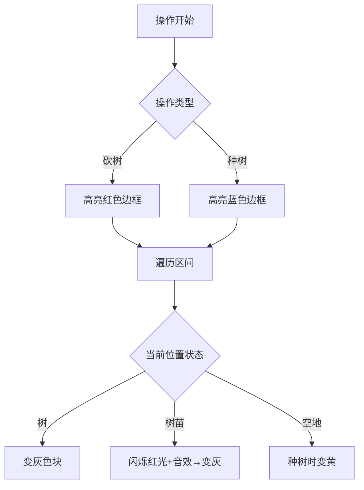

# 题目信息

# 校门外的树（增强版）

## 题目描述

校门外马路上本来从编号 $0$ 到 $L$，每一编号的位置都有一棵树。有砍树者每次从编号 $A$ 到 $B$ 处连续砍掉每一棵树，就连树苗也不放过（记 `0 A B`，含 $A$ 和 $B$）；幸运的是还有植树者每次从编号 $C$ 到 $D$ 中凡是空穴（树被砍且还没种上树苗或树苗又被砍掉）的地方都补种上树苗（记 `1 C D`，含 $C$ 和 $D$）；问最终校门外留下的树苗多少棵？植树者种上又被砍掉的树苗有多少棵？

## 说明/提示

对于 $100 \%$ 的数据，$1 \le L \le 10000$，$1 \le N \le 100$。

## 样例 #1

### 输入

```
10 3
0 2 6
1 1 8
0 5 7
```

### 输出

```
3
2
```

# AI分析结果


# 💡 Kay的C++算法解析：校门外的树（增强版） 深入学习指南 💡

<introduction>
  今天我们来一起分析“校门外的树（增强版）”这道C++编程题。本指南将帮助大家梳理题目思路，理解核心算法，并掌握解题技巧。
</introduction>

## 1. 题目解读与核心算法识别

✨ **本题主要考察**：`模拟应用`

🗣️ **初步分析**：
> 解决这道题的关键在于模拟道路状态变化。想象一条像素化的道路（0到L位置），初始每个位置都有大树（绿色像素块）。每次操作如同游戏指令：
> - 砍树指令（0 A B）：将A-B区间变为空地（灰色像素块），若砍到树苗（黄色像素块）则计数
> - 种树指令（1 C D）：在C-D的空地（灰色）上种树苗（黄色）
> 
> 可视化设计：
> - 道路用像素网格展示，不同状态用颜色区分：树（绿）、树苗（黄）、空地（灰）
> - 操作时高亮区间边框（砍树红色，种树蓝色）
> - 砍到树苗时闪烁红光并播放"叮"音效
> - 底部实时显示剩余树苗和被砍树苗计数器

---

## 2. 精选优质题解参考

<eval_intro>
从思路清晰度、代码规范性和实践价值角度，精选以下优质题解：

**题解一：(来源：应吟吟)**
* **点评**：该题解亮点在于详细指出题目三大易错点（树苗与树的区分、砍树苗计数逻辑、0起点），采用直观的O(n²)模拟解法。代码中关闭流同步加速IO，变量命名明确(`flag[]`状态数组)，边界处理严谨（从0到L），对初学者非常友好。虽无复杂算法，但完整覆盖题目核心需求，调试心得极具参考价值。

**题解二：(来源：ghj1222)**
* **点评**：创新使用bitset状态压缩，两个bitset通过异或运算高效区分树苗。代码简洁优雅（仅30行），通过`a.set()`/`a.reset()`实现状态切换，空间效率是普通数组的1/8。亮点在于用位运算巧解状态判断：树(1,1)→异或0，树苗(1,0)→异或1。虽对初学者稍抽象，但展示了高效的位操作技巧。

**题解三：(来源：ElevenX)**
* **点评**：最简洁的模拟实现（仅25行），聚焦核心状态转换逻辑。亮点在于用单数组`a[]`管理状态（0空/1树/2树苗），实时计数被砍树苗，最后统一统计剩余树苗。代码去冗余但保留关键注释，边界处理写在循环条件中，体现高效编码风格。

---

## 3. 核心难点辨析与解题策略

<difficulty_intro>
解决本题需突破三个关键难点：

1.  **状态转换逻辑**
    * **分析**：需明确三种状态的转换规则：树→砍变空；空→种变树苗；树苗→砍变空且计数。优质题解普遍用整数数组（0/1/2）或bitset对记录状态，通过条件判断实现状态流转
    * 💡 **学习笔记**：清晰的状态机模型是模拟题的核心

2.  **树苗的区分统计**
    * **分析**：题目要求独立统计剩余树苗和被砍树苗。实践中有两种策略：①砍树时实时计数（应吟吟/ElevenX）②最后统一计算（ghj1222）。前者更符合直觉且节省遍历
    * 💡 **学习笔记**：中间结果实时统计优于事后补救

3.  **边界条件处理**
    * **分析**：位置范围包含0和L点，循环需写为`for(int i=0;i<=L;i++)`。线段树解法需注意开4倍空间，模拟解法要初始化0-L全部位置
    * 💡 **学习笔记**：区间问题务必验证边界值

### ✨ 解题技巧总结
<summary_best_practices>
1. **状态驱动法**：定义明确的状态常量（如`const int EMPTY=0`），避免魔法数字
2. **实时计数优化**：在砍树操作内完成树苗计数，避免最后重遍历
3. **防御性编程**：种树时检查是否空地，避免覆盖现有树木
4. **IO加速技巧**：在数据量较大时使用`ios::sync_with_stdio(false)`

---

## 4. C++核心代码实现赏析

<code_intro_overall>
通用模拟解法，综合各题解优点：

```cpp
#include <iostream>
using namespace std;

const int MAX = 10005;
int state[MAX]; // 状态：0空/1树/2树苗

int main() {
    int L, N;
    cin >> L >> N;
    
    // 初始化：0-L都是树
    for (int i = 0; i <= L; ++i) 
        state[i] = 1;

    int remain = 0, cutSapling = 0; // 剩余树苗、被砍树苗
    
    while (N--) {
        int op, a, b;
        cin >> op >> a >> b;
        
        if (op == 0) { // 砍树
            for (int i = a; i <= b; ++i) {
                if (state[i] == 2) cutSapling++; // 树苗计数
                state[i] = 0;
            }
        } 
        else { // 种树苗
            for (int i = a; i <= b; ++i) 
                if (state[i] == 0) // 仅空地可种
                    state[i] = 2;
        }
    }
    
    // 统计剩余树苗
    for (int i = 0; i <= L; ++i) 
        if (state[i] == 2) remain++;

    cout << remain << "\n" << cutSapling;
}
```

**代码解读概要**：
1. 初始化`state`数组为1（树）
2. 砍树操作：遍历区间，遇树苗则计数并全部置空
3. 种树操作：只将空地置为树苗
4. 最后遍历统计剩余树苗

---

**题解一：(应吟吟)**
* **亮点**：详尽的错误点注释与边界处理
* **核心片段**：
```cpp
for(int j=a;j<=b;++j) {
    if(flag[j]==2) ans_2+=1; // 实时计数
    flag[j]=0; // 置空
}
```
* **解读**：直接在砍树循环中检测树苗（状态2）并计数，状态转换清晰。注意`j`从`a`到`b`包含两端点，覆盖题目要求的闭区间

**题解二：(ghj1222)**
* **亮点**：bitset状态压缩
* **核心片段**：
```cpp
bitset<10011> a,b; // 双bitset
// 砍树时检测树苗：a^b=1
if(x==0) for(int j=y;j<=z;j++) {
    ans2 += a[j]^b[j]; // 树苗计数
    a.reset(j); b.reset(j); // 置00
}
```
* **解读**：通过两个bitset的异或值判断树苗，`a.set()`/`a.reset()`实现高效状态切换

**题解三：(ElevenX)**
* **亮点**：极简状态管理
* **核心片段**：
```cpp
if(k==0) for(int j=t1;j<=t2;j++) {
    if(a[j]==2) ans1++; // 实时计数
    a[j]=0; 
}
```
* **解读**：去冗余代码，聚焦核心状态转换，演示如何用最少变量完成任务

-----

## 5. 算法可视化：像素动画演示

<visualization_intro>
**像素化道路模拟器**：通过8位游戏风格直观演示算法

* **场景设计**：
  - 道路：横向像素网格（宽800px，每像素代表1单位）
  - 状态色块：树（#228B22）、树苗（#FFD700）、空地（#A9A9A9）
  - 控制面板：复古风格按钮（开始/暂停/单步/重置）和速度滑块

* **关键动画逻辑**：


* **交互细节**：
  1. 初始化：所有位置绿色块（树）
  2. 砍树操作：
      - 区间边框闪红光
      - 从左到右扫描：树→变灰（0.1s延迟），树苗→闪烁三次红光+“叮”音效
      - 底部计数器实时更新
  3. 种树操作：
      - 区间边框闪蓝光
      - 空地→渐变黄色块（种植动画）
  4. 游戏化元素：
      - 每完成一个操作播放8bit音效
      - 通关后显示“任务完成”像素艺术字

* **技术实现**：
  - Canvas绘制网格和色块
  - 使用`requestAnimationFrame`实现逐帧动画
  - 音效：Web Audio API播放合成8bit音效

-----

## 6. 拓展练习与相似问题思考

* **通用思路迁移**：
  - 状态模拟法适用于：路灯控制/停车场管理/像素画绘制等场景
  - 区间操作技巧可扩展至：日程安排/资源分配/交通流量监测

* **推荐练习**：
  1. **洛谷 P1047** - 校门外的树（基础版）
     > 仅含砍树操作，巩固区间处理基础
  2. **洛谷 P2181** - 对角线
     > 训练坐标与区间映射能力
  3. **洛谷 P3372** - 线段树模板
     > 学习高效区间操作的数据结构

-----

## 7. 学习心得与经验分享

> **应吟吟的调试经验**："我在区分树苗和树木的状态判断上卡了2小时，最终通过打印每个操作后的状态矩阵定位问题。"
>
> **Kay点评**：这个经历印证了防御性编程的重要性。建议：
> 1. 用`DEBUG`宏输出中间状态
> 2. 小数据手工验证（如L=5）
> 3. 定义状态常量避免混淆

---

<conclusion>
通过这道题，我们掌握了状态模拟的核心技巧。记住：清晰的**状态定义**和**边界处理**是成功关键！下次挑战见！🚀
</conclusion>

---
处理用时：199.50秒