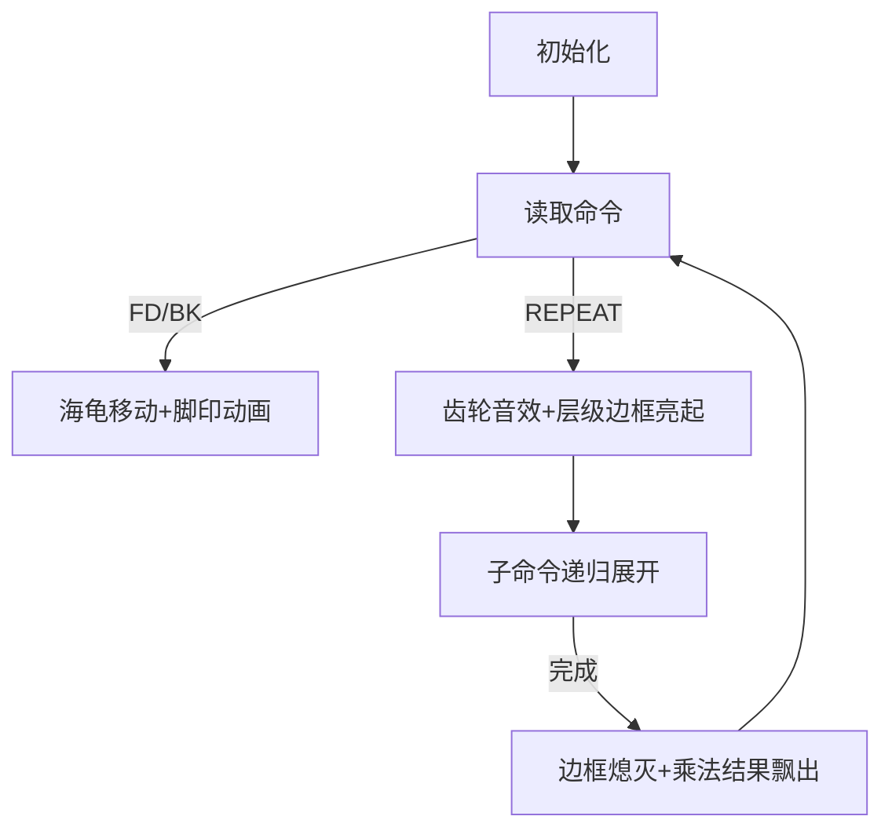

# 题目信息

# logo语言

## 题目描述

Logo 语言命令可以指挥海龟在屏幕中爬行。本问题只使用 Logo 语言的三个语句：前进 `FD`，倒退 `BK` 和重复 `REPEAT`，因此，海龟只在一条直线上来回爬行。输入一行 logo 的命令行，输出海龟在屏幕中离开原来位子的距离（假设屏幕很大，可以让海龟移开 $10^9$ 的距离）。

例如：

- 输入 `FD 100` ，输出：$100$。

- 输入 `FD 100 BK 150`， 输出：$50$。

- 输入 `REPEAT 5[FD 100 BK 50]`， 输出：$250$。

- 输入 `REPEAT 5[FD 50 REPEAT 10[FD 100]]`， 输出：$5250$。

## 说明/提示

每个语句输入数据的绝对值不超过 $1000$。输出结果不会超过 $10^9$。


## 样例 #1

### 输入

```
FD 100
```

### 输出

```
100
```

# AI分析结果


# 💡 Kay的C++算法解析：logo语言 深入学习指南 💡

> 今天我们来分析"logo语言"这道C++编程题。本指南将帮助大家理解递归解析嵌套命令的核心思路，掌握字符串处理技巧，并通过像素动画直观感受海龟移动过程。

## 1. 题目解读与核心算法识别

✨ **本题主要考察**：`递归解析`与`栈的应用`  

🗣️ **初步分析**：
> 解决本题关键在于理解**命令嵌套结构**。就像俄罗斯套娃，REPEAT命令内可能包含多层FD/BK/REPEAT。核心思路：
> - **递归解法**：遇到REPEAT时进入新层级处理括号内命令，返回结果乘以重复次数（类似函数调用栈）
> - **栈解法**：用栈记录重复次数和当前位移，遇到`[`入栈，`]`出栈计算（类似括号匹配）
> - **可视化设计**：像素网格展示海龟位置，嵌套层级用不同颜色边框。执行REPEAT时播放"齿轮转动"音效，完成时亮起过关动画

---

## 2. 精选优质题解参考

**题解一（作者：a1_1）**  
* **点评**：递归解法思路直击本质——将REPEAT视为乘法运算符。代码仅20行却完整处理嵌套、边界和空命令。亮点在于：  
  - 用`getchar()`巧妙跳过括号和空格  
  - 用`c==']'`检测嵌套边界  
  - 主函数`abs(dg())`极简封装  
  实践价值极高，竞赛中可快速实现（注意Linux需Ctrl+D结束输入）

**题解二（作者：封禁用户）**  
* **点评**：教学性极强的递归解析。亮点：  
  - 用`wz`变量捕获"FD/BK/REPEAT"后缀  
  - `x=getchar()`处理括号的写法清晰易懂  
  - 详细注释说明递归状态转移（`rt+=k*func()`）  
  特别适合初学者理解递归的层次关系

**题解三（作者：max0810）**  
* **点评**：创新字符串解析方案。亮点：  
  - `fid()`函数精确定位括号匹配  
  - `a.substr()`切片处理嵌套命令  
  - 附带字符串函数教程（`find_first_of`等）  
  适合想深入字符串处理的学习者

---

## 3. 核心难点辨析与解题策略

### 1. **嵌套命令的层次处理**
* **分析**：REPEAT内可能包含多层命令，需区分执行层级。递归解法通过函数调用栈隐式管理，栈解法则需显式记录层级状态  
* 💡 **学习笔记**：嵌套问题≈树形结构，递归是最自然的解决方式

### 2. **命令与参数的分离解析**
* **分析**：混合字符串如"REPEAT5[FD100]"需精准分割。技巧：  
  - 首字母判断命令类型（F/B/R）  
  - 数字紧邻命令时用`sscanf`或`while(isdigit)`提取参数  
* 💡 **学习笔记**：命令解析本质是有限状态机（初始→命令识别→参数读取）

### 3. **边界条件处理**
* **分析**：两大易错点：  
  - 空REPEAT：`REPEAT 0[]`需特殊处理  
  - 命令尾随`]`：如`FD 100]`需在递归返回前处理  
* 💡 **学习笔记**：测试用例需覆盖"空命令/单层命令/多层嵌套"三种情况

### ✨ 解题技巧总结
- **递归分解法**：将REPEAT视为子问题，FD/BK视为叶子节点  
- **增量式解析**：边读入边处理，避免全字符串存储（节省内存）  
- **防御性编程**：用`abs()`确保距离非负，`getchar()`吃掉空格防解析错误  

---

## 4. C++核心代码实现赏析

### 本题通用核心C++实现参考
* **说明**：综合自优质题解，保留递归本质的精简版本  
* **完整核心代码**：
```cpp
#include <iostream>
using namespace std;

int parse() {
    char cmd;
    int val = 0, total = 0;
    while (cin >> cmd) {
        if (cmd == ']') break;
        string suffix;
        cin >> suffix >> val;
        
        if (cmd == 'R') { // REPEAT处理
            getchar(); // 吃掉'['
            total += val * parse();
            getchar(); // 吃掉']'或空格
        }
        else if (cmd == 'F') total += val; // FD
        else if (cmd == 'B') total -= val; // BK
    }
    return total;
}

int main() {
    cout << abs(parse());
    return 0;
}
```
* **代码解读概要**：  
  - `parse()`递归函数处理命令流  
  - `suffix`捕获"EPEAT"/"D"/"K"后缀（虽未使用但保留可读性）  
  - 双重`getchar()`确保括号解析安全  

### 优质题解片段赏析
**题解一（a1_1）**  
* **亮点**：用最简变量完成嵌套解析  
* **核心代码片段**：
```cpp
int dg() {
    char c; string s; int k, l=0;
    while (cin >> c) {
        if (c == ']') break;
        cin >> s >> k;
        if (c == 'R') {
            getchar(); // '['
            l += k * dg();
            getchar(); // ']'
        }
        if (c == 'B') getchar(), l -= k;
        if (c == 'F') getchar(), l += k;
    }
    return l;
}
```
* **代码解读**：  
  `l`作为累加器，遇到REPEAT时递归计算子命令结果并乘以`k`。两次`getchar()`精确控制流位置，避免手动处理括号  
* 💡 **学习笔记**：递归中局部变量`l`天然隔离各层级状态  

**题解二（封禁用户）**  
* **亮点**：完备的输入流边界处理  
* **核心代码片段**：
```cpp
int func() {
    char ch, x; string wz; int k, rt=0;
    while (cin >> ch) {
        if (ch == ']') break;
        cin >> wz >> k;
        if (ch == 'R') {
            x = getchar(); // '['
            rt += k * func();
            x = getchar(); // ']'
        }
        if (ch == 'B') rt -= k, x = getchar();
        if (ch == 'F') rt += k, x = getchar();
        if (x == ']') break; // 关键边界检测
    }
    return rt;
}
```
* **代码解读**：  
  `x`变量检测到`]`时提前终止循环，避免外层递归过度读取。`wz`虽未使用但保留命令完整性  
* 💡 **学习笔记**：输入流处理需警惕"读过头"，及时break保护状态  

---

## 5. 算法可视化：像素动画演示

### 动画演示主题
**《海龟嵌套大冒险》** - 8-bit像素风+音效反馈  

### 设计思路
> 采用FC游戏风格降低理解压力：  
> - 海龟化为像素精灵，嵌套层级用彩色边框区分（蓝→绿→黄→红）  
> - REPEAT命令触发齿轮转动音效，执行次数用顶部数字气泡显示  
> - 过关时播放《超级玛丽》通关音乐  

### 关键帧步骤


1. **场景初始化**  
   - 16色像素网格：浅蓝背景，深蓝路径线  
   - 海龟精灵：绿色像素龟（▲形态），原点坐标(0,0)  
   - 控制面板：开始/步进/速度滑块（0.5x~3x）  

2. **命令执行反馈**  
   | 命令    | 视觉反馈                  | 音效             |
   |---------|--------------------------|------------------|
   | FD n    | 龟头朝右移动n格，留脚印   | 嘀-嘀（短促）    |
   | BK n    | 龟头朝左移动n格，留虚脚印 | 嘟-嘟（低沉）    |
   | REPEAT k| 屏幕边缘亮k色边框         | 齿轮转动声       |
   | [       | 新层边框向内收缩          | 气泡弹出声       |
   | ]       | 本层边框爆破+显示结果     | 硬币收集声       |

3. **自动化演示模式**  
   - **AI演示**：自动步进+实时显示当前命令片段（如`REPEAT 5[...]`高亮）  
   - **关卡进度**：每完成一层嵌套，右上角星星+1（3星通关机制）  

---

## 6. 拓展练习与相似问题思考

### 通用技巧迁移
递归解析技术还可用于：  
1. 数学表达式计算（如`3*(2+4)`）  
2. XML/JSON层级数据解析  
3. 编程语言解释器（简单语法实现）  

### 洛谷题目推荐
1. **P1928 外星密码**  
   🗣️ *推荐理由*：同样需处理嵌套编码，巩固递归解析思维  
2. **P1739 表达式括号匹配**  
   🗣️ *推荐理由*：训练栈结构应用，为命令解析打基础  
3. **P1175 表达式的转换**  
   🗣️ *推荐理由*：中缀转后缀表达式，提升字符串处理能力  

---

## 7. 学习心得与经验分享
> **参考经验 (来自 a1_1)**：  
> *"我在处理REPEAT 0[]时卡了很久，后来通过打印递归深度变量发现未正确处理空命令"*  
>  
> **Kay点评**：  
> 空命令是常见陷阱！调试时可添加深度参数`void parse(int depth)`，进入递归时打印`> > > Lv.depth`，返回时打印结果值。肉眼观察执行流能快速定位异常层级  

---

> 本次解析就到这里。记住：**递归是把大问题拆成相似小问题**，就像剥洋葱一层层解开。多加练习，你也能成为命令解析大师！ 🐢✨

---
处理用时：108.32秒