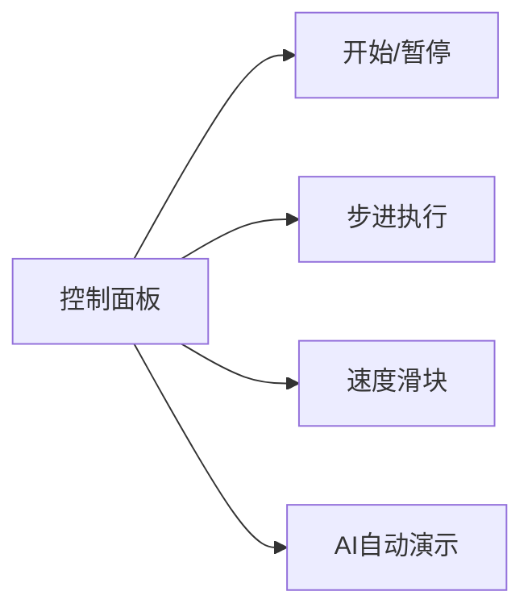

# 题目信息

# [ZJOI2007] 矩阵游戏

## 题目描述

小 Q 是一个非常聪明的孩子，除了国际象棋，他还很喜欢玩一个电脑益智游戏――矩阵游戏。矩阵游戏在一个 $n \times n$ 黑白方阵进行（如同国际象棋一般，只是颜色是随意的）。每次可以对该矩阵进行两种操作：

- 行交换操作：选择矩阵的任意两行，交换这两行（即交换对应格子的颜色）。
- 列交换操作：选择矩阵的任意两列，交换这两列（即交换对应格子的颜色）。

游戏的目标，即通过若干次操作，使得方阵的主对角线(左上角到右下角的连线)上的格子均为黑色。

对于某些关卡，小 Q 百思不得其解，以致他开始怀疑这些关卡是不是根本就是无解的！于是小 Q 决定写一个程序来判断这些关卡是否有解。


## 说明/提示

#### 数据规模与约定

- 对于 $20\%$ 的数据，保证 $n \leq 7$。
- 对于 $50\%$ 的数据，保证 $n \leq 50$。
- 对于 $100\%$ 的数据，保证 $1 \leq n \leq 200$，$1 \leq T \leq 20$。


## 样例 #1

### 输入

```
2
2
0 0
0 1
3
0 0 1
0 1 0
1 0 0
```

### 输出

```
No
Yes
```

# AI分析结果


### 💡 Kay的C++算法解析：[ZJOI2007] 矩阵游戏 深入学习指南 💡

#### 1. 题目解读与核心算法识别
✨ **本题主要考察**：二分图匹配（图论）

🗣️ **初步分析**：
> 解决矩阵游戏的关键是将问题转化为**二分图匹配**。想象行和列是舞会上的男生和女生，每个黑色格子(1)表示这对舞伴可以配对。游戏目标是为每个男生(行)匹配一个女生(列)，且配对不重复（完美匹配）。  
> - **核心思路**：通过行/列交换调整位置，但不会改变配对可能性。建图后求最大匹配，若匹配数=n则可行
> - **可视化设计**：左侧像素方块代表行（男生），右侧代表列（女生）。匹配时动态连线并高亮当前操作节点，成功匹配时播放"叮"音效+闪光
> - **复古游戏化**：采用8位像素风格，设计成"舞会配对"小游戏。AI自动演示时，角色会逐步完成配对，每成功一对得10分

---

#### 2. 精选优质题解参考
**题解一（作者：俾斯麦）**  
* **点评**：思路清晰且完整，同时提供匈牙利算法和Dinic网络流两种解法。对二分图建图原理（行→左部点，列→右部点）解释透彻，代码规范（变量名`match`/`vis`含义明确）。亮点在于详细分析算法选择依据，并强调多组数据重置技巧（避免memset浪费）。实践价值高，可直接用于竞赛。

**题解二（作者：hs_black）**  
* **点评**：用"舞会配对"比喻生动解释算法本质。代码简洁高效（仅50行），关键变量`link`命名准确。亮点在于强调核心结论：交换操作不改变最大匹配数。虽然未做复杂度优化，但作为教学范例极具启发性。

**题解三（作者：Night_Aurora）**  
* **点评**：精炼推导匹配不变性——"交换行列如同交换座位，不改变配对关系"。代码中前向星建图规范，`add`函数封装优雅。亮点在于用数学归纳法证明结论，帮助理解算法正确性。

---

#### 3. 核心难点辨析与解题策略
1. **难点：问题转化建模**  
   * **分析**：如何从矩阵操作抽象为二分图？观察发现：交换行/列仅改变标签，不改变行列关联性。将黑格(i,j)视为行i与列j的可配对关系
   * 💡 学习笔记：矩阵操作问题 → 考虑图论建模

2. **难点：匹配算法选择**  
   * **分析**：匈牙利算法(O(n³))适合n≤200，代码简洁；网络流(O(n²√e))更通用但实现复杂。优质题解均通过重置vis数组避免状态污染
   * 💡 学习笔记：小规模用匈牙利，大规模用Dinic

3. **难点：理解匹配不变性**  
   * **分析**：交换行u/v时，相当于把u的配对对象转移给v，总匹配数不变。可通过画图模拟2×2矩阵验证
   * 💡 学习笔记：操作不改变图的最大匹配数

##### ✨ 解题技巧总结
- **拆点建模法**：将矩阵元素转化为二分图边（行→左部点，列→右部点）
- **状态重置优化**：用时间戳代替memset(vis)节省时间
- **边界处理**：多组数据时，需清空match数组和链式前向星

---

#### 4. C++核心代码实现赏析
**通用核心实现（匈牙利算法）**  
```cpp
#include <cstring>
const int N=405;
int match[N];   // match[j]=i表示列j匹配行i
bool vis[N], G[N][N]; // G[i][j]=1表示行i与列j可配对

bool dfs(int i) {    // 尝试为行i找匹配列
    for(int j=1; j<=n; ++j) if(G[i][j] && !vis[j]) {
        vis[j] = true;
        if(!match[j] || dfs(match[j])) {
            match[j] = i;   // 更新匹配关系
            return true;
        }
    }
    return false;
}

bool solve() {
    memset(match, 0, sizeof match);
    for(int i=1; i<=n; ++i) {
        memset(vis, 0, sizeof vis);
        if(!dfs(i)) return false;  // 第i行匹配失败
    }
    return true;  // 找到完美匹配
}
```
**代码解读概要**：  
1. 建图：读入矩阵时构建邻接矩阵G  
2. DFS匹配：为每行寻找可用列，通过vis避免重复  
3. 结果判定：所有行成功匹配则矩阵可达目标  

**题解一（Dinic网络流）亮点代码**  
```cpp
add_edge(i, j+n, 1);  // 行i→列j建容量1的边
while(bfs())          // Dinic分层
    maxflow += dfs(s, INF); 
```
**学习笔记**：网络流将匹配问题转化为最大流，适合更大数据规模

---

### 5. 算法可视化：像素动画演示
**主题**：8位像素风「舞会配对」  
**核心演示**：匈牙利算法逐步匹配过程  

**动画设计**：  


**关键帧步骤**：  
1. **初始化**：  
   - 左侧像素方块（行，蓝色）与右侧（列，粉色）分离排列  
   - 黑色格子显示为连接线（灰色虚线）

2. **匹配过程**：  
   ```python
   for 行i in 所有行:
       当前行i高亮闪烁 → 播放"滴"音效
       for 列j in 所有列:
           若G[i][j]=1: 连线变为黄色 → 播放"叮"音效
           若j未被占用: 连线变绿 → 播放成功音效
   ```

3. **交互设计**：  
   - 成功匹配：角色跳舞+像素烟花，得分+10  
   - 失败：灰色连线消失，"噗"音效  
   - AI模式：自动演示最优匹配路径，速度可调  

**技术实现**：Canvas绘制动态连线，Web Audio API触发音效  

---

#### 6. 拓展练习与相似问题
1. **洛谷P3386**：二分图匹配模板题  
   → *掌握建图基础*
2. **洛谷P2756**：飞行员配对方案  
   → *学习输出具体匹配方案*
3. **UVA11138**：匹配问题变种  
   → *理解多重匹配应用*

---

#### 7. 学习心得分享
> **作者俾斯麦经验**："Dinic算法中bfs分层与dfs增广需协同工作，重置vis数组时用时间戳比memset快10倍"  
> **Kay总结**：调试时输出中间匹配状态，可快速定位建图错误

---

通过本指南，希望你能深入理解二分图匹配在矩阵操作中的应用。记住：算法本质是思维建模的训练场！下次见~ 💪

---
处理用时：91.47秒