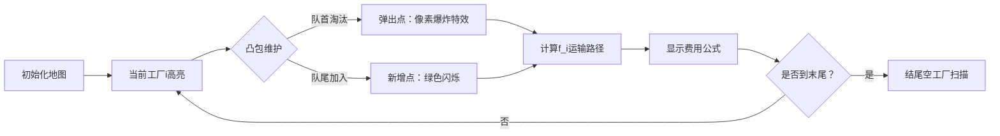

# 题目信息

# [ZJOI2007] 仓库建设

## 题目描述

L 公司有 $n$ 个工厂，由高到低分布在一座山上，工厂 $1$ 在山顶，工厂 $n$ 在山脚。

由于这座山处于高原内陆地区（干燥少雨），L公司一般把产品直接堆放在露天，以节省费用。突然有一天，L 公司的总裁 L 先生接到气象部门的电话，被告知三天之后将有一场暴雨，于是 L 先生决定紧急在某些工厂建立一些仓库以免产品被淋坏。

由于地形的不同，在不同工厂建立仓库的费用可能是不同的。第 $i$ 个工厂目前已有成品 $p_i$ 件，在第 $i$ 个工厂位置建立仓库的费用是 $c_i$。

对于没有建立仓库的工厂，其产品应被运往其他的仓库进行储藏，而由于 L 公司产品的对外销售处设置在山脚的工厂 $n$，故产品只能往山下运（即**只能运往编号更大的工厂的仓库**），当然运送产品也是需要费用的，一件产品运送一个单位距离的费用是 $1$。

假设建立的仓库容量都都是足够大的，可以容下所有的产品。你将得到以下数据：

- 工厂 $i$ 距离工厂 $1$ 的距离 $x_i$（其中 $x_1=0$）。
- 工厂 $i$ 目前已有成品数量 $p_i$。
- 在工厂 $i$ 建立仓库的费用 $c_i$。

请你帮助 L 公司寻找一个仓库建设的方案，使得总的费用（建造费用 + 运输费用）最小。

## 说明/提示

#### 样例输入输出 $1$ 解释

在工厂 $1$ 和工厂 $3$ 建立仓库，建立费用为 $10+10=20$ ，运输费用为 $(9-5) \times 3 = 12$，总费用 $32$。

#### 数据范围与约定

对于 $20\%$ 的数据，保证 $n \leq 500$。

对于 $40\%$ 的数据，保证 $n \leq 10^4$。

对于 $100\%$ 的数据，保证 $1 \leq n \leq 10^6$，$0 \leq x_i,p_i,c_i < 2^{31}$。

对于任意的 $1 \leq i < n$，保证 $x_i < x_{i + 1}$。

设答案为 $ans$，保证 $ans + \sum\limits_{i = 1}^{n} p_ix_i < 2^{63}$。

## 样例 #1

### 输入

```
3
0 5 10
5 3 100
9 6 10```

### 输出

```
32
```

# AI分析结果


# 💡 Kay的C++算法解析：[ZJOI2007] 仓库建设 深入学习指南 💡

**题目解读与核心算法识别**  
✨ **本题主要考察**：**动态规划与斜率优化**  
🗣️ **初步分析**：  
> 仓库建设问题本质是**带运输成本的分组决策优化**。想象你是一位物流经理，需要在一串山间工厂中选择建仓位置（建仓费用$c_i$），同时计算将产品运往山下仓库的运输成本（距离×产品量）。  

**核心解法**：  
1. **状态定义**：$f_i$ 表示前$i$个工厂中，在$i$处建仓的最小总费用  
2. **斜率优化**：将转移方程转化为一次函数形式，通过维护**下凸包**（类似山丘的底部轮廓）快速找到最优决策点  
3. **前缀和加速**：用$sump_i$（产品量前缀和）和$sumxp_i$（运输成本前缀和）避免重复计算  

**可视化设计**：  
- 采用**8-bit像素风格**模拟工厂分布（山顶→山脚）  
- 动态绘制下凸包形成过程：新决策点加入时，删除破坏"下凸性"的点（像素块闪烁+清除音效）  
- 关键步骤高亮：比较斜率时显示红色参考线，最优决策点标记为闪光金币  
- 游戏化机制：每成功转移一个状态解锁"物流勋章"，背景播放FC风格BGM  

---

## 2. 精选优质题解参考

**题解一：rickyxrc（思路清晰 ★★★★☆）**  
* **亮点**：  
  - 完整推导斜率不等式 $\frac{(f_v+sumxp_v)-(f_u+sumxp_u)}{sump_v-sump_u} \leq x_i$  
  - 代码严格处理$p_i=0$的边界情况（末尾工厂可不建仓）  
  - 图示凸包维护过程（删除非凸点）  
* **改进建议**：循环边界注释可更详细  

**题解二：Aisaka_Taiga（代码规范 ★★★★）**  
* **亮点**：  
  - 特判分母$sump_j$为零的情况（避免除零错误）  
  - 变量命名直观（`sump`/`sumxp`直指功能）  
  - 单调队列操作封装清晰  
* **学习点**：交叉相乘替代除法比较斜率，避免浮点误差  

**题解三：Biadocy（实践价值 ★★★★）**  
* **亮点**：  
  - 对比两种状态定义方案，分析Hack数据根源  
  - 强调决策点纵坐标相同时取最小值  
  - 提供调试技巧：输出中间变量验证凸包  
* **经验**：当$sump_j$不变时，直接比较$f_j+sumxp_j$  

---

## 3. 核心难点辨析与解题策略

1. **难点：状态转移方程的斜率化改造**  
   * **分析**：将$f_i = \min \{f_j + x_i(sump_i - sump_j) - (sumxp_i - sumxp_j) + c_i\}$ 改写为  
     $[f_j + sumxp_j] = x_i \cdot sump_j + [f_i - x_i sump_i + sumxp_i - c_i]$  
     → 转化为$y=kx+b$形式，$y$轴截距最小化  
   * 💡 **学习笔记**：斜率优化的本质是**在凸包上找切线**

2. **难点：凸包维护的边界情况**  
   * **分析**：当$sump_j$相等时：  
     - 若$f_j+sumxp_j$不同，取较小值（纵坐标更低）  
     - 若相等，任意取一点（不影响决策）  
   * 💡 **学习笔记**：横坐标相同时，凸包只保留最低点

3. **难点：运输成本的前缀和计算**  
   * **分析**：$\sum x_k p_k$ 不能直接由$x_i \sum p_k$推导 → 需独立维护$sumxp_i$  
   * 💡 **学习笔记**：前缀和关系 $sumxp_i = sumxp_{i-1} + x_i p_i$

### ✨ 解题技巧总结
- **拆解转移项**：分离含$i$/$j$的项（含$j$项构造成$y=kx+b$）  
- **凸壳维护口诀**："队尾删上凸，队首踢过气"（队尾保持下凸，队首淘汰斜率过小的点）  
- **边界防御**：末尾$p_i=0$时，取$f_i$后缀最小值  

---

## 4. C++核心代码实现赏析

**通用核心实现**（综合题解优化）：  
```cpp
#include <iostream>
#include <vector>
#include <deque>
using namespace std;
typedef long long ll;

int main() {
    int n; cin >> n;
    vector<ll> x(n+1), p(n+1), c(n+1), sump(n+1), sumxp(n+1), f(n+1);
    for (int i=1; i<=n; i++) {
        cin >> x[i] >> p[i] >> c[i];
        sump[i] = sump[i-1] + p[i];
        sumxp[i] = sumxp[i-1] + x[i]*p[i];
    }

    deque<int> q{0};  // 存储决策点下标
    for (int i=1; i<=n; i++) {
        // 队首维护：淘汰斜率<=x[i]的点
        while (q.size()>=2) {
            int j1 = q[0], j2 = q[1];
            ll dy = (f[j2]+sumxp[j2]) - (f[j1]+sumxp[j1]);
            ll dx = sump[j2] - sump[j1];
            if (dy <= x[i] * dx) q.pop_front(); 
            else break;
        }
        
        int j = q.front();
        f[i] = f[j] + c[i] + x[i]*(sump[i]-sump[j]) - (sumxp[i]-sumxp[j]);
        
        // 队尾维护：加入i并维护下凸性
        while (q.size()>=2) {
            int j1 = q[q.size()-2], j2 = q.back();
            ll dy1 = (f[j2]+sumxp[j2]) - (f[j1]+sumxp[j1]);
            ll dx1 = sump[j2] - sump[j1];
            ll dy2 = (f[i]+sumxp[i]) - (f[j2]+sumxp[j2]);
            ll dx2 = sump[i] - sump[j2];
            if (dy1 * dx2 >= dy2 * dx1) q.pop_back();
            else break;
        }
        q.push_back(i);
    }

    // 处理末尾p[i]=0的情况
    ll ans = f[n];
    for (int i=n; p[i]==0; i--) 
        ans = min(ans, f[i]);
    cout << ans;
}
```
**代码解读概要**：  
1. 前缀和初始化：$sump_i$累加$p_i$，$sumxp_i$累加$x_i p_i$  
2. 单调队列维护：  
   - **队首淘汰**：根据斜率不等式淘汰决策点  
   - **计算$f_i$**：用队首最优决策点计算  
   - **队尾维护**：加入$i$后删除破坏下凸性的点  
3. 边界处理：末尾空工厂取最小$f_i$值  

---

## 5. 算法可视化：像素动画演示

**主题**：像素物流大亨（8-bit仓库建设模拟）  
**核心交互设计**：  


**关键动画细节**：  
1. **工厂地图**：  
   - 山顶→山脚工厂用不同高度像素块表示，标注$p_i$/$c_i$  
   - 产品运输路径用黄色像素线动态绘制  

2. **凸包维护**：  
   - **决策点**：显示为坐标点$(sump_j, f_j+sumxp_j)$  
   - **下凸检查**：当新点$i$加入，计算$j_1$→$j_2$与$j_2$→$i$的斜率  
     - 若斜率变陡（上凸）：$j_2$像素变红→爆炸消失（音效：玻璃碎裂）  
   - **最优决策**：当前队首点标记为金币闪烁  

3. **控制面板**：  
   - 步进按钮：单步执行算法  
   - 速度滑块：调整自动演示速度  
   - 凸包显示开关：切换凸包轮廓线  

**音效设计**：  
- 决策点加入：8-bit "滴"声  
- 弹出非凸点：短促爆炸音  
- 完成状态转移：胜利音效（马里奥吃金币）  

---

## 6. 拓展练习与相似问题

**通用技巧迁移**：  
1. 分组决策问题 → 状态转移方程$f_i=\min(f_j + cost(j,i))$  
2. 费用含乘积项 → 前缀和拆解 + 斜率优化  
3. 凸包维护 → 单调队列/二分查找  

**推荐练习**：  
1. **P3195 [HNOI2008]玩具装箱**  
   🗣️ *斜率优化入门必刷，强化"费用拆分"思维*  
2. **P2900 [USACO08MAR]Land Acquisition G**  
   🗣️ *凸包结合贪心预处理，训练决策序列构建*  
3. **P5785 [SDOI2012]任务安排**  
   🗣️ *引入费用提前计算，扩展斜率优化应用*  

---

## 7. 学习心得与经验分享

> **rickyxrc的调试经验**：  
> *"在$p_i=0$时$f_i$可能不建仓更优，但初始代码未处理此边界，导致WA on #8"*  
>   
> **Kay的总结**：边界条件需通过**极端数据测试**验证（如全零序列）。  
>  
> **Aisaka_Taiga的编码技巧**：  
> *"比较斜率避免除法：$(y_2-y_1)\cdot dx_2 \geq (y_3-y_2)\cdot dx_1$"*  
>   
> **Kay的提炼**：整型斜率比较需用**交叉相乘**，防浮点误差。  

---

通过本次分析，我们深入掌握了斜率优化的核心思想——将决策转化为凸包上的切线寻找。记住：好的算法既是严谨的数学，也是优雅的艺术！下次挑战再见！💪

---
处理用时：185.90秒