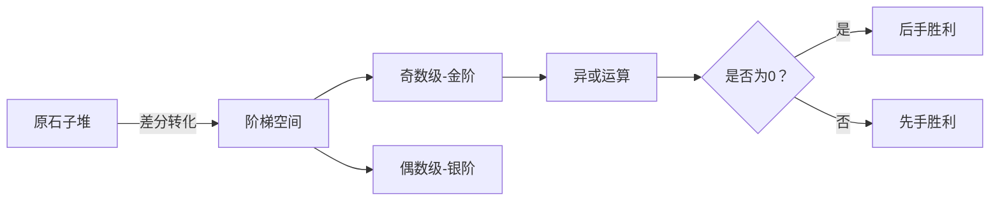

# 题目信息

# [POI 2009] KAM-Pebbles

## 题目描述

有 $n$ 堆石子。除了第一堆外，每堆石子个数都不少于前一堆的石子个数。两人轮流操作。每次操作可以从一堆石子中移走任意多颗石子，但是要保证操作后仍然满足初始时的条件。没有石子可移动的人就输掉了游戏。问先手是否必胜。

## 样例 #1

### 输入

```
2
2
2 2
3
1 2 4
```

### 输出

```
NIE
TAK
```

# AI分析结果


### 💡 Kay的C++算法解析：KAM-Pebbles 深入学习指南 💡

#### 1. 题目解读与核心算法识别
✨ **本题主要考察**：`阶梯Nim游戏`（博弈论经典模型）

🗣️ **初步分析**：
> 解决"KAM-Pebbles"关键在于将石子堆的单调递增特性转化为**阶梯Nim模型**。想象石子堆是阶梯的台阶，每次移动石子就像在台阶间传递物品。通过差分数组（相邻石子堆的差值）建立阶梯：
> - 从右向左编号阶梯（第n堆为第1级）
> - 每次取石子操作 ⇨ 将当前阶梯的石子向右移动
> - **胜负条件**：奇数级阶梯的差分值异或和为0时先手必败
> 
> **可视化设计**：在8-bit像素网格中（类似FC游戏）：
> 1. 用不同颜色方块表示石子堆和差分值
> 2. 操作时高亮当前阶梯并播放"像素音效"
> 3. 奇数级阶梯闪烁金色边框，异或结果实时显示
> 4. 获胜时触发"胜利音效"和像素烟花动画

---

#### 2. 精选优质题解参考
**题解一（Vatyr）**
* **点评**：清晰解释阶梯Nim的转化原理，指出"反序操作"关键点（本题移动方向与标准阶梯Nim相反）。代码用差分数组`c[i]=a[i]-a[i-1]`精准建模，循环从n向1遍历奇数位异或。实践性强，可直接用于竞赛。

**题解二（ycyaw）**
* **点评**：用"反向阶梯"比喻直观解释算法本质，通过`(n-i+1)&1`巧妙定位奇数位置。代码简洁高效（15行内解决），变量命名规范（`input[]`，`k`），边界处理完整（隐式处理a[0]=0）。

**题解三（Mars_Dingdang）**
* **点评**：系统阐述阶梯Nim证明过程，强调"偶数阶梯不影响结果"的特性。代码将差分计算融入循环，空间效率优（单数组存储）。学习笔记部分给出完整数学推导，适合深度理解。

---

#### 3. 核心难点辨析与解题策略
1. **差分转化与方向反转**
   * **分析**：难点在于发现操作等价于差分数组的右移。需反转阶梯方向（原第n堆视为阶梯起点）才能匹配标准阶梯Nim模型。优质解法均通过`for(int i=n;i>=1;i-=2)`实现反转。
   * 💡 **学习笔记**：非递减序列 ⇨ 差分数组非负 ⇨ 天然匹配阶梯模型

2. **奇数位判定逻辑**
   * **分析**：阶梯Nim仅考虑奇数级（从右数第1,3,5...堆）。需注意当总堆数奇偶性不同时，最后一级的索引计算（如`(n-i+1)&1`或`i-=2`）。
   * 💡 **学习笔记**：从右向左遍历可统一处理奇偶性，避免复杂边界判断

3. **博弈策略抽象**
   * **分析**：需理解"对手操作偶数级时，我可反向操作抵消影响"的核心论证。这解释了为何只需关注奇数级异或和。
   * 💡 **学习笔记**：阶梯Nim本质是奇数级Nim游戏的等效变形

### ✨ 解题技巧总结
- **差分转化法**：对相邻元素有约束的问题，优先考虑差分数组
- **方向修正技巧**：当操作方向与标准模型相反时，反转遍历顺序
- **博弈等效转换**：识别操作中的不变量（如偶数级石子的可抵消性）
- **边界精简处理**：设a[0]=0可统一差分计算

---

#### 4. C++核心代码实现赏析
**通用核心实现**（综合题解优化）：
```cpp
#include <iostream>
using namespace std;
int main() {
    int T, n, a[1005] = {0}; // a[0]初始化为0
    cin >> T;
    while (T--) {
        cin >> n;
        for (int i = 1; i <= n; i++) cin >> a[i];
        int ans = 0;
        for (int i = n; i >= 1; i -= 2) // 反序遍历奇数位
            ans ^= (a[i] - a[i-1]);     // 计算差分异或和
        cout << (ans ? "TAK\n" : "NIE\n"); 
    }
    return 0;
}
```
* **代码解读概要**：
  1. 读入时默认`a[0]=0`统一差分计算
  2. 倒序循环（`i从n到1`，步长-2）定位奇数阶梯
  3. 异或差分值决策胜负（非零则先手胜）

---

**题解一核心片段赏析**：
```cpp
for(int i=n;i>=1;i-=2)
    ans^=c[i]; // c[i]=a[i]-a[i-1]
```
* **亮点**：直击阶梯Nim本质，显式倒序访问
* **学习笔记**：倒序遍历是方向修正的关键操作

**题解二核心片段赏析**：
```cpp
if ((n - i + 1) & 1) 
    k ^= (input[i] - input[i-1]);
```
* **亮点**：用奇偶判断替代步长控制，适配连续遍历场景
* **学习笔记**：位运算`&1`比模运算`%2`效率更高

---

#### 5. 算法可视化：像素动画演示
**主题**：`阶梯武士的宝石征程`（FC像素RPG风格）

**核心演示**：


**动画流程**：
1. **场景初始化**（8-bit风格）：
   - 上屏：石子堆像素塔（高度=a[i]），下屏：差分阶梯（金/银色方块）
   - 控制面板：步进按钮/速度滑块/异或值显示区

2. **操作演示**：
   - 选中某堆石子时：对应像素塔闪烁红光，播放"选择音效"
   - 拖动滑块减少石子：像素块逐格下降，差分值实时更新
   - 石子移动：差分方块从当前阶梯滑向右邻阶梯，伴随"叮"声

3. **胜负判定**：
   - 异或归零：所有金阶闪绿光，播放胜利BGM
   - 非零时：最后操作的金阶爆炸为像素烟花

**交互设计**：
- AI演示模式：自动执行最优策略（蓝衣武士NPC）
- 关卡进度：每关对应测试用例，通关解锁新难度

---

#### 6. 拓展练习与相似问题思考
1. **阶梯Nim变形**：
   - POJ 1704（棋子移动等效石子）
   - HDU 4315（阶梯Nim+国王特权）

2. **差分技巧应用**：
   - CodeForces 786A（差分+周期博弈）
   - LeetCode 798（差分数组优化）

3. **洛谷推荐**：
   - P3480 [POI2009]KAM-Pebbles（本题强化）
   - P2575 高手过招（阶梯Nim+状态压缩）
   - P2964 [USACO09NOV] Coin Game（差分博弈思想）

---

#### 7. 学习心得与经验分享
> **Vatyr的调试经验**："我在处理堆序号时，最初错误地从左向右取奇数位，导致WA。通过打印中间异或值才发现方向反了。"
>
> **Kay总结**：阶梯Nim的方向敏感性是常见陷阱。调试时可：
> 1. 打印差分数组和选取的索引
> 2. 小规模手动模拟（如n=3）
> 3. 对比标准阶梯Nim操作方向

--- 
通过本指南，希望大家不仅掌握阶梯Nim的代码实现，更能理解其背后的博弈思想。记住：优秀的算法思维就像搭建阶梯，每一步都要稳固方向正确！🚀

---
处理用时：182.73秒