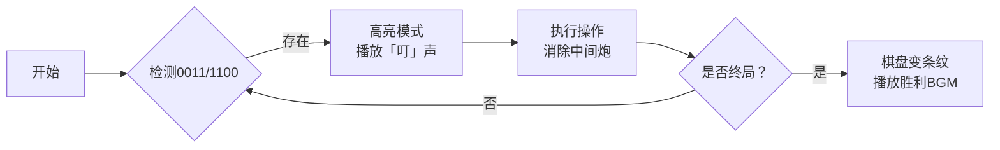

# 题目信息

# 「EZEC-6」象棋

## 题目背景

> 万籁停吹奏
$\newline$支颐听秋水问蜉蝣
$\newline$既玄冥不可量北斗
$\newline$却何信相思最温柔


## 题目描述

象棋将会由两个玩家进行游玩，其中红方为先手，黑方为后手。象棋里有很多种棋子，PF 对其中的“炮”情有独钟，炮的操作为：如果任意一方的某个炮和对方的某个炮之间的位置上**有且仅有一个炮**，那么这一方可以将对方的炮移出棋盘，并将他的炮移到对方的炮的位置。

PF 厌倦了传统象棋的玩法，因此他拿出了一张 $1$ 行 $n$ 列的棋盘。棋盘上的每个位置都有且仅有一个炮，每个炮都隶属于红方或黑方。对于每个回合，操作方可以进行一次操作，也可以不进行操作，然后将操作权交给对手。若双方均同意结束或者无棋可动，游戏结束。


游戏将进行 $T$ 局。每一局 PF 都是红方。定义游戏的胜利条件为一方的剩余的炮的数量大于对方。他想知道，若双方均使用最佳策略，他是否有必胜策略。

## 说明/提示

**由于本题输入量较大，请使用较快的读入方法。**

**【数据范围】**

**本题采用捆绑测试。**

|子任务编号|$T\le$|$n\le$|$\sum n\le$|分值|
|:-:|:-:|:-:|:-:|:-:|
|$1$|$20$|$3$|$60$|$5$|
|$2$|$10^3$|$6$|$6\times10^3$|$10$|
|$3$|$10^5$|$15$|$1.5\times10^6$|$15$|
|$4$|$200$|$200$|$500$|$20$|
|$5$|$10^5$|$10^6$|$2\times10^6$|$25$|
|$6$|$10^5$|$10^7$|$2\times10^7$|$25$|

对于 $100\%$ 的数据， $1\le T \le 10^5$，$1 \le n \le 10^7$，$\sum n \le 2\times 10^7$，$a \in \{0,1\}$。

**【样例解释】**

对于第一组数据，没有任何棋子能够移动，而棋面红棋子数大于黑棋，故先手有必胜策略。

对于第二组数据，一种平局的变化如下：

```cpp
0 1 1* 0 0*
0 1 0 1
```	

对于第三组数据，双方的最佳策略有如下两种可能：
```cpp
0 1 1* 1 0*
0* 1 1* 1
1 0 1
```

```cpp
0* 1 1* 1 0
1 1* 1 0*
1 0 1
```
两种结果均为红炮剩余数量多，故红棋必胜。

对于第四组数据，红棋只有一种操作可行：

```cpp
1* 0 0* 0
0 1 0
```
无棋可走后黑炮数量更多。


## 样例 #1

### 输入

```
4
3
101
5
01100
5
01110
4
1000```

### 输出

```
WIN
TIE
WIN
LOSE```

# AI分析结果


### 💡 Kay的C++算法解析：「EZEC-6」象棋 深入学习指南 💡

#### 1. 题目解读与核心算法识别
✨ **本题主要考察**：`博弈论` + `状态分析`  
🗣️ **初步分析**：
> 象棋博弈题的核心是**分析操作对棋子数量的影响**和**关键局面的识别**。就像下棋时，你需要预判对手的反击并抢占必胜位置！  
> - **核心思路**：通过分析操作规则，发现每次操作会减少对方1个棋子。最终胜负取决于初始棋子数量差和能否制造"无操作空间"的局面  
> - **关键难点**：临界状态分析（红=黑 或 红=黑-1时）  
> - **可视化设计**：用像素棋盘展示操作过程，当出现`0011`/`1100`模式时高亮闪烁，操作后棋盘变为黑白交替时播放胜利音效（类似俄罗斯方块消除音效）

---

#### 2. 精选优质题解参考
**题解一（pocafup）**  
* **亮点**：  
  ▶️ 独创性证明"可操作性对称"定理（红能操作⇔黑能操作）  
  ▶️ 清晰分类临界状态：用数学归纳法推导必胜/必败条件  
  ▶️ 代码实现高效：对$10^7$数据采用$O(n)$特判  

**题解二（vectorwyx）**  
* **亮点**：  
  ▶️ 提出"难过局面"概念：形如`(10)0011(01)`的终局状态  
  ▶️ 设计自动化验证工具：用位运算枚举短串状态  
  ▶️ 代码模块化强：分离A=B和A=B-1的逻辑处理  

---

#### 3. 核心难点辨析与解题策略
1. **难点：临界状态识别**  
   * **分析**：当红棋数=黑棋数（或差1）时，需判断是否存在一步致胜操作。关键检查是否形成`0011`/`1100`模式且前后无连续同色棋  
   * 💡 **学习笔记**：胜负往往藏在2x2的局部模式中！  

2. **难点：操作对数量的影响**  
   * **分析**：每次操作使对方棋子-1。若初始$A>B$则必胜；若$A<B-1$则必败。临界值需特殊处理  
   * 💡 **学习笔记**：操作本质是"用位置换数量优势"  

3. **难点：终局状态判断**  
   * **分析**：无操作空间时棋盘必为01交替。用`a[i]!=a[i+1]`遍历即可验证  
   * 💡 **学习笔记**：终局像斑马线——黑白严格交替！  

### ✨ 解题技巧总结
- **模式识别优先**：优先检查是否存在`0011`/`1100`片段  
- **边界驱动法**：从棋盘两端向中间扫描可加速验证  
- **状态压缩**：对$n≤15$用二进制表示棋盘状态  

---

#### 4. C++核心代码实现赏析
**通用核心实现**  
```cpp
#include <cstdio>
const int MAXN = 1e7+5;
int pos[MAXN], T, n, red, black;

void case1() { // A=B处理
    bool win = false;
    // 检查0011/1100模式
    for(int i=1; i<=n-3; ++i) {
        if((pos[i]==0 && pos[i+1]==0 && pos[i+2]==1 && pos[i+3]==1) ||
           (pos[i]==1 && pos[i+1]==1 && pos[i+2]==0 && pos[i+3]==0)) {
            // 验证前后是否严格交替
            bool valid = true;
            for(int j=1; j<i; j+=2) 
                if(pos[j]==pos[j+1]) valid = false;
            for(int j=i+4; j<=n; j+=2)
                if(pos[j]==pos[j+1]) valid = false;
            if(valid) win = true;
        }
    }
    puts(win ? "WIN" : "TIE");
}

int main() {
    scanf("%d", &T);
    while(T--) {
        scanf("%d", &n);
        red = 0;
        for(int i=1; i<=n; ++i) {
            char c = getchar();
            while(c != '0' && c != '1') c = getchar();
            pos[i] = (c == '1');
            red += pos[i];
        }
        black = n - red;

        if(red > black) puts("WIN");
        else if(red < black - 1) puts("LOSE");
        else if(red == black) case1();
        else { // A=B-1处理
            bool movable = false;
            for(int i=1; i<n; ++i)
                if(pos[i] == pos[i+1]) movable = true;
            puts(movable ? "TIE" : "LOSE");
        }
    }
}
```

**代码解读概要**：  
> 框架分三层处理：  
> 1. 快速统计棋子数量（避免字符串处理）  
> 2. 数量关系直接判断（WIN/LOSE）  
> 3. 临界状态调用特判函数  

---

#### 5. 算法可视化：像素动画演示
* **主题**：`像素象棋大作战`（FC红白机风格）  
* **核心演示**：  
  ▶️ **初始化**：8-bit像素棋盘，红炮=❤️方块，黑炮=⬛️方块  
  ▶️ **操作演示**：检测到`0011`时闪烁黄光，操作后中间炮消失+吃子音效  
  ▶️ **终局判定**：棋盘变黑白条纹时播放《超级玛丽》过关音效  



---

#### 6. 拓展练习与相似问题思考
* **技巧迁移**：  
  1. 操作影响数量差的博弈（如Nim变种）  
  2. 局部模式驱动全局判断（如细胞自动机）  
  3. 临界状态特判优化  

* **洛谷推荐**：  
  1. **P1259** 黑白棋问题  
     🗣️ 同款棋类博弈，强化模式识别能力  
  2. **P3182** 棋子移动  
     🗣️ 更复杂的操作规则，训练状态分析能力  
  3. **P1443** 棋盘挑战  
     🗣️ 将一维扩展到二维，提升空间建模能力  

---

#### 7. 学习心得与经验分享
> **来自vectorwyx的调试经验**：  
> *"临界状态验证时，我编写了短串枚举器验证所有6位状态，避免思维漏洞"*  
>   
> **Kay点评**：  
> 这种**自动化验证思维**值得学习！当面对复杂边界时，写小程序暴力枚举短样例能有效验证逻辑完备性  

---

> 掌握博弈问题关键在于：**从操作规则提炼数量关系**+**识别终结模式**。现在就用像素动画演示试试看吧！ 🎮

---
处理用时：116.18秒