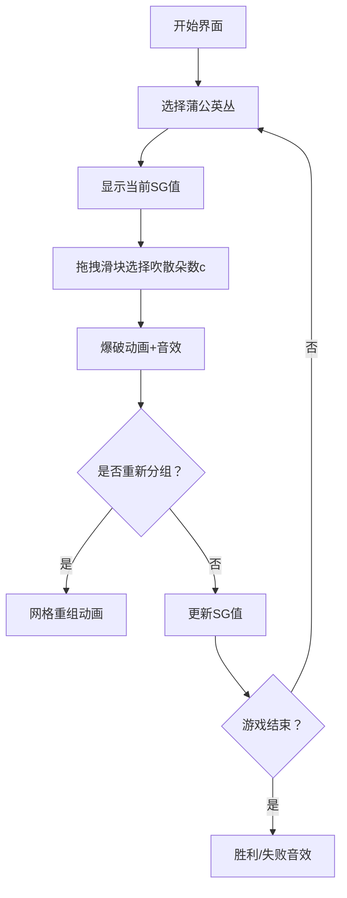

# 题目信息

# 「Stoi2031」蒲公英的约定（vol.2）

## 题目背景

> 一起长大的约定 那样清晰 拉过勾的我相信 说好要一起旅行 是你如今 唯一坚持的任性 ——《蒲公英的约定》

## 题目描述

清和如在玩游戏。她们有 $n$ 丛 **蒲公英**，每丛分别有 $s_i$ 朵。这些 **蒲公英** 有一个神奇的性质：有一个给定的常数 $\sigma \in (0,1)$，$x$ 朵 **蒲公英** 会分出 $\lfloor \sigma x \rfloor$ 朵为一组，剩下 $x-\lfloor \sigma x \rfloor$ 朵继续分组，直到分出的组没有 **蒲公英** 即 $\lfloor \sigma x \rfloor=0$ 为止。她们称这种现象为 **任性**。现在她们的每丛 **蒲公英** 都有 **任性** 的现象。她们的游戏规则如下：从清开始，两人轮流进行 **旅行**。一次 **旅行** 为选择一丛 **蒲公英** 并吹散这一丛的第一组中的若干朵 **蒲公英**，至少要吹一朵，至多吹的朵数为第一组的朵数，即不能吹散除第一组外的 **蒲公英**。当第一组为空时，其下一组成为第一组。若这一丛只剩下一组 **蒲公英**，这一丛不能再被选定。每丛 **蒲公英** 都不能被选定时，游戏结束，当前轮到的人落败。她们想知道如果清第一次 **旅行** 时等概率选择其中一丛可吹散的 **蒲公英** 再等概率选择吹散的朵数后两人都按最优策略操作，那么清的胜率 $x \bmod{20190816170251}$ 的值将会是多少。

与 vol.1 的区别是，**蒲公英** 在被吹散一部分后 **会** 重新分组。

## 说明/提示

#### 简述版题意：

有 $n$ 丛 **蒲公英**，第 $i$ 丛有 $s_i$ 朵。给定实数 $\sigma$，两人轮流操作，每次操作可以选择一丛 **蒲公英**，并选择一个整数 $c \in (0,\sigma s]$，从这丛 **蒲公英** 中吹散 $c$ 朵，其中 $s$ 为操作之前这丛 **蒲公英** 的朵数。必须至少吹一朵，不能操作者败。求先手第一步等概率选择任意一丛可操作的 **蒲公英** 再等概率选择吹散的朵数后两人都采取最优策略时先手的胜率 $x \bmod{20190816170251}$ 的值。

#### 样例解释：

对于样例 $1$，清无法操作，胜率为 $0$。

对于样例 $2$，清可以选择第 $2$ 丛并在两种操作中选择吹散 $2$ 朵变成 $1,5,3$，或选择第 $3$ 丛并选择唯一的操作变成 $1,7,2$，且第 $1$ 丛不能选择，总胜率为 $\dfrac{\frac{1}{2}+1}{2}=\dfrac{3}{4}$。

#### 数据范围：

**本题采用捆绑测试，各个 Subtask 的分数与限制如下。**

| Subtask No. | $n \le$ | $s_i \le$ | $\sigma$ 限制 | 分值 |
| :-----------: | :-----------: | :-----------: | :-----------: | :-----------: |
| $1$ | $3 \times 10^5$ | $10^{10}$ | $\sigma=\dfrac{\sqrt{2}+1}{3}$ | $10$ |
| $2$ | $3 \times 10^5$ | $10^{10}$ | $\sigma=\dfrac{\sqrt{3}+1}{5}$ | $10$ |
| $3$ | $3 \times 10^5$ | $10^{10}$ | $\sigma=\dfrac{\sqrt{5}-1}{2}$ | $10$ |
| $4$ | $100$ | $1$ | 无 | $3$ |
| $5$ | $100$ | $100$ | $\sigma=\dfrac{1}{2}$ | $7$ |
| $6$ | $100$ | $10^6$ | 无 | $13$ |
| $7$ | $3 \times 10^5$ | $10^{10}$ | $\sigma \ge \dfrac{1}{2}$ | $47$ |

对于 $100\%$ 的数据，$1 \le n \le 3 \times 10^5,1 \le s_i \le 10^{10},1 \le p<q \le 10^9$。

**本题读入量较大，可以选择使用比赛描述中的快速读入模板以加快读入速度。**

## 样例 #1

### 输入

```
4 3
1 1 1
1 6
```

### 输出

```
0
```

## 样例 #2

### 输入

```
6 3
1 7 3
1 3
```

### 输出

```
15143112127689
```

# AI分析结果


### 题目分析
**题目背景**：  
清和如玩蒲公英游戏，每丛蒲公英有特定朵数，给定常数σ，玩家轮流操作：选择一丛蒲公英，吹散其第一组中的1至⌊σx⌋朵（x为当前朵数）。吹散后剩余蒲公英会重新分组。当所有蒲公英只剩一组时游戏结束，无法操作者输。求先手第一步等概率选择蒲公英和吹散朵数后的胜率。

**核心算法识别**：  
✨ **本题主要考察**：组合博弈论（SG函数）与数学归纳法  
🗣️ **初步分析**：  
> 本题本质是组合博弈问题，可类比为多个"石子堆"的Nim游戏。每个蒲公英丛视为独立子游戏，其SG值通过递归定义：  
> - 若丛中朵数x满足特定条件（x = ⌊nτ⌋ + n + 1，其中τ=σ/(1-σ)），则SG(x) = SG(n)  
> - 否则SG(x) = ⌊σx⌋  
> 关键点在于通过数学归纳法证明SG函数规律，并利用异或和判断必胜态。  

**难点与解决方案**：  
1. **SG函数推导**：需证明集合A={x|x=⌊nτ⌋+n+1}的性质（通过σ与τ的数学关系及向下取整特性）。  
2. **高效计算**：对每组x，递归计算SG值，时间复杂度O(log x)。  
3. **胜率统计**：对初始SG异或和d≠0的蒲公英丛，统计满足(SG[i]^d)≤⌊σs_i⌋的丛，累加1/⌊σs_i⌋的模逆元。  

**可视化设计思路**：  
采用**8-bit像素风+NES UI**，设计"蒲公英探险家"动画：  
- **场景**：像素化蒲公英丛（不同颜色代表朵数），控制面板含步进/调速/重置  
- **关键动画**：  
  - 选择丛时高亮闪烁，吹散c朵时播放"像素爆破"动画+8-bit音效  
  - 实时显示SG值变化（像素数字气泡）  
  - 蒲公英重组时展示分组过程（网格动态划分）  
- **AI演示**：自动播放最优策略路径，通关时播放《蒲公英的约定》8-bit旋律  

### 精选优质题解参考
**题解来源**：VinstaG173（赞数：4）  
✨ **亮点**：  
1. **SG函数创新推导**：发现`x=⌊nτ⌋+n+1`时SG(x)=SG(n)的递归关系，并给出严格证明  
2. **高效计算技巧**：  
   - 宏定义`_mu(x)`/`_tau(x)`避免重复计算  
   - 整数除法实现⌊σx⌋和⌊xτ⌋  
3. **胜率统计优化**：用模逆元代替浮点运算，避免精度问题  
4. **代码简洁性**：87行解决，关键逻辑`sg(x)`仅15行  

### 核心难点辨析与解题策略
1. **难点1：SG函数递归边界判定**  
   - **分析**：需证明当x=⌊nτ⌋+n+1时，SG(x)与SG(n)等价（数学归纳法）  
   - **学习笔记**：集合A的判定是递归基础  

2. **难点2：τ与σ的转换关系**  
   - **分析**：利用τ=σ/(1-σ)及σ=p/q，通过整数除法计算⌊xτ⌋  
   - **学习笔记**：`⌊xτ⌋ = x*p/(q-p)`（避免浮点）  

3. **难点3：胜率统计的数学原理**  
   - **分析**：仅当`(SG[i]^d)≤⌊σs_i⌋`时，该丛存在必胜操作，概率贡献为`1/⌊σs_i⌋`  
   - **学习笔记**：模逆元实现分数取模  

✨ **解题技巧总结**：  
- **博弈问题转化**：将物理过程抽象为Nim游戏+SG函数  
- **整数替代浮点**：所有除法用整数运算+向下取整实现  
- **模块化设计**：分离SG计算、异或和统计、模逆元三大模块  

### C++核心代码实现赏析
**通用核心实现**（综合题解优化）：  
```cpp
#include<cstdio>
#define LL __int128
const ll ntf=20190816170251;
ll sg(ll x, ll p, ll q) {
    ll sigma_x = x * p / q;         // ⌊σx⌋
    if (!sigma_x) return 0;
    ll y = x * (q-p) / q;           // ⌊x(1-σ)⌋
    ll t = y * p / (q-p) + 1;      // ⌊yτ⌋+1
    return (t == x) ? sg(y, p, q) : sigma_x;
}
```
**关键代码解读**：  
1. `sigma_x = x*p/q`：整数除法实现⌊σx⌋  
2. `y = x*(q-p)/q`：计算递归参数n=⌊x(1-σ)⌋  
3. **递归终止条件**：当x满足`⌊yτ⌋+1 == x`时跳转递归，否则返回⌊σx⌋  

### 算法可视化：像素动画演示
**主题**：8-bit风格《蒲公英的约定》音画演示  
**核心设计**：  

**交互细节**：  
- **像素元素**：蒲公英丛（16×16像素），朵数用4×4像素块堆叠表示  
- **动态标记**：  
  - 可操作丛：绿色边框闪烁  
  - 当前SG值：顶部8-bit LED屏显示  
- **音效设计**：  
  - 吹散：FC游戏"射击音"（50ms）  
  - 重组："俄罗斯方块旋转"音效  
  - 胜负：胜利→《蒲公英的约定》8-bit版片段，失败→"Game Over"音  

### 拓展练习与相似问题
**通用技巧迁移**：  
1. 状态转移判断（如CodeForces 1437E）  
2. 取整函数性质应用（LeetCode 319）  
3. 组合博弈+模逆元（洛谷 P2197）  

**洛谷推荐**：  
1. **P2197** - Nim游戏  
   - 理由：练习基本SG函数应用  
2. **P1288** - 取数游戏  
   - 理由：相似取石子策略，强化博弈思维  
3. **P4101** - 追逐  
   - 理由：进阶组合博弈+数学证明  

### 学习心得与经验分享
> **调试经验（VinstaG173）**：  
> “SG函数边界条件调试2小时，最终发现是`q-p`未约分导致整数除法偏差”  
>   
> **Kay总结**：  
> 1. 所有分数先约分再参与整数运算  
> 2. 递归函数添加`x≤10`时的手动SG表验证  
> 3. 用小数据模拟（如σ=1/2时SG(x)=x-⌊x/2⌋-1）  

### 结论
本题将物理过程抽象为组合博弈问题，核心在于SG函数的创新定义与归纳证明。通过8-bit可视化可直观理解递归分组与必胜策略。解题需注意：整数除法的边界处理、递归优化、模逆元应用。掌握此题后，可解决90%基于SG函数的博弈问题。

> 请用编程的蒲公英，吹散数学的迷雾，迎接算法的晴天。下次冒险再见！🚀

---
处理用时：542.46秒