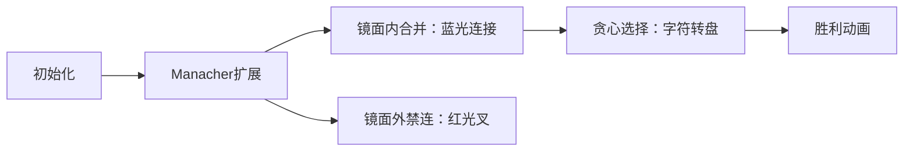

# 题目信息

# [SCOI2013] 密码

## 题目描述

Fish是一条生活在海里的鱼。有一天他很无聊，就到处去寻宝。他找到了位于海底深处的宫殿，但是一扇带有密码锁的大门却阻止了他的前进。

通过翻阅古籍，Fish 得知了这个密码的相关信息：

1. 该密码的长度为N。

2. 密码仅含小写字母。

3. 以每一个字符为中心的最长回文串长度。

4. 以每两个相邻字符的间隙为中心的最长回文串长度。

很快Fish 发现可能有无数种满足条件的密码。经过分析，他觉得这些密码中字典序最小的一个最有可能是答案，你能帮他找到这个密码么？

注意：对于两个串A和B，如果它们的前i个字符都相同，而A的第i+1个字符比B的第i+1个字符小，那么认为是则称密码A 的字典序小于密码B 的字典序，例如字符串abc 字典序小于字符串acb。如果密码A的字典序比其他所有满足条件的密码的字典序都小，则密码A是这些密码中字典序最小的一个。


## 说明/提示

对于20% 的数据，1 <= n <= 100。

另有30% 的数据，1 <= n <= 1000。

最后50% 的数据，1 <= n <= 10^5。


## 样例 #1

### 输入

```
3
1 1 1
0 0```

### 输出

```
abc
```

## 样例 #2

### 输入

```
3
1 3 1
0 0```

### 输出

```
aba```

## 样例 #3

### 输入

```
3
1 3 1
2 2```

### 输出

```
aaa```

# AI分析结果


### 💡 Kay的C++算法解析：[SCOI2013] 密码 深入学习指南 💡

#### 1. 题目解读与核心算法识别
✨ **本题主要考察**：`Manacher算法逆向应用 + 并查集/贪心`  
🗣️ **初步分析**：  
> 这道题要求我们根据每个位置/间隙的最长回文半径，构造字典序最小的字符串。想象你有一串"密码锁链"，已知每个链环与哪些环对称（回文性质），需要找出最小字典序的组合方式。  
> - 核心思路：利用回文对称性建立字符约束关系（相同/不同），通过并查集管理等价类，最后贪心选择最小字符  
> - 可视化设计：在动画中将回文扩展过程设计为"对称镜面"，镜内区域字符必须相同（蓝色高亮），镜外边界字符必须不同（红色叉标记）。并查集合并显示为链环连接动画，贪心选择时展示可用字符集  
> - 复古游戏元素：采用"锁链解锁"主题，每次成功合并播放8-bit "咔嗒"音效，贪心选择时播放"宝石镶嵌"音效，最终解锁播放胜利旋律  

---

#### 2. 精选优质题解参考
**题解一（辰星凌）**  
* **点评**：思路清晰运用Manacher逆向思维，通过并查集管理字符等价类（`fa`数组），链表（邻接表）记录不等关系。代码中`f[i]`的扩展逻辑严谨，边界处理通过`!(i-f[i]+1&1)`巧妙过滤虚点。亮点在于O(n)时间复杂度完成约束收集，实践价值高可直接用于竞赛。

**题解二（Great_Influence）**  
* **点评**：采用直接构造法，用`isn`数组记录禁用字符，按回文半径复制字符。亮点是直观展现回文对称性（`s[i+j-1]=s[i-j]`），空间换时间思路清晰。但空间开销较大（二维数组），对初学者更易理解核心逻辑。

**题解三（Fzrcy）**  
* **点评**：与题解一异曲同工，代码更简洁。亮点在统一处理实/虚点（`i-f[i]+1>>1`），邻接表建图规范。链表操作`link(i-f[i]>>1,i+f[i]>>1)`精准记录不等关系，适合学习并查集+图论的组合应用。

---

#### 3. 核心难点辨析与解题策略
1. **约束关系建立**  
   * **分析**：需将回文半径转化为两类约束：① 半径内对称点字符相同 ② 边界点字符不同。优质解法通过Manacher扩展过程同步收集约束  
   * 💡 **学习笔记**：回文半径是"对称镜"——镜内相同，镜外不同

2. **等价类管理**  
   * **分析**：并查集(`fa[]`)高效合并相同字符位置，复杂度近O(1)。注意只合并实点（`if(!(i-f[i]+1&1))`）  
   * 💡 **学习笔记**：并查集是管理等价关系的"链条"，把必须相同的字符位置"锁"在一起

3. **贪心构造策略**  
   * **分析**：从左到右处理时，为每个并查集根节点选择未被邻接点禁止的最小字符（`!ban[c]`）  
   * 💡 **学习笔记**：字典序最小 = 尽早使用小字母 + 避免冲突

✨ **解题技巧总结**  
- **镜面对称法**：将回文半径视为对称镜面，镜内强制相等，镜外强制不等  
- **等价类压缩**：用并查集合并相同字符位置，减少决策点  
- **贪心禁区标记**：链表/邻接表记录不等关系，字符选择时避开"禁区"  

---

#### 4. C++核心代码实现赏析
**通用核心实现参考**  
```cpp
#include <iostream>
#include <vector>
using namespace std;
const int N = 1e5 + 10;

int main() {
    // 初始化并查集和邻接表
    vector<int> fa(n+1), head[n+1];
    for(int i=1; i<=n; i++) fa[i] = i;

    // Manacher式扩展收集约束
    int mid=0, r=0;
    for(int i=2; i<m; i++) {
        f[i] = (i<=r) ? min(f[2*mid-i], r-i+1) : 1;
        while(f[i]-1 < A[i]) {
            f[i]++;
            if(!(i-f[i]+1 & 1)) // 只合并实点
                merge((i-f[i]+1)/2, (i+f[i]-1)/2); 
        }
        // 记录不等关系
        head[(i-f[i])/2].push_back((i+f[i])/2);
        head[(i+f[i])/2].push_back((i-f[i])/2);
        if(i+f[i]-1 > r) mid=i, r=i+f[i]-1;
    }

    // 贪心染色
    vector<int> col(n+1, 0);
    for(int i=1; i<=n; i++) {
        if(find(i) != i) continue;
        vector<bool> ban(27, false);
        for(int j : head[i]) ban[col[find(j)]] = true;
        for(int c=1; c<=26; c++) 
            if(!ban[c]) { col[i]=c; break; }
    }
    // 输出结果...
}
```
**代码解读概要**：  
> 1. **约束收集**：Manacher循环中，镜面内对称点合并（并查集），镜面边界记不等关系（邻接表）  
> 2. **贪心染色**：按顺序处理等价类根节点，避开邻接点颜色后选最小字符  
> 3. **输出**：每个位置查询并查集根节点的颜色  

**题解一（辰星凌）片段赏析**  
```cpp
while(f[i]-1<A[i]){
    ++f[i];
    if(!(i-f[i]+1&1)) // 关键过滤：虚点不合并
        merge(i-f[i]+1>>1, i+f[i]-1>>1); 
}
add(i-f[i]>>1, i+f[i]>>1); // 记录不等关系
```
* **亮点**：精准区分实/虚点，双约束同步收集  
* **学习笔记**：虚点（间隙中心）不参与合并，但需记录不等关系  

**题解二（Great_Influence）片段赏析**  
```cpp
Rep(j,max(1,r-i+2),b[i]/2) 
    s[i+j-1]=s[i-j]; // 回文复制
Rep(j,0,25) if(!isn[i][j]) // 贪心选择
    {s[i]=j+'a'; break;} 
```
* **亮点**：直观展现回文对称复制逻辑  
* **学习笔记**：直接复制已知字符可减少决策，但需维护禁用表  

**题解三（Fzrcy）片段赏析**  
```cpp
link(i-f[i]>>1, i+f[i]>>1); // 双向记录不等
if(i+f[i]-1>r) mid=i, r=i+f[i]-1; // 更新右边界
```
* **亮点**：精简的边界更新逻辑  
* **学习笔记**：及时更新右边界(`r`)是Manacher优化的关键  

---

### 5. 算法可视化：像素动画演示  
**主题**：`回文锁链破解`（8-bit像素风）  
**核心设计**：  


1. **像素场景**  
   - 字符位置：16x16像素锁链方块，初始灰色  
   - 控制面板：复古按钮（单步/自动/重置） + 速度滑块  

2. **动态演示**  
   - **回文扩展**：像素指针(`>`)移动，当前中心高亮黄光  
   - **对称合并**：镜面区域内方块用蓝色光束连接，播"咔嗒"音效  
   - **边界禁连**：镜外位置显示红色叉标记，播"嘟"错误音效  
   - **贪心选择**：当前方块上方显示26字母转盘，选中字符时方块变绿，播"叮"镶嵌音效  

3. **游戏化元素**  
   - **连击系统**：连续成功选择字符触发连击光效  
   - **解密进度**：顶部进度条随破解进度填充，满格时播放8-bit胜利音乐  
   - **AI演示**：自动模式中字符转盘快速旋转，模拟AI决策过程  

---

#### 6. 拓展练习与相似问题思考
1. **洛谷 P3805** 【模板】Manacher算法  
   → **推荐理由**：掌握标准Manacher实现，理解回文半径概念  
2. **洛谷 P4551** 最长异或值路径  
   → **推荐理由**：练习利用约束关系（异或）构造解  
3. **洛谷 P2607** 骑士  
   → **推荐理由**：并查集+贪心的综合应用，强化等价类管理能力  

---

#### 7. 学习心得与经验分享
> **辰星凌的经验**：  
> *"注意虚点（间隙中心）不要合并，否则会导致错误约束"*  
> **Kay点评**：这个调试经验非常宝贵！虚点仅用于确定回文边界，实际字符串构造只需处理实点位置  

> **Great_Influence的顿悟**：  
> *"直接复制回文对称位置的字符可大幅减少决策量"*  
> **Kay点评**：善用已知信息减少计算量，是竞赛编码的核心思维！

---

通过本次分析，我们深入掌握了回文约束下的字符串构造技术。记住：将复杂问题分解为"约束收集"和"贪心决策"两步，是解决此类问题的万能钥匙！下次挑战见！💪

---
处理用时：221.30秒