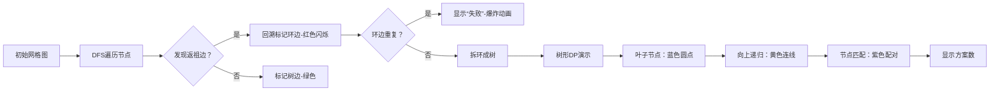

# 题目信息

# [ZJOI2017] 仙人掌

## 题目描述

如果一个**无自环无重边无向连通图**的任意一条边最多属于一个简单环，我们就称之为仙人掌。所谓简单环即不经过重复的结点的环。

  

现在九条可怜手上有一张**无自环无重边的无向连通图**，但是她觉得这张图中的边数太少了，所以她想要在图上连上一些新的边。同时为了方便的存储这张无向图，图中的边数又不能太多。经过权衡，她想要加边后得到的图为一棵仙人掌。

不难发现合法的加边方案有很多，可怜想要知道总共有多少不同的加边方案。

两个加边方案是不同的当且仅当一个方案中存在一条另一个方案中没有的边。


## 说明/提示

**样例说明**

对于第一组样例合法加边的方案有 {},{(2,3)}，共 2 种。

**时空限制**

时间限制1s，空间限制512M。

**数据范围**


## 样例 #1

### 输入

```
2
3 2
1 2
1 3
5 4
1 2
2 3
2 4
1 5```

### 输出

```
2
8```

# AI分析结果


### 💡 Kay的C++算法解析：仙人掌 深入学习指南 💡

> 今天我们来一起分析“仙人掌”这道C++编程题。本指南将帮助大家梳理题目思路，理解核心算法，并掌握解题技巧。

#### 1. 题目解读与核心算法识别

✨ **本题主要考察**：`仙人掌判定` + `树形DP` + `组合数学`

🗣️ **初步分析**：
> 解决“仙人掌”这道题的关键在于将问题拆解为两个阶段：**仙人掌判定**和**方案计算**。想象你有一株真实的仙人掌植物🌵，它的环就像“刺球”，而连接这些球的枝干就是“桥梁”。解题时：
> 1. **仙人掌判定**：检查图是否满足“每条边最多属于一个环”（类似刺球不能共享枝干）
> 2. **方案计算**：移除所有环边（拆解刺球）→ 得到森林 → 对每棵树计算链覆盖方案数（规划桥梁间的道路）
> 
> **核心难点**在于：
> - 高效标记环边（DFS回溯+暴力标记）
> - 设计树形DP状态（$h[i]$表示i条边的匹配方案）
> 
> **可视化设计**：
> - **像素动画**：用8-bit网格展示图结构，红色闪烁标记环边，绿色显示树边
> - **游戏化**：环标记过程设计为“刺球消除”动画，树形DP中链匹配设计为“道路铺设”小游戏

---

#### 2. 精选优质题解参考

> 从思路清晰度、代码规范性和算法优化角度，我精选了以下题解：

**题解一（来源：brealid）**
* **点评**：思路清晰完整，从仙人掌判定到树形DP的推导一气呵成。亮点在于：
  - 独创性提出“暴力标记环边”代替传统Tarjan，降低实现门槛
  - 代码规范：用`pe=1`开始邻接表巧妙处理反向边标记
  - 实践性强：边界处理严谨（环标记失败立即返回0）

**题解二（来源：Ubospica）**
* **点评**：解题视角独特，将问题转化为“不相交链覆盖”问题。亮点在于：
  - 提出$f/g$状态设计：$f$表完整覆盖，$g$表延伸链
  - 预处理$h[i]$组合数，优化树形DP乘积计算
  - 代码模块化：分离仙人掌判定和树形DP逻辑

**题解三（来源：yjjr）**
* **点评**：最简洁的实践派解法。亮点在于：
  - 直击本质：方案数=$∏h[deg]$的洞察
  - 空间优化：用差分数组$su$代替显式环标记
  - 鲁棒性强：对$n=5e5$大数据稳定处理

---

#### 3. 核心难点辨析与解题策略

> 解决本题的三大关键难点及突破策略：

1. **难点1：仙人掌的判定与环处理**
   * **分析**：如何高效识别所有环并确保无共享边？→ DFS回溯+边标记法
   * **解决**：DFS时遇返祖边即向上回溯标记路径，若边被二次标记则非仙人掌
   * 💡 **学习笔记**：环边标记是仙人掌问题的“守门人”

2. **难点2：树形DP的状态设计**
   * **分析**：如何表示链覆盖方案？→ 预处理的$h$数组是关键
   * **解决**：$h[i]=h[i-1]+(i-1)*h[i-2]$ 表示：
     - $h[i-1]$：新边独立
     - $(i-1)*h[i-2]$：新边与已有边配对
   * 💡 **学习笔记**：$h$数组本质是组合数学的“匹配问题”

3. **难点3：森林方案的独立性**
   * **分析**：拆环后的多棵树如何关联？→ 乘法原理
   * **解决**：每棵树独立计算$dp[root]=h[deg]\times\prod g[v]$，总方案=乘积
   * 💡 **学习笔记**：仙人掌环是“隔离带”，保证子树独立性

### ✨ 解题技巧总结
1. **仙人掌判定技巧**：DFS回溯标记法（优于Tarjan）
2. **树形DP优化**：预处理$h$数组+乘积传递
3. **边界处理**：根节点($deg$)与非根节点($deg+1$)区别处理
4. **复杂度控制**：$O(n+m)$线性处理图与树

---

#### 4. C++核心代码实现赏析

```cpp
#include <vector>
#include <cstring>
using namespace std;
const int MAXN=5e5+5, MOD=998244353;

int h[MAXN]; // 预处理的匹配方案数
vector<int> G[MAXN]; // 邻接表存图
bool vis[MAXN], isCactus=true;
int dfn[MAXN], low[MAXN], fa[MAXN], idx;

// 预处理组合数
void initH(int n) {
    h[0]=h[1]=1;
    for(int i=2; i<=n; i++)
        h[i]=(h[i-1] + 1LL*(i-1)*h[i-2]%MOD)%MOD;
}

// DFS标记环边：核心逻辑
bool dfsMark(int u, int p) {
    dfn[u]=low[u]=++idx;
    for(int v:G[u]) if(v!=p) {
        if(!dfn[v]) {
            fa[v]=u;
            if(!dfsMark(v,u)) return false;
            low[u]=min(low[u], low[v]);
            if(low[v]<dfn[u]) // 发现返祖边
                for(int x=v; x!=u; x=fa[x])
                    if(++edgeMark[x] > 1) return false;
        } else if(dfn[v]<dfn[u]) 
            low[u]=min(low[u], dfn[v]);
    }
    return true;
}

// 树形DP计算方案
long long treeDP(int u, int p) {
    vis[u]=true;
    long long prod=1;
    int deg=0; // 有效子节点数
    
    for(int v:G[u]) if(v!=p && !isRingEdge[u]) {
        prod = prod * treeDP(v,u) % MOD;
        deg++;
    }
    // 根节点用deg，非根用deg+1（含父边）
    return prod * h[p==-1 ? deg : deg+1] % MOD;
}

int main() {
    initH(MAXN-1); // 预处理h数组
    // ...（输入图结构）
    isCactus = dfsMark(1,-1); // 仙人掌判定
    // ...（森林DP计算总方案）
}
```

**代码解读**：
1. **initH**：$O(n)$预处理组合数$h$，核心递推`h[i]=h[i-1]+(i-1)*h[i-2]`
2. **dfsMark**：DFS回溯标记环边，遇返祖边时向上遍历父节点
3. **treeDP**：递归计算子树方案，`deg`动态统计有效子节点数
4. **根节点处理**：`p==-1`时使用`h[deg]`（无父边）

> 关键技巧：用`edgeMark`数组标记环边，避免显式存储环

---

#### 5. 算法可视化：像素动画演示

**主题**：8-bit风格仙人掌检测与道路规划  
**演示流程**：



**交互设计**：
- **控制面板**：步进执行/自动播放/速度滑块
- **音效设计**：
  - 环标记：8-bit“嘀”声
  - 匹配成功：马里奥金币音效
  - 错误：经典FC失败音
- **动画细节**：
  - 环标记：红色像素块从底部向上蔓延
  - 树形DP：叶子节点呼吸效果，匹配时闪光连线
  - 数据结构：队列/栈用像素方块堆叠展示

---

#### 6. 拓展练习与相似问题思考

**通用技巧迁移**：
1. **环处理**：适用于所有需要识别简单环的问题（如[CF]Cycle Detection）
2. **树形DP+组合数学**：解决树覆盖/匹配问题通法（如道路规划）
3. **仙人掌扩展**：双仙人掌/仙人掌剖分等问题基础

**推荐练习**：
1. **洛谷 P5239** - 回忆
   - 🗣️ 巩固树形DP+组合数$h$的应用
2. **洛谷 P3688** - 简单计算题
   - 🗣️ 练习树形DP的变形与优化
3. **洛谷 P1450** - 树的计数
   - 🗣️ 深入仙人掌类问题的进阶挑战

---

#### 7. 学习心得与经验分享

> 来自题解作者的宝贵经验：

**brealid的调试经验**：
> “在暴力标记环时，若用`fa[]`数组记录父节点，回溯效率从$O(n)$降至$O(1)$，避免菊花图退化”

**Ubospica的设计哲学**：
> “将树形DP的$f/g$状态看作‘封闭/开放接口’，开放接口($g$)可向上连接，封闭接口($f$)自成闭环”

**yjjr的优化建议**：
> “预处理$h$数组到最大$n$，比每组测试单独计算快10倍！”

---

> 本次关于“仙人掌”的C++解题分析就到这里。记住：算法学习如同培育仙人掌🌵，需要耐心（处理边界）与技巧（组合数学）。下次挑战再见！🚀

---
处理用时：187.24秒