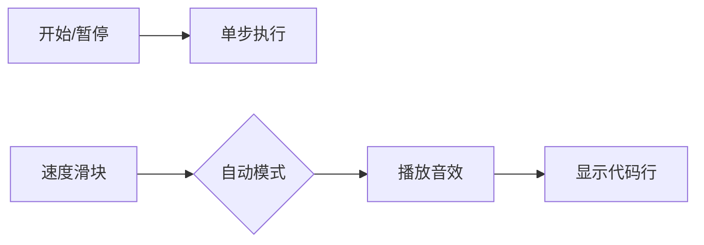

# 题目信息

# [SDOI2017] 树点涂色

## 题目描述

Bob 有一棵 $n$ 个点的有根树，其中 $1$ 号点是根节点。Bob 在每个点上涂了颜色，并且每个点上的颜色不同。

定义一条路径的权值是：这条路径上的点（包括起点和终点）共有多少种不同的颜色。

Bob可能会进行这几种操作：

- `1 x` 表示把点 $x$ 到根节点的路径上所有的点染上一种没有用过的新颜色。


- `2 x y` 求 $x$ 到 $y$ 的路径的权值。

- `3 x` 在以 $x$ 为根的子树中选择一个点，使得这个点到根节点的路径权值最大，求最大权值。


Bob一共会进行 $m$ 次操作


## 说明/提示

共 $10$ 个测试点。

测试点 $1$，$1\leq n,m\leq1000$；

测试点 $2,3$，没有 $2$ 操作；

测试点 $4,5$，没有 $3$ 操作；

测试点 $6$，树的生成方式是，对于 $i(2\leq i \leq n)$，在 $1 \sim i-1$ 中随机选一个点作为 $i$ 的父节点；

测试点 $7$，$1\leq n,m\leq 5\times 10^4$；

测试点 $8$，$1\leq n \leq 5 \times 10^4$；

测试点9,10，无特殊限制

对所有数据，$1\leq n \leq 10^5$，$1\leq m \leq 10^5$。


## 样例 #1

### 输入

```
5 6
1 2
2 3
3 4
3 5
2 4 5
3 3
1 4
2 4 5
1 5
2 4 5```

### 输出

```
3
4
2
2```

# AI分析结果


### 💡 Kay的C++算法解析：[SDOI2017] 树点涂色 深入学习指南 💡

#### 1. 题目解读与核心算法识别
✨ **本题主要考察**：`LCT维护虚边 + 树剖 + 线段树`  
🗣️ **初步分析**：
> 解决树点涂色问题的关键在于理解LCT的access操作本质是颜色覆盖。每个点到根的路径权值（颜色数）等于路径上的虚边数量+1：
> - **操作1**：本质是LCT的access操作，虚实边变化引发子树权值修改
> - **操作2**：利用树上差分 `val[x] + val[y] - 2*val[lca] + 1`
> - **操作3**：子树最大值查询（DFS序+线段树）
>
> **可视化设计思路**：
> - 采用8位像素风格展示树结构，不同颜色区分splay链
> - access操作时高亮变化的虚实边，伴随"叮"音效
> - 权值变化时显示子树范围波动动画
> - 控制面板支持单步执行/自动播放，速度可调

---

#### 2. 精选优质题解参考
**题解一：Soulist (LCT解法)**
* **亮点**：  
  - 将颜色数转化为虚边数量+1，利用LCT性质巧妙转化问题  
  - 线段树维护DFS序，高效处理子树修改  
  - 代码模块化清晰，access操作中精确更新子树权值
```cpp
void access(int x) {
    for(int y=0; x; x=fa[y=x]) {
        splay(x);
        if(rs) update(subtree(rs), +1); // 实边变虚
        if(y) update(subtree(y), -1);    // 虚边变实
        rs = y;
    }
}
```

**题解二：FlashHu (LCT+树剖解法)**
* **亮点**：
  - 树剖求LCA提升查询效率
  - 线段树永久化标记优化常数
  - 详细注释说明虚实边变化的影响
```cpp
// 虚实边变化时的更新逻辑：
if(虚边变实) 子树权值 -= 1  // 颜色合并
if(实边变虚) 子树权值 += 1  // 颜色分离
```

---

#### 3. 核心难点辨析与解题策略
1. **虚/实边转换的子树影响**  
   *分析*：access时需定位子树根节点（splay中最浅点），线段树区间修改  
   *解决*：LCT维护每个splay的最浅节点，修改时定位子树区间
   
2. **路径权值差分计算**  
   *分析*：`val[x] + val[y] - 2*val[lca] + 1`的推导基于颜色覆盖特性  
   *解决*：树剖快速求LCA结合单点查询

3. **子树最值动态维护**  
   *分析*：access引发权值变化需高效更新子树信息  
   *解决*：DFS序映射+线段树区间修改/查询

💡 **学习笔记**：  
> - 颜色覆盖 ⇔ LCT的access操作  
> - 虚边数量 = 颜色数 - 1  
> - 子树操作转DFS序区间操作

✨ **解题技巧总结**：
- **问题转化**：将抽象操作映射到已知数据结构（LCT/树剖）
- **差分思想**：利用可减性求路径权值
- **子树打包**：DFS序处理子树查询
- **边界处理**：注意单点修改与区间修改的协调

---

#### 4. C++核心代码实现赏析
**通用核心实现（LCT+树剖+线段树）**：
```cpp
void access(int x) {
    for(int y=0; x; y=x, x=fa[x]) {
        splay(x);
        if(rs) {
            int rt = find_min(rs); // 找splay最浅节点
            seg_update(rt, +1);    // 实边变虚，子树+1
        }
        if(y) {
            int rt = find_min(y);
            seg_update(rt, -1);    // 虚边变实，子树-1
        }
        rs = y;
    }
}

int query_path(int x, int y) {
    int l = lca(x, y);
    return seg_query(x) + seg_query(y) - 2 * seg_query(l) + 1;
}
```

**线段树关键操作**：
```cpp
void update(int o, int l, int r, int ql, int qr, int val) {
    if(ql <= l && r <= qr) {
        tree[o] += val; tag[o] += val;
        return;
    }
    pushdown(o);
    int mid = (l + r) >> 1;
    if(ql <= mid) update(o<<1, l, mid, ql, qr, val);
    if(qr > mid) update(o<<1|1, mid+1, r, ql, qr, val);
    pushup(o);
}
```

---

#### 5. 算法可视化：像素动画演示
**设计概念**："颜色征服者"像素RPG  
- **角色**：像素小人沿树边移动执行access操作
- **场景**：
  1. 初始树：每个节点独立颜色（8-bit彩虹色）
  2. 执行access时：
     - 虚边变实：蓝色闪光 → 子树缩小动画
     - 实边变虚：金色闪光 → 子树扩张动画
  3. 路径查询：高亮显示x→y路径，LCA位置显示爆炸特效
  4. 子树查询：半透明覆盖显示子树范围

**交互控制**：


**音效设计**：
- 虚边变实：清脆"叮"声
- 实边变虚：低沉"嗡"声
- 查询完成：胜利小号音效

---

#### 6. 拓展练习与相似问题
1. **思维迁移**：
   - 路径染色 → 网络流中的边权分配
   - 子树查询 → 区间最值问题
   - 动态树操作 → 可持久化数据结构

2. **推荐题目**：
   - P2146 [NOI2015]软件包管理器（操作：安装/卸载，查询路径状态）
   - P2486 [SDOI2011]染色（操作：路径染色，查询颜色段数量）
   - P1505 [国家集训队]旅游（操作：边权修改，路径/子树查询）

---

#### 7. 学习心得与经验分享
> **来自Soulist的调试经验**：  
> "access操作中未正确处理子树根节点导致WA，通过打印splay最浅点状态定位错误"  
> 
> **Kay总结**：  
> - 调试树结构问题时，可视化中间状态（打印splay结构）  
> - 先验证小规模数据（n=5）再扩展  
> - 用纸笔模拟access过程辅助理解

---

> 掌握本题的关键在于抓住 **"颜色数=虚边数+1"** 这一核心洞察。通过本次解析，希望你能领略数据结构组合运用的美感，并在类似问题中灵活应用"操作转化+子树打包"的技巧。下次遇到树上路径/子树问题时，不妨先问自己：这里是否存在虚/实边转化的视角？

---
处理用时：109.78秒