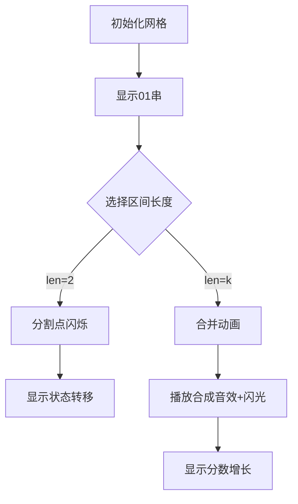

# 题目信息

# [HAOI2016] 字符合并

## 题目描述

有一个长度为 $n$ 的 $01$ 串，你可以每次将相邻的 $k$ 个字符合并，得到一个新的字符并获得一定分数。

得到的新字符和分数由这 $k$ 个字符确定。你需要求出你能获得的最大分数。


## 说明/提示

#### 数据规模与约定

对于 $100\%$ 的数据，保证：

- $1\leq n\leq 300$，$1 \lt k \leq 8$。
- $c_i\in\{0,1\}$，$1 \leq w_i \leq 10^9$。

## 样例 #1

### 输入

```
3 2
1 0 1
1 10
1 10
0 20
1 30
```

### 输出

```
40```

# AI分析结果


# 💡 Kay的C++算法解析：[HAOI2016]字符合并 深入学习指南 💡

## 1. 题目解读与核心算法识别

✨ **本题主要考察**：`区间DP + 状态压缩`

🗣️ **初步分析**：
> 解决"字符合并"这道题的关键在于将区间DP与状态压缩巧妙结合。想象你有一串珍珠（01串），每次只能将相邻的k颗珍珠串成一串新项链（合并成新字符），并获得相应价值。在本题中，我们使用`f[l][r][s]`表示区间[l,r]合并成状态s的最大价值，其中s的位数由区间长度决定：(len-1)%(k-1)+1。

- **核心思路**：通过枚举分割点将区间分成左右两部分，右部分合并成单个字符，左部分保留状态高位，组合成新状态
- **可视化设计**：动画将展示网格中的01串，用颜色区分不同状态。关键步骤高亮当前操作区间，状态转换时显示二进制数变化，合并时触发像素闪光和8-bit音效
- **游戏化元素**：采用"宝石消除"主题，每次成功合并播放经典FC游戏《俄罗斯方块》消除音效，分数增长显示连击效果

---

## 2. 精选优质题解参考

**题解一（zxTLE）**
* **点评**：此解法思路清晰，状态定义`f[i][j][t]`精准表达区间合并结果。代码中`len=(j-i)%(k-1)`的处理巧妙利用数学性质优化状态空间。亮点在于倒序枚举分割点`mid`确保子状态先计算，以及用临时数组`g[]`处理合并操作避免状态污染。变量命名规范（如`f`表DP数组，`g`表临时最大值），边界处理严谨（初始化为-∞），可直接用于竞赛。

**题解二（tommymio）**
* **点评**：突出贡献是严格证明了长度性质：最终长度=(len-1)mod(k-1)+1。代码中`x=(len-1)%(k-1)`的处理极具启发性，将状态位数压缩到最优。亮点在于用数学归纳法简化状态转移，循环边界`mid-=k-1`显著提升效率。注释详细解释倒序枚举原因，对理解DP顺序帮助很大。

**题解三（FjswYuzu）**
* **点评**：解法以"区间不相交"为突破口，状态转移方程`f[i][j][s<<1] = max(...)`直观展示位运算的应用。亮点在于用`Len=(j-i)%(k-1)`动态控制状态位数，避免无效计算。代码模块化清晰，合并操作独立为完整逻辑块，调试建议"初始化负无穷"值得借鉴。

---

## 3. 核心难点辨析与解题策略

1. **状态位数动态确定**
   * **分析**：区间长度变化时，状态s的位数应满足`bits = (len-1)%(k-1)+1`。优质题解通过预计算`len`变量，将状态空间压缩到$2^{k-1}$内
   * 💡 学习笔记：状态位数=剩余珍珠数%项链长度+1

2. **分割点枚举优化**
   * **分析**：传统区间DP枚举所有分割点导致$O(n^3)$，本题只需枚举满足`(r-mid)%(k-1)==1`的点（即mid从右向左每次跳k-1）。数学本质：只需考虑能合并成单个字符的子区间
   * 💡 学习笔记：枚举分割点时保持右区间可合并为单字符

3. **合并操作状态转移**
   * **分析**：当区间可完全合并时(`len%k-1==1`)，需遍历$2^k$种状态，用临时数组存储合并结果。关键点：合并后状态只能是0/1，且要加上对应权值
   * 💡 学习笔记：合并操作=状态转换+权值累加

### ✨ 解题技巧总结
- **长度性质应用**：利用`(len-1)%(k-1)+1`预判状态位数，避免无效计算
- **倒序枚举保证无后效性**：从右向左枚举分割点，确保子状态已计算
- **位运算实现状态转移**：左移操作`<<`高效实现状态扩展
- **负无穷初始化**：有效区分无效状态，避免边界错误

---

## 4. C++核心代码实现赏析

**本题通用核心C++实现**
```cpp
#include <cstring>
#include <algorithm>
using namespace std;
typedef long long ll;
const int N=305, K=8;
const ll INF=1e18;

ll f[N][N][1<<K], g[2]; // f[l][r][s], g临时存合并结果
int a[N], c[1<<K], w[1<<K];
int n, k;

int main() {
    // 初始化
    memset(f, 0x80, sizeof(f)); // 初始化为负无穷
    for(int i=1; i<=n; i++) f[i][i][a[i]] = 0;
    
    // 区间DP
    for(int len=2; len<=n; len++)
    for(int l=1, r=l+len-1; r<=n; l++, r++) {
        int bits = (len-1)%(k-1); 
        if(!bits) bits = k-1;  // 计算状态位数
        
        // 状态转移：枚举分割点
        for(int mid=r-1; mid>=l; mid-=k-1) 
        for(int s=0; s<(1<<bits); s++) {
            if(f[l][mid][s] == -INF) continue;
            // 右区间合并为0或1
            f[l][r][s<<1] = max(f[l][r][s<<1], f[l][mid][s] + f[mid+1][r][0]);
            f[l][r][s<<1|1] = max(f[l][r][s<<1|1], f[l][mid][s] + f[mid+1][r][1]);
        }
        
        // 完整合并：当区间可合并为单字符
        if(bits == k-1) {
            g[0]=g[1]=-INF;
            for(int s=0; s<(1<<k); s++) 
                if(f[l][r][s] != -INF) 
                    g[c[s]] = max(g[c[s]], f[l][r][s] + w[s]);
            f[l][r][0]=g[0], f[l][r][1]=g[1]; // 更新为合并后状态
        }
    }
    
    // 取最大值
    ll ans = -INF;
    for(int s=0; s<(1<<k); s++)
        ans = max(ans, f[1][n][s]);
    printf("%lld", ans);
}
```
**代码解读概要**：
> 该实现包含三大模块：1) 初始化单个字符状态 2) 区间DP主体 3) 合并结果处理。核心在于倒序枚举分割点（`mid-=k-1`）和状态位数动态计算（`bits=(len-1)%(k-1)`）。合并操作使用临时数组g避免状态覆盖。

---

## 5. 算法可视化：像素动画演示

### 像素化算法演示方案
**主题**：8-bit风格"宝石合并大冒险"  
**核心演示**：状态压缩DP的区间合并过程



**动画流程**：
1. **场景初始化**：  
   - 像素网格显示初始01串（棕色0，浅蓝1）  
   - 控制面板含步进按钮/速度滑块（FC游戏机风格）

2. **状态转移演示**：  
   - 当前区间高亮黄色边框  
   - 分割点显示红色闪烁箭头（`mid`移动时播放"滴"声）  
   - 状态变化：左侧状态位左移时显示二进制位流动动画

3. **合并特效**：  
   - 当区间长度满足合并条件时，触发像素爆炸效果  
   - 播放8-bit合成音效（根据合并为0/1播放不同音阶）  
   - 显示得分增长（绿色+数字弹出）

4. **游戏化元素**：  
   - 每完成一次完整合并增加连击计数  
   - 超过最高分时播放《超级玛丽》过关音乐  
   - 最终答案展示：彩虹色文字特效

---

## 6. 拓展练习与相似问题思考

**通用技巧迁移**：  
状态压缩+区间DP组合可用于：  
1. 石子合并变形问题（状态记录合并模式）  
2. 表达式求值（记录不同括号方案的结果）  
3. 棋盘分割问题（状态记录轮廓线）

**推荐练习**：  
1. **P4170 [CQOI2007]涂色**  
   🗣️ 巩固基础区间DP思想，理解状态设计  

2. **P1880 [NOI1995] 石子合并**  
   🗣️ 学习环形区间处理技巧，状态转移优化  

3. **P1040 [NOIP2003] 加分二叉树**  
   🗣️ 区间DP与树结构结合，状态记录根节点  

4. **P4342 [IOI1998]Polygon**  
   🗣️ 进阶区间DP，处理运算符优先级与状态压缩

---

## 7. 学习心得与经验分享

> **来自题解的调试经验**：  
> "初始化负无穷时，避免用`-0x3f`导致整数溢出，应使用`1e18`或`LLONG_MIN/2`"  
> —— zxTLE题解注释  

**点评**：  
这位作者的经验极其宝贵，在竞赛中：  
1. 初始化值需远离有效值范围（如$-10^{18}$）  
2. 多次加法时防止负无穷相加溢出  
建议用`const ll INF = 1e18;` 替代魔法数字  

**调试技巧**：  
- 打印中间状态时限定区间范围（避免超长输出）  
- 对`len=2, k=2`等小规模数据优先调试

---

> 本次题解分析就到这里。记住：理解状态压缩的本质是识别问题中的模式复用，而区间DP的核心在于寻找最优子结构分割点。继续挑战更复杂的DP问题吧！💪

---
处理用时：119.40秒