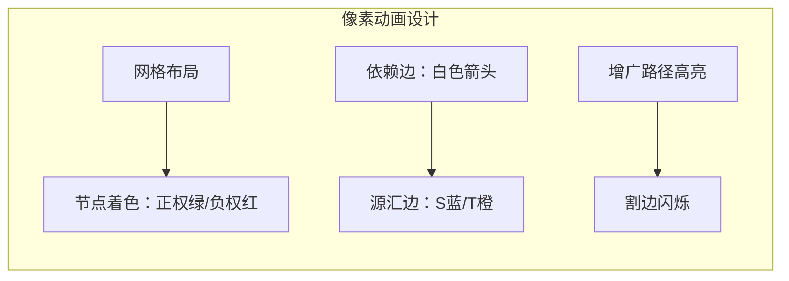

# 题目信息

# [六省联考 2017] 寿司餐厅

## 题目描述

Kiana 最近喜欢到一家非常美味的寿司餐厅用餐。

每天晚上，这家餐厅都会按顺序提供 $n$ 种寿司，第 $i$ 种寿司有一个代号 $a_i$ 和美味度 $d_{i, i}$，不同种类的寿司有可能使用相同的代号。每种寿司的份数都是无限的，Kiana 也可以无限次取寿司来吃，但每种寿司每次只能取一份，且每次取走的寿司必须是按餐厅提供寿司的顺序连续的一段，即 Kiana 可以一次取走第 $1, 2$ 种寿司各一份，也可以一次取走第 $2, 3$ 种寿司各一份，但不可以一次取走第 $1, 3$ 种寿司。

由于餐厅提供的寿司种类繁多，而不同种类的寿司之间相互会有影响：三文鱼寿司和鱿鱼寿司一起吃或许会很棒，但和水果寿司一起吃就可能会肚子痛。因此，Kiana 定义了一个综合美味度 $d_{i, j} \ (i < j)$，表示在一次取的寿司中，如果包含了餐厅提供的从第 $i$ 份到第 $j$ 份的所有寿司，吃掉这次取的所有寿司后将获得的额外美味度。由于取寿司需要花费一些时间，所以我们认为分两次取来的寿司之间相互不会影响。注意在吃一次取的寿司时，不止一个综合美味度会被累加，比如若 Kiana 一次取走了第 $1, 2, 3$ 种寿司各一份，除了 $d_{1, 3}$ 以外，$d_{1, 2}, d_{2, 3}$ 也会被累加进总美味度中。

神奇的是，Kiana 的美食评判标准是有记忆性的，无论是单种寿司的美味度，还是多种寿司组合起来的综合美味度，在计入 Kiana 的总美味度时都只会被累加一次。比如，若 Kiana 某一次取走了第 $1, 2$ 种寿司各一份，另一次取走了第 $2, 3$ 种寿司各一份，那么这两次取寿司的总美味度为 $d_{1, 1} + d_{2, 2} + d_{3, 3} + d_{1, 2} + d_{2, 3}$，其中 $d_{2, 2}$ 只会计算一次。

奇怪的是，这家寿司餐厅的收费标准很不同寻常。具体来说，如果 Kiana 一共吃过了 $c \ (c > 0)$ **种**代号为 $x$ 的寿司，则她需要为这些寿司付出 $mx^2 + cx$ 元钱，其中 $m$ 是餐厅给出的一个常数。

现在 Kiana 想知道，在这家餐厅吃寿司，自己能获得的总美味度（包括所有吃掉的单种寿司的美味度和所有被累加的综合美味度）减去花费的总钱数的最大值是多少。由于她不会算，所以希望由你告诉她。

## 说明/提示

### 样例解释 1

在这组样例中，餐厅一共提供了 $3$ 份寿司，它们的代号依次为 $a_1 = 2, a_2 = 3, a_3 = 2$，计算价格时的常数 $m = 1$。

在保证每次取寿司都能获得新的美味度的前提下，Kiana 一共有 $14$ 种不同的吃寿司方案。以下列出其中几种：
1. Kiana 一个寿司也不吃，这样她获得的总美味度和花费的总钱数都是 $0$，两者相减也是 $0$；
2. Kiana 只取 $1$ 次寿司，且只取第 $1$ 个寿司，即她取寿司的情况为 $\{[1, 1]\}$，这样获得的总美味度为 $5$，花费的总钱数为 $1 \times 2^2 + 1 \times 2 = 6$，两者相减为 $-1$；
3. Kiana 取 $2$ 次寿司，第一次取第 $1, 2$ 个寿司，第二次取第 $2, 3$ 个寿司，即她取寿司的情况为 $\{[1, 2], [2, 3]\}$，这样获得的总美味度为 $5 + (-10) + 15 + (-10) + 15 = 15$，花费的总钱数为 $(1 \times 2^2 + 2 \times 2) + (1 \times 3^2 + 1 \times 3) = 20$，两者相减为 $-5$；
4. Kiana 取 $2$ 次寿司，第一次取第 $1$ 个寿司，第二次取第 $3$ 个寿司，即她取寿司的情况为 $\{[1, 1], [3, 3]\}$，这样获得的总美味度为 $5 + 15 = 20$，花费的总钱数为 $1 \times 2^2 + 2 \times 2 = 8$，两者相减为 $12$。

在 $14$ 种方案中，惟一的最优方案是列出的最后一种方案，这时她获得的总美味度减去花费的总钱数的值最大为 $12$。

### 数据范围

对于所有数据，保证 $-500 \leq d_{i, j} \leq 500$。

数据的一些特殊约定如下表：

| Case # | $n$ | $a_i$ | $m$ | 附加限制 |
|:-:|:-:|:-:|:-:|:-:|
| 1 | $\leq 2$ | $\leq 30$ | $= 0$ | - |
| 2 | $\leq 2$ | $\leq 30$ | $= 1$ | - |
| 3 | $\leq 3$ | $\leq 30$ | $= 0$ | - |
| 4 | $\leq 3$ | $\leq 30$ | $= 1$ | - |
| 5 | $\leq 5$ | $\leq 30$ | $= 0$ | - |
| 6 | $\leq 5$ | $\leq 30$ | $= 1$ | - |
| 7 | $\leq 10$ | $\leq 30$ | $= 0$ | 所有的 $a_i$ 相同 |
| 8 | $\leq 10$ | $\leq 30$ | $= 1$ | - |
| 9 | $\leq 15$ | $\leq 30$ | $= 0$ | 所有的 $a_i$ 相同 |
| 10 | $\leq 15$ | $\leq 30$ | $= 1$ | - |
| 11 | $\leq 30$ | $\leq 1000$ | $= 0$ | 所有的 $a_i$ 相同 |
| 12 | $\leq 30$ | $\leq 30$ | $= 0$ | 所有的 $a_i$ 相同 |
| 13 | $\leq 30$ | $\leq 1000$ | $= 0$ | - |
| 14 | $\leq 30$ | $\leq 1000$ | $= 1$ | - |
| 15 | $\leq 50$ | $\leq 1000$ | $= 0$ | 所有的 $a_i$ 相同 |
| 16 | $\leq 50$ | $\leq 30$ | $= 0$ | 所有的 $a_i$ 相同 |
| 17 | $\leq 50$ | $\leq 1000$ | $= 0$ | - |
| 18 | $\leq 50$ | $\leq 1000$ | $= 1$ | - |
| 19 | $\leq 100$ | $\leq 1000$ | $= 0$ | - |
| 20 | $\leq 100$ | $\leq 1000$ | $= 1$ | - |

## 样例 #1

### 输入

```
3 1
2 3 2
5 -10 15
-10 15
15```

### 输出

```
12```

## 样例 #2

### 输入

```
5 0
1 4 1 3 4
50 99 8 -39 30
68 27 -75 -32
70 24 72
-10 81
-95```

### 输出

```
381```

## 样例 #3

### 输入

```
10 1
5 5 4 4 1 2 5 1 5 3
83 91 72 29 22 -5 57 -14 -36 -3
-11 34 45 96 32 73 -1 0 29
-48 68 44 -5 96 66 17 74
88 47 69 -9 2 25 -49
86 -9 -77 62 -10 -30
2 40 95 -74 46
49 -52 2 -51
-55 50 -44
72 22
-68```

### 输出

```
1223```

# AI分析结果


### 💡 Kay的C++算法解析：[六省联考2017]寿司餐厅 深入学习指南 💡

**引言**  
今天我们来分析"寿司餐厅"这道C++编程题。本指南将帮助你理解题目核心思路，掌握最大权闭合子图的应用，并通过像素动画直观感受算法执行过程。

---

### 1. 题目解读与核心算法识别
✨ **本题主要考察**：最大权闭合子图（网络流最小割模型）

🗣️ **初步分析**：
> 解决本题的关键是将寿司选择问题转化为**依赖关系图**。想象你在玩一个"寿司连锁收集"游戏：选择一段寿司区间就像解锁一个宝箱，但必须同时解锁相邻的小宝箱（子区间）。最大权闭合子图就像在收益和代价间寻找最佳平衡点。

- **核心难点**：处理区间选择的依赖关系（选[i,j]必须选[i+1,j]和[i,j-1]）和类型代价（mx² + cx）。
- **解决方案**：  
  ① 每个区间[i,j]视为节点，权值为d[i,j]（若i=j需减去aᵢ）  
  ② 建立依赖边：区间→子区间（容量∞）  
  ③ 类型节点：权值为-mx²，寿司节点→类型节点（容量∞）
- **可视化设计**：  
  像素动画将展示网格化区间节点（绿色正权/红色负权）和类型节点（紫色）。增广路径高亮显示，割边闪烁（S边红/T边蓝），音效提示关键操作（"滴"声表增广，"咔嚓"声表割边）。

---

### 2. 精选优质题解参考
**题解一（来源：小粉兔）**  
* **点评**：思路清晰，用最大权闭合子图精准建模。亮点在于：
  - 依赖关系处理：用∞边连接区间与子区间
  - 代价分离：类型节点处理mx²，寿司节点直接扣除cx
  - 代码规范：Dinic实现简洁（30行），变量名如`Id[i][j]`直观

**题解二（来源：tzc_wk）**  
* **点评**：教学性强，详解最大权闭合子图原理。亮点：
  - 问题转化：将"记忆性收益"转化为子区间依赖
  - 复杂度优化：边数从O(n³)降至O(n²)
  - 边界处理：特判m=0时代价减免

**题解三（来源：SofanHe）**  
* **点评**：代码可读性最佳。亮点：
  - 节点编号：`gnum(i,j)`函数清晰映射区间
  - 资源优化：用`vis`数组避免重复建类型节点
  - 实践价值：完整可运行代码（60行）

---

### 3. 核心难点辨析与解题策略
1. **难点：依赖关系建模**  
   *分析*：选[i,j]必须选子区间→转化为网络流∞边约束。优质题解用递归式建边（[i,j]→[i+1,j]和[i,j-1]）避免O(n⁴)复杂度。
   💡 **学习笔记**：树形依赖可转化为拓扑链

2. **难点：代价分离处理**  
   *分析*：mx²与c×x分离——前者绑定类型节点（选任意同类寿司触发），后者直接计入d[i,i]。
   💡 **学习笔记**：固定成本（mx²）与可变成本（c×x）需区别处理

3. **难点：负权点处理**  
   *分析*：d[i,j]<0时，建边权为|-d[i,j]|的T边，保证网络流边权非负。
   💡 **学习笔记**：最小割模型中，负权点必须连接汇点

✨ **解题技巧总结**：
- **问题分解**：将复杂代价拆解为mx²（类型级）和c×x（实例级）
- **图论转化**：识别"选择A必须选B"的依赖链→最大权闭合子图
- **边界特判**：m=0时跳过类型节点建边

---

### 4. C++核心代码实现赏析
**通用核心实现参考**  
*说明*：综合优质题解，突出依赖关系与代价分离
```cpp
#include <cstdio>
#include <cstring>
#include <queue>
using namespace std;
const int N=6000, INF=1e9;

struct Dinic { // 网络流模板（略） };

int main() {
    int n, m, S=0, T=1, cnt=1, ans=0;
    scanf("%d%d", &n, &m);
    // 读入a[i]和d[i][j]
    for(int i=1; i<=n; i++) {
        for(int j=i; j<=n; j++) {
            if(i == j) d[i][j] -= a[i]; // 扣除c*x代价
            if(d[i][j] > 0) {
                add(S, id[i][j], d[i][j]); // 正权连源点
                ans += d[i][j];
            } else add(id[i][j], T, -d[i][j]); // 负权连汇点
            
            if(i != j) { // 递归式依赖建边
                add(id[i][j], id[i+1][j], INF);
                add(id[i][j], id[i][j-1], INF);
            } else if(m) { // 类型节点处理
                add(id[i][j], type[a[i]], INF);
            }
        }
    }
    if(m) for(int x=1; x<=max_a; x++) 
        add(type[x], T, m*x*x); // 类型代价边
        
    printf("%d", ans - dinic()); // 正权和-最小割
}
```

**题解一代码亮点**  
*片段*：
```cpp
if(i == j) {
    if(m) add(id[i][j], type[a[i]], INF); // 类型依赖
    d[i][j] -= a[i]; // 直接扣除单价
}
```
*解读*：  
> 此处巧妙处理两种代价：① 类型依赖通过∞边约束 ② 单价直接在点权扣除。就像在游戏中，拾取寿司时自动扣费，但开启新类型时才支付"会员费"。

---

### 5. 算法可视化：像素动画演示
**主题**："寿司连锁收集"（8位像素风）  
**核心演示**：Dinic算法在网格化区间节点的运行过程



**动画流程**：
1. **初始化**：显示n×n网格（每个像素块代表区间[i,j]），右侧类型节点
2. **BFS分层**：从S出发逐层染色（水波纹扩散效果），伴随"滴"声
3. **DFS增广**：路径高亮（黄→蓝），流量数值实时更新
4. **最小割形成**：
   - 被割S边变红（放弃正收益）
   - 被割T边变蓝（接受负收益）
5. **游戏化反馈**：每完成一层BFS播放"过关"音效，最终得分=剩余收益

**技术细节**：
- **交互控制**：步进执行/调速滑块/重置按钮
- **音效设计**：
  - 增广路径："滴"声（类似FC《吃豆人》）
  - 割边："咔嚓"（类似《俄罗斯方块》消除）
  - 完成：8-bit胜利旋律

---

### 6. 拓展练习与相似问题
**通用技巧迁移**：
最大权闭合子图适用于：
1. 选择具有依赖关系的项目（如"选课程需先修课"）
2. 收益/代价分离的场景
3. 带约束的资源分配

**洛谷推荐**：
1. **P4174 [NOI2006]最大获利**  
   🗣️ 推荐理由：巩固"依赖关系+收益代价"建模
2. **P2762 太空飞行计划问题**  
   🗣️ 推荐理由：经典最大权闭合子图应用
3. **P2805 [NOI2009]植物大战僵尸**  
   🗣️ 推荐理由：拓扑排序+最大权闭合子图综合训练

---

### 7. 学习心得与经验分享
> **参考经验（来自小粉兔）**：  
> "调试时发现未处理m=0的情况，导致类型节点错误建边。这提醒我们要仔细审题——m=0时mx²代价消失！"

**点评**：  
> 这个调试经历很典型！在建模时：
> 1. 注意特判条件（如m=0）
> 2. 用小数据验证（n=2时手动模拟）
> 3. 输出中间图结构检查依赖边

---

### 结语  
本次分析揭示了"寿司餐厅"问题背后的网络流本质。记住：复杂问题常能分解为依赖关系图+代价计算。通过最大权闭合子图的精准建模，结合Dinic高效求解，你就能在算法世界里享受"寿司盛宴"！🍣 下次我们继续探索新的编程挑战！

---
处理用时：121.04秒