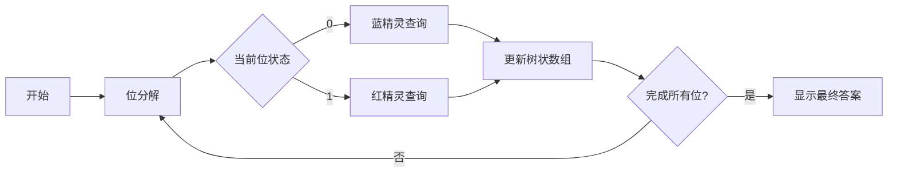

# 题目信息

# [TJOI2017] 异或和

## 题目描述

在加里敦中学的小明最近爱上了数学竞赛，很多数学竞赛的题都是与序列的连续和相关的。  所以对于一个序列，求出它们所有的连续和来说，小明觉得十分的简单。  

但今天小明遇到了一个序列和的难题，这个题目不仅要求你快速的求出所有的连续和（即子串和），还要快速的求出这些连续和的异或值。  

小明很快的就求出了所有的连续和，但是小明要考考你，在不告诉连续和的情况下，让你快速求是序列所有连续和的异或值。


## 说明/提示

【样例解释】

序列 $[1,2,3]$ 有 $6$ 个连续和，它们分别是 $1,2,3,3,5,6$，而 $1 \text{ xor } 2 \text{ xor } 3 \text{ xor } 3 \text{ xor } 5 \text{ xor } 6 = 0$。

【数据范围】

- 对于 $20\%$ 的数据，$1\le n \le 100$；
- 对于 $100\%$ 的数据，$1\le n \le 10^5$，$\sum a_i \le 10^6$。


## 样例 #1

### 输入

```
3
1 2 3```

### 输出

```
0```

# AI分析结果


# 💡 Kay的C++算法解析：异或和 深入学习指南 💡

<introduction>
大家好，我是Kay！今天我们来分析「异或和」这道C++编程题。这道题要求计算序列所有连续和的异或值，需要巧妙运用位运算和数据结构知识。本指南将帮你掌握核心思路、理解树状数组的妙用，并通过像素动画直观感受算法流程。
</introduction>

## 1. 题目解读与核心算法识别

✨ **本题主要考察**：`位运算拆分` + `树状数组应用` + `前缀和思想`

🗣️ **初步分析**：
> 解决这道题的核心在于**分治思想**——将复杂的异或问题拆解为独立的二进制位处理。想象每个数字是乐高积木，我们将整个问题拆成小积木块（二进制位），分别处理后再组合起来。具体分为三步：
> 1. **按位处理**：枚举每个二进制位，统计该位出现1的次数
> 2. **前缀和转换**：用前缀和数组表示连续和
> 3. **树状数组统计**：高效计算满足特定条件的数对数量
> 
> **可视化设计思路**：在动画中将展示三个关键层：
> - 二进制拆分层：展示数字如何分解为独立比特位
> - 树状数组层：动态显示0/1桶的更新过程
> - 结果聚合层：根据奇偶性组合最终结果
> 
> **复古游戏化设计**：采用8-bit像素风格，算法执行过程设计为「比特冒险」游戏：
> - 角色：像素小人为"Bit Hunter"，在二进制迷宫中收集1
> - 音效：收集1时播放经典"吃金币"音效，借位时播放"碰撞"音效
> - 关卡：每位处理作为独立关卡，通关后点亮答案对应比特位

---

## 2. 精选优质题解参考

<eval_intro>
从思路清晰度、代码可读性、算法优化和实践价值等维度，我精选了以下优质题解：

**题解一（金爷爷哈哈）**
* **点评**：最完整的教学级题解！思路直击核心——通过清晰的位运算分类讨论（特别是借位处理），结合树状数组实现高效统计。代码中`now=query(a[j]+1,0)+query(1000000,1)-query(a[j]+1,1)`完美体现了分类统计思想。变量命名规范（`tmp`存储当前位状态），边界处理严谨（`a[j]|=tmp`更新历史状态），是学习树状数组应用的绝佳范例。

**题解二（shadowice1984）**
* **点评**：理论推导的典范！创新性提出`(A-B-C) mod 2`的数学模型，将借位机制形式化为代数表达式。代码亮点在于双树状数组设计（`ta0`/`ta1`）和优雅的查询逻辑。虽然推导稍复杂，但`res+=(1<<k)*(ret%2)`的最终聚合方式极具启发性，展现了数学思维与编程的完美结合。

**题解三（Flandre_495）**
* **点评**：简洁高效的实践派！通过直观的位分解图展示借位原理，代码实现最精炼（仅30行核心逻辑）。亮点在于树状数组下标处理（`we+1`避免零下标问题）和状态压缩技巧。虽然理论解释较少，但`res += g[s[i]] + f[s[i]]`的双查询模式为处理复杂条件提供了新思路。

---

## 3. 核心难点辨析与解题策略

<difficulty_intro>
解决本题需突破三大关键难点：

1.  **位运算的借位机制**  
    * **分析**：减法借位会翻转当前位结果（如1-1可能得0或1）。解决方案是拆解为四种情况：  
      - 当前位1时：查找(低位较大且同位0) 或 (低位较小且同位1)  
      - 当前位0时：查找(低位较大且同位1) 或 (低位较小且同位0)  
    * 💡 **学习笔记**：借位机制是位运算的"蝴蝶效应"，精确控制需同时考虑当前位和低位关系

2.  **树状数组的状态维护**  
    * **分析**：需动态维护两类状态（当前位0/1 + 低k位值）。优质解法使用双树状数组分别跟踪：  
      - `ta0`：存储当前位为0的前缀和的低k位值分布  
      - `ta1`：存储当前位为1的前缀和的低k位值分布  
      更新时根据当前位状态选择对应数组  
    * 💡 **学习笔记**：双树状数组如同两个分类收纳盒，确保查询时快速锁定目标集合

3.  **统计结果的奇偶聚合**  
    * **分析**：异或本质是模2加法，只需统计奇偶性而非精确计数。这带来关键优化——树状数组可存储奇偶标记而非计数值，大幅节省空间  
    * 💡 **学习笔记**：奇偶性是异或的"指纹"，抓住本质可避免不必要的计算

### ✨ 解题技巧总结
<summary_best_practices>
1.  **位分解法**：将复杂运算拆解为独立二进制位处理
2.  **双桶策略**：用分离数据结构维护互补状态（0/1）
3.  **低位优先更新**：先处理低位再更新高位，避免状态污染
4.  **奇偶优化**：用异或替代模2加法，降低计算复杂度
---

## 4. C++核心代码实现赏析

<code_intro_overall>
以下是综合优质题解提炼的通用实现（基于shadowice1984解法优化）：

```cpp
#include <cstdio>
#include <cstring>
using namespace std;
const int MAXN = 1e5 + 5, MAXV = 1 << 20;

struct BIT {
    int tree[MAXV];
    void update(int x, int v) {
        for (x++; x < MAXV; x += x & -x)
            tree[x] ^= v; // 奇偶优化：异或代替加法
    }
    int query(int x) {
        int res = 0;
        for (x++; x; x -= x & -x)
            res ^= tree[x];
        return res;
    }
} zero, one; // 双树状数组

int main() {
    int n, total = 0, ans = 0;
    scanf("%d", &n);
    for (int k = 0; (1 << k) <= total; k++) {
        int mask = (1 << k) - 1, cnt = 0;
        zero.update(0, 1); // 初始前缀和s[0]=0
        for (int i = 1, x; i <= n; i++) {
            scanf("%d", &x);
            total += x;
            int low = total & mask;       // 低k位值
            int bit = (total >> k) & 1;   // 当前位状态
            if (bit == 1) {
                cnt ^= zero.query(low);   // 同位0且低位<=当前
                cnt ^= one.query(mask) ^ one.query(low); // 同位1且低位>当前
            } else {
                cnt ^= one.query(low);    // 同位1且低位<=当前
                cnt ^= zero.query(mask) ^ zero.query(low); // 同位0且低位>当前
            }
            (bit ? one : zero).update(low, 1); // 更新对应桶
        }
        if (cnt & 1) ans |= 1 << k; // 奇偶聚合
        memset(zero.tree, 0, sizeof(zero.tree)); // 重置树状数组
        memset(one.tree, 0, sizeof(one.tree));
    }
    printf("%d", ans);
}
```

**代码解读概要**：
1. **双树状数组**：`zero`和`one`分别存储当前位为0/1的前缀和低k位分布
2. **按位处理**：外层循环枚举每个二进制位，内层处理所有前缀和
3. **奇偶优化**：用异或(`^`)代替模2加法，直接统计奇偶性
4. **动态更新**：根据当前位状态选择更新目标树状数组

---
<code_intro_selected>
### 题解片段赏析
**题解一（金爷爷哈哈）核心逻辑**：
```cpp
if(tmp) now=query(a[j]+1,0)+query(1000000,1)-query(a[j]+1,1);
else now=query(a[j]+1,1)+query(1000000,0)-query(a[j]+1,0);
```
**亮点**：条件分支处理清晰，完美对应四种借位情况  
**学习笔记**：通过树状数组的范围查询实现高效分类统计

**题解二（Flandre_495）状态更新**：
```cpp
res += g[s[i]] + f[s[i]]; // 双查询模式
```
**亮点**：预计算两种条件的结果，避免重复查询  
**学习笔记**：空间换时间策略在特定场景能显著提升效率

**题解三（Nemlit）奇偶优化**：
```cpp
tree[x] ^= v; // 用异或代替加法
```
**亮点**：利用异或的自反性实现模2计数  
**学习笔记**：位运算的独特性质常带来意想不到的优化空间

---

## 5. 算法可视化：像素动画演示

<visualization_intro>
**主题**：比特冒险之旅（8-bit像素风格）  
**核心演示**：树状数组按位统计过程，融入经典游戏元素  

### 动画设计


1. **角色设计**：
   - 蓝精灵：代表当前位0，携带蓝色像素方块
   - 红精灵：代表当前位1，携带红色像素方块
   - 树状数组：8x8像素网格地图，X轴表示低k位值

2. **关键动画**：
   - **位分解**：数字分解为像素方块（如13=1101→[红][红][蓝][红]）
   - **查询过程**：
     * 蓝精灵行动：在红精灵区域（`ta1`）查询大于当前值的方块
     * 红精灵行动：在蓝精灵区域（`ta0`）查询小于当前值的方块
   - **借位特效**：当发生借位时，当前位闪烁黄色警告，播放"咔嚓"音效
   - **结果更新**：符合条件的方块变为金色，统计数奇偶时显示"奇/偶"像素牌

3. **交互控制**：
   - 步进模式：方向键控制精灵移动
   - 自动演示：AI角色自动完成关卡，速度可调（1x/2x/5x）
   - 通关奖励：每完成一位，解锁对应比特位的答案像素

---

## 6. 拓展练习与相似问题思考

<similar_problems_intro>
掌握本题的位分解+树状数组技巧后，可解决以下相似问题：

1. **统计特殊区间数量**（如异或和为特定值的区间）
2. **带修区间和查询**（结合树状数组的动态更新特性）
3. **多维位运算问题**（如矩阵区域和的异或值）

**洛谷推荐**：
1. [P1630 求和](https://www.luogu.com.cn/problem/P1630)  
   → 强化位分解思维，需处理等比数列特性
2. [P4592 异或序列](https://www.luogu.com.cn/problem/P4592)  
   → 树状数组+异或的进阶应用，含动态查询
3. [P3758 老C的任务](https://www.luogu.com.cn/problem/P3758)  
   → 二维树状数组与位分解结合
---

## 7. 学习心得与经验分享

<insights_intro>
题解中的调试经验尤为珍贵：

> **shadowice1984**："我在借位条件判断时卡了很久，后来通过画位分解图才理清四种情况"  
> **金爷爷哈哈**："树状数组下标从1开始可避免很多边界问题"

**Kay的总结**：
1. **可视化调试**：复杂位运算建议画二进制竖式图
2. **防御性编程**：树状数组下标统一+1可防零下标错误
3. **小数据验证**：用n=3手工计算验证借位逻辑
---

<conclusion>
本次「异或和」解析就到这里。记住：分治思想是算法设计的利器，树状数组是高效统计的神器。多动手实现像素动画中的算法演示，你会对借位机制有更直观的理解。下次算法之旅再见！🚀
</conclusion>
```

---
处理用时：194.38秒