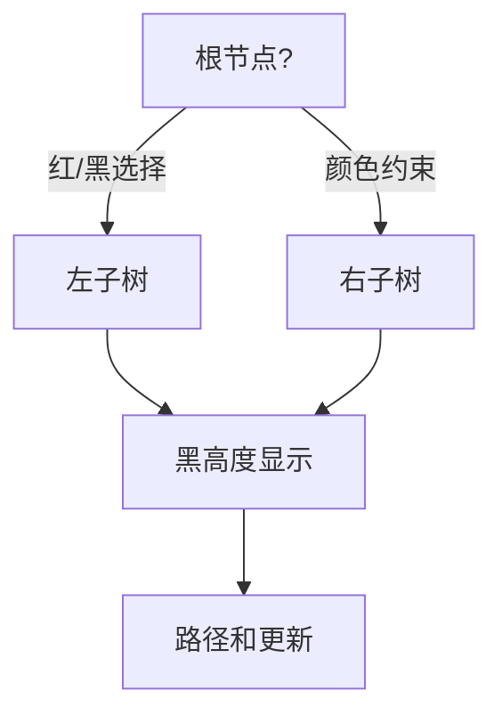

# 题目信息

# [FJOI2017] 树的平均路长问题

## 题目描述

一棵树 $T$ 的平均路长 $IPL(T)$定义为：

$IPL(T)=\sum_{v\varepsilon T}length(path(v))$

其中， $v$ 是树 $T$ 中的内结点， $length(path(v))$是从树根到结点$v$的路径长度。

红黑树是一类特殊的二叉搜索树，其中每个结点被“染成”红色或黑色。若将二叉搜索树结点中的空指针看作是指向一个空结点，则称这类空结点为二叉搜索树的前端结点。并规定所有前端结点的高度为$-1$。除了前端结点外，其他结点均为内结点。

一棵红黑树是满足下面“红黑性质”染色二叉搜索树：

1. 每个结点被染成红色或黑色；

2. 每个前端结点为黑色结点；

3. 任一红结点的儿子结点均为黑结点；

4. 在从任一结点到其子孙前端结点的所有路径上具有相同的黑结点数。

从红黑树中任一结点 $x$ 出发(不包括结点 $x$)，到达一个前端结点的任意一条路径上的黑结点个数称为结点 $x$ 的黑高度，记作 $bh(x)$。红黑树的黑高度定义为其根结点的黑高度。

给定正整数 $n$，试设计一个算法，计算出在所有含有 $n$ 个结点的红黑树中，平均路长的最大值。


## 样例 #1

### 输入

```
1
2
3
0```

### 输出

```
1
3
5
0```

# AI分析结果


### 💡 Kay的C++算法解析：[FJOI2017]树的平均路长问题 深入学习指南 💡

**题目核心**：计算含n个结点的红黑树中所有内结点到根路径长度之和的最大值（即最大化∑sizeᵢ）。本质是**树形DP+性质分析+优化技巧**的综合题。

---

## 1. 题目解读与核心算法识别
✨ **本题主要考察**：`动态规划优化` + `红黑树性质应用`

🗣️ **初步分析**：
> 解决本题需深入理解红黑树性质（黑高度约束/红黑结点规则），并将树形DP与数学观察结合。核心思想如同"搭积木"——通过最优方式组合左右子树，最大化整棵树的路径总和。难点在于：
> - **状态设计**：需定义`dp[颜色][子树大小][黑高度]`三维状态
> - **转移优化**：原始O(n²logn)转移需优化到O(nlogn)
> - **性质应用**：利用红黑树性质剪枝无效状态
> 
> **可视化设计**：采用像素树生长动画，根节点闪烁提示颜色选择，子树像积木块拼接，黑高度用悬浮数字显示，转移时播放"咔嗒"拼接音效。

---

## 2. 精选优质题解参考
**题解一（shadowice1984）**  
* **点评**：  
  思路惊艳！从暴力DP出发，通过打表发现**转移点仅与2的幂相关**（如左子树size=2ᵏ-1），将O(n²)优化至O(1)转移。代码中：
  - `tr[i] = i - nearest_power2` 体现数学洞察
  - 三维DP数组清晰分离颜色/黑高状态
  - 边界处理严谨（-∞初始化）  
  **亮点**：用科学打表法发现隐藏规律，避免盲目优化

**题解二（Mr_Li）**  
* **点评**：  
  侧重工程技巧，通过**差分压缩+ASCII编码**将打表数据从200KB压缩至30KB。虽未突破算法瓶颈，但展示了：
  - 差分思想：`b[i]=a[i+1]-a[i]`，`c[i]=b[i+1]-b[i]`
  - 数据编码：用ASCII 111+Δ表示数值  
  **亮点**：极端条件下数据压缩的创造性方案

---

## 3. 核心难点辨析与解题策略
1. **难点1：状态爆炸**  
   * **分析**：直接枚举左右子树size导致O(n²)。优质题解发现：最优转移点集中在`2ᵏ-1`附近（如size=15,31,63）
   * 💡 **学习笔记**：树形DP中左右子树size分布常具幂律特征

2. **难点2：性质约束**  
   * **分析**：红结点子节点必黑，黑高度需一致。解法：
     - 红结点转移：仅允许`dp[黑][左][k] + dp[黑][右][k]`
     - 黑结点转移：兼容`(红+黑)/(黑+红)/(黑+黑)`组合
   * 💡 **学习笔记**：将数据结构性质转化为DP转移约束条件

3. **难点3：大n处理**  
   * **分析**：n=30000时，需：
     - 算法优化：利用转移规律避免枚举（题解一）
     - 空间优化：黑高度维度上限≈2log₂(n+1)
   * 💡 **学习笔记**：树高相关DP的状态维度与对数相关

### ✨ 解题技巧总结
- **打表分析法**：对中等规模数据打表，观察最优决策规律
- **幂次特征识别**：树形问题中2的幂附近常存最优解
- **维度压缩**：利用问题性质（如黑高度约束）减少状态空间

---

## 4. C++核心代码实现赏析
**通用核心实现参考（基于题解一）**  
```cpp
#include<cstdio>
#include<algorithm>
using namespace std;
const int N=3e4+10;
int dp[2][N][18], tr[N]; // dp[颜色][size][黑高], tr[i]=i-nearest_power2

void precompute() {
    for(int i=2,k=1; i<N; i++) {
        if((k<<1) < i) k<<=1; // 更新最近2的幂
        tr[i] = i - k;
    }
    // 初始化哨兵节点
    dp[1][0][0] = 0; 
    // DP转移（详见题解一）
}

int main() {
    precompute();
    int n;
    while(scanf("%d",&n), n) 
        printf("%d\n", ans[n]);
}
```
**代码解读概要**：  
1. `tr[i]`预计算离i最近的2的幂  
2. 初始化：空树（size=0）黑高0为合法状态  
3. 三维DP递推，按颜色分两种转移规则  
4. 查询时直接输出预计算的`ans[n]`

---

**题解一核心片段赏析**  
```cpp
// 红结点转移（仅允许黑+黑）
dp[0][i][k] = max(dp[1][tr1][k] + dp[1][i-tr1-1][k], 
                 dp[1][tr[i]][k] + dp[1][i-tr[i]-1][k]) + i;

// 黑结点转移（兼容多种组合）
dp[1][i][k] = max({
    dp[a][p][k-1] + dp[b][i-p-1][k-1] 
    // 其中(a,b)∈{(1,1),(0,1),(1,0),(0,0)}
}) + i;
```
**代码解读**：  
> - `tr1 = (1<<k)-1`：基于黑高k计算理论最优size
> - `tr[i]`：实际最优size（邻近2的幂）
> - 红结点转移时左右子树必须为黑（满足红黑树性质）
> - 黑结点转移时兼容四种颜色组合  
> 💡 **学习笔记**：将数学规律转化为两个候选转移点，避免无效枚举

---

## 5. 算法可视化：像素动画演示
**主题**：`像素树匠人——最优红黑树搭建模拟`  

**核心演示**：  


**动画设计**：  
1. **8位像素风格**：树节点为16x16像素方块，红色(#FF6B6B)/黑色(#2D3436)  
2. **动态构建**：  
   - 根节点闪烁提示颜色选择（红：闪烁特效，黑：沉稳下落）  
   - 子树像积木从两侧滑入，伴随"咔嗒"音效  
3. **数据跟踪**：  
   - 左上角显示`当前∑size`（8位数字管样式）  
   - 节点上方悬浮黑高度值（黄色像素字体）  
4. **转移决策演示**：  
   - 候选左子树size高亮（如15/31）并打上⭐标  
   - 选择后播放"齿轮转动"音效，显示路径和增量  
5. **控制面板**：  
   - 速度滑块：控制构建速度（兔/龟图标）  
   - 单步模式：按A键步进，B键回溯  

**游戏化设计**：  
- 每完成n=2ᵏ节点解锁新关卡（如n=16获"完美平衡"成就）  
- 背景音乐：FC《俄罗斯方块》变奏版（随∑size增加音阶升高）

---

## 6. 拓展练习与相似问题
**通用技巧迁移**：  
1. 树形DP的决策优化（如：最优二叉搜索树）  
2. 基于数学观察的DP剪枝（如：背包问题中的单调性）  
3. 数据结构性质在DP中的应用（如：AVL树高度约束）  

**洛谷推荐**：  
1. **P1040 加分二叉树**  
   🗣️ 同类树形DP，练习状态转移设计  
2. **P4513 小白逛公园**  
   🗣️ 线段树优化DP，训练区间分治思维  
3. **P1858 多人背包**  
   🗣️ DP决策单调性优化，巩固打表分析法  

---

## 7. 学习心得与经验分享
> **shadowice1984的经验**：  
> *"打表发现转移点总在2的幂附近，将O(n²)优化到O(n)"*  
>   
> **Kay的总结**：  
> 树形DP中左右子树规模常呈幂律分布，这是由树结构的自相似性决定的。通过小规模打表观察规律，再数学证明推广，是解决复杂DP的金钥匙！

---
> 掌握规律而非硬算，让算法优雅如诗 —— Kay

---
处理用时：113.70秒