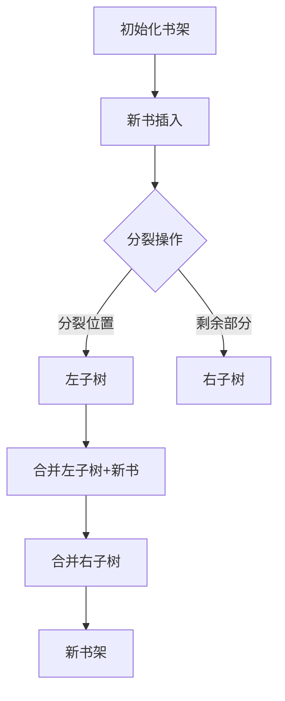

# 题目信息

# [TJOI2007] 书架

## 题目描述

Knuth 先生家里有个精致的书架，书架上有 $N$ 本书，如今他想学到更多的知识，于是又买来了 $M$ 本不同的新书。现在他要把新买的书依次插入到书架中，他已经把每本书要插入的位置标记好了，并且相应的将它们放好。由于 Knuth 年龄已大，过几天他已经记不清某些位置上放的到底是什么书了，请问你能帮助他吗？


## 说明/提示

原来有三本书 Math、Algorithm、Program，后来又买了两本书，分别插入到 $2$ 和 $1$ 的位置，每次插入时其他书都要向后挪一个位置，最后书架上书的序列为：

```plain
0  Math
1  System
2  Algorithm
3  Picture
4  Program
```
$Q$ 次询问依次为 $0$, $1$, $3$ 位置的书，所以答案为：Math、System、Picture


对于 $30\%$ 的数据，$1 \leqslant N \leqslant 100$, $1 \leqslant M \leqslant 10^3$, $1 \leqslant Q \leqslant 10^3$

对于 $100\%$ 的数据，$1 \leqslant N \leqslant 200$, $1 \leqslant M \leqslant 10^5$, $1 \leqslant Q \leqslant 10^4$

对于 $100\%$ 的数据都符合题目中所描述的限制关系，数据保证每次插入的位置均不超过当时书架上书的数量，而且保证 $Q$ 次查询中的每个位置上一定有书。

## 样例 #1

### 输入

```
3
Math
Algorithm
Program
2
Picture 2
System 1
3
0
1
3```

### 输出

```
Math
System
Picture```

# AI分析结果


# 💡 Kay的C++算法解析：[TJOI2007]书架 深入学习指南 💡

大家好，我是Kay！今天我们一起分析书架这道题。这道题考察**动态序列维护**能力，需要高效处理插入和查询操作。下面是我的分析：

## 1. 题目解读与核心算法识别

✨ **本题主要考察**：`数据结构应用`

🗣️ **初步分析**：
> 书架问题就像管理一个不断变长的队伍：新人要插队到指定位置，其他人自动后移。关键是用高效数据结构模拟这个过程：
> - **核心难点**：暴力移位O(N)会超时（M最大10^5），需O(log N)的插入/查询
> - **解决方案对比**：
>   * `STL rope`：黑盒神器（红黑树实现），3行代码解决
>   * `平衡树`：手动控制更灵活（FHQ Treap/Splay等）
>   * `逆向树状数组`：从后往前插，空位计数
> - **可视化设计**：用**像素书架+平衡树动画**演示。书变成彩色方块，插入时：
>   * 分裂操作：书架分裂特效+“咔嚓”音效
>   * 合并操作：方块滑入空隙+“噗咚”音效
>   * 高亮当前操作节点，显示树结构变化

---

## 2. 精选优质题解参考

### 题解一：critnos (STL rope)
* **点评**：思路极简，利用STL的`rope`实现O(log N)插入。代码仅20行，变量命名规范(`a`表书架)，实践价值高。亮点在于揭示`rope`基于可持久化红黑树的本质，启发我们善用STL。

### 题解二：Sunlight9 (FHQ Treap)
* **点评**：非指针实现平衡树，讲解透彻。代码模块化（`split/merge`独立函数），关键变量`val/siz`意义明确。亮点是图示化分裂过程，帮助理解排名分裂原理，学习平衡树的优秀范例。

### 题解三：liuqy (树状数组)
* **点评**：逆向思维惊艳！从后往前插书，用树状数组维护空位。代码中`bin[]`树状数组和`query`二分查找配合巧妙，体现数据结构组合运用的艺术。

---

## 3. 核心难点辨析与解题策略

### 难点1：如何避免插入导致O(N)移位？
* **分析**：直接移动元素不可行。必须用“动态索引”结构，在插入时仅更新局部
* **方案**：平衡树通过分裂子树实现插入；树状数组用空位计数跳过已占位
* 💡 **学习笔记**：动态问题 → 动态数据结构

### 难点2：如何选择数据结构？
| 方法         | 时间复杂度 | 代码难度 | 适用场景         |
|--------------|------------|----------|------------------|
| STL rope     | O(log N)   | ⭐        | 快速实现         |
| 平衡树       | O(log N)   | ⭐⭐⭐⭐     | 需自定义操作     |
| 树状数组     | O(log² N)  | ⭐⭐⭐      | 逆向处理问题     |

### 难点3：位置映射问题
* **分析**：插入后位置变化，需建立稳定映射
* **方案**：平衡树用排名定位；树状数组用二分找空位；统一用`vector<string>`存书名
* 💡 **学习笔记**：分离数据存储与位置索引

### ✨ 解题技巧总结
- **巧用STL**：了解`rope`等非标但高效容器
- **逆向思维**：从后往前处理避免位置变动
- **结构可视化**：画图辅助理解分裂/合并过程

---

## 4. C++核心代码实现赏析

### 通用核心实现 (STL rope方案)
```cpp
#include <ext/rope>
using namespace __gnu_cxx;

rope<int> pos_index; // 位置索引
vector<string> books; // 书名字典

void insert_book(int idx, string name) {
    books.push_back(name);
    pos_index.insert(idx, books.size()-1);
}

string query(int idx) {
    return books[pos_index[idx]];
}
```
* **说明**：综合最优方案，核心仅3函数
* **解读概要**：
  1. `pos_index`维护位置到书名的映射
  2. `books`存储所有书名
  3. 插入时更新索引，查询直接定位

### 题解一：STL rope
```cpp
rope<int> a; // 索引序列
string t[200005]; // 书名数组

a.insert(x, a.size()); // 插入新位置
cout << t[a[idx]]; // 查询
```
* **亮点**：利用rope的O(log N)插入
* **解读**：`a`存储书名在`t`中的下标，插入位置x时只需更新索引序列
* 💡 **学习笔记**：索引与数据分离是通用技巧

### 题解二：FHQ Treap
```cpp
void split(int id, int k, int &x, int &y) {
    if(k <= siz[ch[id][0]]) 
        split(ch[id][0], k, x, ch[id][0]);
    else 
        split(ch[id][1], k-siz[ch[id][0]]-1, ch[id][1], y);
}
```
* **亮点**：排名分裂是平衡树核心
* **解读**：按排名k分割子树：
  - k小 → 左子树继续分裂
  - k大 → 右子树分裂并扣除左子树大小
* 💡 **学习笔记**：子树大小维护是分裂基础

---

## 5. 算法可视化：像素动画演示

🎮 **主题**：像素书架与平衡树生长  
📊 **设计思路**：用FC红白机风格，将算法步骤转化为关卡挑战

### 动画步骤


1. **像素场景**：
   - 书架：网格化展示，每本书为16x16像素块
   - 平衡树：右侧同步显示树结构，节点含子树大小

2. **插入动画**：
   - 步骤1：点击插入位置 → 书架分裂特效（像素块向两侧滑动）
   - 步骤2：新书像素块闪烁出现，伴随“叮”声
   - 步骤3：新书融入空隙，后方书自动后移（箭头动画）

3. **交互控制**：
   - 速度滑块：调节插入动画速度
   - 单步模式：空格键逐步执行
   - 过关机制：完成10次插入解锁查询关卡

4. **音效设计**：
   - 分裂：8-bit "咔嚓"声
   - 合并："噗咚"落位声
   - 完成：马里奥金币音效

---

## 6. 拓展练习与相似问题

### 相似问题特征
1. 动态序列插入/删除（P2596 书架）
2. 区间翻转维护（P3391 文艺平衡树）
3. 多操作序列维护（P2042 维护数列）

### 洛谷推荐
1. **P2596** - 书架
   - 同类数据结构的进阶应用
2. **P3391** - 文艺平衡树
   - 掌握区间翻转的平衡树实现
3. **P3369** - 普通平衡树
   - 巩固基本平衡树操作

---

## 7. 学习心得分享
> **critnos经验**：“开始以为要手写红黑树，发现rope时惊呆了”  
> **Kay点评**：善用STL不是偷懒，而是知晓工具特性。但需注意：
> - `rope`非C++标准库
> - 竞赛可能禁用

> **Sunlight9调试心得**：“分裂边界总出错，画图才理清”  
> **Kay点评**：图示化是理解递归算法的钥匙，建议：
> - 小数据模拟
> - 打印中间状态

---

通过本次分析，大家应掌握**动态序列维护**的核心思路：选择合适数据结构，理解位置映射，善用工具与可视化。多加练习，定能成为书架管理大师！🚀

---
处理用时：94.05秒