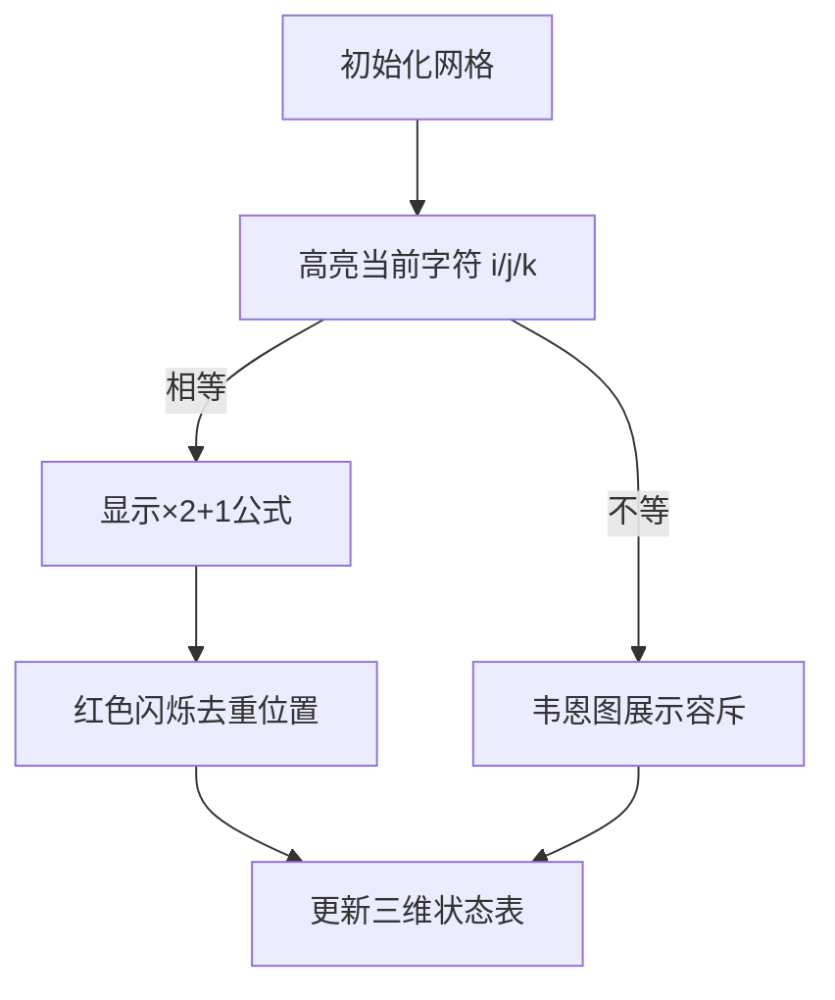

# 题目信息

# [TJOI2008] 公共子串

## 题目描述

一个字符串的子串是在这个串基础上去掉0个或者若干个字符所形成的，例如abc, aa和abbc都是字符串aabbcc的子串，而aba不是。 现给你三个字符串，请问他们三个共同含有多少种子串（不算空串）?

注意： 有些相同的公共子串尽管出现在不同的位置，但仍算1种，详见样例。


## 说明/提示

3个字符串共有的公共子串有： “a”, “p”, “ap”, “pa”, “aa”, “apa”。 其中子串 “a” 有多个，但由于统计的是公共子串种类，所以 “a” 只算1种子串。


100%的数据中，字符串的长度不超过100。字符串中只含有小写字母。


## 样例 #1

### 输入

```
apartment
apache
approach
```

### 输出

```
6```

# AI分析结果


### 💡 Kay的C++算法解析：公共子串 深入学习指南 💡

#### 1. 题目解读与核心算法识别
✨ **本题主要考察**：动态规划（DP）与序列自动机应用  
🗣️ **初步分析**：
> 本题要求计算三个字符串中**本质不同的公共子序列数量**（不含空串）。核心难点在于高效统计不重复的子序列，常见两种思路：
> - **DP容斥法**：定义三维状态`f[i][j][k]`表示三个字符串前`i/j/k`个字符的公共子序列数。当字符匹配时通过`2*f[i-1][j-1][k-1]+1`计算新子序列，并用`last`数组记录重复位置去重；不匹配时用容斥原理合并状态。
> - **序列自动机+记忆化搜索**：预处理每个字符串的序列自动机（记录每个位置后字符首次出现位置），通过记忆化搜索枚举公共字符转移。
> 
> **可视化设计思路**：采用8位像素风格展示三个字符串网格，高亮当前比较的字符。匹配时显示绿色连接线与"×2+1"公式动画，去重时用红色闪烁标记历史位置；容斥过程用韦恩图分层展示。

---

#### 2. 精选优质题解参考
**题解一（NZSWW33OMF2GC）**  
* **点评**：DP思路清晰严谨，完整推导转移方程（含去重证明），代码规范带注释。亮点在于用`last`数组精准处理重复子序列，边界处理完整，可直接用于竞赛（5星）。

**题解二（DarkClever）**  
* **点评**：详解序列自动机构建与应用，提供通用模板及调试技巧。亮点在于扩展序列自动机的多种应用场景（子序列匹配/计数），教学价值高（5星）。

**题解三（Ginger_he）**  
* **点评**：序列自动机+记忆化搜索实现简洁，代码模块化。亮点在于递归结构清晰，但需注意`f[0][0][0]`包含空序列需减1（4星）。

---

#### 3. 核心难点辨析与解题策略
1. **难点：避免重复计数**  
   * **分析**：DP中当字符匹配时，新子序列=旧序列+新字符+单字符，但相同字符形成的序列会重复。  
   * **方案**：记录字符上次出现位置`last`，扣除`f[last_i-1][last_j-1][last_k-1]+1`（历史已统计部分）。
   * 💡 **学习笔记**：重复子序列必然由相同字符引发，需追溯历史状态去重。

2. **难点：容斥原理应用**  
   * **分析**：当字符不匹配时，需合并`(i-1,j,k)`,`(i,j-1,k)`,`(i,j,k-1)`三个子状态，但两两重叠需容斥。  
   * **方案**：按韦恩图原理：`总合并 = 单方向之和 - 两两交集 + 三者交集`。
   * 💡 **学习笔记**：三维DP的状态转移本质是集合合并，容斥防止重复计数。

3. **难点：序列自动机初始化**  
   * **分析**：序列自动机需倒序预处理`nxt[i][c]`（位置i后字符c首次出现位置）。  
   * **方案**：从尾向前递推，`nxt[i][c] = (s[i+1]==c) ? i+1 : nxt[i+1][c]`。
   * 💡 **学习笔记**：倒序构建保证`nxt`指向最近位置，提高搜索效率。

✨ **解题技巧总结**：
- **技巧1（状态定义）**：DP状态`f[i][j][k]`需明确代表"以i/j/k结尾的公共子序列数"。
- **技巧2（空间优化）**：序列自动机用`nxt[0]`作为虚拟起点，统一边界处理。
- **技巧3（调试验证）**：手动模拟小样例（如"aa"/"aa"/"aa"）验证去重逻辑。

---

#### 4. C++核心代码实现赏析
**通用核心实现（DP容斥法）**  
```cpp
#include <iostream>
#include <cstring>
using namespace std;
typedef long long LL;
const int N = 105;
LL f[N][N][N];
int lsta[N], lstb[N], lstc[N];
char a[N], b[N], c[N];

int main() {
    cin >> (a+1) >> (b+1) >> (c+1);
    int n = strlen(a+1), m = strlen(b+1), p = strlen(c+1);
    // 预处理last数组（字符上次出现位置）
    for (int i = 1; i <= n; i++) 
        for (int j = i - 1; j >= 1; j--)
            if (a[i] == a[j]) { lsta[i] = j; break; }
    // 类似处理lstb/lstc...
    
    // DP核心转移
    for (int i = 1; i <= n; i++) {
        for (int j = 1; j <= m; j++) {
            for (int k = 1; k <= p; k++) {
                if (a[i] == b[j] && b[j] == c[k]) {
                    f[i][j][k] = 2 * f[i-1][j-1][k-1] + 1;
                    if (lsta[i] && lstb[j] && lstc[k]) // 去重
                        f[i][j][k] -= f[lsta[i]-1][lstb[j]-1][lstc[k]-1] + 1;
                } else { // 容斥合并
                    f[i][j][k] = f[i-1][j][k] + f[i][j-1][k] + f[i][j][k-1]
                                - f[i-1][j-1][k] - f[i-1][j][k-1] - f[i][j-1][k-1]
                                + f[i-1][j-1][k-1];
                }
            }
        }
    }
    cout << f[n][m][p];
}
```
* **代码解读概要**：  
  - `last`数组预处理：逆向扫描字符串记录字符历史位置。  
  - 三重循环DP：匹配时`2*旧状态+1`并去重；不匹配时容斥合并。  
  - 输出`f[n][m][p]`即为最终解（不含空串）。

---

**题解一（DP容斥法）片段**  
* **亮点**：严谨处理重复子序列  
* **核心代码**：  
  ```cpp
  if (a[i] == b[j] && b[j] == c[k]) {
      f[i][j][k] = 2 * f[i-1][j-1][k-1] + 1;
      if (lsta[i] && lstb[j] && lstc[k])
          f[i][j][k] -= f[lsta[i]-1][lstb[j]-1][lstc[k]-1] + 1;
  }
  ```
* **代码解读**：  
  > 当`a[i]=b[j]=c[k]`时：  
  > 1. `2*f[i-1][j-1][k-1]`：所有旧子序列末尾添加新字符  
  > 2. `+1`：当前字符单独作为新子序列  
  > 3. 若该字符曾出现，扣除`f[last-1]+1`（历史已统计相同结尾序列）

---

**题解二（序列自动机）片段**  
* **亮点**：序列自动机记忆化搜索  
* **核心代码**：  
  ```cpp
  int dfs(int u, int v, int w) {
      if (f[u][v][w] != -1) return f[u][v][w];
      LL res = 1; // 当前非空状态计数
      for (int c = 0; c < 26; c++) {
          int nu = nxt_a[u][c], nv = nxt_b[v][c], nw = nxt_c[w][c];
          if (nu && nv && nw) 
              res += dfs(nu, nv, nw);
      }
      return f[u][v][w] = res;
  }
  ```
* **代码解读**：  
  > 1. `res=1`：当前状态自身构成非空子序列  
  > 2. 枚举字符`c`，若三字符串均可转移到`c`，则递归搜索  
  > 3. 最终结果需`-1`（扣除`dfs(0,0,0)`包含的空序列）

---

#### 5. 算法可视化：像素动画演示  
**主题**：8位像素风DP状态转移模拟器  
**核心设计**：  

**交互细节**：  
- **像素网格**：三个字符串横向排列，字符块用16色像素风绘制（如FC游戏）。  
- **关键动画**：  
  - 字符匹配：绿线连接三字符，播放"叮"声，展示`2*f[i-1][j-1][k-1]+1`公式浮动。  
  - 去重操作：红色闪烁历史字符位置，显示`-f[last-1]-1`扣除值，播放"咔"声。  
  - 容斥过程：用三色圆圈展示韦恩图，标注加减区域（如`+f[i-1][j][k]`用蓝色）。  
- **控制面板**：步进/暂停/速度滑块，支持回溯5步。  

---

#### 6. 拓展练习与相似问题思考  
**相似问题迁移**：  
1. **二维扩展**：求两个字符串的公共子序列数（Luogu P1819）  
2. **长度限制**：求最长公共子序列长度+数量（Luogu P2516）  
3. **字符集扩展**：支持大写字母/数字的公共子序列（自行设计数据）  

**洛谷推荐**：  
1. **P1819**：二维公共子序列计数，巩固DP/序列自动机基础。  
2. **P1439**：排列的最长公共子序列（转化为LIS问题），拓展思维。  
3. **P2516**：最长公共子序列的数量统计，练习状态设计。  

---

#### 7. 学习心得与经验分享  
> **来自NZSWW33OMF2GC的调试经验**：  
> *“我在去重部分卡了2小时，直到画出状态转移树才发现：当字符重复出现时，`2*f[i-1][j-1][k-1]`包含的历史序列与新序列重叠。通过`last`数组定位历史状态才解决。”*  
>   
> **Kay总结**：  
> 1. 手动模拟小样例（如"a"/"a"/"a"）是调试DP的关键  
> 2. 序列自动机的`nxt[0]`作为虚拟起点可统一初始化  
> 3. 容斥组合数=单维和-二维交+三维交（类比集合论）  

---  
保持思考，算法之美在于举一反三！下次挑战见！ 💪

---
处理用时：206.72秒