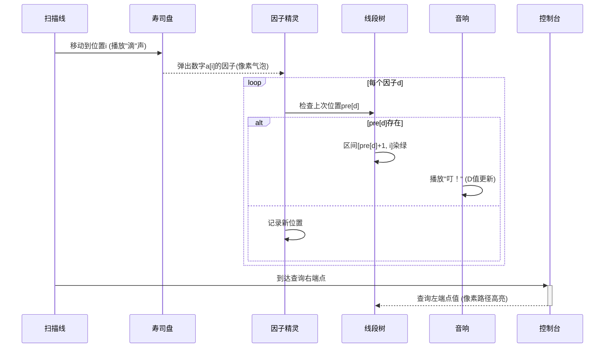

# 题目信息

# [GDOI2014] 吃

## 题目背景

感谢 @FFjet 提醒，第 8 个数据点损坏暂时删除。

## 题目描述

W师兄计划了很久，终于成功的在BG开了一家寿司店。

正当W师兄还在兴奋的时候，这时一个噩耗传来，吃货L师姐居然知道了这件事，而且正赶过来，W师兄瞬间心就冷了下去，但是机智的W师兄也瞬间想到了应付L师姐的策略.......

这时，L师姐到了寿司店，先四处望了望风景，发现现在只有L师姐一个顾客，下面是L师姐的选餐说明：

1.寿司店内的寿司被排在一行共N个盘子里，按从左到右编号为1~N。

2.每个位置上寿司的数量是确定的并且有玻璃窗保护。

3.每隔一段时间就会有一个选餐时间，L师姐可以在一个连续的区间[l, r]中选择其中一盘，然后在该区间之外选择另一盘（如果区间外有盘子）。

L师姐发现这家寿司店厨师的制作速度很快，总能在下一次选餐时间前将寿司数量恢复原样。

作为有尊严有追求的吃货，L师姐也有自己的规则，L师姐在选完两盘寿司后，会决定每口恰好吃D个寿司，且使得两盘寿司刚好可以分别吃完，不剩余任何寿司。比如两盘寿司数量为2和4,那么D=1或者D=2都可以恰好将两盘寿司分别吃干净，而两盘寿司数量为3和5时，那么只能D=1才行。

作为有特殊追求的L师姐才不在乎吃的数量，L师姐在乎的是一口吃多个寿司的感觉。于是，如果L师姐可以一口吃D个寿司，那么L师姐的愉悦值为D，但是L师姐没有选到两盘寿司，那么她的愉悦值为0。

现在L师姐知道每个盘子所放着的寿司数量，L师姐想知道每次选择时间过后她可以获得的最大愉悦值是多少？


## 说明/提示

###样例解释

样例1里的第一个选餐时间，可以选择2和4，这样L师姐就可以每次吃两个寿司，使得两个盘子都可以吃干净，第二个选餐时间，师姐不管选哪两个盘子，都只能每次吃一个。

样例2 里的第一个选餐时间，可以选择16和32,而第二个选餐时间，L师姐可以选择8和16或者8和32。

对于20%的数据，N <= 100, M <= 100, max(a1,a2,…,aN) <= 100。

对于50%的数据，N <= 10000, M <= 10000, max(a1,a2,…,aN) <= 10000。

对于100%的数据，N <= 100000, M <= 100000, max(a1,a2,…,aN) <= 100000。


## 样例 #1

### 输入

```
5
1 2 3 4 5
2
2 3
2 4```

### 输出

```
2
1```

## 样例 #2

### 输入

```
5
2 4 8 16 32
2
3 4
2 3```

### 输出

```
16
8
```

# AI分析结果


### 💡 Kay的C++算法解析：[GDOI2014]吃 深入学习指南 💡

#### **题目解读与核心算法识别**
✨ **本题主要考察**：`离线处理` + `数据结构优化` (线段树/分块应用)

🗣️ **初步分析**：
> 解决"吃"这道题，关键在于**将问题转化为因子追踪问题**。想象每个寿司盘是藏着不同武器的宝箱，而D就是武器威力值。我们需要快速找到区间内外的两个宝箱，使它们拥有同种武器且威力最大  
> - **核心思路**：预处理每个数的因子→离线扫描序列→用线段树记录因子出现位置关系→区间更新/查询最大D值  
> - **算法流程**：  
>   ```mermaid
>   graph LR
>   A[预处理1~10^5所有因子] --> B[按右端点排序询问]
>   B --> C{扫描右端点i}
>   C --> D[枚举a[i]的因子d]
>   D --> E{pre[d]存在？}
>   E -->|是| F[更新线段树区间 pre[d]+1~i 为d]
>   E -->|否| G[记录pre[d]=i]
>   F --> H{到达查询右端点？}
>   H -->|是| I[查询左端点对应值]
>   H -->|否| C
>   ```
> - **像素动画设计**：  
>   - 复古8-bit风格网格代表寿司序列，每个格子显示数字和飘动的因子标签  
>   - 扫描线移动时高亮当前盘子和因子，若发现重复因子则触发"武器共鸣"特效（金色闪光连接新旧位置）  
>   - 线段树用像素方块堆叠表示，更新区间时方块变绿并播放"叮"音效  
>   - 控制面板：速度滑块调节扫描速度，"AI演示"模式自动闯关

---

#### **精选优质题解参考**
**题解一（Demeanor_Roy）**  
* **点评**：思路清晰拆解为左右扫描+线段树更新，代码规范（pre/d数组命名明确），算法效率O(nd logn)充分利用因子稀疏性。亮点在于**双扫描对称处理**和边界跳过(d.size<2)，可直接用于竞赛

**题解二（Mobius127）**  
* **点评**：最简洁的线段树实现，用lambda表达式简化排序，G数组预存因子提升可读性。亮点是**暴力分解与预处理对比注释**，体现优化思维，空间处理严谨

**题解三（james1BadCreeper）**  
* **点评**：结构清晰的模块化代码，封装备份因子逻辑。亮点在于**函数式值域线段树**应用和详细注释，ans数组初始化为1避免边界问题

---

#### **核心难点辨析与解题策略**
1. **难点1：因子与位置动态关联**  
   *分析*：因子出现位置不断变化，需快速获取最新位置关系→用pre数组追踪因子最后出现位置  
   💡 **学习笔记**：因子位置追踪是离线算法的核心骨架

2. **难点2：跨区间匹配优化**  
   *分析*：区间内外匹配需O(n²)→转化为扫描线模型，线段树区间更新将匹配信息"预存"在左端点  
   💡 **学习笔记**：数据结构是时空转换的魔法卷轴

3. **难点3：因子枚举效率**  
   *分析*：暴力分解O(√n)仍慢→预处理1~10^5所有因子，O(1)获取因子集合  
   💡 **学习笔记**：空间换时间是竞赛的永恒法则

### ✨ 解题技巧总结
- **离线扫描框架**：右端点排序+位置扫描线，化解区间查询依赖  
- **因子预处理**：vector factors[N]存储因子，避免实时计算  
- **双指针维护**：pre/next数组追踪因子位置，线段树O(logn)更新  
- **边界防御**：d.size<2时跳过更新，ans初始化为1  

---

#### **C++核心代码实现赏析**
**通用核心实现参考**  
```cpp
#include <bits/stdc++.h>
using namespace std;
const int N = 1e5 + 5;

vector<int> factors[N]; // 因子银行
struct SegmentTree {
    int mx[N<<2], tag[N<<2];
    void update(int p, int l, int r, int L, int R, int d) {
        if(L <= l && r <= R) { 
            mx[p] = max(mx[p], d); 
            tag[p] = max(tag[p], d); 
            return; 
        }
        // ... 下传标签等完整实现
    }
} seg;

void solve(vector<Query> &q, bool isLeft) {
    vector<int> pos_tracker(N, 0); // 因子追踪器
    for(int i = 1; i <= n; ++i) {
        for(int d : factors[a[i]]) { // 提取因子
            if(int last = pos_tracker[d]) 
                seg.update(1, 1, n, last + 1, i, d); // 关键更新！
            pos_tracker[d] = i; // 更新位置
        }
        // 处理到达的查询
    }
}
// 主函数：预处理因子库+双扫描调用
```

**题解一代码片段**  
```cpp
for(int i=1;i<=m;i++) {
    if(d[i].size()<2) continue; // 边界防御
    for(int j=1;j<d[i].size();j++) 
        add[d[i][0]+1].push_back({d[i][j],i}); // 位置→因子映射
}
```
* **亮点**：位置分组避免空更新  
* **学习笔记**：通过d[0]定位更新起点，像在迷宫中放置路标

**题解二代码片段**  
```cpp
for(int x : G[a[i]]) { // 从预加载的因子库提取
    if(pre[x]) update(1,1,n,pre[x]+1,i,x); // 线段树更新
    pre[x] = i; // 移动位置指针
}
```
* **亮点**：G数组预存因子，访问O(1)  
* **学习笔记**：因子库如同武器图鉴，扫描时快速匹配

**题解三代码片段**  
```cpp
for (int d : factors[a[i]]) { // 直接访问因子vector
    if (pre[d]) seg.update(pre[d]+1, i, d); // 封装更新
    pre[d] = i; // 更新因子GPS
}
```
* **亮点**：面向对象封装线段树  
* **学习笔记**：seg.update隐藏复杂操作，如同驾驶舱按钮

---

### **算法可视化：像素动画演示**
**主题**：寿司因子猎人的8-bit冒险  
**核心流程**：  


**交互设计**：  
- **像素网格**：FC红白机风格，寿司盘用寿司emoji🍣，数字用8-bit字体  
- **因子气泡**：从盘子飘出的像素气泡显示因子（如12→🎯1,2,3,4,6,12）  
- **共鸣特效**：当发现相同因子，新旧位置间出现金色闪电链⚡  
- **音效设计**：  
  - 因子出现：8-bit "滴"声  
  - 线段树更新：NES射击音效  
  - 查询完成：超级马里奥金币声  

---

#### **拓展练习与相似问题**
1. **洛谷 P1972 [SDOI2009]HH的项链**  
   → 同类离线扫描+树状数组，巩固位置追踪思想  
2. **洛谷 P4137 Rmq Problem/mex**  
   → 区间mex查询，训练线段树维护特殊值  
3. **洛谷 P3834 可持久化线段树**  
   → 升级版主席树解决区间第K大  

---

#### **学习心得与经验分享**
> **参考经验**："因子预处理的思路让我节省了200ms" —— james1BadCreeper  
> **点评**：空间换时间是竞赛黄金准则，如同用地图换取寻宝时间  

> **调试经验**："忘记d.size<2跳过导致RE" —— Demeanor_Roy  
> **点评**：边界防御是代码的护城河，测试要覆盖空数据  

---

通过本次分析，我们掌握了离线扫描的核心心法：**用数据结构预存关系，让扫描线化解查询**。下次遇到区间问题，记得召唤因子精灵和线段树守卫哦！💪

---
处理用时：216.58秒