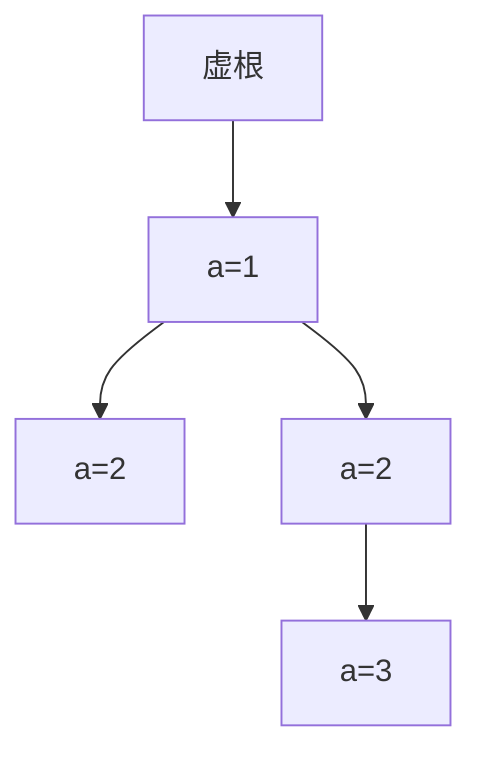

# 题目信息

# [TJOI2014] Alice and Bob

## 题目描述

Alice 和 Bob 发明了一个新的游戏。给定一个序列 $\{x_0,x_1,\cdots,x_{n-1}\}$，Alice 得到一个序列 $\{a_0,a_1,\cdots,a_{n-1}\}$，其中 $a_i$ 表示以 $x_i$ 结尾的最长上升子序列的长度；Bob 得到一个序列$\{b_0,b_1,\cdots,b_{n-1}\}$，其中 $b_i$ 表示以 $x_i$ 开头的最长下降子序列的长度。Alice 的得分是序列 $\{a_i\}$ 的和，Bob的得分是序列 $\{b_i\}$ 的和。


## 说明/提示

### 数据范围

对于 $30\%$ 的数据，$N \le 1000$。

对于 $100\%$ 的数据，$N \le 10^5$。


## 样例 #1

### 输入

```
4
1 2 2 3```

### 输出

```
5```

## 样例 #2

### 输入

```
4
1 1 2 3```

### 输出

```
5```

# AI分析结果


### 💡 Kay的C++算法解析：[TJOI2014] Alice and Bob 深入学习指南 💡

#### 1. 题目解读与核心算法识别
✨ **本题主要考察**：`贪心构造 + 树遍历 + 动态规划`

🗣️ **初步分析**：
> 解决本题的关键在于将序列构造问题转化为树结构问题。想象你在搭建一座"数字城堡"，城堡中每个房间（节点）的编号由其位置决定，楼层（a_i值）决定了房间的连通规则。高楼层房间必须由低楼层房间连接（a_i值差1），同层房间需保证后入住的房间更小（满足贪心原则）。通过DFS遍历这座城堡，我们就能获得最优的房间编号序列（x_i）。

- **核心思路**：  
  1. 建树规则：对每个位置i，找到最近的满足a_j = a_i-1的j作为父节点  
  2. 贪心DFS：按子节点加入的反序遍历（后加入的先访问）  
  3. 答案计算：将DFS序列反转后求最长上升子序列（LIS）长度和

- **可视化设计**：  
  采用8位像素风格（类似FC游戏）展示树的构建与遍历过程：
  - 节点：像素方块（颜色区分a_i值），标位置编号
  - 连边：动态绘制箭头（父→子），播放"连接"音效
  - DFS遍历：被访问节点闪烁变绿，显示DFS序号
  - 控制面板：步进/自动播放（可调速）、重置按钮
  - 音效设计：节点访问("叮")、完成遍历("胜利旋律")

#### 2. 精选优质题解参考
**题解一（allqpsi）**  
* **点评**：思路清晰直击核心，用`vector`反序遍历子节点实现贪心DFS，代码规范（变量名`dfn`/`f`含义明确）。亮点在于用`zfrep`倒序遍历子节点，完美实现贪心原则，边界处理严谨（虚根0）。实践价值高，可直接用于竞赛。

**题解二（MorsLin）**  
* **点评**：采用链式前向星存图，利用其"后加入边先遍历"特性自然满足贪心要求。代码中`min(b[pos], dfn[i])`的优化体现算法理解深度，时间复杂度O(nlogn)高效可靠。亮点在于双向边处理的简洁性。

**题解三（xiaomimxl）**  
* **点评**：创新性拓扑排序解法拓宽思路，优先队列选最大编号节点实现贪心，树状数组求LIS展现扎实基础。虽然实现稍复杂，但提供全新视角，对理解贪心本质有启发性价值。

#### 3. 核心难点辨析与解题策略
1. **难点：序列到树的转化逻辑**  
   *分析*：关键在发现"最近前驱"原则——每个a_i必须连接最近的a_i-1节点。优质题解用`last`数组动态维护前驱位置，建树过程自然满足约束条件。
   💡学习笔记：树边表示数值约束关系，建树即建模问题

2. **难点：贪心DFS的遍历顺序**  
   *分析*：相同a_i节点需保证位置靠后的x_i更小。通过反序遍历子节点（后加入先访问），DFS序天然满足要求。可视化中需高亮子节点遍历顺序。
   💡学习笔记：DFS序即最优x序列，反序遍历是贪心核心

3. **难点：LDS到LIS的转化**  
   *分析*：求x序列每个位置开头的LDS长度和，等价于反转序列后求每个位置结尾的LIS长度和。优质题解用从n到1的遍历方向配合单调数组维护实现O(nlogn)求解。
   💡学习笔记：序列反转是经典技巧，二分维护单调数组是效率关键

✨ **解题技巧总结**：
- **问题转化艺术**：序列约束→树结构→DFS序
- **贪心实现技巧**：反序遍历子节点、优先队列最大编号
- **DP优化策略**：单调数组+二分求LIS
- **边界处理心法**：虚根0处理a_i=1的边界情况

#### 4. C++核心代码实现赏析
**通用核心实现（综合优化版）**：
```cpp
#include <iostream>
#include <vector>
#include <algorithm>
using namespace std;
const int N = 1e5 + 5;

vector<int> G[N];
int last[N], dfn[N], cnt;
int f[N], len; // f维护LIS单调数组

void dfs(int u) {
    dfn[u] = ++cnt;
    for (int i = G[u].size() - 1; i >= 0; i--) // 反序遍历子节点
        dfs(G[u][i]);
}

int main() {
    int n, a; cin >> n;
    for (int i = 1; i <= n; i++) {
        cin >> a;
        G[last[a - 1]].push_back(i); // 连接最近前驱
        last[a] = i; // 更新最后出现位置
    }
    dfs(0); // 从虚根开始遍历
    
    long long ans = 0;
    for (int i = n; i >= 1; i--) { // 反转序列方向
        if (dfn[i] > f[len]) f[++len] = dfn[i];
        else {
            int pos = lower_bound(f + 1, f + len + 1, dfn[i]) - f;
            f[pos] = dfn[i];
        }
        ans += len;
    }
    cout << ans;
}
```

**题解一（allqpsi）片段**：
```cpp
vi[ai[a-1]].push_back(i);  // 建树核心
zfrep(i, vi[x].size()) dfs(vi[x][i]); // 反序遍历
```
> **解读**：`vi`数组存储每个a_i的最后位置，建树时连接`a_i-1`的最近节点。`zfrep`倒序遍历子节点保证靠后位置获得更小DFS序，完美实现贪心原则。

**题解二（MorsLin）片段**：
```cpp
add(a[x-1], i); // 前向星加边
for (int i = head[x]; i; i = a[i].next) // 自动反序
```
> **解读**：前向星后加入边存储在链表头部，遍历时自然实现反序访问，巧妙利用数据结构特性。

**题解三（xiaomimxl）片段**：
```cpp
if(!ind[i]) Q.push(i); // 拓扑排序入口
while(!Q.empty()) {
    int u = Q.top(); Q.pop(); // 取最大编号
    b[u] = ++tmp; // 赋权值
}
```
> **解读**：优先队列选最大编号节点保证靠后位置获得更小权值，树状数组维护LIS展现高效实现。

#### 5. 算法可视化：像素动画演示
**主题**："数字城堡探险"（8位像素风格）

**核心演示**：


**动画流程**：
1. **城堡建造阶段**（动态绘制）
   - 像素方块生成：位置i显示为像素块（颜色=楼层a_i）
   - 连边动画：箭头从父节点射向子节点（"嗖"音效）
   - 节点标记：显示位置编号（如①、②）

2. **城堡探险阶段**（DFS遍历）
   - 探险家(Kay像素形象)从虚根0出发
   - 遍历规则：先访问最后加入的子节点（颜色高亮）
   - 节点激活：被访问节点闪烁绿光，显示DFS编号（"叮"音效）
   - 路径记录：显示当前DFS序：0→3→1→2→4

3. **宝藏计算阶段**（LIS求解）
   - 序列展示：x = [dfn1, dfn2,...]（像素条形图）
   - 从右向左扫描：位置4→1（剑光闪烁特效）
   - 单调数组维护：f数组用像素柱动态更新（高度=值）
   - 音效反馈：插入("咔")、替换("锵")、扩展("嘣")

**交互设计**：
- 控制面板：步进/自动、速度滑块（乌龟→兔子）
- 探险日记：显示当前操作解释
  > "访问节点③：它是节点①最后加入的子节点"
- 成就系统：完成DFS播放胜利音乐，计算答案显示宝石得分

#### 6. 拓展练习与相似问题思考
**技巧迁移**：
1. 树结构建模序列约束（P4254 [JSOI2008]Blue Mary开公司）
2. DFS序应用（P3379 【模板】最近公共祖先）
3. LIS/LDS转化技巧（P1439 【模板】最长公共子序列）

**洛谷推荐**：
1. **P1020 导弹拦截**  
   → 巩固LIS/LDS基础应用
2. **P4303 [AHOI2006]基因匹配**  
   → 练习LCS转LIS的转化思维
3. **P5825 排列计数**  
   → 强化序列约束与树结构的建模能力

#### 7. 学习心得与经验分享
> **参考经验（allqpsi）**：  
> "建树时注意最近前驱选择，DFS反序遍历是保证贪心的关键。调试时手动模拟小样例验证树结构"

> **Kay总结**：  
> 本题难点在于问题转化的思维跳跃——从序列约束到树结构。核心心法：  
> 1. 寻找"最近前驱"建树（建模约束）  
> 2. 反序DFS实现贪心（后进先访）  
> 3. 序列反转化LDS为LIS  
> 多练习树结构与序列问题的相互转化，编程能力将获得质的飞跃！

> 记住：算法学习就像搭建像素城堡，每一块积木（基础技巧）的堆砌都让你更接近完美解法。下次挑战见！🚀

---
处理用时：300.31秒