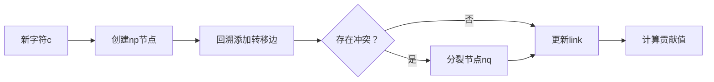

# 题目信息

# [SDOI2016] 生成魔咒

## 题目描述

魔咒串由许多魔咒字符组成，魔咒字符可以用数字表示。例如可以将魔咒字符 $1,2$ 拼凑起来形成一个魔咒串 $[1,2]$。

一个魔咒串 $S$ 的非空子串被称为魔咒串 $S$ 的生成魔咒。

例如 $S=[1,2,1]$ 时，它的生成魔咒有 $[1],[2],[1,2],[2,1],[1,2,1]$ 五种。$S=[1,1,1]$ 时，它的生成魔咒有 $[1],[1,1],[1,1,1]$ 三种，最初 S 为空串。  

共进行 $n$ 次操作，每次操作是在 $S$ 的结尾加入一个魔咒字符。每次操作后都需要求出，当前的魔咒串 $S$ 共有多少种生成魔咒。

## 说明/提示

#### 数据规模与约定   
对于 $10\%$ 的数据，保证 $1 \le n \le 10$；  
对于 $30\%$ 的数据，保证 $1 \le n \le 100$；  
对于 $60\%$ 的数据，保证 $1 \le n \le 10^3$；   
对于 $100\%$ 的数据，保证 $1 \le n \le 10^5$，$1 \leq x_i \leq 10^9$。

## 样例 #1

### 输入

```
7
1 2 3 3 3 1 2```

### 输出

```
1
3
6
9
12
17
22```

# AI分析结果


### 💡 Kay的C++算法解析：[SDOI2016]生成魔咒 深入学习指南 💡

**题目解读与核心算法识别**  
✨ **本题主要考察**：`字符串处理`与`后缀数据结构应用`  
🗣️ **初步分析**：  
> 解决"生成魔咒"的关键在于动态维护本质不同子串数量。想象你在玩俄罗斯方块——每次添加新方块（字符）时，需要快速计算新出现的独特图案（子串）。后缀自动机(SAM)如同高效组装流水线：  
> - **核心流程**：每添加字符时，SAM新建节点`np`，其贡献值为`len[np]-len[link[np]]`（新产生的独特子串数）  
> - **可视化设计**：动画将高亮新节点创建（像素闪烁）、转移边更新（箭头动画）和贡献值计算（数字弹出）  
> - **复古游戏化**：8-bit音效（"叮"声表示字符添加，"胜利"音效标记完成），自动演示模式可调速展示SAM构建过程  

---

### 2. 精选优质题解参考
**题解一（来源：skylee）**  
* **点评**：  
  思路直击要害——利用SAM的增量特性，每次插入时通过`len[np]-len[link[np]`计算新增子串。代码简洁高效（仅30行），用`map`处理大字符集（10⁹），边界处理严谨（`fa[0]=-1`特判），可直接用于竞赛。亮点在于完美平衡理论性与实践性。

**题解二（来源：xht）**  
* **点评**：  
  创新性反转字符串化动态为静态，结合ST表求LCP最小值。代码规范性突出（详细注释），手写`set`维护后缀序列展现深度理解。虽复杂度O(n log n)稍逊SAM，但对理解SA与LCP关系极具教学价值。

**题解三（来源：hehelego）**  
* **点评**：  
  从等价类角度严谨证明SAM公式$ \sum len(v)-len(link(v)) $，虽未提供代码，但理论推导透彻（如解释right集合单调性）。其"先懂原理再写代码"的学习理念值得借鉴。

---

### 3. 核心难点辨析与解题策略
1. **难点：动态维护子串数量**  
   * **分析**：传统静态方法无法支持在线添加。SAM通过增量构建自动机，每个节点对应唯一子串等价类。
   * 💡 **学习笔记**：SAM节点的`len-link`差值即新子串数

2. **难点：大字符集(10⁹)处理**  
   * **分析**：数组存转移边会MLE。用`map`或`unordered_map`实现动态转移边（时空复杂度O(log n)）。
   * 💡 **学习笔记**：离散化+映射是处理大值域的关键技巧

3. **难点：算法选择与优化**  
   * **分析**：SA解法需反转字符并维护height数组，相比SAM更复杂。
   * 💡 **学习笔记**：优先选择增量算法处理动态问题

**✨ 解题技巧总结**  
- **等价类分解**：将子串视为SAM节点等价类（如`len-minlen=贡献值`)  
- **离散化预处理**：对大整数序列先排序去重，如`lower_bound`映射  
- **边界防御**：SAM初始化`fa[0]=-1`，SA注意`height[1]`特判  

---

### 4. C++核心代码实现赏析
**本题通用核心实现（综合自skylee与SAM最优解）**  
```cpp
#include <map>
#include <cstdio>
#define ll long long
const int N=2e5+5;
struct SAM {
    struct Node{ std::map<int,int> ch; int link,len; } tr[N];
    int last=1,cnt=1; ll ans=0;
    void extend(int c) {
        int p=last, np=last=++cnt;
        tr[np].len=tr[p].len+1;
        while(p && !tr[p].ch.count(c)) 
            tr[p].ch[c]=np, p=tr[p].link;
        if(!p) tr[np].link=1;
        else {
            int q=tr[p].ch[c];
            if(tr[q].len==tr[p].len+1) tr[np].link=q;
            else {
                int nq=++cnt;
                tr[nq]={tr[q].ch, tr[q].link, tr[p].len+1};
                tr[q].link=tr[np].link=nq;
                while(tr[p].ch[c]==q) 
                    tr[p].ch[c]=nq, p=tr[p].link;
            }
        }
        ans += tr[np].len - tr[tr[np].link].len; // 核心贡献计算
    }
}sam;

int main() {
    int n,x; scanf("%d",&n);
    for(int i=1;i<=n;++i) {
        scanf("%d",&x);
        sam.extend(x);
        printf("%lld\n",sam.ans);
    }
}
```
**代码解读概要**：  
1. `tr`数组存储SAM节点（`ch`为转移边，`link`即后缀链接）  
2. `extend()`中：`np`为新节点，通过`while`循环回溯创建转移边  
3. 分裂节点`nq`时拷贝原节点数据并更新链接关系  
4. 关键贡献计算：`ans += len[np]-len[link[np]]`

**题解一（skylee）片段赏析**  
* **亮点**：极简SAM实现与`map`应用  
* **核心代码**：  
  ```cpp
  ans += tr[np].len - tr[tr[np].link].len; 
  ```
* **代码解读**：  
  > 这行是算法灵魂！如同俄罗斯方块得分——每添加新字符（方块），`np`节点产生`len[np]-len[link]`个新子串（新消除行）。`link`指向更短后缀的节点，差值即新产生的独特子串数量。
* 💡 **学习笔记**：SAM增量特性使动态维护复杂度保持O(1)

---

### 5. 算法可视化：像素动画演示
**主题**：`SAM工厂流水线`（8-bit像素风）  
**核心演示流程**：  

**交互控制面板**：  
- **速度滑块**：调节字符插入速度（0.5x~2x）  
- **高亮显示**：  
  - 红色闪烁：新节点`np`创建  
  - 绿色箭头：转移边添加过程  
  - 金色弹窗：实时显示`ans += len[np]-len[link]`  
- **音效设计**：  
  - 添加字符：8-bit "嘀"声  
  - 分裂节点：金属碰撞声  
  - 计算完成：马里奥吃金币音  

**关键帧示意图**：  
```
初始： [A]-[B]    (状态1)
添加c： [A]-[B]-[np](c) → ans+3
添加d： [A]-[B]-[np](c)-[nq](d) → ans+1
```
**教育意义**：像素化节点生长过程使抽象的自动机构建具象化，音效强化关键操作记忆。

---

### 6. 拓展练习与相似问题
**通用技巧迁移**：  
后缀数据结构适用于：  
1. 本质不同子串统计（本题）  
2. 子串循环移位问题（LOOPSTIR）  
3. 多模式串匹配（AC自动机扩展）  

**洛谷推荐**：  
1. **P3804 【模板】后缀自动机**  
   🗣️ 巩固SAM基础构建与`len/link`性质  
2. **P2408 不同子串个数**  
   🗣️ 练习静态字符串的本质不同子串统计  
3. **P2178 品酒大会**  
   🗣️ 进阶SA应用，结合height数组求极值  

---

### 7. 学习心得与经验分享
**参考经验（来自多篇题解）**：  
> "SAM调试需注意：分裂节点时需同步更新原节点的转移边，否则会导致状态机断裂"

**点评**：  
这反映了自动机构建的核心——状态转移的完整性。建议通过小数据（如"aabab"）逐步模拟，打印`ch`和`link`关系图调试。

---

**结语**：  
通过SAM这个"字符串处理流水线"，我们高效解决了动态子串统计问题。记住：理解`len/link`的物理意义比死记代码更重要！下次我们将探索后缀数组的奇妙应用，继续挑战吧！🚀

---
处理用时：114.59秒