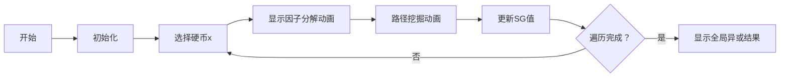

# 题目信息

# [SDOI2016] 硬币游戏

## 题目描述

Alice 和 Bob 现在在玩的游戏，主角是依次编号为 $1$ 到 $n$ 的 $n$ 枚硬币。每一枚硬币都有两面，我们分别称之为正面和反面。一开始的时候，有些硬币是正面向上的，有些是反面朝上的。Alice 和 Bob 将轮流对这些硬币进行翻转操作，且 Alice 总是先手。


具体来说每次玩家可以选择一枚编号为 $x$，要求这枚硬币此刻是反面朝上的。对于编号 $x$ 来说，我们总可以将 $x$ 写成 $ c\cdot 2^a \cdot 3^b$ ，其中 $a$ 和 $b$ 是非负整数，$c$ 是与 $2,3$ 都互质的非负整数，然后有两种选择：


选择整数 $p,q$ 满足 $a \ge pq , p \ge 1$ 且 $1 \leq q \leq \text{MAXQ}$，然后同时翻转所有编号为 $c \cdot 2^{a-pj} \cdot 3^b$  的硬币，其中 $j = 0, 1, 2, \ldots ,q$。

选择整数 $p,q$ 满足 $b \ge pq, p \ge 1$  且 $1 \leq q \leq \text{MAXQ}$，然后同时翻转所有编号为 $c \cdot 2^a \cdot 3^{b-pj}$ 的硬币，其中 $j = 0, 1, 2, \ldots, q$。

可以发现这个游戏不能无限进行下去，当某位玩家无法继续操作上述操作时，便输掉了游戏。作为先手的 Alice，总是希望可以在比赛开始之前就知道自己能否获胜。她知道自己和 Bob 都是充分聪明的，所以在游戏过程中，两人都会最优化自己的策略并尽量保证自己处于不败的情形中。


## 说明/提示

对于 $100\%$ 的数据 $1\le n \le 30000,1 \le \text{MAXQ} \le 20,t\le 100$。


## 样例 #1

### 输入

```
6
16 14
1 0 0 1 0 0 0 0 1 0 0 0 1 0 1 1
16 14
0 1 0 0 0 1 1 1 1 1 1 0 1 0 0 1
16 11
0 1 0 0 0 1 1 1 0 1 0 0 0 1 0 1
16 12
1 1 1 1 1 1 1 1 0 0 1 1 0 1 1 0
16 4
1 0 0 1 0 0 1 0 0 0 0 1 0 1 1 0
16 20
0 0 0 0 1 0 1 0 0 0 1 0 0 1 0 0```

### 输出

```
win
lose
win
lose
win
win```

# AI分析结果


### 💡 Kay的C++算法解析：[SDOI2016] 硬币游戏 深入学习指南 💡
<introduction>
今天我们来分析博弈论中的经典翻硬币游戏。通过SG函数和独立子游戏思想，本指南将带大家理解如何判断必胜策略，并掌握核心实现技巧。
</introduction>

---

## 1. 题目解读与核心算法识别

✨ **本题主要考察**：`博弈论/SG函数应用`

🗣️ **初步分析**：
> 本题可比喻为"像素地牢寻宝"：每个硬币是独立房间，翻转操作如同打开隐藏通道。**SG函数**就像每个房间的"通关密码"，而异或运算则是验证全局通关的钥匙。
> - **核心思路**：将每个硬币视为独立子游戏，计算其SG值，最终将所有反面硬币的SG值异或，非零则先手必胜。
> - **难点解析**：关键在于理解操作的本质——每次操作实际是修改当前状态并创建新子状态（类似打开新通道）。
> - **可视化设计**：将用8-bit像素风格展示硬币状态（正面/反面用不同颜色），操作时显示"通道打开"动画，SG值计算过程以数字气泡实时显示，关键异或步骤触发"叮"音效。

---

## 2. 精选优质题解参考

**题解一：winxp_qwq（5星）**
* **点评**：最具启发性解法！通过"石子游戏"类比（原游戏≡新游戏mod2），完美解释SG函数适用性。代码中`gao()`函数高效处理因子分解，`cnt[]`数组巧妙实现mex计算。边界处理严谨，可直接用于竞赛。

**题解二：_Sein（5星）**
* **点评**：创新性采用二维SG表（`sg[MaxQ][j][k]`存储2^j*3^k的状态）。亮点在于预处理对数表`lg2[]/lg3[]`加速索引，`mex()`函数用位运算实现极简高效。数学证明严谨，强化理论基础。

**题解三：单曦增（4星）**
* **点评**：直白实现题意，三重循环清晰展示SG计算过程。独特之处是直接对原始数值分解因子（`while(temp%2==0)`），避免索引转换。虽效率略低但教学价值高，适合初学者理解。

---

## 3. 核心难点辨析与解题策略

1.  **难点1：操作转化为子游戏状态**
    * **分析**：每次操作不是简单翻转硬币，而是创建新子状态（如操作`c*2^a·3^b`会影响`c*2^{a-pj}·3^b`）。需理解操作等价于在博弈图上添加边。
    * 💡 **学习笔记**：每个操作是当前状态的"状态分裂器"。

2.  **难点2：高效计算SG值**
    * **分析**：优质解法均采用"从底向上"DP：
      ```python
      for 状态 in 所有可能子状态:
          收集所有可达状态的SG值异或结果 → 求mex
      ```
      关键优化：`winxp_qwq`用`cnt[]`数组避免排序，`_Sein`用对数表加速索引。
    * 💡 **学习笔记**：SG值范围极小（0~20），可用位压缩替代集合。

3.  **难点3：独立子游戏证明**
    * **分析**：核心定理——局面SG值=各硬币SG值的异或和。`_Sein`提供的[证明链接](https://lb2003.top/archives/453.html)严谨推导了该性质。
    * 💡 **学习笔记**：异或的本质是模2加法，完美契合翻硬币特性。

### ✨ 解题技巧总结
- **技巧1：问题转化**（如winxp_qwq将翻硬币→石子游戏）
- **技巧2：状态压缩**（SG值范围小，用int位运算代替set）
- **技巧3：对数加速**（预处理lg2/lg3快速定位因子指数）
- **技巧4：边界剪枝**（如单曦增代码中`p*k<=er`提前终止循环）

---

## 4. C++核心代码实现赏析

**通用核心实现参考**
```cpp
#include <cstring>
#include <iostream>
using namespace std;
const int N = 30000;

int sg[N+5], cnt[300]; // cnt用于mex计算

// 分解x的p因子并更新可达状态
void dfs(int x, int p, int base) {
    for(int q=1, y=x; y%p==0; q++, y/=p) {
        int new_state = sg[y]; 
        for(int j=2; j<=q; j++) new_state ^= sg[y / pow(p,j)];
        cnt[new_state] = x; // 标记状态存在
    }
}

void calcSG(int x) {
    memset(cnt, 0, sizeof cnt);
    dfs(x, 2, 1); // 分解2因子
    dfs(x, 3, 1); // 分解3因子
    for(int i=0; ; i++) 
        if(cnt[i] != x) { sg[x]=i; return; }
}

int main() {
    int T, n, maxQ; cin >> T;
    while(T--) {
        cin >> n >> maxQ;
        int ans = 0;
        for(int i=1; i<=n; i++) calcSG(i);
        for(int i=1, coin; i<=n; i++) {
            cin >> coin;
            if(!coin) ans ^= sg[i]; // 反面硬币参与异或
        }
        puts(ans ? "win" : "lose");
    }
}
```
**代码解读概要**：  
1. `calcSG()`计算每个位置的SG值  
2. `dfs()`处理因子分解和状态转移  
3. 主函数读入硬币状态并异或SG值  

---

**题解一（winxp_qwq）核心片段**
```cpp
void gao(int x, int p, int w) {
    int y = x, state = 0;
    for(int q=1; y%p==0; q++, y/=p) {
        state ^= sg[y]; // 累加子状态SG值
        cnt[state] = x; // 关键！用数组下标标记状态存在性
    }
}
```
**解读**：  
> `gao()`像"隧道挖掘机"：沿因子p方向（如p=2）层层挖掘子状态。`state`记录路径上所有子状态的异或值，`cnt[state]=x`巧妙利用数组赋值实现状态标记，省去集合操作。

---

**题解二（_Sein）核心片段**
```cpp
for(int MaxQ=1; MaxQ<=20; MaxQ++)
    for(int a=0, i=1; i<=N; i*=2, a++)
        for(int b=0, j=1; i*j<=N; j*=3, b++) {
            int s = 0;
            // 处理2的指数操作
            for(int p=1; p<=a; p++) 
                for(int q=1; p*q<=a && q<=MaxQ; q++)
                    s |= 1 << (state ^= sg[MaxQ][a-p*q][b]);
            sg[MaxQ][a][b] = mex(s); // 位压缩求mex
        }
```
**解读**：  
> 三重循环像"像素地图生成器"：外层`MaxQ`是难度级别，内层`a,b`遍历所有2^a*3^b的坐标。`s |= 1<<state`用位图记录可达状态，`mex()`函数快速扫描最低未置位比特。

---

## 5. 算法可视化：像素动画演示

**主题**：《SG勇士：8-bit硬币迷宫》  
**核心演示**：SG值计算过程 & 操作路径动态展示  

### 🎮 动画设计


1. **像素场景**：
   - 硬币阵列：正面(黄色像素块) / 反面(蓝色像素块)
   - 控制面板：速度滑块/单步执行/SG值显示区

2. **关键动画**：
   - **因子分解**：选中硬币后，显示`c·2ᵃ·3ᵇ`分解式（如像素粒子重组动画）
   - **路径挖掘**：
     ```python
     操作p=2, q=3时：
     硬币x → 分裂为 x/2, x/4, x/8 三个新硬币
     ```
     伴随"通道打开"像素动画和电子音效
   - **SG计算**：实时显示`cnt[]`数组状态，mex扫描过程用激光扫描线效果

3. **游戏化元素**：
   - **音效**：正确操作(8-bit上升音) / 错误操作(警报音)
   - **关卡制**：每完成一个硬币的SG计算视为小关，BOSS战为最终异或判定
   - **AI演示**：自动播放模式展示必胜策略路径

---

## 6. 拓展练习与相似问题思考

**通用技巧迁移**：  
SG函数+因子分解适用于：
1. 阶梯博弈（如操作受位置约束）
2. 树形博弈（因子分解类似树结构）
3. 多维状态游戏（如本题的2^a*3^b）

**洛谷推荐**：  
1. **P2148 [SDOI2009]E&D**  
   → 同类因子分解博弈，强化二维状态处理
2. **P2964 [USACO09NOV]Coin Game**  
   → 翻硬币变体，训练异或性质应用
3. **P3185 [HNOI2007]分裂游戏**  
   → 高阶SG函数实战，掌握状态分裂技巧

---

## 7. 学习心得与经验分享

> **winxp_qwq的经验**：  
> "原问题转化为石子游戏后，通过mod2性质证明等价性，这是解题突破口。"  
>   
> **Kay点评**：  
> 这种转化思维是博弈论核心——将陌生问题映射到已知模型。调试时可打印操作路径验证状态转移。

---

<conclusion>
掌握SG函数就像获得游戏攻略手册！通过本指南，你已理解：
1️⃣ 如何用因子分解建模操作
2️⃣ 高效计算SG值的位技巧
3️⃣ 异或判定的数学本质
下次遇到翻硬币游戏，你定能快速找到必胜策略！🚀
</conclusion>

---
处理用时：112.02秒