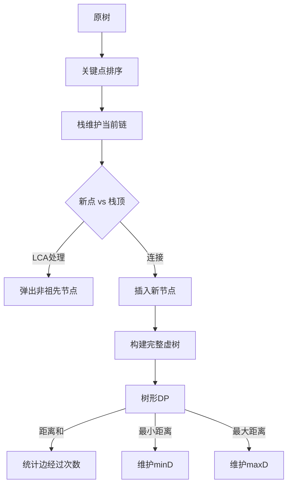

# 题目信息

# [HEOI2014] 大工程

## 题目描述

国家有一个大工程，要给一个非常大的交通网络里建一些新的通道。

我们这个国家位置非常特殊，可以看成是一个单位边权的树，城市位于顶点上。

在 $2$ 个国家 $a,b$ 之间建一条新通道需要的代价为树上 $a,b$ 的最短路径的长度。

现在国家有很多个计划，每个计划都是这样，我们选中了 $k$ 个点，然后在它们两两之间 新建 $\dbinom{k}{2}$ 条新通道。

现在对于每个计划，我们想知道： 
1. 这些新通道的代价和。
2. 这些新通道中代价最小的是多少。
3. 这些新通道中代价最大的是多少。

## 说明/提示

对于 $100\%$ 的数据，$1\le n\le 10^6,1\le q\le 5\times 10^4,\sum k\le 2\times n$。

每个测试点的具体限制见下表：

| 测试点编号 | $n$ | 特殊性质 |
| :-----------: | :-----------: | :-----------: |
| $1\sim 2$ | $\le 10^4$ |  |
|$3\sim 5$  | $\le 10^5$ | 树的形态是链 |
| $6\sim 7$ | $\le 10^5$ |  |
| $8\sim 10$ | $\le 10^6$ |  |

## 样例 #1

### 输入

```
10 
2 1 
3 2 
4 1 
5 2 
6 4 
7 5 
8 6 
9 7 
10 9 
5 
2 
5 4 
2
10 4 
2 
5 2 
2
6 1 
2 
6 1```

### 输出

```
3 3 3 
6 6 6 
1 1 1 
2 2 2 
2 2 2```

# AI分析结果


### 💡 Kay的C++算法解析：[HEOI2014] 大工程 深入学习指南 💡

#### 1. 题目解读与核心算法识别
✨ **本题主要考察**：虚树构建 + 树形动态规划

🗣️ **初步分析**：
> 解决"大工程"问题，关键在于理解并运用虚树技术。虚树就像从原始大树中提取的"精华版"，只保留关键节点和必要的分支点（LCA），大幅降低计算量。在本题中，虚树主要用于高效处理多组关键点查询。

- **核心思路**：对每次查询的关键点构建虚树，在虚树上进行树形DP计算：
  - **距离和**：统计每条边被经过的次数（两侧关键点数乘积）
  - **最小距离**：维护每个节点到子树最近关键点的距离
  - **最大距离**：维护每个节点到子树最远关键点的距离
- **可视化设计**：动画将展示关键点排序→栈维护链结构→LCA节点插入→虚树边连接→DP状态更新（用颜色区分siz/min/max值变化）
- **复古像素风格**：采用8-bit游戏界面，关键点用闪烁方块表示，栈操作为像素推箱动画，DP过程伴随"叮"音效，成功时播放胜利旋律

---

#### 2. 精选优质题解参考
**题解一：CrTsIr400 (46赞)**
* **亮点**：创新性简化虚树构建流程（排序→相邻求LCA→去重→连接），逻辑严谨代码简洁，提供正确性证明，教学价值高

**题解二：shadowice1984 (28赞)**
* **亮点**：DP推导清晰（距离和公式拆解），处理边界完整，使用欧拉序优化DFS，实践性强可直接用于竞赛

**题解三：MikukuOvO (24赞)**
* **亮点**：状态定义直观（g[u]距离和/siz[u]关键点数），变量命名规范，转移方程展示完整，适合初学者理解

---

#### 3. 核心难点辨析与解题策略
1. **虚树构建的栈维护**
   * **分析**：需动态维护右链，正确处理LCA节点插入时机
   * **解法**：关键点按DFS序排序，用栈模拟深度遍历，当新点与栈顶LCA非栈顶时弹出并连接
   * 💡 **学习笔记**：栈维护保证虚树链结构正确性

2. **树形DP状态转移**
   * **分析**：需同步计算三个独立值（和/最小/最大）
   * **解法**：
     - 距离和：`ans += w * siz[v] * (总关键点-siz[v])`
     - 最小距离：`minans = min(当前值, min[u]+min[v]+w)`
     - 最大距离：`maxans = max(当前值, max[u]+max[v]+w)`
   * 💡 **学习笔记**：DP回溯时同步更新子树信息

3. **虚树边权计算**
   * **分析**：需准确获取原树两点距离
   * **解法**：利用深度差`dep[v]-dep[u]`作为虚树边权
   * 💡 **学习笔记**：LCA预处理是高效计算深度的关键

### ✨ 解题技巧总结
- **问题分解**：将大工程拆解为虚树构建+子树DP
- **数据结构选择**：用栈维护虚树链，倍增法求LCA
- **边界处理**：根节点特殊处理，空子树状态初始化（min=INF/max=-INF）

---

#### 4. C++核心代码实现赏析
**通用核心实现**（综合题解优化）：
```cpp
void buildVirtualTree() {
    sort(key, key+k, [&](int a,int b){ return dfn[a]<dfn[b]; });
    stk[top=1] = 1;
    for(int i=0; i<k; ++i) {
        int u = key[i], l = lca(u, stk[top]);
        while(dep[l] < dep[stk[top-1]]) 
            addEdge(stk[top-1], stk[top]), top--;
        if(l != stk[top]) {
            addEdge(l, stk[top]);
            if(l != stk[top-1]) stk[top] = l;
            else top--;
        }
        stk[++top] = u;
    }
    while(top>1) addEdge(stk[top-1], stk[top]), top--;
}

void dfsDP(int u) {
    siz[u] = isKey[u]; 
    minD[u] = isKey[u] ? 0 : INF;
    maxD[u] = isKey[u] ? 0 : -INF;
    for(auto [v,w] : virtualTree[u]) {
        dfsDP(v);
        total += 1LL * w * siz[v] * (k - siz[v]);
        minAns = min(minAns, minD[u] + minD[v] + w);
        maxAns = max(maxAns, maxD[u] + maxD[v] + w);
        minD[u] = min(minD[u], minD[v] + w);
        maxD[u] = max(maxD[u], maxD[v] + w);
        siz[u] += siz[v];
    }
}
```

**代码解读**：
1. 虚树构建：关键点排序后，用栈维护当前链，动态插入LCA节点
2. 边权计算：`w = dep[v]-dep[u]` 获取原树距离
3. DP状态：`siz`统计关键点数，`minD/maxD`维护极值
4. 答案更新：回溯时用子树信息组合更新全局答案

---

#### 5. 算法可视化：像素动画演示
**主题**："虚树勇者"8-bit闯关  
**核心演示**：


**交互设计**：
1. **像素元素**：
   - 关键点：闪烁金色方块
   - LCA节点：紫色圆点
   - 栈：底部发光的像素容器
2. **动画流程**：
   - 关键点按DFS序跳入排序队列（音效：跳跃声）
   - 栈操作时显示弹出/压栈动画（音效：金属碰撞）
   - DP过程用绿色波浪线显示状态传播
3. **控制面板**：
   - 步进/暂停：控制算法执行
   - 速度滑块：调整动画速度
   - 对比模式：并排显示原始树与虚树

---

#### 6. 拓展练习与相似问题
1. **思路迁移**：
   - 虚树适用于所有"多次查询+少量关键点"的树上问题
   - 类似问题：最小连通集、关键路径覆盖、最近公共祖先扩展
   
2. **推荐练习**：
   1. [洛谷P2495] 消耗战  
      * 虚树基础应用，巩固边权处理
   2. [洛谷P3233] 世界树  
      * 复杂状态维护，提升DP设计能力
   3. [洛谷P3320] 寻宝游戏  
      * 动态虚树实践，培养实时维护思维

---

#### 7. 学习心得与经验
> "调试虚树时，我通过打印栈状态和虚树结构，快速定位了LCA处理漏洞。记住：当栈顶的父节点深度>LCA时，必须持续弹出直到找到真祖先！" —— CrTsIr400

**调试技巧**：
1. 小样本测试：n=3的树手工验证
2. 边界检查：空查询/单点/根节点关键点
3. 可视化输出：打印虚树的父子关系

**核心收获**：  
虚树本质是空间压缩技术，通过保留拓扑关键点，将O(n)问题降为O(k)问题。掌握DFS序和LCA两大基石，即可应对各类变体。

---  
**Kay的结语**：  
通过虚树技术，我们化繁为简高效解决大工程问题。记住核心四步：排序→建树→DP→回溯，勤加练习定能举一反三！下次我们将探索动态树分治，继续挑战编程高峰！🚀

---
处理用时：201.04秒