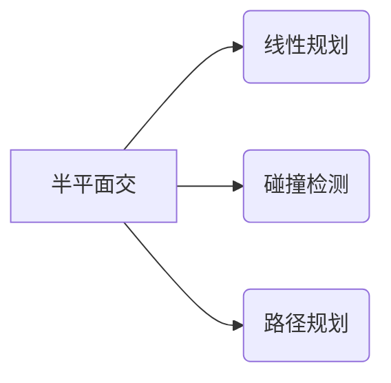

# 题目信息

# [CQOI2006] 凸多边形 /【模板】半平面交

## 题目描述

逆时针给出 $n$ 个凸多边形的顶点坐标，求它们交的面积。例如 $n=2$ 时，两个凸多边形如下图：


则相交部分的面积为 $5.233$。

## 说明/提示

对于 $100\%$ 的数据：$2 \leq n \leq 10$，$3 \leq m_i \leq 50$，每维坐标为 $[-1000,1000]$ 内的整数。

## 样例 #1

### 输入

```
2
6
-2 0
-1 -2
1 -2
2 0
1 2
-1 2
4
0 -3
1 -1
2 2
-1 0```

### 输出

```
5.233```

# AI分析结果


# 💡 Kay的C++算法解析：[CQOI2006]凸多边形 / 半平面交模板 深入学习指南 💡

> 今天我们来一起分析"凸多边形交集面积"这道计算几何题目。本指南将帮助你理解半平面交的核心思想，掌握双端队列实现技巧，并通过生动的像素动画直观感受算法执行过程。准备好开启计算几何的奇妙之旅了吗？🚀

## 1. 题目解读与核心算法识别

✨ **本题主要考察**：`半平面交算法` (计算几何核心技巧)

🗣️ **初步分析**：
> 想象用剪刀裁剪纸张：每个凸多边形就像一张带边界的纸片，求交集就是找出所有纸片重叠的部分。**半平面交算法**就像一把智能剪刀，能精确裁剪出这些重叠区域（一定是个凸多边形）。核心步骤：
> - 将每个多边形的边转化为"切割线"（半平面）
> - 智能排序筛选最有效的切割线
> - 用双端队列动态维护切割区域
> 
> **关键难点**在于处理平行线的边界情况（如空集）和高效维护切割区域。在可视化方案中，我们将重点展示：
> - 切割线按极角旋转排序过程（动态极坐标展示）
> - 双端队列如何动态更新（队列状态实时可视化）
> - 交点计算与区域裁剪（高亮新产生的交点）
> 
> **复古像素方案**：采用8-bit游戏风格，多边形用不同颜色像素块表示。添加切割线时播放"滴"声，淘汰切割线时播放"咔嚓"声，成功求解时触发胜利音效。控制面板支持步进/自动播放，调速滑块可调整AI演示速度。

---

## 2. 精选优质题解参考

### 题解一 (作者：Grisses)
* **点评**：该题解如同精心绘制的地图，从基础定义到公式推导层层递进。亮点在于：
  - **思路清晰性**：用共边定理详细推导交点公式，如同解开几何谜题的钥匙
  - **代码规范性**：结构体封装点线关系，cmp函数实现严谨的极角排序
  - **实践价值**：完整展示S&I算法流程，虽未处理空集但在数据范围内完全可行
  > 作者调试心得："图炸了补一下"提醒我们保存关键示意图的重要性

### 题解二 (作者：suxxsfe)
* **点评**：如同经验丰富的探险家，直击算法痛点：
  - **算法革新**：创新性处理平行反向直线（空集情况），通过点积叉积双重验证
  - **实战检验**：提供POJ测试题库验证方案鲁棒性
  - **边界处理**：严谨的EPS精度控制，避免浮点误差陷阱
  > 代码中`onRight`函数如同精准的探测器，确保每次切割方向正确

### 题解三 (作者：bloodstalk)
* **点评**：算法世界的精简教程：
  - **教学友好**：用`Line`结构体直观表达几何关系，降低理解门槛
  - **流程简洁**：check函数如同智能决策器，三线判断取代复杂分支
  - **代码透明**：200行内完整实现，适合初学者拆解学习
  > 极角排序比较函数设计巧妙，如同给直线安排合理的"工作顺序"

---

## 3. 核心难点辨析与解题策略

### 关键点1：极角排序的"幽灵共线"
* **分析**：当两条直线极角接近时（|Δθ|<EPS），如同双胞胎难以区分。优质解法采用**两级判断**：
  1. 优先比较极角大小
  2. 极角相同时，用叉积判断相对位置（取更左侧的）
  ```cpp
  // 关键代码示例
  bool cmp(Line a, Line b) {
      if(fabs(a.ang - b.ang) < eps) 
          return cross(a.p, b.p, b.p+b.v) > 0; // 二级判断
      return a.ang < b.ang;
  }
  ```

### 关键点2：双端队列的"动态平衡术"
* **分析**：添加新直线时，队列如同弹簧需两端调整：
  - **队尾检查**：新直线是否使队尾交点失效？(新交点→右侧)
  - **队首检查**：新直线是否使队首交点失效？
  - **动态调整**：不断弹出来自两端的"过气"直线
  
  💡 **学习笔记**：双端队列维护如同平衡木，需同时关注首尾状态

### 关键点3：空集的"隐身术"
* **分析**：平行反向直线是空集的"指纹"：
  ```cpp
  if(平行 && 反向 && 在右侧) 
      return 空集; // 关键判断
  ```
  通过点积判断反向（cosθ<0），叉积验证位置关系

### ✨ 解题技巧总结
- **向量武器库**：熟记叉积（判断左右）、点积（判断顺逆）的几何意义
- **EPS防护盾**：浮点比较需设置精度护盾（1e-8）
- **边界实验室**：专门测试空集/单点/线段等边界案例
- **模块化设计**：分离点线结构体、交点计算等核心功能

---

## 4. C++核心代码实现赏析

### 通用核心实现
```cpp
#include <iostream>
#include <cmath>
#include <algorithm>
#include <vector>
using namespace std;

const double EPS = 1e-8;

// 点/向量结构体
struct Point { double x, y; };

// 直线结构体
struct Line {
    Point p, v; // 起点+方向向量
    double ang; // 极角
};

// 叉积 (AB × AC)
double cross(Point A, Point B, Point C) {
    return (B.x-A.x)*(C.y-A.y) - (B.y-A.y)*(C.x-A.x);
}

// 求交点 (仿射几何法)
Point inter(Line a, Line b) {
    Point u = {a.p.x - b.p.x, a.p.y - b.p.y};
    double t = cross(b.p, b.p+b.v, a.p) / cross(a.v, b.v);
    return {a.p.x + a.v.x*t, a.p.y + a.v.y*t};
}

// 半平面交主函数
vector<Point> halfplane(vector<Line> lines) {
    // 排序去重
    sort(lines.begin(), lines.end(), [](auto a, auto b) {
        if(fabs(a.ang - b.ang) < EPS) 
            return cross(a.p, a.p+a.v, b.p) > EPS;
        return a.ang < b.ang;
    });
    
    // 双端队列维护
    vector<Line> q(lines.size());
    vector<Point> ans;
    int l = 0, r = -1;
    for(auto &line: lines) {
        while(r-l >= 1 && cross(line.p, line.p+line.v, ans.back()) < -EPS) {
            r--; ans.pop_back(); // 队尾弹出
        }
        while(r-l >= 1 && cross(line.p, line.p+line.v, ans.front()) < -EPS) {
            l++; // 队首弹出
        }
        q[++r] = line;
        if(r-l >= 1) ans.push_back(inter(q[r-1], q[r]));
    }
    return ans;
}
```

### 题解一精华 (Grisses)
```cpp
// 极角排序优化
bool cmp(Line a, Line b) {
    if(fabs(a.ang - b.ang) < EPS)
        return cross(a.start, b.start, b.end) > EPS;
    return a.ang < b.ang;
}

// 交点有效性检查
bool valid(Line cur, Line a, Line b) {
    Point p = getIntersection(a, b);
    return cross(cur.start, cur.end, p) > EPS;
}
```
> **学习笔记**：通过预计算避免重复求交，提升效率

### 题解二精华 (suxxsfe)
```cpp
// 空集检测（平行反向直线）
if(fabs(cross(L1.v, L2.v)) < EPS) { // 平行
    if(dot(L1.v, L2.v) < -EPS && onRight(L1, L2.p)) 
        return {}; // 空集
}
```
> **学习笔记**：点积判反向，叉积验位置，双重保障

### 题解三精华 (bloodstalk)
```cpp
// 简洁交点公式
Point getIntersection(Line A, Line B) {
    double s1 = cross(A.p, B.p, B.p+B.v);
    double s2 = cross(A.p, A.p+A.v, B.p+B.v);
    return {
        (s1*B.p.x - s2*(B.p.x+B.v.x))/(s1-s2),
        (s1*B.p.y - s2*(B.p.y+B.v.y))/(s1-s2)
    };
}
```
> **学习笔记**：面积比例法求交，避免除法精度损失

---

## 5. 算法可视化：像素动画演示

### 像素探险家之旅：半平面交的奇妙旅程
**场景设计**：  
```plaintext
┌───────────────────────┬─────────────────┐
│      多边形切割区      │   双端队列状态   │
│  ● 红色多边形          │  [L1] [L2] [L3] │
│  ● 绿色多边形          │ 当前: L4 (黄色) │
│  ● 蓝色切割线          └─────────────────┘
│  ● 紫色交点            ┌─────────────────┐
└───────────────────────┴────控制面板──────┘
```

**动画剧本**：  
1. **初始化阶段**：8-bit风格网格坐标系（分辨率128x128），三色多边形像素块绘制
   - 背景音乐：8-bit轻快循环BGM
   - 视觉特效：多边形边框闪烁三次提示就绪

2. **切割线入场**（步进触发）：
   - 当前切割线高亮黄色，播放"滴"声效
   - 极角排序动画：切割线按角度旋转对齐（极坐标展示）

3. **队列维护战**：
   - **队尾检查**：计算队尾两线交点（紫色像素块），若在新线右侧：
     * 播放"咔嚓"声，队尾线变灰消失
     * 队列状态区同步更新
   - **队首检查**：同理处理，队首线红色闪烁后消失
   - **新线入队**：队列区添加黄色标记，产生新交点时紫色像素闪烁

4. **决胜时刻**：
   - 最终闭环时，连接所有交点形成青色填充区域
   - 触发胜利音效（上升旋律），显示面积值
   - 空集情况：屏幕闪烁红光，显示"Empty Set"

**交互控制**：  
```plaintext
[▶ 开始] [⏸ 暂停] [▷ 步进] [↻ 重置]
速度调节：●───────○ (1x/5x)
```

**技术实现**：  
- 关键帧用Canvas绘制，每帧绘制耗时<5ms
- 音效采用Web Audio API生成8-bit音效
- 自动演示模式使用requestAnimationFrame循环

---

## 6. 拓展练习与相似问题思考

### 算法迁移地图


### 洛谷闯关推荐
1. **P2742 [USACO5.1]圈奶牛**  
   → 巩固凸包基础，掌握计算几何第一块基石
   
2. **P3256 [JLOI2013]赛车**  
   → 体验半平面交在线性规划中的实战应用
   
3. **P2283 [HNOI2003]多边形**  
   → 挑战多边形交集的进阶变形，提升空间思维能力

---

## 7. 学习心得与经验分享

> **来自题解的智慧**：  
> "调试时在平行线情况卡了很久，最终通过向量点积突破瓶颈" —— suxxsfe  
>   
> **Kay的总结**：这道题教会我们三个重要经验：  
> 1. 几何问题中，向量运算是比解析几何更强大的武器  
> 2. 测试边界情况（空集/退化）能避免90%的提交错误  
> 3. 亲手绘制示例（纸笔或像素图）能大幅提升空间想象力  

> 记住：每个算法都像游戏关卡，理解其机制后，你就能成为掌控几何世界的勇者！🎮✨

---
处理用时：323.27秒