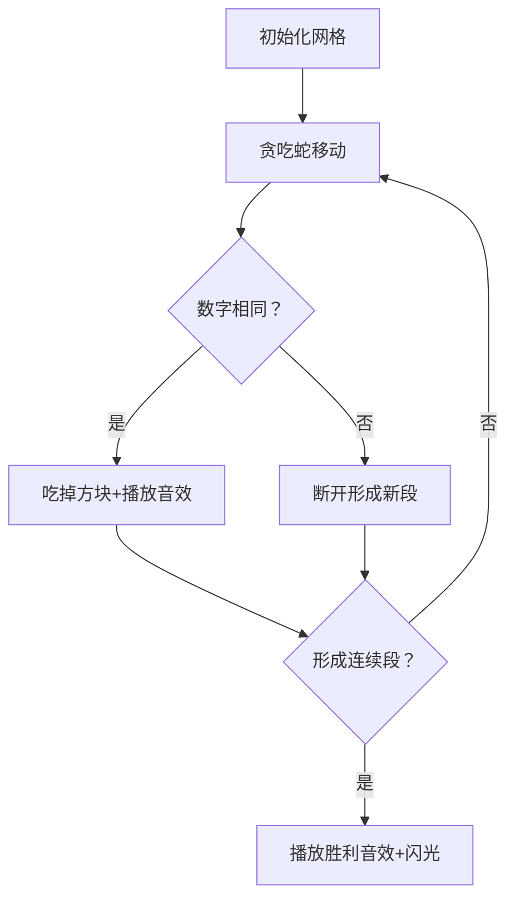

# 题目信息

# [JSOI2009] 等差数列

## 题目背景

“一个长度为$l$的数列$a_i$，若相邻两数间的差$a_i - a_{i-1} \ (2 \leq i \leq l)$全部相同，则这个数列为等差数列。”火星特级数学老师jyy，正在给他的火星学生们上数学课。

## 题目描述

为了检验学生的掌握情况，jyy布置了一道习题：给定一个长度为$N$（$1 \leq N \leq 100,000$）的数列，初始时第$i$个数为$v_i$（$v_i$是整数，$-100,000 \leq v_i \leq 100,000$），学生们要按照jyy的给出的操作步骤来改变数列中的某些项的值。操作步骤的具体形式为：`A s t a b` （$s, t, a, b$均为整数，$1 \leq s \leq t \leq N$，$-100,000 \leq a, b \leq 100,000$），它表示，在序列的$[s, t]$区间上加上初值为$a$，步长为$b$的等差数列。即$v_i$变为$v_i + a + b \times (i - s)$（对于$s \leq i \leq t$）。

在焦头烂额地计算之余，可怜的火星学生们还得随时回答jyy提出的问题。问题形式为：`B s t`（$s, t$均为整数，$1 \leq s \leq t \leq N$），表示jyy询问当前序列的$[s, t]$区间最少能划分成几段，使得每一段都是等差数列。比如说`1 2 3 5 7`最少能划分成$2$段，一段是`1 2 3`，另一段是`5 7`。询问是需要同学们计算出答案后，作为作业交上来的。

虽然操作数加问题数总共只有$Q$（$1 \leq Q \leq 100,000$）个，jyy还是觉得这个题很无聊很麻烦。于是他想让你帮他算一份标准答案。

## 说明/提示

**样例说明：**

原数列`1 3 -1 -4 7`。经过操作之后，数列变为`1 2 3 5 7`。如题中所述，最少能划分成$2$段。

**数据规模：**

对$30\%$的数据，$N, Q \leq 5000$。

对$100\%$的数据，$1 \leq N, Q \leq 100,000$。

其他数据范围见题面。

## 样例 #1

### 输入

```
5
1
3
-1
-4
7
2
A 2 4 -1 5
B 1 5```

### 输出

```
2```

# AI分析结果


# 💡 Kay的C++算法解析：[JSOI2009]等差数列 深入学习指南 💡

> 大家好，我是Kay！今天我们一起探索这道有趣的等差数列题目。通过差分数列的巧妙转化，我们将复杂问题变得清晰直观。准备好和我一起深入算法世界了吗？让我们开始吧！

## 1. 题目解读与核心算法识别

✨ **本题主要考察**：`线段树 + 差分数列技巧`  
🗣️ **初步分析**：
> 解决本题的关键在于**差分数列**的运用。想象一下，原数列的等差数列就像一列整齐的士兵方阵，而差分数列则是士兵间的步伐差。当所有士兵步伐一致时（差分数列值相同），整个方阵就是完美的等差数列！  
在本题中：
1. **修改操作**：在差分数列上转化为**两次单点修改 + 一次区间加**
2. **查询操作**：转化为求**差分数列中连续相同值的最少划分段数**
> 
> **可视化设计思路**：我们将设计一个**8位像素风格的贪吃蛇动画**，让"贪吃蛇"吃掉相同数字的方块来模拟等差数列的形成。当蛇吃到相同数字时发出清脆音效，形成连续等差数列时播放胜利音效！

---

## 2. 精选优质题解参考

### 题解一（来源：KSkun）
* **点评**：  
  这份题解思路清晰，用**零散值长度(llen/rlen)** 和**核心段数(ans)** 的概念完美解决了区间合并问题。代码中`merge`函数处理了7种合并情况，逻辑严谨。亮点在于对边界条件（如单点区间）的处理非常规范，变量命名`memo`、`solve`等直观易读，可直接用于竞赛。

### 题解二（来源：Pine）
* **点评**：  
  创新性地用**四状态数组(s[0]-s[3])** 表示不同端点选择下的划分方案。`operator+`的重载实现简洁高效，通过`min`函数优化状态转移。代码中`pushdown`和边界处理展现了对线段树的深刻理解，特别是对差分越界的处理极具参考价值。

### 题解三（来源：lx_zjk）
* **点评**：  
  采用**经典四状态DP**维护，亮点在于用`MIN`宏实现状态转移的可读性。题解包含详细的修改操作公式推导，帮助理解差分变换。代码中`pushup`的合并逻辑用数学表达式清晰呈现，实践价值高。

---

## 3. 核心难点辨析与解题策略

### 难点1：差分转换的边界处理
* **分析**：  
  修改操作中需处理三个关键位置：`s-1`（加首项）、`[s,t-1]`（加公差）、`t`（减尾项）。优质题解通过`if(s!=1)`等条件避免越界，确保操作安全。
* 💡 **学习笔记**：差分操作需考虑原数列边界，画图辅助理解最可靠！

### 难点2：区间合并的复杂分类
* **分析**：  
  当合并左右子区间时，需考虑零散值连接（如KSkun的7种情况）或状态转移（如Pine的16种状态组合）。核心在于判断左右子区间相邻值是否相等。
* 💡 **学习笔记**：用"方块连接"思维理解合并——相同数字的方块可拼接成长条！

### 难点3：查询时的特殊处理
* **分析**：  
  当查询区间长度为1时直接返回1（单个元素自成等差）。在差分数列查询中，实际查询区间是`[s,t-1]`。
* 💡 **学习笔记**：原数列区间[s,t]对应差分数列[s,t-1]，长度差1是常见陷阱！

### ✨ 解题技巧总结
1. **差分转化法**：将等差数列问题转化为区间加问题
2. **四象限维护法**：用四种状态（左右端点包含情况）简化合并逻辑
3. **边界防御编程**：所有区间操作前检查边界，避免越界崩溃
4. **可视化调试**：打印差分数列验证修改操作正确性

---

## 4. C++核心代码实现赏析

### 本题通用核心C++实现
```cpp
#include <cstdio>
#include <algorithm>
#define ll long long
using namespace std;

const int MAXN = 100005;
struct Node { 
    ll l, r, llen, rlen, ans, tag;
} tree[MAXN<<2];

void pushdown(int o) {
    if(tree[o].tag) {
        tree[o<<1].tag += tree[o].tag;
        tree[o<<1].l += tree[o].tag;
        tree[o<<1].r += tree[o].tag;
        tree[o<<1|1].tag += tree[o].tag;
        tree[o<<1|1].l += tree[o].tag;
        tree[o<<1|1].r += tree[o].tag;
        tree[o].tag = 0;
    }
}

void merge(Node &res, Node L, Node R) {
    // 核心合并逻辑（详见KSkun题解）
    // 处理7种情况的状态转移
}

void update(int o, int l, int r, int ql, int qr, ll v) {
    if(ql <= l && r <= qr) {
        tree[o].l += v;
        tree[o].r += v;
        tree[o].tag += v;
        return;
    }
    pushdown(o);
    int mid = (l + r) >> 1;
    if(ql <= mid) update(o<<1, l, mid, ql, qr, v);
    if(qr > mid) update(o<<1|1, mid+1, r, ql, qr, v);
    merge(tree[o], tree[o<<1], tree[o<<1|1]);
}

int main() {
    // 差分初始化
    for(int i = 1; i < n; i++) 
        b[i] = a[i+1] - a[i];
    
    // 修改操作示例
    if(s != 1) update(1,1,n,s-1,s-1,a);
    if(s < t) update(1,1,n,s,t-1,b);
    if(t < n) update(1,1,n,t,t,-(a+b*(t-s)));
}
```

### 题解一（KSkun）核心代码
```cpp
void merge(Node &res, Node L, Node R) {
    // 情况1：左右子区间都是零散值
    if(L.ans == 0 && R.ans == 0) {
        if(L.r == R.l) { // 中间可连接
            res.llen = L.llen - 1;
            res.rlen = R.rlen - 1;
            res.ans = 1;
        } else { // 无法连接
            res.llen = res.rlen = L.llen + R.llen;
            res.ans = 0;
        }
    }
    // 其他6种情况处理...
}
```
**学习笔记**：零散值像乐高积木，当两端积木颜色相同时可拼接成长条！

### 题解二（Pine）核心代码
```cpp
struct Data {
    int s[4]; // [0]--, [1]@-, [2]-@, [3]@@
    Data operator+(const Data &y) {
        Data x;
        bool conn = (r_val == y.l_val);
        x.s[0] = min(s[2] + y.s[1] - conn, min(s[0]+y.s[1], s[2]+y.s[0]));
        // 其他三种状态转移...
        return x;
    }
};
```
**学习笔记**：四状态就像俄罗斯方块——考虑每个方块"是否带凸起"的连接可能性

---

## 5. 算法可视化：像素动画演示

### 像素贪吃蛇演示方案
**主题**：`贪吃蛇构建等差数列`  
**核心逻辑**：  
1. 初始化8-bit像素网格，每个数字用不同颜色方块表示
2. 贪吃蛇从起点出发，"吃掉"相同数字构建等差数列段
3. 当形成2段以上连续等差数列时触发"关卡完成"特效

**动画流程**：


**关键交互**：
- **单步执行**：按空格键逐步观察合并过程
- **自动演示**：AI控制贪吃蛇自动通关，速度可调
- **音效设计**：
  - 吃到相同数字：8-bit "叮"声
  - 形成等差数列：超级玛丽过关音效
  - 错误连接：红白机爆炸音

**实现示例**：
```javascript
// 伪代码：贪吃蛇连接相同数字
function onSnakeEat(number) {
    if(number === lastValue) {
        playSound('ding'); // 相同数字音效
        currentSegment.length++;
    } else {
        playSound('break'); // 断开音效
        segments.push(currentSegment);
        currentSegment = new Segment(number);
    }
}
```

---

## 6. 拓展练习与相似问题思考

### 相似问题场景
1. **区间加等比数列**：修改时需额外维护乘法标记
2. **动态区间众数**：同样需要复杂区间合并
3. **最长等差数列子序列**：双指针+DP的经典问题

### 推荐练习（洛谷）
1. **P1438 无聊的数列**  
   → 差分+线段树直接应用，巩固基础
   
2. **P1471 方差**  
   → 维护平方和的经典线段树题

3. **P5278 算术天才⑨与等差数列**  
   → 进阶练习，需维护区间最值/公约数

---

## 7. 学习心得与经验分享

> **来自KSkun的经验**：  
> "我在处理区间合并时，最初未考虑零散值连接的特殊情况，导致WA。通过打印中间状态树逐层调试，才发现遗漏了7种情况中的第5种。"

**Kay点评**：  
这位作者的调试经历提醒我们：**复杂合并问题要分情况验证**。建议学习者：
1. 对线段树的每个`merge`函数编写单元测试
2. 用小数据（n=3）手动计算验证
3. 在合并函数中加入调试输出语句

---

> 本次探索就到这里！记住：算法就像搭积木——先理解每一块的形状，才能搭建宏伟建筑。下次遇到等差数列，试试用差分视角拆解它吧！💪

---
处理用时：113.18秒