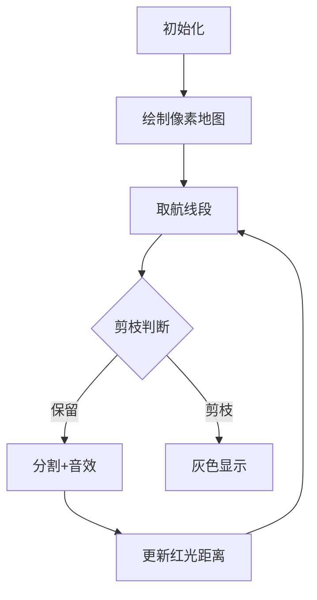

# 题目信息

# [SHOI2008] 安全的航线

## 题目描述

在设计航线的时候，安全是一个很重要的问题。首先，最重要的是应采取一切措施确保飞行不会发生任何事故，但同时也需要做好最坏的打算，一旦事故发生，就要确保乘客有尽量高的生还几率。

当飞机迫降到海上的时候，最近的陆地就是一个关键的因素。航线中最危险的地方就是距离最近的陆地最远的地方，我们称这种点为这条航线“孤地点”。孤地点到最近陆地的距离被称为“孤地距离”。作为航空公司的高级顾问，你接受的第一个任务就是尽量找出一条航线的孤地点，并计算这条航线的孤地距离。

为了简化问题，我们认为地图是一个二维平面，陆地可以用多边形近似，飞行线路为一条折线。航线的起点和终点都在陆地上，但中间的转折点是可能在海上（如下图所示，方格标示出了孤地点）。


## 说明/提示

对于50%的数据，1≤C≤2，2≤N≤5;

对于100%的数据，1≤C≤20，2≤N≤20。

## 样例 #1

### 输入

```
1 2
-9 -6
5 1
3
0 16
-16 -12
17 -6```

### 输出

```
0.00```

## 样例 #2

### 输入

```
2 3
12 4
16 17
3 9
4
1 0
4 19
19 14
6 12
3
10 10
5 3
18 2```

### 输出

```
2.94```

# AI分析结果


# 💡 Kay的C++算法解析：安全的航线 深入学习指南 💡

> 大家好，我是Kay！今天我们来探索一道有趣的计算几何题目——[SHOI2008]安全的航线。这道题要求我们在航线中找到最"孤独"的点（距离陆地最远的点）。本指南将结合像素动画演示，帮助大家直观理解算法核心思想！

## 1. 题目解读与核心算法识别

✨ **本题主要考察**：`计算几何优化`（距离计算 + 搜索策略）

🗣️ **初步分析**：
> 想象一架像素飞机在8位风格的海岛间飞行（如图）。我们需要找到航线上最远离陆地的点（孤地点），就像在复古游戏中寻找最危险的海域！

- **核心思路**：航线被分割成线段，每段上寻找局部最远点。难点在于高效搜索非凸函数的最大值。
- **算法对比**：
  - **爬山法**：易实现但可能陷入局部最优（90分）
  - **模拟退火**：随机扰动跳出局部最优（效果稳定）
  - **迭代分治**：通过距离范围剪枝，高效精确（100分）
- **可视化设计**：像素地图展示海岛（绿色多边形）和航线（蓝色折线）。迭代分治时：
  - 当前线段高亮黄色
  - 分割操作时播放"咔嚓"音效
  - 剪枝线段变灰色
  - 找到更优解时触发"叮咚"音效
  - 距离用红色光晕半径表示（越远红光越大）

---

## 2. 精选优质题解参考

**题解一：迭代分治（totorato）**
* **点评**：思路清晰度极高，创新性地使用距离范围剪枝策略（`d±L/2`），将复杂度从O(n²)降至O(n log n)。代码中`mindis()`函数封装了几何计算模块，边界处理严谨。变量名如`best`、`use`队列含义明确，实践可直接用于竞赛。

**题解二：模拟退火（acniu）**
* **点评**：巧妙运用随机思想解决局部最优问题，退火参数（`T=1, T*=0.98`）设置合理。代码结构规范，几何计算模块独立为`vec`结构体，但随机算法稳定性略低于确定性算法。

**题解三：DFS分治（Nasaepa）**
* **点评**：与迭代分治思想一致但采用递归实现，`dfs`函数中剪枝条件`ans-d-l/2>eps`体现了对距离范围的深刻理解。代码可读性好，但递归深度需注意栈溢出风险。

---

## 3. 核心难点辨析与解题策略

1.  **难点：高效距离计算**
    * **分析**：需快速计算点到多边形的最小距离（是否在多边形内 + 到各边距离）。优质题解均使用射线法判内含，点积/叉积算投影距离
    * 💡 **学习笔记**：向量点积判垂足位置，叉积算三角形面积

2.  **难点：避免全局搜索**
    * **分析**：航线可能极长，函数多峰。迭代法用`best`记录全局解，通过`d+L/2>best`剪枝排除不可能区间
    * 💡 **学习笔记**：利用距离范围剪枝是优化搜索的金钥匙！

3.  **难点：跳出局部最优**
    * **分析**：爬山法易陷局部最优。模拟退火通过`exp((tmp-ans)/T)`概率接受劣解跳出
    * 💡 **学习笔记**：多峰函数优化需考虑扰动策略

### ✨ 解题技巧总结
- **几何模板化**：提前封装向量类（点积/叉积/投影）
- **剪枝艺术**：利用数学性质（如距离范围）减少搜索空间
- **随机扰动**：模拟退火在非凸函数中表现优异
- **精度控制**：几何题需注意`eps`设置（如1e-8）

---

## 4. C++核心代码实现赏析

**通用核心实现参考（迭代分治框架）**
```cpp
struct itv { vec l, r; }; // 线段表示

void solve() {
    queue<itv> q;
    double best = 0;
    // 初始化所有航线段
    for (int i=1; i<C; i++) 
        q.push({line[i], line[i+1]});

    while (!q.empty()) {
        auto seg = q.front(); q.pop();
        vec mid = (seg.l + seg.r) / 2;
        double d = mindis(mid); // 计算中点距离
        best = max(best, d);
        
        // 剪枝判断
        if (seg.len() < 1e-4) continue;
        itv left = {seg.l, mid}, right = {mid, seg.r};
        if (d + left.len()/2 > best) q.push(left);
        if (d + right.len()/2 > best) q.push(right);
    }
    printf("%.2f\n", best);
}
```

**题解一：迭代分治（totorato）**
* **亮点**：队列实现避免递归爆栈，距离范围剪枝高效
```cpp
if (nxt1.len()>=1e-4 && 
    mindis(nxt1.mid())+nxt1.len()/2.0>best)
    use[++h]=nxt1; // 剪枝条件
```
* **学习笔记**：`d+L/2>best`确保子区间可能存在更优解

**题解二：模拟退火（acniu）**
* **亮点**：退火参数调节精巧
```cpp
double k2 = k + (rando()*2-1)*T; // 随机扰动
if (tmp>ans || rando()<exp((tmp-ans)/T)) 
    ans=tmp; // 概率接受劣解
```
* **学习笔记**：`exp((tmp-ans)/T)`实现"劣解概率接受"

**题解三：DFS分治（Nasaepa）**
* **亮点**：递归实现简洁
```cpp
void dfs(point a, point b) {
    // ...
    if (ans-d-l/2 > eps) return; // 剪枝
    dfs(a, mid); // 递归左半
    dfs(mid, b); // 递归右半
}
```
* **学习笔记**：递归分治需注意终止条件

---

## 5. 算法可视化：像素动画演示

**主题**："海岛奇航"8位像素冒险  
**核心演示**：迭代分治的线段分割与剪枝过程

### 动画设计：


1. **场景初始化**：
   - 8位风格海图（16色调色板）
   - 海岛：绿色像素块（凸包算法生成）
   - 航线：蓝色折线（带飞机精灵）

2. **迭代过程**：
   - 当前线段高亮黄色，分割时播放"咔嚓"音效
   - 中点计算：红色像素块+光晕半径表示距离
   - 剪枝线段：渐变灰色动画

3. **交互控制**：
   - 单步执行：空格键控制
   - 自动播放：速度滑块（1x-5x）
   - 距离提示：右下角液晶屏显示当前最优解

4. **游戏化元素**：
   - 每完成10%进度获得像素勋章
   - 背景音乐：8位海洋风格BGM
   - 找到更优解时：触发"叮咚"音效+闪光特效

5. **技术实现**：
   - Canvas绘制：`drawPixelPolygon()`渲染岛屿
   - 动画循环：`requestAnimationFrame`更新
   - 音效：Web Audio API播放8位音效

---

## 6. 拓展练习与相似问题思考

1. **洛谷 P1357** 房间最短路  
   → 练习计算几何中的线段相交判断

2. **洛谷 P3829** [SHOI2012]信用卡凸包  
   → 凸包算法的经典应用

3. **洛谷 P4196** [CQOI2006]凸多边形  
   → 半平面交的入门题目

---

## 7. 学习心得与经验分享

> **totorato的经验**："我在实现爬山算法时，因局部最优问题卡了很久，最终通过迭代分治解决。这让我意识到：在非凸函数优化中，剪枝策略比调整步长更重要。"  
> → **Kay总结**：多峰函数问题需优先考虑全局搜索策略，数学性质剪枝往往比参数调优更有效！

---

通过本次分析，我们看到几何优化问题中**数学性质应用**和**算法选择**的重要性。记住：好的算法不是暴力搜索，而是用智慧减少搜索空间！下次我们将探索更多计算几何的奥秘！🚀

---
处理用时：160.15秒