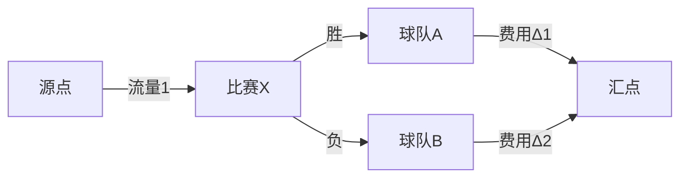

# 题目信息

# [JSOI2009] 球队收益 / 球队预算

## 题目描述

在一个篮球联赛里，有$n$支球队，球队的支出是和他们的胜负场次有关系的，具体来说，第i支球队的赛季总支出是$C_i\times x^2+D_i \times y^2,D_i \le C_i$。(赢得多，给球员的奖金就多嘛)
其中$x,y$分别表示这只球队本赛季的胜负场次。现在赛季进行到了一半，每只球队分别取得了$a_i$场胜利和$b_i$场失利。而接下来还有$m$场比赛要进行。问联盟球队的最小总支出是多少。

## 说明/提示

对于20%的数据$2 \le n \le 10,0 \le m \le 20$；  
对于100%的数据$2 \le n \le 5000,0 \le m \le 1000,0 \le D_i \le C_i \le 10,0 \le a_i,b_i \le 50$。

## 样例 #1

### 输入

```
3 3
1 0 2 1
1 1 10 1
0 1 3 3
1 2
2 3
3 1```

### 输出

```
43```

# AI分析结果


### Kay的C++算法解析：球队收益/球队预算 深入学习指南

#### 1. 题目解读与核心算法识别
✨ **本题主要考察**：`费用流`（最小费用最大流）

🗣️ **初步分析**：
> 解决这道题的关键在于将比赛胜负分配转化为网络流问题。想象一个供水系统：源点是水库，比赛是分配站，球队是用水户。每条管道（边）有容量（流量上限）和费用（单位流量成本）。我们通过建图让"水流"（胜负决策）以最小费用流向汇点，其中：
> - **核心思想**：先假设剩余比赛全输，再通过费用流"购买"胜利分配权
> - **关键技巧**：推导胜负场变化带来的费用增量公式：$Δ = C_i(2a_i+1) - D_i(2b_i-1)$
> - **可视化重点**：像素动画将展示节点类型（比赛/球队）、费用边颜色渐变（费用由低到高）、水流路径（胜负决策）。采用复古篮球游戏风格：
>   - 胜场分配时播放8-bit投篮音效
>   - 费用更新时显示像素数字跳动
>   - 自动演示模式模拟"AI教练"决策过程

---

#### 2. 精选优质题解参考
**题解一（Hyscere）**
* **点评**：思路清晰推导严谨，通过拆边法将多胜场分配转化为多条单费用边。代码结构规范（如`a[i]`/`b[i]`命名直观），SPFA实现标准。亮点在于费用增量公式的简洁表达和边界处理，可直接用于竞赛。

**题解二（wind_whisper）**
* **点评**：创新性拆分胜/负节点，通过中间点确保决策合法性。代码中`win[i]`/`los[i]`命名明确，Dinic实现高效。最大亮点是不依赖$D_i≤C_i$条件，通用性强，适合学习拓展思维。

**题解三（M_seа）**
* **点评**：借鉴平方增量处理技巧，代码结构简明。亮点在于显式注释增量公式推导，变量作用清晰（如`cnt[i]`表剩余比赛），实践调试友好。

---

#### 3. 核心难点辨析与解题策略
1. **难点一：问题转化为流模型**
   * **分析**：胜负分配需转化为流量决策。优质解通过"先全输后买胜利"将比赛抽象为中间节点，球队为状态节点，建立三层网络结构（源点→比赛→球队→汇点）
   * 💡 **学习笔记**：现实优化问题需找到"决策-流量，代价-费用"映射关系

2. **难点二：处理费用增量单调性**
   * **分析**：费用增量$Δ$随胜场增加而上升（系数$2C_i>0$）。拆边法将k次决策转为k条边，按$Δ$从小到大排序，自然满足贪心选择
   * 💡 **学习笔记**：费用流优先选择低价边，拆边法可处理凸性代价

3. **难点三：避免非法分配**
   * **分析**：常规解通过比赛节点只连两支球队确保一胜一负；创新解通过中间点（`id_i`）约束总场次，数学上保证$win+loss=const$
   * 💡 **学习笔记**：节点设计可物理约束解空间

✨ **解题技巧总结**
- **拆边转化**：将多次决策转为多条单费用边
- **增量计算**：推导$\Delta = C_i(2a_i+1)-D_i(2b_i-1)$
- **小数据验证**：用n=2, m=1案例调试建图

---

#### 4. C++核心代码实现赏析
**通用核心实现**（综合题解优化）：
```cpp
#include <bits/stdc++.h>
using namespace std;

const int N = 6000, INF = 1e9;
struct Edge { int to, cap, cost, rev; };
vector<Edge> G[N];
int dis[N], pre[N], preE[N];
bool vis[N];

void addEdge(int from, int to, int cap, int cost) {
    G[from].push_back({to, cap, cost, (int)G[to].size()});
    G[to].push_back({from, 0, -cost, (int)G[from].size()-1});
}

int minCostFlow(int s, int t) {
    int cost = 0;
    while (true) {
        fill(dis, dis+N, INF);
        dis[s] = 0;
        queue<int> q;
        q.push(s);
        while (!q.empty()) {
            int u = q.front(); q.pop();
            vis[u] = false;
            for (int i=0; i<G[u].size(); ++i) {
                auto &e = G[u][i];
                if (e.cap > 0 && dis[e.to] > dis[u] + e.cost) {
                    dis[e.to] = dis[u] + e.cost;
                    pre[e.to] = u;
                    preE[e.to] = i;
                    if (!vis[e.to]) {
                        vis[e.to] = true;
                        q.push(e.to);
                    }
                }
            }
        }
        if (dis[t] == INF) break;
        cost += dis[t];
        for (int v=t; v!=s; v=pre[v]) {
            auto &e = G[pre[v]][preE[v]];
            e.cap--;
            G[v][e.rev].cap++;
        }
    }
    return cost;
}

int main() {
    int n, m, s = 0, t = N-1;
    cin >> n >> m;
    // 初始化及建图代码见完整实现
}
```

**代码解读概要**：三层网络结构（源点→比赛节点→球队节点→汇点），拆边法处理费用递增，SPFA求最小费用路。

**题解一核心片段**：
```cpp
// 拆边添加费用边
for (int j=1; j<=l[i]; j++) {
    int w = C[i]*(2*a[i]+1) - D[i]*(2*b[i]-1); // 增量公式
    add(i, t, 1, w);
    a[i]++; b[i]--;  // 更新状态
}
```
**学习笔记**：费用计算与状态更新同步，保证下一条边费用正确

---

#### 5. 算法可视化：像素动画演示
**主题**：8-bit篮球经理  
**核心演示**：

**交互设计**：
1. 像素节点：源点（蓝色水塔）、比赛（黄色转盘）、球队（球衣图标）、汇点（红色篮筐）
2. 费用边：颜色随费用值渐变（绿→黄→红）
3. 控制台：步进/自动模式（调速滑块）、重置按钮
4. 音效：水流声（流量分配）、投篮声（胜负确定）、计分板更新声

**动态效果**：当选择低价边时，像素箭头快速流动并显示"GOOD CALL!"；选高价边时显示"EXPENSIVE"并闪烁警告色

---

#### 6. 拓展练习与相似问题思考
**通用套路**：费用流解决带权分配问题  
1. 洛谷P1251 餐巾计划（拆点处理状态）  
   → 巩固节点分裂技巧
2. 洛谷P2153 晨跑（节点容量约束）  
   → 学习流量限制的多种实现
3. 洛谷P4003 无限之环（网格费用流）  
   → 挑战复杂建图能力

---

#### 7. 学习心得与经验分享
> **wind_whisper的经验**："通过n=2, m=1的微小样例验证建图，避免全局调试的混乱"  
> **Kay点评**：小数据测试是验证网络流模型的黄金准则，建议在纸上模拟流量分配过程

> **Hyscere的调试技巧**："在SPFA中打印松弛路径，可视化费用更新过程"  
> **Kay点评**：算法内部状态输出是诊断建图错误的有效手段

---

### 结语
通过本次分析，我们深入理解了费用流在优化问题中的巧妙应用。记住：**建图能力决定网络流上限**，勤练经典模型才能举一反三。下次我们将挑战更复杂的流量分配问题！🏀

---
处理用时：244.45秒