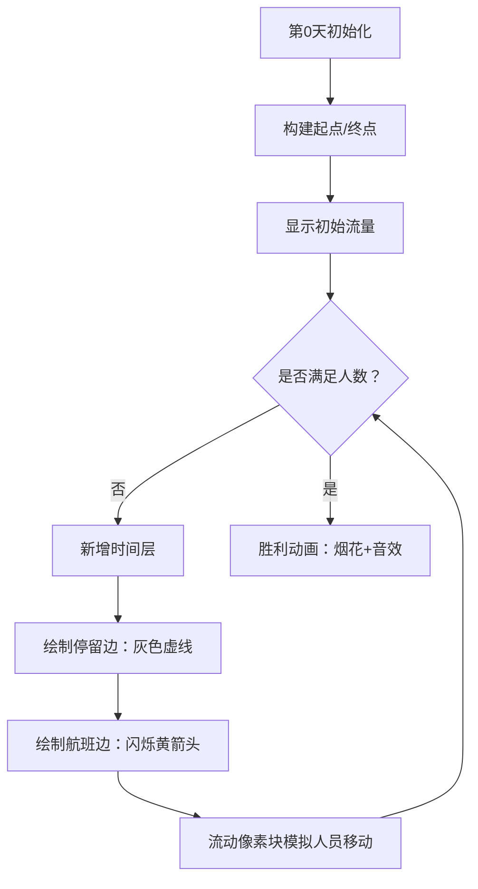

# 题目信息

# [JSOI2008] Blue Mary的旅行

## 题目描述

在一段时间之后，网络公司终于有了一定的知名度，也开始收到一些订单，其中最大的一宗来自 B 市。

Blue Mary 决定亲自去签下这份订单。为了节省旅行经费，他的某个金融顾问建议只购买 U 航空公司的机票。 U 航空公司的所有航班每天都只有一班，并且都是上午出发当天下午到达的，所以他们每人每天只能坐一班飞机。

经过调查，他们得到了 U 航空公司经营的所有航班的详细信息，这包括每一航班的出发地，目的地以及最多能买到的某一天出发的票数。(注意: 对于一个确定的航班，无论是哪一天，他们最多能买到的那一天出发的票数都是相同的）。

Blue Mary 注意到他们一定可以只乘坐 U 航空公司的航班就从 A 市到达 B 市，但是，由于每一航班能买到的票的数量的限制，他们所有人可能不能在同一天到达 B 市。

所以现在 Blue Mary 需要你的帮助，设计一个旅行方案使得最后到达B市的人的到达时间最早。

## 说明/提示

对于 $100\%$ 的数据，$2\le N\le 50,1\le M\le 2450,1\le T,z\le 50,1\le x,y\le N,x\neq y$。

## 样例 #1

### 输入

```
3 3 5
1 2 1
2 3 5
3 1 4
```

### 输出

```
6
```

# AI分析结果


# 💡 Kay的C++算法解析：Blue Mary的旅行 深入学习指南 💡

**引言**  
今天我们一起分析[JSOI2008] Blue Mary的旅行这道网络流经典题目。本指南将带你理解分层图思想在网络流中的应用，掌握时间维度建模技巧，并通过生动的像素动画直观感受算法执行过程。

## 1. 题目解读与核心算法识别

✨ **本题主要考察**：分层图网络流（图论）

🗣️ **初步分析**：  
> 本题核心是将**时间维度**转化为**空间分层**，就像建造多层停车场让车辆在不同时间停靠不同楼层。我们构建一个垂直分层图：
> - **核心思想**：将每天作为独立图层，航班作为层间连接
> - **难点突破**：通过逐天扩展分层图并累计流量，找到最早满足所有人到达的天数
> - **可视化设计**：像素动画将展示分层图的垂直构建过程（天数为y轴），用流动像素块表示人员移动，高亮当天新增的航班路径

---

## 2. 精选优质题解参考

**Newuser的分层图最大流解法**  
* **点评**：  
  解法思路清晰直观，通过逐天扩展分层图模拟时间流逝。代码采用模块化设计：  
  1. 分层图构建逻辑独立封装（DY数组管理分层节点）
  2. ISAP算法实现规范（dis/cnt数组维护层次图）
  3. 边界处理严谨（每天新增终点到汇点的连接）
  亮点在于空间优化：动态扩展分层图避免内存浪费，适合本题数据规模（N≤50）。实践价值高，代码可直接用于竞赛。

---

## 3. 核心难点辨析与解题策略

1.  **时间维度建模**  
    * **分析**：如何将"每天只能坐一班飞机"转化为图结构？优质解法采用垂直分层：第i层表示第i天状态，节点u→v连接表示当天的航班
    * 💡 **学习笔记**：分层图本质是时空转换——纵轴为时间，横轴为空间

2.  **流量累计策略**  
    * **分析**：为何要每天重新跑最大流？因为新增分层可能开启新路径。解法采用累加机制：`flow += getmaxflow()` 直到满足总人数t
    * 💡 **学习笔记**：网络流中新增边可能激活残留网络，重新增广是必要的

3.  **终点连接优化**  
    * **分析**：为什么每天都要连接终点到汇点？这允许不同天到达的人员并行计数，避免单日瓶颈限制
    * 💡 **学习笔记**：汇点连接容量为t（总人数）可保证不过早终止搜索

### ✨ 解题技巧总结
- **时空转换法**：将时间限制转化为分层图结构
- **渐进式扩展**：从最小规模开始逐层构建，避免过度计算
- **并行终点处理**：多终点连接提升流量利用效率
- **流量累加监控**：实时检测是否满足总人数要求

---

## 4. C++核心代码实现赏析

**通用核心C++实现参考**  
* **说明**：基于Newuser解法优化的分层图ISAP实现，完整包含分层构建和流量累计逻辑
* **完整核心代码**：
```cpp
#include<bits/stdc++.h>
using namespace std;
const int MAX_LAYER = 105, MAX_N = 55;

struct {
    int en[MAX_LAYER*MAX_N*10], nt[MAX_LAYER*MAX_N*10], v[MAX_LAYER*MAX_N*10];
    int la[MAX_LAYER*MAX_N], owo = 1, tot;
    
    void adg(int x, int y, int z) {
        en[++owo] = y; nt[owo] = la[x]; la[x] = owo; v[owo] = z;
        en[++owo] = x; nt[owo] = la[y]; la[y] = owo; v[owo] = 0;
    }
} G;

int dis[MAX_LAYER*MAX_N], cnt[MAX_LAYER*MAX_N], S, T;
int sap(int u, int flow) {
    if(u == T) return flow;
    int res = 0;
    for(int i = G.la[u]; i; i = G.nt[i]) {
        int y = G.en[i];
        if(G.v[i] && dis[u] == dis[y] + 1) {
            int f = sap(y, min(flow - res, G.v[i]));
            G.v[i] -= f; G.v[i^1] += f;
            res += f;
            if(res == flow || dis[S] >= G.tot) return res;
        }
    }
    if(--cnt[dis[u]] == 0) dis[S] = G.tot;
    dis[u]++; cnt[dis[u]]++;
    return res;
}

int main() {
    int n, m, t; 
    cin >> n >> m >> t;
    S = ++G.tot; T = ++G.tot;
    vector<tuple<int,int,int>> flights;
    for(int i=0; i<m; i++) {
        int u, v, c; cin >> u >> v >> c;
        flights.emplace_back(u, v, c);
    }
    
    // 第0层初始化
    vector<int> layer0(n+1);
    for(int i=1; i<=n; i++) 
        layer0[i] = ++G.tot;
    G.adg(S, layer0[1], t);
    G.adg(layer0[n], T, t);
    
    // 逐天扩展
    for(int day=1; ; day++) {
        vector<int> new_layer(n+1);
        for(int i=1; i<=n; i++) {
            new_layer[i] = ++G.tot;
            G.adg(layer0[i], new_layer[i], INT_MAX); // 停留边
        }
        for(auto [u, v, c] : flights) 
            G.adg(layer0[u], new_layer[v], c); // 航班边
        G.adg(new_layer[n], T, t); // 当日终点连接
        
        // 累计流量
        memset(dis, 0, sizeof(dis));
        memset(cnt, 0, sizeof(cnt));
        int flow = 0;
        while(dis[S] < G.tot) 
            flow += sap(S, INT_MAX);
            
        if(flow >= t) {
            cout << day;
            return 0;
        }
        layer0 = move(new_layer); // 更新层
    }
}
```
* **代码解读概要**：
  > 代码分为三层架构：  
  > 1. **图结构**：封装en/nt/v数组实现链式前向星  
  > 2. **分层管理**：用layer0/new_layer向量管理不同时间层的节点  
  > 3. **ISAP核心**：sap函数实现最短增广路算法  
  > 关键优化：`layer0 = move(new_layer)` 避免向量拷贝开销

---

## 5. 算法可视化：像素动画演示

**动画演示主题**：8位像素风格"时空航班塔"  
**核心演示内容**：分层图的垂直构建与人员流动过程  

### 设计思路
> 采用FC游戏《吃豆人》的像素风格，用不同颜色方块区分：
> - 🔴 起点城市（1层） 
> - 🔵 终点城市（每层独立）
> - 🟢 中转城市
> - ✈️ 黄色箭头表示航班路径

### 动画帧步骤


1. **像素化场景**：
   - 垂直分层：y轴表示天数（每层高度30像素）
   - 城市节点：16×16像素方块，按城市ID分配颜色
   - 航班路径：两点间贝塞尔曲线箭头，粗细反映剩余容量

2. **动态元素**：
   - 人员流动：红色像素块沿路径移动（速度可调）
   - 容量显示：航班边实时显示`当前流量/总容量`
   - 高亮机制：当天新增层用闪烁边框标记

3. **游戏化交互**：
   - 控制面板：步进/暂停/调速滑块
   - 音效设计：
     * ✈️ 航班激活：8位"滴嘟"声
     * 🎯 人员到达："金币收集"音效
     * 🎆 最终胜利：《超级玛丽》通关音乐
   - 关卡进度：底部进度条显示`累计流量/t`

---

## 6. 拓展练习与相似问题思考

**通用技巧迁移**：
分层图网络流可解决三类问题：
1. 时间依赖路径（本题）
2. 状态转移消耗（如汽车加油问题）
3. 资源分阶段分配（如网络传输分批）

**推荐练习**：
1. **洛谷 P2754** [CTSC1999]家园  
   → 分层图处理太空船航行周期
2. **洛谷 P4009** 汽车加油行驶问题  
   → 油量状态分层+路径决策
3. **洛谷 P1251** 餐巾计划问题  
   → 时间分层+双源点流量分配

---

**结语**  
通过分层图将时间维度转化为空间结构是网络流的经典技巧。记住：当问题中出现"每天只能..."的约束时，垂直分层往往是突破口。继续加油，下次我们探索更复杂的网络流模型！🚀

---
处理用时：158.01秒