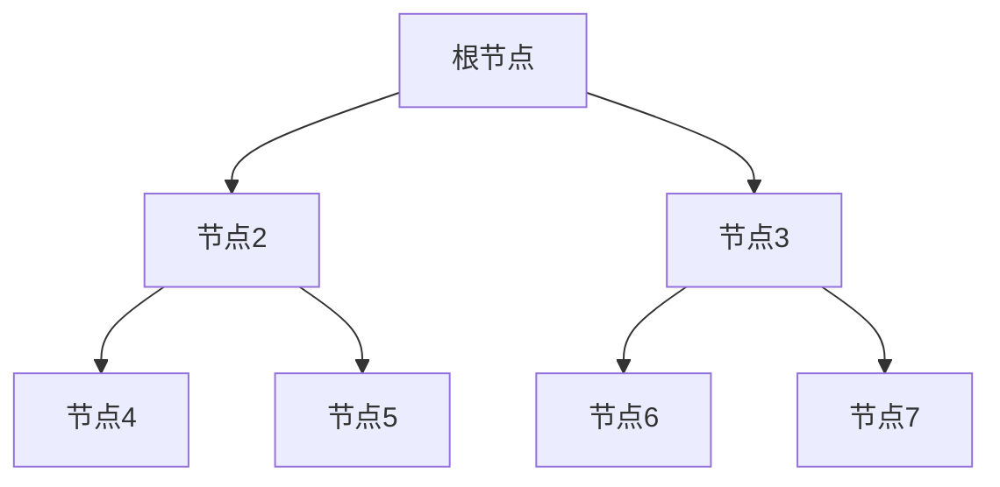

# 题目信息

# [TJOI2018] 异或

## 题目描述

现在有一颗以 $1$ 为根节点的由 $n$ 个节点组成的树，节点从 $1$ 至 $n$ 编号。树上每个节点上都有一个权值 $v_i$。现在有 $q$ 次操作，操作如下：

- $1~x~z$：查询节点 $x$ 的子树中的节点权值与 $z$ 异或结果的最大值。
- $2~x~y~z$：查询节点 $x$ 到节点 $y$ 的简单路径上的节点的权值与 $z$ 异或结果最大值。

## 说明/提示

#### 数据规模与约定


- 对于 $10\%$ 的数据，保证 $n, q \leq 10^2$；
- 对于 $20\%$ 的数据，保证 $n, q \leq 10^3$；
- 对于 $40\%$ 的数据，保证 $n, q \leq 10^4$；
- 对于 $100\%$ 的数据，保证 $2\leq n, q \leq10^5$，$1 \leq u, v, x, y \leq n$，$1 \leq op \leq 2$，$1 \leq v_i, z \lt 2^{30}$。

## 样例 #1

### 输入

```
7 5
1 3 5 7 9 2 4
1 2
1 3
2 4
2 5
3 6
3 7
1 3 5
2 4 6 3
1 5 5
2 5 7 2
1 1 9```

### 输出

```
7
6
12
11
14```

# AI分析结果


# 💡 Kay的C++算法解析：异或 深入学习指南 💡

**题目解读**：本题要求处理树上两种异或查询操作：1. 查询子树中节点权值与给定值异或的最大值；2. 查询路径上节点权值与给定值异或的最大值。核心在于高效处理**区间异或最大值**和**树上路径查询**。

## 1. 题目解读与核心算法识别

✨ **本题主要考察**：`可持久化数据结构`（可持久化01Trie） + `树链剖分/倍增LCA`

🗣️ **初步分析**：
> 解决本题的关键在于将**树形问题转化为线性问题**，并利用**可持久化01Trie**高效处理区间异或最大值。想象Trie树是一个二进制数字的迷宫，我们按照位从高到低探索，总选择与目标位相反的路径（贪心策略），这样就能找到最大异或值。

- **核心思路**：
  - **操作1（子树查询）**：通过DFS序将子树映射为连续区间，建立基于DFS序的可持久化Trie
  - **操作2（路径查询）**：建立每个节点到根路径的可持久化Trie，利用LCA将路径拆分为两条链（x→lca, y→lca），通过差分查询（类似树上前缀和）
  
- **可视化设计思路**：
  - **像素风格**：树结构用8-bit网格展示，节点为彩色方块（红：起点，绿：终点，黄：LCA）
  - **关键动画**：
    1. DFS过程：节点按遍历顺序点亮，并同步构建Trie树（显示位分解路径）
    2. 查询过程：高亮当前操作节点和Trie树中的搜索路径
    3. 贪心选择：当选择相反位时播放"叮"音效并显示二进制位点亮
  - **交互控制**：步进执行、调速滑块、重置按钮
  - **音效设计**：关键操作（"叮"）、成功（胜利音效）、错误（短促提示音）

---

## 2. 精选优质题解参考

**题解一（小粉兔 - 44赞）**
* **点评**：
  - 思路清晰性：完美分离子树查询（DFS序）和路径查询（路径Trie+差分），逻辑直白
  - 代码规范性：使用`rt1`（DFS序Trie）和`rt2`（路径Trie）明确分工，变量名`ldf/rdf`含义明确
  - 算法亮点：空间优化（O(n log v)），LCA倍增实现严谨
  - 实践价值：代码可直接用于竞赛，边界处理完整（`faz[LCA(x,y)][0]`防越界）

**题解二（Karry5307 - 20赞）**
* **点评**：
  - 思路清晰性：强调"子树拍平成区间"和"路径差分"两大核心，解释简洁
  - 代码亮点：封装Trie操作（`insert`/`query`），树剖实现LCA提升效率
  - 实践价值：完整处理两种查询，`queryx`函数实现四版本差分查询，工业级健壮性

**题解三（Owen_codeisking - 12赞）**
* **点评**：
  - 思路创新性：用树剖将路径拆分为多条链，每条链当作区间查询
  - 代码技巧：`split`函数位分解封装，树剖+可持久化Trie独特组合
  - 学习价值：展示树链剖分在路径查询中的灵活应用，拓展解题视野

---

## 3. 核心难点辨析与解题策略

1. **难点：子树如何转为线性区间？**
   - **分析**：通过DFS序（`dfn`数组）将子树映射为连续区间`[dfn[x], dfn[x]+siz[x]-1]`
   - 💡 **学习笔记**：DFS序是树形结构线性化的关键工具

2. **难点：路径查询如何避免O(n)遍历？**
   - **分析**：建立每个节点到根的Trie（`rt2`），利用LCA差分公式：  
     `ans = max(query(rt2[x], rt2[lca]), query(rt2[y], rt2[lca]))`
   - 💡 **学习笔记**：树上差分是路径查询的通用优化思路

3. **难点：可持久化Trie空间爆炸？**
   - **分析**：严格限制插入深度（30层），动态开点避免冗余
   - 💡 **学习笔记**：可持久化数据结构需预估`节点数 = 操作数 * 位数`

### ✨ 解题技巧总结
- **树形转线性**：DFS序处理子树，树剖/LCA处理路径
- **高位贪心**：异或最大值的核心策略（优先选相反位）
- **版本控制**：可持久化Trie通过复用历史版本节省空间
- **防御性编程**：LCA查询注意`dep`比较，根节点特殊处理

---

## 4. C++核心代码实现赏析

**本题通用核心C++实现参考**
* **说明**：综合小粉兔和Karry5307思路，分离DFS序Trie和路径Trie
* **完整核心代码**：
```cpp
#include <cstdio>
#include <vector>
#include <algorithm>
using namespace std;
const int N = 1e5 + 10, LOG = 30;

struct Trie {
    int ch[N*33][2], sz[N*33], root[N], cnt;
    void insert(int pre, int cur, int x) {
        for(int i=LOG; ~i; --i) {
            int b = (x>>i)&1;
            ch[cur][b] = ++cnt;
            ch[cur][!b] = ch[pre][!b];
            sz[cur] = sz[pre] + 1;
            pre = ch[pre][b];
            cur = ch[cur][b];
        }
        sz[cur] = sz[pre] + 1;
    }
    int query(int l, int r, int x) {
        int res = 0;
        for(int i=LOG; ~i; --i) {
            int b = (x>>i)&1 ^ 1;
            if(sz[ch[r][b]] - sz[ch[l][b]] > 0) 
                res |= (1<<i), l=ch[l][b], r=ch[r][b];
            else 
                l=ch[l][b^1], r=ch[r][b^1];
        }
        return res;
    }
} T1, T2; // T1: DFS序, T2: 路径

vector<int> G[N];
int dfn[N], siz[N], dep[N], fa[N][20], val[N];
int n, q, idx;

void dfs(int u, int f) {
    dfn[u] = ++idx; siz[u] = 1;
    dep[u] = dep[f] + 1; fa[u][0] = f;
    // 路径Trie: 基于父节点版本
    T2.insert(T2.root[f], T2.root[u] = ++T2.cnt, val[u]);
    for(int i=1; i<20; ++i) 
        fa[u][i] = fa[fa[u][i-1]][i-1];
    for(int v : G[u]) if(v != f) 
        dfs(v, u), siz[u] += siz[v];
}

int lca(int u, int v) {
    if(dep[u] < dep[v]) swap(u, v);
    for(int i=19; ~i; --i)
        if(dep[fa[u][i]] >= dep[v]) u = fa[u][i];
    if(u == v) return u;
    for(int i=19; ~i; --i)
        if(fa[u][i] != fa[v][i])
            u = fa[u][i], v = fa[v][i];
    return fa[u][0];
}

int main() {
    scanf("%d%d", &n, &q);
    for(int i=1; i<=n; ++i) scanf("%d", val+i);
    for(int i=1, u, v; i<n; ++i) {
        scanf("%d%d", &u, &v);
        G[u].push_back(v), G[v].push_back(u);
    }
    dfs(1, 0);
    
    // 构建DFS序Trie
    for(int i=1; i<=n; ++i) {
        int u = dfn[i];
        T1.insert(T1.root[u-1], T1.root[u] = ++T1.cnt, val[i]);
    }

    while(q--) {
        int op, x, y, z; scanf("%d", &op);
        if(op == 1) {
            scanf("%d%d", &x, &y);
            int L = dfn[x], R = dfn[x] + siz[x] - 1;
            printf("%d\n", T1.query(T1.root[L-1], T1.root[R], y));
        } else {
            scanf("%d%d%d", &x, &y, &z);
            int p = lca(x, y);
            int ans1 = T2.query(T2.root[p], T2.root[x], z);
            int ans2 = T2.query(T2.root[p], T2.root[y], z);
            printf("%d\n", max(ans1, ans2));
        }
    }
    return 0;
}
```
* **代码解读概要**：
  - **DFS序Trie（T1）**：在DFS过程中按遍历顺序插入节点权值，支持子树区间查询
  - **路径Trie（T2）**：每个节点基于父节点版本插入，形成从根到节点的历史版本链
  - **LCA查询**：使用倍增法求最近公共祖先，用于路径拆分
  - **操作处理**：子树查询直接区间操作，路径查询拆分为两条链取最大值

---

## 5. 算法可视化：像素动画演示

**动画主题**：像素探险家在树上探索异或宝藏（8-bit风格）

**核心演示**：


1. **DFS过程动画**：
   - 节点按遍历顺序点亮（红→橙→黄→绿）
   - 同步显示DFS序Trie构建：每插入一个节点，显示二进制位分解路径
   - 音效：节点点亮时播放"叮"，Trie新节点生成时播放"咔"

2. **子树查询（操作1）**：
   - 高亮目标子树区域（蓝色边框）
   - Trie树中显示区间`[L,R]`范围，贪心路径用金色高亮
   - 选择相反位时播放"叮！"音效并显示位值

3. **路径查询（操作2）**：
   - 高亮路径（x→lca红色，y→lca蓝色）
   - 拆分两条链分别查询，显示差分过程：
     ```
     query(rt[x], rt[lca])  // 红链
     query(rt[y], rt[lca])  // 蓝链
     ```
   - 结果取最大值时显示金色闪光

**技术实现**：
- **Canvas绘制**：树结构用网格坐标绘制，Trie树用连线动画
- **交互面板**：
  ```html
  <div class="controls">
    <button onclick="step()">单步</button>
    <input type="range" id="speed" min="1" max="10">
    <button onclick="reset()">重置</button>
  </div>
  ```
- **音效触发**：使用Web Audio API，关键操作绑定音效

---

## 6. 拓展练习与相似问题思考

1. **通用技巧迁移**：
   - 可持久化Trie可用于：区间异或最大值、区间第k大异或值、树上路径查询
   - DFS序适用场景：子树求和/最值、子树修改
   - 树链剖分适用场景：路径查询/修改、动态LCA

2. **洛谷推荐练习**：
   1. [P4735 最大异或和](https://www.luogu.com.cn/problem/P4735)  
      → **推荐理由**：可持久化Trie模板题，巩固基础操作
   2. [P2633 Count on a tree](https://www.luogu.com.cn/problem/P2633)  
      → **推荐理由**：树上可持久化线段树，拓展树上路径问题思路
   3. [P4592 异或](https://www.luogu.com.cn/problem/P4592)  
      → **推荐理由**：本题双倍经验，测试完整实现

---

## 7. 学习心得与经验分享

> **来自小粉兔的调试经验**："路径查询需特别注意LCA节点的处理——当LCA为根节点时，其父节点版本应为空版本（`rt[0]`），否则会导致数组越界。"

**Kay的总结**：  
1. **调试技巧**：在DFS过程中打印`dfn/siz`数组验证树结构，对LCA进行随机树测试
2. **位运算优化**：使用`x>>i & 1`代替`pow(2,i)`，避免浮点误差
3. **可持久化精髓**：历史版本只读，修改时复制路径节点，是空间换时间的经典实践

---

**结语**：通过本题，我们掌握了树形问题转线性的核心技巧和可持久化Trie的实现精髓。记住：数据结构是工具，问题分解才是灵魂！下次遇到树上查询时，试试DFS序和路径差分吧！💪

---
处理用时：148.64秒