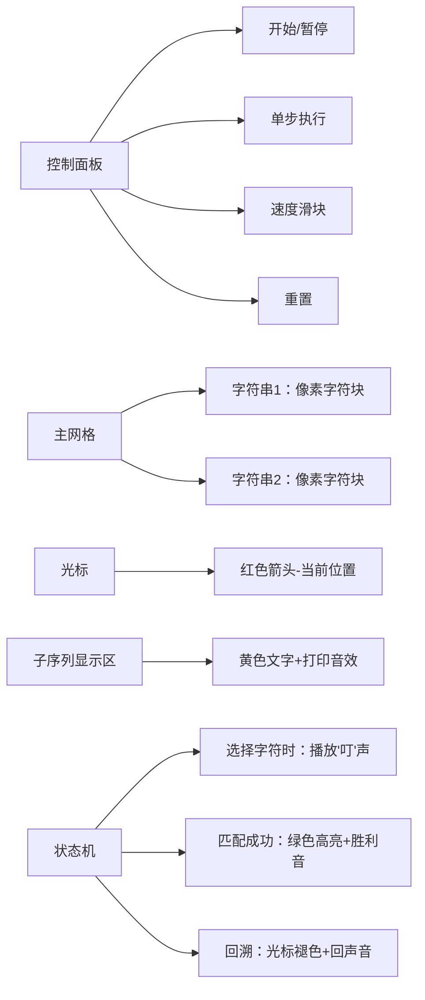

# 题目信息

# [FJOI2016] 所有公共子序列问题

## 题目描述

一个给定序列的子序列是在该序列中删去若干元素后得到的序列。确切地说，若给定序列 $X=x_1x_2\ldots x_m$，则另一序列 $Z=z_1z_2\ldots z_k$ 是 $X$ 的子序列是指存在一个严格递增下标序列 $i_1,i_2, \ldots ,i_k$ 使得对于所有 $j=1,2,…,k$ 有 $z_j=x_{i_j}$。

例如，序列 $Z=$``GACT`` 是序列 $X=$``GCTACT`` 的子序列，相应的递增下标序列为 $1,4,5,6$。给定两个序列 $X$ 和 $Y$，当另一序列 $Z$ 既是 $X$ 的子序列又是 $Y$ 的子序列时，称 $Z$ 是序列 $X$ 和 $Y$ 的公共子序列。例如，若 $X=$``GCTACT``， $Y=$``GATCCT``，序列 $T$ 是 $X$ 和 $Y$ 的一个公共子序列，序列 ``GACT`` 也是 $X$ 和 $Y$ 的一个公共子序列。注意对于任何给定的序列 $X$ 和 $Y$，空序列总是它们的一个公共子序列。

所有公共子序列问题是要求对于给定的 $2$ 个序列 $X=x_1x_2\ldots x_m$ 和 $Y=y_1y_2\ldots y_m$，找出 $X$ 和 $Y$ 的所有不同的公共子序列。

## 说明/提示

$1 \leq m,n \leq 3010$

答案....很大啦

## 样例 #1

### 输入

```
6 6
GCTACT
GATCCT 1```

### 输出

```
A
AC
ACT
AT 
C  
CC 
CCT
CT 
G  
GA 
GAC
GACT
GAT 
GC  
GCC 
GCCT
GCT 
GT  
GTC 
GTCT
GTT 
T   
TC  
TCT 
TT  
26```

# AI分析结果


### 💡 Kay的C++算法解析：所有公共子序列问题 深入学习指南 💡

#### 1. 题目解读与核心算法识别
✨ **本题主要考察**：`序列自动机` + `动态规划` + `高精度计算`

🗣️ **初步分析**：
> 本题要求找出两个字符串的所有公共子序列（包括空序列）。想象一下，序列自动机就像一台"字符导航仪"，它能快速定位字符串中每个字符的后续位置，而动态规划则是"记忆大师"，记录从每个位置出发能形成的子序列数量。解题核心分三步：
> - **序列自动机构建**：从后往前预处理每个位置后各字符首次出现的位置（类似建立字符地图）
> - **DP状态设计**：`f[i][j]`表示从字符串1的i位置和字符串2的j位置开始的公共子序列数
> - **高精度优化**：答案可能极大，需用压位高精（如每9位存一个数）避免内存溢出
> 
> **可视化设计思路**：
> 采用8位像素风网格展示双字符串，两个光标同步移动：
> 1. 初始光标在起点(0,0)，显示空串
> 2. 选择字符时播放"叮"音效，光标跳转到下一个匹配位置
> 3. 形成完整子序列时，字符串高亮闪烁+胜利音效
> 4. 控制面板含步进/自动播放（可调速），回溯时播放回声音效

---

#### 2. 精选优质题解参考
**题解一（枫林晚）**
* **点评**：思路清晰解释了序列自动机原理，完整实现DFS输出和压位高精（每1e9压位）。代码中`nxt`数组构建采用倒序预处理，`dp[i][j].add()`方法封装高精运算，边界处理严谨。亮点在于详细注释自动机构建逻辑，并处理了空串。

**题解二（s_r_f）**
* **点评**：代码最简洁高效，压位高精（每1e18压位）大幅节省空间。核心在`Ne1/Ne2`数组构建和记忆化搜索`dp()`函数，字符映射用`t[]`数组巧妙处理大小写。亮点是空间优化极致，变量名`Ne`(next缩写)简洁明确。

**题解三（Fzrcy）**
* **点评**：结构清晰易读，压位高精（每1e9压位）实现合理。特色在于`ZXLZDJ`结构体封装自动机，`dfs()`和`dp()`分离逻辑。亮点是字符集遍历用`for(int i=0;i<58;i++)`统一处理大小写。

---

#### 3. 核心难点辨析与解题策略
1. **难点：序列自动机的理解与构建**
   * **分析**：需理解倒序预处理原理——从后往前更新每个位置的字符跳转表。例如构建`nxt[i-1][c]`时先继承`nxt[i]`的值，再更新当前字符位置。
   * 💡 **学习笔记**：序列自动机本质是"字符位置索引表"，预处理时间复杂度O(n*|S|)

2. **难点：DP状态转移设计**
   * **分析**：状态转移需遍历所有字符：`f[i][j] = 1 + Σf[nxt1[i][c]][nxt2[j][c]]`。其中"1"代表空串，求和部分统计非空子序列。
   * 💡 **学习笔记**：采用记忆化搜索可避免重复计算，注意递归边界是自动机返回0值

3. **难点：大数存储与运算**
   * **分析**：当n,m≤3010时，状态数超9e6，普通高精会MLE。压位高精通过将数字分组（如9位/组）存储，减少内存占用10倍以上。
   * 💡 **学习笔记**：压位高精核心是处理进位时`a[i+1] += a[i]/BASE`

**✨ 解题技巧总结**
- **自动机倒序预处理**：从后往前更新字符位置表
- **记忆化搜索优化**：避免重复计算DP状态
- **结构化高精封装**：实现`add()/out()`方法提升可读性
- **统一字符映射**：用数组将'A'-'z'映射到0-57简化遍历

---

#### 4. C++核心代码实现赏析
**通用核心实现参考**
```cpp
#include <cstdio>
#include <cstring>
#include <algorithm>
const int N=3010, BASE=1e9;
struct Big{ // 压位高精（每9位）
    int len; long long s[20];
    void init(){ memset(s,0,sizeof(s)); len=0; }
    void add(const Big &b){
        len = std::max(len, b.len);
        for(int i=0;i<=len;++i){
            s[i] += b.s[i];
            if(s[i] >= BASE) s[i+1] += s[i]/BASE, s[i] %= BASE;
        }
        if(s[len+1]) len++;
    }
};
int nxt1[N][58], nxt2[N][58]; // 序列自动机
char s1[N], s2[N];
bool vis[N][N];
Big f[N][N];

void build(int n, char *s, int nxt[][58]){
    memset(nxt[n],0,sizeof(nxt[n]));
    for(int i=n-1;i>=0;--i){ // 倒序预处理
        memcpy(nxt[i], nxt[i+1], sizeof(nxt[i]));
        nxt[i][s[i+1]-'A'] = i+1; // 更新字符位置
    }
}
void dp(int i, int j){
    if(vis[i][j]) return;
    vis[i][j]=true;
    f[i][j].init(); f[i][j].s[0]=1; // 空串计数
    for(int c=0;c<58;++c){
        if(!nxt1[i][c] || !nxt2[j][c]) continue;
        dp(nxt1[i][c], nxt2[j][c]); // 记忆化搜索
        f[i][j].add(f[nxt1[i][c]][nxt2[j][c]]);
    }
}
```

**题解二（s_r_f）片段赏析**
```cpp
// 字符映射：'A'-'Z'→0-25, 'a'-'z'→26-57
int t[256]; 
for(int i=0;i<26;++i) t['A'+i]=i, t['a'+i]=26+i;

// 记忆化搜索核心
void dp(int i,int j){
    if(vis[i][j]) return;
    vis[i][j]=1; f[i][j].init(); f[i][j].add(1);
    for(int c=0;c<58;++c){
        if(Ne1[i][c]&&Ne2[j][c]){
            dp(Ne1[i][c],Ne2[j][c]); 
            f[i][j].add(f[Ne1[i][c]][Ne2[j][c]]);
        }
    }
}
```
> **解读**：`t[]`数组完成字符→数字映射，`Ne1[i][c]`直接获取位置。注意`f[i][j]`初始化包含空串（值为1），递归时累加所有合法字符路径的解  
> 💡 **学习笔记**：58位字符集遍历保证字典序

---

#### 5. 算法可视化：像素动画演示
**主题**：双字符串像素网格同步扫描  
**设计思路**：复古绿色终端风格，模拟DNA序列比对过程  



**关键帧流程**：
1. **初始化**：显示双字符串像素网格（8x16字体），起点光标闪烁
2. **字符选择**：按'A'→'z'顺序扫描，可用字符显示为蓝色
3. **匹配跳转**：选中字符后：
   - 播放按键音效，子序列区追加字符
   - 两个光标同步跳转到下一位置（滑动动画）
4. **结果输出**：每形成子序列时：
   - 子序列区黄色闪烁
   - 播放"胜利"音效（8-bit风格）
5. **自动模式**：AI自动演示DFS过程（速度可调）

---

#### 6. 拓展练习与相似问题
**通用技巧迁移**：序列自动机+DP可解决：
1. 多字符串公共子序列计数
2. 带限制条件的子序列搜索
3. 子序列匹配问题变形

**洛谷推荐**：
1. **P1439** - 最长公共子序列  
   → 巩固序列自动机思想，理解LCS与本题区别
2. **P1819** - 公共子序列计数  
   → 扩展至多字符串场景，练习高精优化
3. **P2516** - 最长公共子序列问题  
   → 学习如何记录具体方案

---

#### 7. 学习心得与经验分享
**参考经验**：  
> 多位作者提到：调试时需特别注意空串计数和字符映射边界，建议用`memcpy`初始化自动机数组避免越界

**点评**：  
> 这些经验凸显两个要点：  
> 1. 空串是合法子序列，初始状态`f[0][0]`必须包含  
> 2. 字符映射需完整覆盖'A'-'z'（58字符），否则会漏解

---

通过本指南，相信大家已掌握序列自动机的核心思想。记住：算法学习就像建造自动机——先打好基础框架，再优化细节结构。下次挑战见！💪

---
处理用时：189.24秒