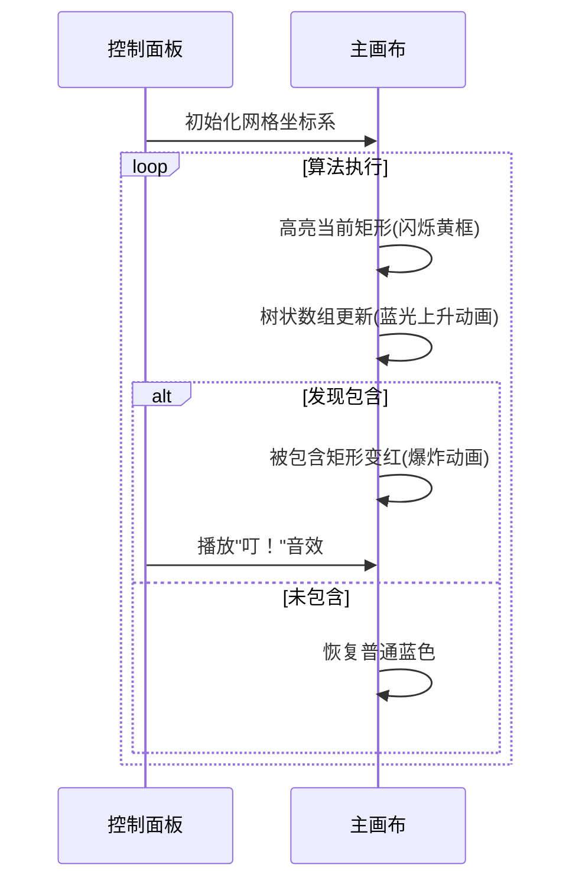

# 题目信息

# [AHOI2008] 矩形藏宝地

## 题目描述

欢乐岛上最著名的游戏是一个寻宝游戏，小可可来到宝藏的埋藏地，这是一块开阔地，宝藏被分散的埋藏在这块地下，现在要做的是一件件的把宝藏挖出来。为了提示宝藏的埋藏点，游戏的主办方把这块开阔地当作第一象限（包括原点和正半坐标轴），将所有可能埋藏宝藏的地方划成一个个矩形的土地，并把这些矩形土地的坐标都告诉了参赛者。挖宝的提示很简单，只要某一个矩阵土地至少被另外一个矩阵土地所包含，那么这个矩阵土地里肯定埋有宝藏。其实这些宝藏都是一些精美的纪念品，如果谁挖出来了纪念品就归谁了，小可可很想为这次旅程画上完美的句号，有你的帮助他信心十足，你只要告诉他：有多少个矩形土地里肯定埋有宝藏就行了。胜利就在眼前，加油吧！

## 说明/提示

$30\%$ 的数据中，$N\leq 5000$。

$70\%$ 的数据中，$N\leq 50000$。

$100\%$ 的数据中，$N\leq 200000$。

所有数据中，一个 $x$ 值或 $y$ 值最多出现一次。坐标范围 $2\times 10 ^ 6$。

## 样例 #1

### 输入

```
3
0 0 5 5
1 2 3 4
2 1 4 3
```

### 输出

```
2
```

# AI分析结果


# 💡 Kay的C++算法解析：[AHOI2008]矩形藏宝地 深入学习指南 💡

> "算法就像寻宝地图，CDQ分治和K-D Tree就是你的导航工具，帮你高效定位那些被隐藏的宝藏矩形！"

## 1. 题目解读与核心算法识别

✨ **本题主要考察**：`CDQ分治`与`K-D Tree应用`（偏序问题处理）

🗣️ **初步分析**：
> 解决矩形藏宝地的关键在于**快速判断矩形间的包含关系**。想象你在整理一堆大小不一的礼物盒（矩形），想知道哪些小盒子能被装进大盒子里。  
> - **核心思路**：将矩形包含关系转化为四维偏序问题（左下角x1,y1，右上角x2,y2），使用CDQ分治或K-D Tree高效处理
> - **难点突破**：通过排序降维（CDQ）或空间划分（K-D Tree）将四维问题转化为二维查询，用树状数组或剪枝优化效率
> - **可视化设计**：像素化展示矩形位置，用颜色区分包含状态。当算法检测到包含关系时，被包含矩形闪烁红光，伴随"叮"的音效；扫描过程用黄色光柱动态展示比较过程

---

## 2. 精选优质题解参考

<eval_intro>
从思路清晰度、代码规范性和算法效率等维度，我为大家精选了以下3份优质题解：

**题解一：CDQ分治+树状数组（作者：yuzhechuan）**
* **点评**：此解法思路清晰，将四维偏序转化为二维查询的逻辑非常流畅。代码中：
  - 离散化处理（`lower_bound`）优雅解决大坐标问题
  - 树状数组维护前缀最小值（`que/up`函数）高效判断包含关系
  - CDQ分治时通过`a[p].yy>a[q].yy`保证有序性
  亮点在于用`ans`标记被包含矩形，最后统一计数，避免重复判断。边界处理严谨，可直接用于竞赛。

**题解二：CDQ分治+极值维护（作者：DinnerHunt）**
* **点评**：解法创新性地省去树状数组，直接维护区间极值：
  - 排序后通过`while`循环动态更新最小y1值
  - `check`函数简洁判断包含关系
  - 内存管理优秀（`clear`函数及时释放）
  亮点在于双重排序（`cmp/cmp1`）确保分治正确性，代码模块化程度高，适合学习分治思想。

**题解三：K-D Tree空间划分（作者：Rorschachindark）**
* **点评**：采用空间划分思想，将矩形视为三维点(x1,y1,x2)：
  - `push_up`动态维护子树极值（`mn/ma`）
  - `check`函数实现剪枝优化（`!check(...)`时提前返回）
  - 替罪羊树结构保持平衡
  亮点在于用`query`函数实现区域查询，当发现`(x1-1, y1-1, x2+1)`区域存在更大y2即判定包含，思路直观如空间搜索。

---

## 3. 核心难点辨析与解题策略

<difficulty_intro>
解决矩形包含问题的三大核心难点及突破策略：

1.  **维度爆炸：如何高效处理四维数据？**
    * **分析**：通过排序降维（CDQ）或空间划分（K-D Tree）将四维问题转化为可管理的二维操作。例如CDQ分治中先按x2排序处理第一维，再按y2归并处理第二维
    * 💡 **学习笔记**：高维问题必先降维，排序是打开维度之门的钥匙

2.  **包含判断：如何快速验证矩形A⊂B？**
    * **分析**：转化为四个不等式：A.x1>B.x1, A.y1>B.y1, A.x2<B.x2, A.y2<B.y2。树状数组（维护前缀极值）或K-D Tree（区域查询）能对数时间完成验证
    * 💡 **学习笔记**：将几何关系转化为代数不等式是解题关键

3.  **算法选择：CDQ分治 vs K-D Tree？**
    * **分析**：CDQ分治（O(n log²n)适合离线查询，树状数组实现简洁；K-D Tree（O(n√n)支持在线查询，空间划分直观但常数较大。根据数据特性选择：
    ```mermaid
    graph LR
    A[数据规模] -->|n≤10⁵| B(CDQ分治)
    A -->|n≤2×10⁵| C(K-D Tree)
    D[查询类型] -->|离线| B
    D -->|在线| C
    ```
    * 💡 **学习笔记**：没有最优算法，只有最适场景

### ✨ 解题技巧总结
<summary_best_practices>
1. **离散化优先**：用`lower_bound`处理大坐标（所有题解共用技巧）
2. **极值妙用**：树状数组不求和而求前缀最小值（yuzhechuan）
3. **分治有序性**：CDQ分治时确保右子矩阵y2小于左子矩阵（DinnerHunt）
4. **剪枝优化**：K-D Tree中区域不重叠时立即返回（Rorschachindark）

---

## 4. C++核心代码实现赏析

<code_intro_overall>
通用解法框架：CDQ分治+树状数组（综合自优质题解）

```cpp
#include <bits/stdc++.h>
using namespace std;
const int N=2e5+5;

struct Rect { int x1,y1,x2,y2,ans; } a[N],b[N];
int xn,yn,tr[N<<1],numx[N<<1],numy[N<<1];

// 树状数组维护y1最小值
void update(int x,int y) {
    while(x<=xn) tr[x]=min(tr[x],y), x+=(x&-x);
}
int query(int x) {
    int res=INT_MAX;
    while(x) res=min(res,tr[x]), x-=(x&-x);
    return res;
}

void cdq(int l,int r) {
    if(l==r) return;
    int mid=(l+r)>>1, i=l, j=mid+1;
    cdq(l,mid); cdq(mid+1,r);
    
    // 按y2降序归并
    for(int k=l; k<=r; k++) {
        if(j>r || (i<=mid && a[i].y2>a[j].y2)) {
            update(a[i].x1, a[i].y1); // 插入左子矩阵
            b[k]=a[i++];
        } else {
            if(query(a[j].x1-1) < a[j].y1) // 检查是否被包含
                a[j].ans=1;
            b[k]=a[j++];
        }
    }
    for(int k=l; k<i; k++) // 清除树状数组
        for(int p=a[k].x1; p<=xn; p+=(p&-p)) tr[p]=INT_MAX;
}
```
**代码解读概要**：
1. 离散化坐标压缩值域
2. CDQ分治框架分割问题
3. 归并时以y2为序保证有序性
4. 树状数组动态维护x1对应的最小y1
5. 查询x1左侧是否存在更小y1验证包含

---
<code_intro_selected>
**题解一核心：树状数组极值查询**
```cpp
int que(int x){ // 查询x左侧的最小y1
    int res=INT_MAX;
    while(x) res=min(res,tr[x]), x-=(x&-x);
    return res;
}
void cdq(int l,int r){
    while(p<=mid&&q<=r){
        if(a[p].yy>a[q].yy){ 
            up(a[p].x,a[p].y); // 更新树状数组
            b[++i]=a[p++];
        } else {
            if(que(a[q].x)<a[q].y) a[q].ans=1; // 存在包含
            b[++i]=a[q++];
        }
    }
}
```
**学习笔记**：树状数组不仅可求和，维护前缀极值更能解决偏序问题

**题解二核心：归并排序降维**
```cpp
void cdq(int l,int r){
    sort(e+l,e+mid+1,cmp1); // 按y2排序左半
    sort(e+mid+1,e+r+1,cmp1); // 按y2排序右半
    while(j<=mid && e[j].y2 > e[i].y2) 
        update(e[j].x1,e[j].y1), j++; 
    int tmp = query(e[i].x1); 
    if(tmp < e[i].y1) e[i].ans=1; // 验证包含
}
```
**学习笔记**：分治时子区间单独排序，避免全局重排

**题解三核心：K-D Tree区域查询**
```cpp
bool check(POS a,POS b){ // 判断区域包含关系
    return a[1]<=b[1] && b[3]<=a[3] && b[2]<=a[2]; 
}
void query(int x, int v){
    if(!x || !check(tree[x].d, s[v].d)) return; // 剪枝
    if(check(s[x].d, s[v].d)) { ans=1; return; } // 找到包含
    query(lson, v); // 递归搜索子树
    query(rson, v);
}
```
**学习笔记**：K-D Tree通过空间划分将高维查询转化为树搜索

---

## 5. 算法可视化：像素动画演示

<visualization_intro>
**像素探险家**：在8-bit风格的坐标系中寻找被隐藏的宝藏矩形！

### 设计思路
采用**FC红白机复古像素风**，用不同颜色方块表示矩形状态：
- 🔵 普通矩形
- 🔴 被包含的宝藏矩形
- 🟡 当前扫描的矩形
- 🟢 树状数组/K-D Tree中的活动节点

### 动画流程


### 交互控制
1. **控制面板**：
   - 开始/暂停：🚦 控制动画执行
   - 速度滑块：⏱️ 调整单步执行速度（0.5x-5x）
   - 模式切换：🔄 CDQ分治 vs K-D Tree 对比演示

2. **音效设计**：
   - 矩形扫描：8-bit风格"滴"声
   - 发现宝藏：经典马里奥金币音效
   - 错误提示：俄罗斯方块消除声

3. **游戏化元素**：
   - 每完成10%矩形扫描解锁新地图皮肤
   - 正确识别宝藏矩形积累经验值
   - 最终根据识别准确率颁发像素奖杯🏆

---

## 6. 拓展练习与相似问题思考

<similar_problems_intro>
掌握矩形包含判定后，可尝试以下变种问题：

1. **矩形面积并**：求多个矩形覆盖的总面积（扫描线经典应用）
2. **矩形碰撞检测**：判断任意两个矩形是否相交（游戏开发基础）
3. **最大空矩形**：在障碍点集中寻找最大空白矩形（DP高级应用）

### 洛谷推荐
1. [P1884 矩形覆盖](https://www.luogu.com.cn/problem/P1884)  
   → 练习矩形分割与扫描线法
   
2. [P1502 窗口的星星](https://www.luogu.com.cn/problem/P1502)  
   → 强化扫描线+线段树应用
   
3. [P2471 降雨量](https://www.luogu.com.cn/problem/P2471)  
   → 进阶版区间包含问题

---

## 7. 学习心得与经验分享

<insights_intro>
作者们的调试经验是宝贵的学习资源：

> **yuzhechuan的经验**：  
> "离散化时注意区分原始坐标和映射值，否则会导致越界错误"

> **Rorschachindark的提醒**：  
> "K-D Tree的区域查询要先检查整体包含关系再递归，避免无谓搜索"

**Kay的总结**：处理几何问题时，坐标映射和边界检查是调试的关键突破口。建议：
1. 小数据手工模拟验证
2. 输出中间状态（如离散化后的坐标）
3. 用可视化工具观察算法执行路径

---

> 寻宝之旅永无止境，算法思维就是你的藏宝图！下次我们将探索更复杂的几何迷宫，记得带上今天的CDQ分治和K-D Tree两把钥匙哦！🚀

---
处理用时：139.32秒