# 题目信息

# [JSOI2012] 越狱老虎桥

## 题目背景

这里，是美丽的南京；这里，是秀美的进香河；这里是安逸的老虎桥。 

如果说进香河的美，美在其秀美的风光，倒不如说是美在了那惬意的南京古典小巷式生活。如果说进香河的迷人，在其淳朴的民风，倒不如说是那被历史掩埋了的秘密吸引着人们好奇的心。 

也许很多人都还记得，老虎桥监狱，北洋时期江南最大的监狱，在近一个世纪中，面对满清、北洋、民国、新中国几朝兴衰，名称屡次更替，沧桑尽显其中。 

现在的人们，恐怕很难相信，到底有多少惊心动魄的事情曾经就在这里上演。 

## 题目描述

那是$1948$年的冬天，南京地下组织的一支小分队决定偷袭老虎桥监狱，救出被困的数百名人员。那时的老虎桥监狱，被$N$层电网围了起来，由内而外，依次编号为$1$,$2$,$\dots$,$N$。第$1$层电网接有高压电。有$M$条高压线，连接了所有电网，其中第$i$条高压线连接了第$a_i$和$b_i$层电网，如果要破坏第$i$条高压线，需要至少动用$T_i$位特工。面对这么多层电网，偷袭小分队犯愁了。至少需要破坏一层电网，否则是无法偷袭成功的。
 
然而，狡猾的间谍却知道了这件事情，为了破坏偷袭计划，敌人秘密地又增加了一条高压线，不让偷袭小分队的成员发现。 

为了能够偷袭成功，不论新增的这一条秘密高压线是连接哪两层电网的，小分队都必须要破坏且仅破坏一条高压线，使得至少有一层电网不通电。注意，对于新增的高压线，我们并不知道需要多少位特工才能成功破坏。现在的问题是，偷袭小分队至少需要多少名特工呢？
 
决战就在今夜！

## 说明/提示

对于$30\%$的数据，$N \leq 200$，$M \leq 250$。

对于$70\%$的数据，$N \leq 50000$，$M \leq 100000$。

对于$100\%$的数据，$N \leq 500000$，$M \leq 1000000$，$T \leq 100000$。

对于第二组样例，新增的高压线只有可能出现在$2$和$3$，$2$和$4$或$3$和$4$之间。

如果出现在了$2$和$3$之间，则只能破坏$1$和$4$之间的高压线；如果出现在$2$和$4$之间，则只能破坏$1$和$3$之间的高压线；如果出现在$3$和$4$之间，则只能破坏$1$和$2$之间的高压线。

所以，至少需要出动$3$位特工，才能应付所有可能情况。

## 样例 #1

### 输入

```
3 2
1 2 1
2 3 2```

### 输出

```
-1```

## 样例 #2

### 输入

```
4 3
1 2 1
1 3 2
1 4 3```

### 输出

```
3```

# AI分析结果


# 💡 Kay的C++算法解析：越狱老虎桥 深入学习指南 💡

> **Kay的话**：今天我们来分析一道结合图论与贪心思维的难题——「越狱老虎桥」。这道题需要我们在动态变化的图中找到关键边，我会用清晰的语言和生动的比喻帮你理解核心思想。准备好进入算法世界了吗？让我们开始吧！

## 1. 题目解读与核心算法识别

✨ **本题主要考察**：`边双连通分量缩点` + `树上贪心路径维护`

🗣️ **初步分析**：
> 想象电网系统如同一个复杂的电路板，边双连通分量就像焊接在一起的电路模块（内部电流互通），而桥则是连接模块的保险丝。敌人新增的高压线相当于在电路板上临时跳线，会形成新的电流环路。我们的任务是找到最关键的保险丝（权值最小），即使敌人新增跳线，切断它也能让某个模块断电。

- **核心思路**：通过边双缩点将图转化为树结构（模块化），按权值从小到大检查每条保险丝（桥）。维护一条覆盖路径（敌人新增边形成的环路），当某条保险丝无法被路径覆盖时，其权值即为答案。
- **可视化设计**：在像素动画中，用不同颜色方块表示边双模块，闪烁红线表示关键保险丝。路径维护过程如同贪吃蛇吃豆子，新边加入时蛇身延伸，冲突时触发警报音效。
- **复古游戏化**：采用8位像素风格，保险丝权值显示为分数，路径覆盖过程设计为「电流连通」小游戏，成功覆盖时播放FC风格胜利音效。

---

## 2. 精选优质题解参考

> Kay为你精选了思路最清晰的解法（评分≥4★），帮你避开学习弯路：

**题解一（作者：lenlen，赞22）**  
* **亮点**：  
  - 思路直击本质：边双缩点 → 建树 → 贪心维护路径  
  - 代码规范：`ecc[]`标记边双，`dis[]`记录路径，变量名清晰  
  - 巧妙优化：暴力跳父亲均摊O(n)，比倍增LCA更高效  
  - 实践价值：直接处理50万数据，边界严谨（根节点特判）

**题解二（作者：EnofTaiPeople，赞10）**  
* **亮点**：  
  - 独创性：用bitset优化访问标记，类似并查集路径压缩  
  - 效率突出：每个点只访问一次，严格O(n)复杂度  
  - 深度洞察：指出LCT可解但暴力更优，体现实用思维  

**题解三（作者：EternalHeart1314，赞5）**  
* **亮点**：  
  - 教学友好：DFS序判断子树关系，逻辑可视化强  
  - 结构清晰：独立`Tree`类封装树操作，易扩展  
  - 安全处理：显式避免重边，缩点后显式建树  

> **Kay总结**：优先学习lenlen的解法，其平衡了效率与可读性。EnofTaiPeople的bitset技巧和EternalHeart1314的DFS序都是值得掌握的进阶技巧。

---

## 3. 核心难点辨析与解题策略

### 难点1：理解边双缩点的必要性
> **问题**：为何非桥边不影响结果？  
> **分析**：边双内部存在多条路径，删单边不改变连通性。缩点将图简化为树，树上边才是关键桥。  
> 💡 **学习笔记**：边双缩点是图转树的黄金法则，化繁为简！

### 难点2：维护动态覆盖路径
> **问题**：如何确定新增边形成的环路？  
> **分析**：类比拼图——当前路径是已拼好的部分，新边需能延伸路径（端点相邻）或完全嵌入。冲突即失败。  
> 💡 **学习笔记**：维护路径端点(L,R)，新边端点必须与L/R连通且不破坏线性结构。

### 难点3：高效判断路径包含关系
> **问题**：如何快速判断边是否在路径上？  
> **分析**：两种主流方案：  
> 1. **暴力跳父亲**（lenlen）：从深度大端点向上跳，均摊O(1)  
> 2. **DFS序判断**（EternalHeart）：`dfn[u]≤dfn[v]≤dfn[u]+siz[u]-1`  
> 💡 **学习笔记**：50万数据优选暴力跳父亲，代码更简洁。

### ✨ 解题技巧总结
- **拆解复杂问题**：图 → 树 → 链 （层层转化）
- **贪心排序**：按桥权值升序处理，保证最小代价
- **模块化编码**：Tarjan、缩点、建树、维护路径解耦
- **边界防御**：根节点特殊处理（可能多子树）

---

## 4. C++核心代码实现赏析

### 通用核心实现（基于lenlen解法优化）
```cpp
#include <bits/stdc++.h>
using namespace std;
const int N = 1e6 + 5;

struct Edge { int u, v, w; };
vector<Edge> edges;
vector<int> graph[N];
int dfn[N], low[N], ecc[N], fa[N], dep[N];
bitset<N> is_bridge; // 标记桥边
int cnt, bcc_cnt;

// Tarjan求桥
void tarjan(int u, int parent) {
    static int time = 0;
    dfn[u] = low[u] = ++time;
    for (int eid : graph[u]) {
        auto &e = edges[eid];
        int v = e.v;
        if (v == parent) continue;
        if (!dfn[v]) {
            tarjan(v, u);
            low[u] = min(low[u], low[v]);
            if (low[v] > dfn[u]) 
                is_bridge[eid] = is_bridge[eid^1] = true;
        } else {
            low[u] = min(low[u], dfn[v]);
        }
    }
}

// 边双缩点
void dfs_ecc(int u, int comp) {
    ecc[u] = comp;
    for (int eid : graph[u]) {
        if (is_bridge[eid]) continue;
        int v = edges[eid].v;
        if (!ecc[v]) dfs_ecc(v, comp);
    }
}

int main() {
    int n, m; cin >> n >> m;
    edges.resize(2*m+2);
    for (int i=0; i<m; ++i) {
        int u, v, w; cin >> u >> v >> w;
        graph[u].push_back(2*i);
        graph[v].push_back(2*i+1);
        edges[2*i] = {u, v, w};
        edges[2*i+1] = {v, u, w};
    }

    // 求桥并缩点
    tarjan(1, 0);
    for (int i=1; i<=n; ++i)
        if (!ecc[i]) dfs_ecc(i, ++bcc_cnt);

    // 建树并排序桥
    vector<Edge> tree_edges;
    for (int i=0; i<2*m; i+=2) {
        if (is_bridge[i]) {
            int u = ecc[edges[i].u], v = ecc[edges[i].v];
            tree_edges.push_back({u, v, edges[i].w});
        }
    }
    sort(tree_edges.begin(), tree_edges.end(), 
        [](auto &a, auto &b) { return a.w < b.w; });

    // 维护覆盖路径（核心逻辑）
    int root = tree_edges[0].u;
    vector<int> path_fa(bcc_cnt+1); // 路径父亲
    auto extend_path = [&](int u) {
        while (u != root && !path_fa[u]) {
            int p = fa[u]; // 树上的父亲
            path_fa[p] = u; // 标记路径
            u = p;
        }
        return u;
    };

    for (int i=1; i<tree_edges.size(); ++i) {
        int u = tree_edges[i].u, v = tree_edges[i].v;
        if (dep[u] < dep[v]) swap(u, v);
        int end = extend_path(u); // 尝试加入路径
        
        // 冲突检测（无法加入路径）
        if (end != root && path_fa[end] != v) {
            cout << tree_edges[i].w << endl;
            return 0;
        }
    }
    cout << -1 << endl;
}
```

### 分段解析
1. **Tarjan求桥**：用`dfn/low`标记，发现`low[v] > dfn[u]`即为桥
2. **边双缩点**：跳过桥边DFS连通块，`ecc[]`存储分量ID
3. **建树排序**：仅保留桥边，按权值升序排序
4. **路径维护**：从深度大端点向上跳，用`path_fa[]`记录路径方向
5. **冲突检测**：当新边无法连接路径端点时立即输出答案

> **学习笔记**：暴力跳父亲的精髓在于`path_fa[]`标记，每个点只访问一次，如同走迷宫留下面包屑。

---

## 5. 算法可视化：像素动画演示

### 主题：**「电流危机」8位像素解密**
> 我们将算法过程设计为复古电路修复游戏，玩家扮演工程师维护电网安全。

```mermaid
graph LR
    A[原图节点] -->|Tarjan处理| B[边双模块]
    B -->|缩点| C[树结构]
    C -->|排序桥| D[贪心路径]
    D -->|冲突检测| E[答案输出]
```



**像素动画设计**：
1. **场景设计**：
   - 电网节点：8位像素方块（红：带电，蓝：断电）
   - 高压线：闪烁光带（绿色：安全，红色：桥）
   - 边双模块：相同色块（黄/青/紫）

2. **关键动画帧**：
   - **帧1**：显示原始电网，Tarjan过程用扫描线效果标记dfn/low
   - **帧2**：桥边闪烁红光后断裂，边双模块收缩为色块
   - **帧3**：树结构呈现为电路板，桥边显示权值分数
   - **帧4**：路径维护如贪吃蛇延伸，新边加入时播放“叮”声
   - **帧5**：冲突发生时触发警报，当前桥边爆炸特效

3. **交互控制**：
   - 单步执行：空格键步进
   - 速度调节：方向键控制动画速度
   - 模式切换：Tab键切换树/图视图

4. **音效设计**：
   - 路径扩展：8位上升音阶
   - 冲突发生：经典FC爆炸音
   - 成功覆盖：塞尔达式胜利旋律

> **设计意义**：像素化让抽象算法具象化，例如路径维护的树形结构转化为电路板连线，帮助理解「覆盖」本质。

---

## 6. 拓展练习与相似问题思考

### 通用技巧迁移
> 边双缩点+树上路径维护是**处理动态图连通性**的利器，适用于：
> 1. 动态维护最小割边（本题核心）
> 2. 判断添加边后图的连通分量变化
> 3. 寻找覆盖所有关键边的最优路径

### 推荐练习（洛谷）
1. **P3388 【模板】割点**  
   → *掌握割点判定，理解连通分量基础*
2. **P8436 【模板】边双连通分量**  
   → *熟练边双缩点，本题前置技能*
3. **P2860 [USACO06JAN]冗余路径**  
   → *进阶：添加最少的边使图边双连通*

> **Kay提示**：按顺序攻克这三题，你将成为图论连通性问题专家！

---

## 7. 学习心得与经验分享

> **来自lenlen的调试经验**：  
> *“根节点处理让我卡了2小时——当路径端点移到根时，需检查是否有多子树冲突”*  
>   
> **Kay的总结**：  
> 树问题中根节点是特殊存在，建议：  
> 1. 调试时打印`fa[]`和`path_fa[]`数组  
> 2. 对根节点单独设计测试用例  
> 3. 用`if (u == root)`处理分支逻辑  

---

> **结语**：通过边双缩点，我们化图为树；通过贪心维护，我们化树为链。算法本质就是不断简化问题，直击核心。希望这份指南照亮你的算法之路！下次见！🚀

---
处理用时：225.33秒