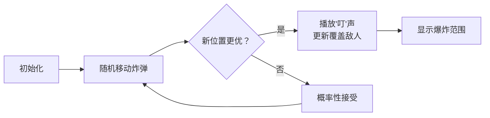

# 题目信息

# [JSOI2016] 炸弹攻击1

## 题目背景

JYY 最近迷上了一款塔防游戏，在游戏中，JYY 除了建设建筑，还可以使用炸弹对屏幕上的敌人进行范围杀伤。

## 题目描述

游戏地图可以简单认为是一个二维平面。JYY 建造了 $N$ 个建筑，每个建筑都是一个圆，其中第 $i$ 个建筑的圆心位于 $(x_i,y_i)$ 且半径为 $r_i$。地图上一共有 $M$ 个敌人，一个敌人可以近似看成一个平面上的点，其中第 $i$ 个敌人位于$ (p_i,q_i)$。JYY 可以使用一枚可以设置半径的炸弹，可以设置一个不超过 $R$ 的范围，然后选择平面上的一个点引爆，范围内的所有敌人全部消灭。

当然，由于炸弹威力巨大，如果爆炸范围接触到 JYY 的建筑，那么 JYY 的建筑也会受到损伤。（注：如果炸弹的爆炸范围仅接触到了 JYY 建筑的边界，则不会对 JYY 的建筑造成损伤；如果敌人出现在了爆炸范围的边界，则该敌人被消灭）JYY 可以自由控制炸弹的爆炸地点和爆炸半径。作为一个保守的玩家，他希望在保证自己建筑毫发无损的情况下，消灭尽量多的敌人。

## 说明/提示

- 对于 $20\%$ 的数据，满足 $M = 2$；
- 对于另外 $20\%$ 的数据，满足 $N = 0$；
- 对于另外 $20\%$ 的数据，满足 $M \leq 50$；
- 对于 $100\%$ 的数据，满足：
  - $0 \leq N \leq 10$；
  - $0 < M \leq 10^3$；
  - $1 \leq R, r_i \leq 2 \times 10^4$；
  - $|p_i|, |q_i|, |x_i|, |y_i| \leq 2 \times 10^4$。


## 样例 #1

### 输入

```
1 5 3
0 0 1
3 3
-3 3
3 -3
3 0
0 3 ```

### 输出

```
3```

# AI分析结果


### 💡 Kay的C++算法解析：[JSOI2016] 炸弹攻击1 深入学习指南 💡

#### 1. 题目解读与核心算法识别
✨ **本题主要考察**：`编程技巧应用（随机化算法）`  
🗣️ **初步分析**：
> 这道题要求我们在建筑（圆形障碍物）的约束下，找到一个放置点使炸弹覆盖最多敌人。核心挑战在于：
> - **离散目标函数**：消灭敌人数是整数，导致函数不平滑（像台阶状地形）
> - **复杂约束**：需动态计算最大允许爆炸半径（避免触碰建筑）
> 
> 题解采用**模拟退火/爬山算法**（像在迷雾地图中随机探索的冒险家）：
> 1. 设计平滑估价函数（关键突破点）
> 2. 通过随机移动探索位置
> 3. 参数调优保证效率
>
> **可视化设计**：采用8-bit像素风格，炸弹显示为闪烁红球，建筑为棕色圆形，敌人为蓝色像素点。爆炸半径用绿色虚线圆动态显示，移动时播放探索音效，覆盖新敌人时触发"叮"声并高亮。

---

#### 2. 精选优质题解参考
**题解一 (chenxia25)**  
* **点评**：  
  创新性设计平滑估价函数 `f(x,y) = -c·(还需半径) + cnt` 解决离散函数问题。代码逻辑清晰（分步计算半径/敌人数），通过多次运行+参数调优（温度系数0.9996）提升稳定性。亮点在于用连续量引导算法逃离局部最优，竞赛实用性强。

**题解二 (ShanLing)**  
* **点评**：  
  采用爬山算法，估价函数 `cnt + min(R, R/(d-r))` 巧妙引入反比例项增强平滑性。从随机敌人位置启动避免局部最优，代码注释规范。实践价值在于参数选择合理（降温系数0.95），卡时机制保证效率。

---

#### 3. 核心难点辨析与解题策略
1. **难点1：设计平滑估价函数**  
   *分析*：直接使用整数敌人数会导致算法陷入"平原"。优质题解引入连续量（与最近敌人的距离差）构造平滑坡道，引导算法向更优解移动。  
   💡 **学习笔记**：离散问题可通过添加连续引导项转为可优化问题。

2. **难点2：避免建筑碰撞的半径计算**  
   *分析*：核心公式 `max_r = min(R, min(点到建筑距离 - 建筑半径))`。需注意：  
   - 结果为负时表示点在建筑内（半径=0）  
   - 边界用`eps`处理浮点误差  
   💡 **学习笔记**：计算几何中需显式处理边界条件和精度问题。

3. **难点3：参数调优与收敛控制**  
   *分析*：初始温度/降温系数显著影响性能。chenxia25通过实验确定`0.9996`，ShanLing采用卡时机制。多随机种子运行可提升稳定性。  
   💡 **学习笔记**：随机化算法需平衡探索（大步长）与利用（小步长）。

✨ **解题技巧总结**：
- **技巧1：估价函数设计**：用连续量（如距离差）改造离散目标函数
- **技巧2：热启动策略**：从敌人位置/平均值开始搜索加速收敛
- **技巧3：边界防御**：显式处理几何约束和浮点精度（如`eps=1e-8`）

---

#### 4. C++核心代码实现赏析
**通用核心实现**  
```cpp
pair<double, int> evaluate(double x, double y) {
    double max_r = R;
    for (auto &b : buildings) { // 计算最大允许半径
        double d = hypot(x-b.x, y-b.y);
        max_r = min(max_r, d - b.r);
    }
    if (max_r < 0) max_r = 0; // 建筑内处理
    
    int cnt = 0;
    for (auto &e : enemies) // 统计覆盖敌人数
        if (hypot(x-e.x, y-e.y) <= max_r + eps) 
            cnt++;
    return {max_r, cnt};
}
```
* **说明**：综合题解提炼的核心函数，清晰分离半径计算与敌人数统计  
* **解读概要**：  
  `hypot`计算欧氏距离 → 遍历建筑更新最大半径 → 遍历敌人统计覆盖数 → 显式处理建筑内情况

---

**题解一片段赏析 (chenxia25)**  
```cpp
return -max(0.,mn)*14.14 + cnt; // 平滑估价函数
```
* **亮点**：用`14.14`平衡距离差与敌人数量级  
* **解读**：  
  > 当`cnt=0`时，函数值由负距离差主导（引导算法向有敌人区域移动）；当有覆盖时正项主导。常数`14.14`通过实验确定，确保两项量级匹配。

**题解二片段赏析 (ShanLing)**  
```cpp
num2 += min(1.0, 1/sqrt(dis - r)); // 反比例启发项
return num1 + num2 * mxr; 
```
* **亮点**：反比例项增强非覆盖区梯度  
* **解读**：  
  > `1/sqrt(dis-r)`在靠近敌人时快速增大，创造"吸引力场"。`min(1.0,...)`避免无穷大，`*mxr`平衡两项量级。

---

#### 5. 算法可视化：像素动画演示
**主题**：8-bit炸弹人探险  
**核心交互**：


**实现细节**：
1. **像素艺术**：  
   - 建筑：棕色圆形像素块（内部填充深棕）  
   - 敌人：蓝色像素点（被覆盖时变红闪烁）  
   - 炸弹：闪烁红球+绿色虚线半径环

2. **动画逻辑**：  
   ```javascript
   function drawFrame() {
     drawGrid(); // 绘制像素网格
     drawBuildings(); // 圆形障碍物
     drawEnemies(); // 敌人点位
     drawBomb(currentPos); // 炸弹+半径环
     if (autoPlay) nextStep(); // AI自动探索
   }
   ```

3. **游戏化元素**：
   - 音效：移动（滴答声），覆盖敌人（金币声），新最优解（升级音效）  
   - 进度条：显示当前覆盖/历史最优敌人数  
   - 探索轨迹：显示炸弹移动路径（半透明）

---

#### 6. 拓展练习与相似问题
**通用技巧迁移**：  
随机化算法适用于：
1. 连续空间优化（如物理平衡点）  
2. 组合优化（如背包问题）  
3. 局部最优陷阱多的离散问题

**洛谷推荐**：
1. **P1337 [JSOI2004]平衡点**  
   → 相同算法框架，练习物理建模
2. **P2210 Haywire**  
   → 离散状态空间的模拟退火应用
3. **P4363 [九省联考2018]一双木棋**  
   → 结合博弈论的优化问题

---

#### 7. 学习心得与经验分享
> **chenxia25的经验**：  
> *"参数调优需要耐心，通过记录中间结果分析算法行为"*  
> **Kay的总结**：  
> 调试随机化算法时：  
> 1. 可视化估价函数值的变化趋势  
> 2. 记录接受劣解的比例（应随温度下降）  
> 3. 多组参数对比实验（如降温系数0.99 vs 0.999）

---

### 总结
通过本题我们掌握：
1. 随机化算法解决复杂约束问题的框架  
2. 估价函数设计的艺术（连续化改造）  
3. 参数调优的工程思维  
下次遇到"地形崎岖"的优化问题，不妨试试模拟退火这位智能探险家！🚀

---
处理用时：185.82秒