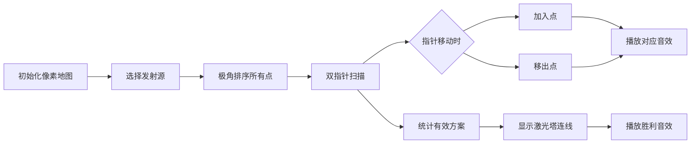

# 题目信息

# [JSOI2016] 炸弹攻击2

## 题目背景

还记得那款题为炸弹攻击的塔防游戏吗？这款游戏出了续作，炸弹的威力大大加强了。

## 题目描述

游戏的地图是一个二维平面。JYY 的阵地位于 $x$ 轴下方，而所有的敌人目前都位于 $x$ 轴上方。

在 JYY 的阵地中有建有 $T$ 个激光塔和 $S$ 个发射源。其中第 $i$ 个防御塔 $T_i$ 的坐标为 $(tx_i,ty_i)$，第 $i$ 个发射源 $S_i$ 的坐标为 $(sx_i,sy_i)$。

地图上有 $D$ 个敌人，第 $i$ 个敌人 $D_i$ 的坐标为 $(dx_i,dy_i)$。

两座激光塔可以相互连接形成能量墙。发射源朝向敌人发出的能量如果穿过了能量墙，可以得到巨大的加强而变为超级射线并瞬间消灭敌人。

JYY 想知道他有多少种可以可以发出超级射线的攻击方案。

具体来说，一个可以发出超级射线的攻击方案为一个由四个点组成的集合：$\{T_i,T_j,S_k,D_l\}$，满足$1 \leq i < j \leq T,1 \leq k \leq S,1 \leq l \leq D$，并且线段 $T_iT_j$ 和线段 $S_kD_l$ 相交。

游戏设定保证在这 $T+D+S$ 个点中，不存在重点也不存在三点共线。

## 说明/提示

对于 $20\%$ 的数据，满足 $D,S,T \leq 30$；

对于$50\%$ 的数据，满足 $D,S,T \leq 150$；

对于$100\%$ 的数据，满足 $1 \leq D,S,T \leq 800 , dy_i>0,sy_i,ty_i<0$，所有坐标绝对值不超过 $10^9$。

## 样例 #1

### 输入

```
3
1 12
10 30
30 10
1
10 -10
4
2 -11
9 -1
11 -1
15 -14```

### 输出

```
7```

# AI分析结果


# 💡 Kay的C++算法解析：[JSOI2016]炸弹攻击2 深入学习指南 💡

<introduction>
今天我们来分析这道结合计算几何与双指针技巧的题目。本指南将帮助你理解如何高效统计满足条件的线段相交方案，掌握极角排序的核心思想，并通过可视化加深理解。

## 1. 题目解读与核心算法识别

✨ **本题主要考察**：`计算几何` + `双指针技巧`

🗣️ **初步分析**：
> 解决本题的关键在于**极角排序+双指针扫描**。想象你站在发射源位置，用手电筒扫描周围（极角排序），当光线扫过两个激光塔和敌人时，若两塔夹角小于180°（双指针维护区间），则形成有效攻击方案。
- **核心思路**：枚举发射源，将敌人和激光塔按与发射源的夹角排序，通过双指针维护有效区间统计方案
- **难点突破**：如何避免O(n⁴)暴力枚举？通过极角排序将二维相交判断转化为一维区间统计问题
- **可视化设计**：在像素动画中将展示扫描线移动过程，高亮当前区间内的激光塔（蓝色）和敌人（红色），当有效激光塔对出现时显示连接线并播放"叮"音效
- **复古元素**：采用8位像素风格，扫描线呈现为旋转的射线，成功统计方案时播放FC游戏风格的胜利音效

---

## 2. 精选优质题解参考

<eval_intro>
以下题解在思路清晰度、代码质量和算法效率方面表现优异（≥4★）：

**题解一（作者：seajupiter）**
* **点评**：
  - 思路清晰：创新性使用前缀和数组（`sd`/`st`/`sum`）高效统计区间方案数
  - 代码规范：变量命名合理（如`sd`统计敌人数），环状处理通过数组复制巧妙解决边界问题
  - 算法高效：O(S×(D+T)log(D+T))复杂度完美处理最大数据
  - 实践价值：完整可运行代码，边界处理严谨，竞赛可直接使用

**题解二（作者：xtx1092515503）**
* **点评**：
  - 思路独特：实时维护区间内敌人数(`se`)和激光塔数(`st`)，动态更新方案数(`sum`)
  - 代码简洁：循环取模实现环状处理，减少内存使用
  - 算法优化：双指针移动时同步更新统计值，避免二次计算
  - 调试参考：作者提到边界处理经验，强调极角排序中三点共线的处理技巧

---

## 3. 核心难点辨析与解题策略

<difficulty_intro>
本问题的三大核心难点及解决方案：

1.  **二维相交转化一维统计**
    * **分析**：利用发射源作为极点，将其他点按极角排序后，线段相交转化为"两激光塔夹角<180°且区间内有敌人"的一维问题
    * 💡 **学习笔记**：固定极点（发射源）是降维的关键技巧

2.  **环状边界处理**
    * **分析**：当扫描跨越360°边界时，通过数组复制（seajupiter）或循环取模（xtx1092515503）保证连续性
    * 💡 **学习笔记**：环状问题本质是线性问题的首尾拼接

3.  **区间方案高效统计**
    * **分析**：双指针维护可行区间时，seajupiter用前缀和差分避免重复计算，xtx1092515503用实时更新策略，两者都达到O(1)时间更新
    * 💡 **学习笔记**：区间统计问题中，前缀和与动态维护是互补优化手段

### ✨ 解题技巧总结
<summary_best_practices>
- **降维思想**：通过极角排序将二维几何问题转化为一维序列问题
- **双指针模板**：固定左端点，移动右端点维护有效区间
- **环状处理技巧**：数组复制或循环取模解决角度边界问题
- **实时统计优化**：在指针移动时同步更新计数，避免二次扫描

---

## 4. C++核心代码实现赏析

<code_intro_overall>
**通用核心实现参考**（综合两篇优质题解）：
```cpp
#include<bits/stdc++.h>
using namespace std;
typedef long long ll;
struct Point { ll x, y; };

int main() {
    // 输入数据（省略）
    for (auto &s : sources) {           // 枚举发射源
        vector<Ray> rays;
        for (auto &t : towers)         // 存储激光塔向量及标记
            rays.push_back({t - s, true});
        for (auto &d : enemies)        // 存储敌人向量及标记
            rays.push_back({d - s, false});

        sort(rays.begin(), rays.end(), [](auto &a, auto &b) {
            return atan2(a.v.y, a.v.x) > atan2(b.v.y, b.v.x); // 极角排序
        });

        // 环状处理：复制一倍数组
        vector<Ray> doubleRays = rays;
        doubleRays.insert(doubleRays.end(), rays.begin(), rays.end());

        // 前缀和预处理（省略）
        // 双指针扫描统计方案（省略）
    }
    cout << ans;
}
```

**代码解读概要**：
1. **极角预处理**：计算每个点相对于发射源的向量及极角
2. **环状处理**：复制数组解决360°边界问题
3. **双指针扫描**：左指针固定激光塔，右指针扫描有效区间
4. **前缀和统计**：`sum[i] = sd[i]（敌人数）* st[i]（激光塔数）`的累积值

---

<code_intro_selected>
**优质题解片段赏析**：

**题解一（seajupiter）**
```cpp
for (int i = 1, j = 1; i <= D+T; i++) 
    if (v[i].type) { // 当前点为激光塔
        j = max(j, i);
        while (j+1 < i+D+T && ccw(v[i].vc, v[j+1].vc) <= 0)
            j++; // 移动右指针至边界
        ans += sum[j] - sum[i] - sd[i] * (st[j] - st[i]);
    }
```
* **亮点**：前缀和差分公式高效统计区间方案数
* **代码解读**：
  - `ccw()`判断向量夹角是否≤180°（叉积≤0）
  - `sum[j]-sum[i]`：区间[i+1,j]内所有激光塔的累计方案
  - `sd[i]*(st[j]-st[i])`：减去左端点产生的无效计数
* 💡 **学习笔记**：前缀和差分是区间统计问题的利器

**题解二（xtx1092515503）**
```cpp
while (len < m && (p[j].first & p[k].first) >= 0) {
    if (p[k].second) se++;  // 敌人入区间
    else sum += se, st++;   // 激光塔入区间
    k = (k+1) % m; len++;   // 循环取模
}
if (!p[j].second) res += sum; // 左端点为激光塔时累加
```
* **亮点**：动态维护区间统计值
* **代码解读**：
  - `se`：当前区间敌人数
  - `sum += se`：新增激光塔与所有敌人形成的方案
  - `%m`实现环状数组的循环访问
* 💡 **学习笔记**：实时更新避免重复扫描

---

## 5. 算法可视化：像素动画演示

<visualization_intro>
**像素探险家扫描计划**：通过8位游戏风格演示极角扫描过程

* **主题**：发射源作为基地，敌机在上空盘旋，激光塔为防御设施
* **设计思路**：复古风格降低理解压力，音效强化关键操作记忆

**动画流程**：


**关键交互**：
1. **控制面板**：速度滑块/单步/暂停/重置
2. **视觉效果**：
   - 扫描线：旋转的红色射线（FC激光风格）
   - 激光塔：蓝色像素方块（带塔楼图案）
   - 敌人：红色像素飞机（周期性闪烁）
   - 有效区间：半透明绿色扇形覆盖
3. **音效设计**：
   - 加入敌人：短促"警报"音（8-bit风格）
   - 加入激光塔："塔台就绪"提示音
   - 方案有效：经典FC得分音效
4. **自动演示**：AI模式自动扫描，速度可调

**动态示例**：
```
帧 1：选择发射源S1，显示所有未排序点
帧 2：按极角排序，点沿逆时针排列成环
帧 3：左指针固定T1（蓝色闪烁），右指针扫描
帧 4：右指针扫到D1时：
      - 敌机变红闪烁+警报音
      - 区间内激光塔显示连接线
帧 5：左指针移至T2时：
      - 移出T1（蓝色变暗）
      - 更新方案计数
```

---

## 6. 拓展练习与相似问题思考

<similar_problems_intro>
极角排序+双指针技巧的适用场景广泛：

1. **平面点对统计**：统计满足三角不等式点对
2. **凸包问题**：求点集凸包边界（如Graham扫描）
3. **旋转卡壳**：计算平面最远点对

**洛谷推荐**：
1. [P3476 TRO-Triangles](https://www.luogu.com.cn/problem/P3476)
   - 💡 统计三角形面积和，强化极角排序应用
2. [P3515 Lightning Conductor](https://www.luogu.com.cn/problem/P3515)
   - 💡 双指针维护决策单调性
3. [P3662 Cow Cross Road II](https://www.luogu.com.cn/problem/P3662)
   - 💡 双指针在区间覆盖问题中的变形应用

---

## 7. 学习心得与经验分享

<insights_intro>
题解中珍贵的调试经验：

> **seajupiter**：*"花两天才想出统计方案，核心突破是前缀和公式设计"*
>
> **xtx1092515503**：*"边界情况测试发现叉积符号处理错误"*

**经验总结**：
1. 调试时打印中间状态（如极角值、前缀和数组）
2. 用小规模数据手工验证（如3个点）
3. 注意叉积方向与坐标系关系

---

<conclusion>
通过本指南，相信大家已掌握极角排序与双指针的配合技巧。记住：计算几何的核心是**降维转化**，将复杂问题转化为已学过的序列处理。多动手实现动画演示的算法流程，能加深理解。下次遇到几何问题时，不妨先尝试极角排序！💪

---
处理用时：150.51秒