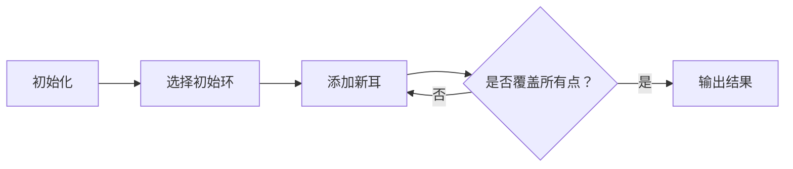

# 题目信息

# [SNOI2013] Quare

## 题目描述

4.20 四川芦山地震发生后，抗震救灾委员会接到一个紧急任务，四川省给该委员会发了一份地图，这份地图给出了该省一些城市的情况：任两个城市是用一条或多条公路连接起来的，也可以没有公路连接，但是每个城市都可以直接或间接地到达另外的城市，注意这些公路是可以双向行驶的。由于最近余震、暴雨造成泥石流倾泻，使得车辆在这些公路上行驶很不安全，于是四川省决定尽快对部分公路进行抢修，以保障救援车辆行车安全。
    
该省对所有的公路情况都进行了勘察，分析估计了抢修某段公路所需要花费的时间，并记录在地图中。现在该省希望抗震救灾委员会能找到一个方案，该方案决定出哪些公路需要抢修，使得抢修后的公路仍能保证任意两个城市之间都能直接或间接地相连，同时为了安全起见，即使某一条抢修的公路被泥石流阻断了，任意两城市仍能保持这个性质。由于时间紧迫，抗震救灾委员会还需保证找到的这个方案总抢修时间最短。

## 说明/提示

对于 $100\%$ 的数据，$1 \leq T \leq 3$，$1 \leq n \leq 12$，$1 \leq m \leq 40$，$1\le c\le 5\times 10^4$。

## 样例 #1

### 输入

```
2
4 6
1 2 1
1 3 2
1 3 3
2 4 2
3 4 1
2 3 1
2 1
1 2 3
```

### 输出

```
6
impossible
```

# AI分析结果


# 💡 Kay的C++算法解析：[SNOI2013] Quare 深入学习指南 💡

**引言**  
今天我们一起分析「[SNOI2013] Quare」这道边双连通图问题。本指南将帮助大家掌握**耳分解**的核心思想与**状压DP**的实现技巧，并通过像素动画直观理解算法流程。

---

## 1. 题目解读与核心算法识别

✨ **本题主要考察**：`图论 - 边双连通分量` + `状压动态规划`

🗣️ **初步分析**：  
> 想象你在搭建一座抗震公路网（边双连通图），初始只需一个环（如乐高底板），之后不断添加"耳朵"（新路径）扩大网络。这种**耳分解**过程对应状压DP的状态设计：
> - **核心思想**：任何边双连通图都可拆分为初始环+若干耳（两端在已建图中，中间为新点）
> - **本题应用**：用DP模拟耳分解过程，逐步添加点集
> - **核心难点**：需处理重边（记录两点最小/次小边权），避免二元环错误
> - **可视化设计**：像素网格中，用颜色区分已加入点（绿色）、当前耳路径（黄色）、新点（红色）。动画高亮状态转移时的边权计算与点集更新

---

## 2. 精选优质题解参考

**题解一：ix35 (评分：★★★★★)**  
* **点评**：  
  该解法创新性地用三维DP状态 `dp[S][i][j][0/1]` 模拟耳分解：
  - **思路亮点**：通过`0/1`标记区分二元环，避免重边误算
  - **代码规范**：变量名`S`(点集),`i/j`(耳端点)含义清晰，边界处理严谨（`e[x][y][0/1]`存储最小/次小边权）
  - **算法优化**：时间复杂度优化至 $O(2^n·n^3)$，是本题最优解
  - **实践价值**：代码可直接用于竞赛，输入处理与DP转移分离，便于调试

**题解二：juju527 (评分：★★★★☆)**  
* **点评**：  
  - **推导清晰**：将转移分为四种情况（新耳/扩耳/结束耳/特判二元环），逻辑直白
  - **教学价值**：伪代码展示关键转移方程，帮助理解状态定义
  - **改进空间**：完整代码未给出，但核心片段已覆盖DP精髓

**题解三：UltiMadow (评分：★★★★)**  
* **点评**：  
  - **独特视角**：将耳分解看作"环+链"组合，预处理链代价
  - **代码亮点**：用`__builtin_popcount`优化点集计数
  - **适用场景**：提供 $O(3^n·n^2)$ 替代方案，适合理解不同复杂度解法

---

## 3. 核心难点辨析与解题策略

1. **难点：耳分解的状态表示与转移**  
   - **分析**：优质题解用 `f[S]` 表点集 `S` 的最小代价，`dp[S][i][j]` 表当前耳状态。转移时分三种情况：
     * 加二元环：`f[S] + min_edge + second_min_edge`
     * 开始新耳：从 `f[S]` 初始化 `dp` 状态
     * 扩展耳：向新点延伸路径
   - 💡 **学习笔记**：好的状态设计需完整覆盖耳分解的阶段性特征

2. **难点：重边处理的边界条件**  
   - **分析**：当两点间存在多条边时，需额外记录次小边权。ix35的 `e[x][y][0/1]` 和二元环特判是典范
   - 💡 **学习笔记**：图论问题中，重边和自环往往是边界陷阱

3. **难点：DP转移顺序的依赖性**  
   - **分析**：必须先处理完整子集再扩展新点，否则会漏状态。juju527强调转移顺序：结束耳→新耳→扩耳
   - 💡 **学习笔记**：状压DP中，点集枚举顺序直接影响正确性

### ✨ 解题技巧总结
- **技巧1：问题分解法** - 将边双连通图分解为环+耳，化整为零
- **技巧2：状态压缩优化** - 用二进制位表示点集，`S|(1<<x)` 高效添加新点
- **技巧3：边界预检查** - 预处理两点最小/次小边权，避免转移时重复计算

---

## 4. C++核心代码实现赏析

**本题通用核心实现（基于ix35解法）**  
```cpp
#include <bits/stdc++.h>
using namespace std;
const int INF = 0x3f3f3f3f;
int t, n, m;
int e[15][15][2];   // e[u][v][0/1]: u->v的最小/次小边权
int dp[1<<12][12][12][2]; // dp[S][i][j][0/1]: 当前点集S，耳端点为i,j
int f[1<<12];       // f[S]: 点集S构成边双的最小代价

void solve() {
    memset(e, 0x3f, sizeof(e));
    memset(dp, 0x3f, sizeof(dp));
    memset(f, 0x3f, sizeof(f));
    // 输入处理与e数组初始化
    while (m--) {
        int u, v, w; cin >> u >> v >> w;
        u--; v--; // 点转为0-indexed
        // 更新u↔v的最小/次小边权
        if (w < e[u][v][0]) e[u][v][1] = e[u][v][0], e[u][v][0] = w;
        else if (w < e[u][v][1]) e[u][v][1] = w;
        // 无向图同步反向边
        e[v][u][0] = e[u][v][0]; e[v][u][1] = e[u][v][1];
    }
    
    // 初始化：单个点代价为0
    for (int i = 0; i < n; i++) f[1<<i] = 0;
    
    // 状压DP主体
    for (int S = 0; S < (1<<n); S++) {
        // 情况1：尝试结束当前耳（i->j）
        for (int i = 0; i < n; i++) for (int j = 0; j < n; j++) 
            if ((S>>i&1) && (S>>j&1))
                f[S] = min(f[S], dp[S][i][j][1] + e[i][j][0]);
        
        // 情况2：从f[S]开始新耳
        if (f[S] < INF) {
            // 特判二元环：直接加两点（需要最小+次小边）
            for (int i = 0; i < n; i++) if (S>>i&1) 
            for (int j = 0; j < n; j++) if (!(S>>j&1)) 
                f[S|(1<<j)] = min(f[S|(1<<j)], f[S] + e[i][j][0] + e[i][j][1]);
            
            // 开始新耳：枚举新点j和终点k
            for (int i = 0; i < n; i++) if (S>>i&1)
            for (int j = 0; j < n; j++) if (!(S>>j&1))
            for (int k = 0; k < n; k++) if (S>>k&1) {
                if (i != k) // 正常情况
                    dp[S][j][k][0] = min(dp[S][j][k][0], f[S] + e[i][j][0]);
                else // 避免二元环：强制先加入新点
                    dp[S|(1<<j)][j][k][1] = min(dp[S|(1<<j)][j][k][1], f[S] + e[i][j][0]);
            }
        }
        
        // 情况3：扩展当前耳（i->j->k）
        for (int i = 0; i < n; i++) if (S>>i&1)
        for (int j = 0; j < n; j++) if (S>>j&1)
        for (int k = 0; k < n; k++) if (!(S>>k&1))
            dp[S|(1<<i)][k][j][1] = min(dp[S|(1<<i)][k][j][1], 
                min(dp[S][i][j][0], dp[S][i][j][1]) + e[i][k][0]);
    }
    
    // 输出全点集结果
    if (f[(1<<n)-1] == INF) cout << "impossible\n";
    else cout << f[(1<<n)-1] << '\n';
}
```

**关键代码解读**：
1. **重边处理**：`e[u][v][0/1]` 存储两点间最小和次小边权，避免二元环计算错误
2. **DP状态初始化**：`f[1<<i]=0` 表示单个点不需要边
3. **新耳开始**：当 `i != k` 时直接转移，否则先加入新点 (`S|(1<<j)`)
4. **耳扩展**：`dp[S|(1<<i)][k][j][1]` 表示从 `i` 扩展到 `k`，耳目标仍是 `j`

---

## 5. 算法可视化：像素动画演示

**主题**：像素城市建设者（复古FC风格）  
**核心演示**：耳分解如何从环逐步构建完整边双连通图



**动画流程设计**：
1. **场景初始化**（8-bit像素风）：
   - 节点：12×12网格，不同颜色区分状态
   - 控制面板：开始/暂停/单步按钮 + 速度滑块
   - 背景：循环播放8-bit风格BGM

2. **耳分解过程演示**：
   ```python
   # 伪代码：单步动画流程
   def draw_ear_decomposition():
       显示当前点集S（绿色节点）
       高亮正在扩展的耳（黄色路径）
       标记当前耳端点i,j（闪烁像素箭头）
       当转移发生时：
          播放“叮”音效（添加边）
          新节点变为红色加入
          更新点集S的显示
       若形成二元环：
          播放“警告”音效 + 红色闪烁
       当完成全点集：
          播放“胜利”音效 + 烟花动画
   ```

3. **交互控制**：
   - **单步执行**：按步查看状态转移
   - **自动演示**：AI自动扩展耳（类似贪吃蛇AI）
   - **速度调节**：滑块控制0.5x~5x速度

4. **游戏化元素**：
   - 每完成一个耳，获得金币+像素烟花
   - 最终根据边权消耗计算星级评价

---

## 6. 拓展练习与相似问题

1. **洛谷 P5056**：边双连通图计数  
   *推荐理由*：巩固边双连通性质与耳分解应用

2. **洛谷 P6186**：最小生成树与边双连通性结合  
   *推荐理由*：练习图论综合应用，理解MST与边双的区别

3. **洛谷 P6178**：最小生成树计数  
   *推荐理由*：对比边双与生成树的算法设计差异

---

## 7. 学习心得与经验分享

> **ix35的调试经验**：  
> *“我在重边处理时卡了很久，后来打印邻接矩阵才发现漏了次小边”*  
>   
> **Kay的总结**：  
> 图论问题中，**可视化中间状态**（如打印邻接矩阵）是调试的核心技巧。在状压DP中，可用`bitset`输出点集S的二进制表示辅助调试。

---

**结语**  
通过耳分解与状压DP，我们解决了边双最小权问题。记住：好的状态设计是DP的核心，而可视化调试能事半功倍。下次挑战见！🚀

---
处理用时：136.96秒