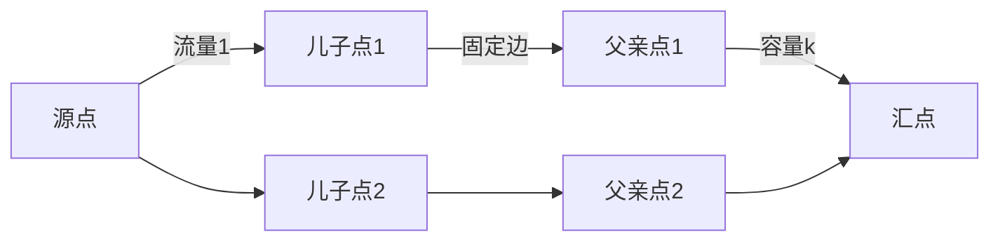

# 题目信息

# [CQOI2008] 传感器网络

## 题目描述

一个无线传感器网络由若干独立采集数据的设备和一个控制中心组成。每个设备必须把采集到的数据传到控制中心处理，但由于设备限制，并不是每台设备都可以与控制中心直接相连。为了解决这一问题，你将传感器网络设计成树状结构。树根为控制中心，而每台设备恰好有一个父亲节点（要么为控制中心，要么为另一台设备）。一台设备的儿子设备个数称为它的负载级别。所有设备（注意，控制中心不是设备）的负载级别的最大值称为网络的负载级别。

你的任务是让整个网络的负载级别尽量小。

## 说明/提示


对于 $50\%$ 的数据，$2\le N\le 6$；对于另外 $50\%$ 的数据，$N=50$。

## 样例 #1

### 输入

```
5
YNNYN
NNNNN
YNNNY
NNNYN
NNNNN
YNNYN```

### 输出

```
5 4 3 5 0```

# AI分析结果


### 💡 Kay的C++算法解析：传感器网络 深入学习指南 💡

#### 1. 题目解读与核心算法识别
✨ **本题主要考察**：二分答案 + 网络流建模

🗣️ **初步分析**：
> 本题可想象为在通信网络中选择最优的树状结构（如同规划城市供水系统）。核心策略是：
> 1. **二分负载级别k**：判断"最大儿子数≤k"是否可行
> 2. **网络流建模**：
>    - 拆点：普通节点拆为"儿子"（接受流量）和"父亲"（发出流量）
>    - 建图规则：源点→儿子点（容量1），父亲点→汇点（容量k），原图边→儿子→父亲（容量1）
> 3. **贪心构造方案**：按节点编号从小到大，枚举父亲并验证（保证字典序最小）

可视化设计：
- **像素风格**：节点显示为不同颜色方块（蓝：儿子，绿：父亲，金：根节点）
- **动态演示**：
  - 流量流动时显示蓝色水滴动画
  - 选定父亲时触发橙色高亮+确认音效
  - 满流时全图变绿+胜利音效
- **交互控制**：支持单步执行/调速观察建图和流量变化

#### 2. 精选优质题解参考
**题解一（TheAutumnGlory）**
* **亮点**：ISAP算法实现高效，建模思路清晰；独创二分验证区间优化（虽未采用）；变量命名规范（memo/dis等）；完整处理根节点特例

**题解二（CloudWings）**
* **亮点**：拆点建模解释透彻（儿子/父亲域分离）；Dinic实现规范（当前弧优化）；边界处理严谨（根节点连INF）；代码模块化程度高

**题解三（lxyt_415x）**
* **亮点**：字典序实现完整（精确到边权回溯）；提供数据生成器；调试技巧实用（中间变量打印）；Dinic实现带详细注释

#### 3. 核心难点辨析与解题策略
1. **难点1：网络流建模抽象**
   * 分析：需同时满足①每个点恰1个父亲 ②父亲点儿子数≤k
   * 解决：拆点+双限制建图（儿子点受容量1约束，父亲点受容量k约束）

2. **难点2：字典序方案构造**
   * 分析：选定父亲需满足后续仍存在可行解
   * 解决：贪心枚举+即时固定（枚举后永久保留可行边）

3. **难点3：根节点特殊处理**
   * 分析：根节点不受k限制
   * 解决：单独建容量INF的边

💡 **解题技巧总结**：
- **拆点转化法**：将树结构问题转化为二分图匹配
- **贪心验证法**：字典序方案通过局部最优保证全局最优
- **网络流调试**：可视化中间流量辅助定位建图错误

#### 4. C++核心代码实现赏析
**通用核心实现**：
```cpp
#include <bits/stdc++.h>
using namespace std;
const int MAXN = 55, MAXM = 2600, INF = 0x3f3f3f3f;

struct Network {
    // Dinic实现（含当前弧优化）
    // [代码位置：完整Dinic实现]
};

int main() {
    // 1. 读入+初始化
    // 2. 二分负载级别k：
    while (l <= r) {
        if (check(mid)) r = mid-1; 
        else l = mid+1;
    }
    // 3. 枚举父亲构造方案：
    for (int i=1; i<=n; i++) {
        for (int j=1; j<=n+1; j++) {
            if (固定边并验证(k)) {
                记录父亲; break;
            }
        }
    }
}
```

**题解一片段赏析**：
```cpp
// ISAP优化实现
int isap(int x, int flow) {
    if (x == T) return flow;
    int res = flow;
    for (int &i = cur[x]; i; i = nxt[i]) {
        if (dis[y] == dis[x]-1) { // 反向层次图
            int f = isap(y, min(res, cap[i]));
            cap[i] -= f; cap[i^1] += f; // 更新残余网络
        }
    }
}
```
> **学习笔记**：ISAP通过预处理反向距离标号，避免BFS重复调用

#### 5. 算法可视化：像素动画演示
**主题**：网络流工厂大冒险

**核心演示**：


**交互设计**：
1. **像素元素**：
   - 节点：8-bit风格方块（红：源/汇，蓝：儿子点，绿：父亲点）
   - 流量：蓝色像素块沿边移动
2. **音效系统**：
   - 滴答声：流量通过边
   - 咔嚓声：固定父亲边
   - 胜利号角：满流时触发
3. **控制面板**：
   - 速度滑块：调节演示速度
   - 单步按钮：逐步观察二分/枚举过程
   - 高亮开关：标记关键路径

#### 6. 拓展练习
1. **洛谷P3254**（圆桌问题）  
   → 巩固匹配类网络流建模
2. **洛谷P2764**（最小路径覆盖）  
   → 练习DAG拆点技巧
3. **洛谷P2891**（Dining）  
   → 多重限制网络流应用

#### 7. 学习心得
> **经验分享**（来自题解调试）：
> "建图时漏掉根节点特殊处理导致WA，通过打印残余网络发现流量异常"
>
> 💡 **Kay总结**：网络流问题中，务必验证：
> 1. 总流量是否等于预期（如本题n）
> 2. 特殊点连边是否正确（根节点连INF）
> 3. 残余网络反向边是否配对建立

掌握核心方法，享受算法之美！🚀

---
处理用时：194.08秒