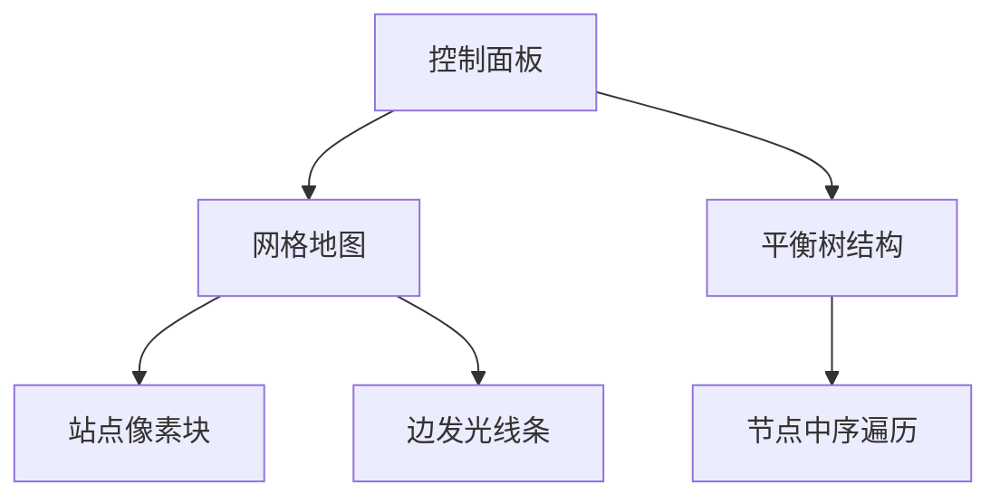

# 题目信息

# [JSOI2013] 公交系统

## 题目背景

几年前南京因为修地铁的缘故，很多公交车线路都被迫改变了。

JYY 为此很苦恼：试想一下，当你坐上一辆公交车，却发现这辆公交车驶向了与你记忆完全不同的方向。

于是 JYY 打算开发一套可以利用手机进行实时更新的公交信息应用， 所有安装了这款应用的手机都可以向数据库发送最新的公交线路更改情况，同时也可以通过应用向数据库查询自己所需要的信息。

## 题目描述

南京一共有 $n$ 个公交站点，分别从 $1$ 到 $n$ 编号。两个不同的站点 $x$ 和 $y$ 之间可能会有公交车直接运营（不经过别的站点直接从 $x$ 开到 $y$） ，我们将这种关系看作一条无向边（公交线路显然是双向的，我们既可以从 $x$ 坐公交车到 $y$，也可以从 $y$ 坐车到 $x$）。

任意时刻任何公交站点都至多只会连有 $2$ 条边，并且所有这些边是不会形成
环的（公交车很少会出现环线，所以这些公交线路应该形成一些不相交的链，链
的两端分别对应两个终点站）。

JYY 的 IOS 应用按照时间顺序一共收到了 $q$ 条交互信息，每一条交互信息
都是下列五种信息之一：

- `add x y z`，表示当前时刻，站点 $x$ 到站点 $y$ 之间有新增了一班公交车直接运营，并且在当前路况下，公交车所需要的运营时间为 $z$。
- `del x y`，表示由于某种原因，原本在站点 $x$ 和站点 $y$ 之间直接运营的公交车停运了。
- `change x y z`，表示由于路况情况改变，站点 $x$ 到站点 $y$ 之间直接运营的公交车当前的运营时间为 $z$。
- `reach x y`，表示某个用户询问从站点 $x$ 坐车能不能坐到站点 $y$。
- `dest x y`，表示某个用户从站点 $x$ 上车，坐上了当前正开往站点 $y$ 的公交车。该用户想知道，他到达 $y$ 后继续乘坐可乘坐的线路(已经乘坐过的线路不能重复乘坐)，最终能够到达的终点站是哪一站？从站点 $x$ 开始需要多久才能
开到终点站？

**在收到第一条信息之前，没有任何公交车在运营**。

由于用户难免会提交错误的信息，所以 JYY 希望他的软件对于错误的信息也
要能够做出合理的反应：

- 对于 `add` 信息，如果加入边 $(x,y)$ 之后，任何站点连接的边数均不超过 $2$ 并且图中没有环，JYY 则认为这个信息是正确的，并根据这个信息更新
数据库中的公交线路数据，否则JYY会无视这个错误信息。
- 对于 `del` 和 `change` 信息，如果站点 $x$ 和站点 $y$ 之间有公交车直接运营， JYY 则认为这条信息是正确的，并更新数据库，否则 JYY 则会无视这个错误
信息。
- 对于 `dest` 信息，如果站点 $x$ 不能到达站点 $y$，JYY 也会认为这一条询问信
息是错误的。

JYY 希望你能够帮助他完成这一个公交信息应用。

## 说明/提示

#### 数据规模与约定

对于 $100\%$ 的数据，保证：

- $2 \leq n \leq 10^5$，$2 \leq q \leq2×10^5$。
- $1 \leq x, y \leq n$，$x \neq y$，$1\leq z \leq10^4$。

---

#### 提示

请注意数据读入对程序效率造成的影响。

## 样例 #1

### 输入

```
6 10
add 1 2 1
add 2 1 1
add 3 2 1
add 4 5 2
reach 4 6
dest 1 5
del 5 6
add 1 4 2
dest 2 3
dest 3 2```

### 输出

```
OK
ERROR
OK
OK
NO
ERROR
ERROR
OK
3 1
5 6```

# AI分析结果


### 💡 Kay的C++算法解析：公交系统 深入学习指南 💡

#### 1. 题目解读与核心算法识别
✨ **本题主要考察**：`数据结构应用（平衡树）`  
🗣️ **初步分析**：  
> 公交系统问题可类比为**动态维护珍珠项链**：站点是珍珠（零重量），边是连接珠（有重量）。核心在于动态维护多条无环链（保证站点度数≤2），支持链的拆分、合并和翻转操作。  
> - **核心解法**：用平衡树（FHQ Treap）存储链结构，以"站点-边-站点"为节点序列，巧妙处理五种操作。
> - **可视化设计**：像素动画将展示站点（彩色像素块）和边（发光线条）。加边/删边时显示平衡树分裂合并，翻转操作时整条链旋转，边权更新时数字闪烁。复古音效（"叮"表操作成功，"嘟"表错误）增强反馈。

---

#### 2. 精选优质题解参考
**题解一（来源：Jr_Zlw）**  
* **点评**：  
  解法将边转化为平衡树节点（点权=0，边权>0），通过**中序遍历模拟链结构**：  
  - **思路亮点**：用`rnk()`计算节点排名时**递归释放翻转标记**，确保排名正确性；  
  - **代码规范**：宏封装读入（`Get()`）提升效率，但变量名`T1,T2,T3`可读性可优化；  
  - **算法优化**：`split/merge`操作均摊O(log n)，完美支持10^5级数据；  
  - **实践价值**：边界处理严谨（如检查链端点时需`rx==1 or rx==t[fx].siz`）。

---

#### 3. 核心难点辨析与解题策略
1. **难点：动态维护链结构**  
   * **分析**：加边需两站点位于不同链端点（`rnk(x)`为1或`siz`），通过**翻转平衡树**对齐方向（如`if(rx==1) Rev(fx)`）。
   * 💡 **学习笔记**：链端点即平衡树中序首位节点。

2. **难点：高效查询节点位置**  
   * **分析**：`rnk(x)`需从节点**回溯到根并下传标记**（`pushall`），避免翻转导致排名错误。
   * 💡 **学习笔记**：平衡树维护动态序列时，标记下传是排名查询的关键。

3. **难点：边权操作的一致性**  
   * **分析**：`add/del/change`共享核心逻辑：验证节点**相邻且间隔为边节点**（`ry==rx+2`）。
   * 💡 **学习笔记**：将边抽象为节点统一处理，简化数据结构设计。

✨ **解题技巧总结**  
- **抽象建模**：将图论问题转化为序列操作（边→节点）  
- **标记处理**：递归下传翻转标记保证查询正确性  
- **边界防御**：严格验证操作合法性（如`del`前检查`fx==fy`）

---

#### 4. C++核心代码实现赏析
**通用核心实现参考**  
* **说明**：综合自题解，完整展示FHQ Treap维护链结构。
```cpp
#include<cstdio>
#include<cstdlib>
#define rep(a,b,c) for(int c=(a);c<=(b);++c)
struct FHQ{int l,r,siz,vl,sm,fa;bool tg;short key;}; // 节点结构体
inline void pushdown(int x){if(t[x].tg)Rev(t[x].l),Rev(t[x].r),t[x].tg=0;} // 标记下传
inline void split(int cur,int k,int &x,int &y){...} // 按大小分裂树
inline int merge(int x,int y){...} // 合并两棵树
inline int rnk(int k){
    pushall(k); // 关键！从根到k释放标记
    int r=t[t[k].l].siz;
    while(t[k].fa) r+=(k==t[t[k].fa].r)?t[t[t[k].fa].l].siz+1:0; // 回溯计算排名
    return r+1;
}
```

**题解片段赏析**  
1. **链端点检测（加边操作）**  
```cpp
if((rx==1||rx==t[fx].siz) && (ry==1||ry==t[fy].siz)){
    if(rx==1) Swap(x,y),Swap(fx,fy); 
    if(rx==1) Rev(fx);  // 左端点需翻转链
    if(ry==t[fy].siz) Rev(fy); // 右端点需翻转链
}
```
> **解读**：  
> - 检查`x,y`是否为链端点（排名1或`siz`）  
> - **翻转技巧**：若`x`是左端点（`rx=1`），翻转整条链使其变右端点，保证合并方向一致。  
> 💡 **学习笔记**：翻转操作使不同方向的链能首尾相接。

2. **边权修改（change操作）**  
```cpp
split(fx,rx,T1,T2); 
split(T2,1,T2,T3); // 拆分出边节点
t[T2].sm=t[T2].vl=z; // 修改边权
merge(merge(T1,T2),T3); // 重新合并
```
> **解读**：  
> - **三步拆分**：先按`x`排名分裂，再取下一节点（即边节点）  
> - **权值更新**：直接修改边节点的`vl`（边权）和`sm`（子树和）  
> 💡 **学习笔记**：FHQ Treap的分裂操作可精准定位任意节点。

---

### 5. 算法可视化：像素动画演示  
**主题**：`像素地铁建造者`（复古FC风格）  
**核心交互设计**：  


1. **动态建链演示**  
   - 加边时：两站点闪烁 → 弹出边节点（黄色像素块）→ 平衡树分裂合并动画  
   - 错误操作：站点变红 → 播放"嘟"声  

2. **平衡树内部状态**  
   - 右侧画布同步显示FHQ Treap结构  
   - **高亮当前操作**：  
     - 查询排名时：从叶到根的路径闪烁蓝色  
     - 翻转链时：整棵树左右子树交换动画  

3. **音效与游戏化**  
   - 成功音效：8-bit风格"叮"（加边/改边权）  
   - 关卡进度：每合并5条链解锁新站点皮肤  

---

### 6. 拓展练习与相似问题思考
**通用技巧迁移**：  
1. 动态维护森林链式结构（如[P3203 弹飞绵羊]）  
2. 平衡树维护序列操作（如[P3391 文艺平衡树]）  
3. 边权动态修改问题（如[P2487 巡逻]）  

**洛谷推荐**：  
1. **P3203** - 弹飞绵羊  
   🗣️ **推荐理由**：同样需要快速查询节点在序列中的位置，巩固`rnk()`实现技巧。  
2. **P2147** - 洞穴勘测  
   🗣️ **推荐理由**：动态加边/删边维护连通性，强化操作合法性检验逻辑。  
3. **P3690** - 动态树  
   🗣️ **推荐理由**：进阶学习LCT（Link-Cut Tree），深化链式结构维护思想。

---

> 本次解析结束！平衡树是算法竞赛的利器，理解其"分裂-操作-合并"的核心范式，你也能成为动态数据结构的"像素建筑师"！🚀

---
处理用时：94.14秒