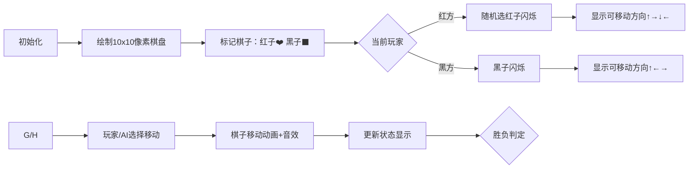

# 题目信息

# [省选联考 2023] 过河卒

## 题目背景

棋盘上有一个过河卒，需要走到底线。卒行走的规则是可以向左移动一格，向右移动一格或者向前移动一格。同时在棋盘上有两个另一方的棋子，需要拦截这个卒走到底线。这两个棋子的走法和帅一致，可以走到前后左右四个方向上相邻的格子。因此本题可以称为“帅拦过河卒”。

## 题目描述

有一个 $n$ 行 $m$ 列的棋盘。我们用 $(i,j)$ 表示第 $i$ 行第 $j$ 列的位置。棋盘上有一些 障碍，还有一个黑棋子和两个红棋子。

游戏的规则是这样的: 红方先走，黑方后走，双方轮流走棋。红方每次可以选择一个红棋子，向棋盘的相邻一格走一步。具体而言，假设红方选择的这个棋子位置在 $(i,j)$，那么它可以走到 $(i-1,j),(i+1,j),(i,j-1),(i,j+1)$ 中的一个，只要这个目的地在棋盘内且没有障碍且没有红方的另一个棋子。

黑方每次可以将自己的棋子向三个方向之一移动一格。具体地，假设这个黑棋子位置在 $(i,j)$，那么它可以走到 $(i-1,j),(i,j-1),(i,j+1)$ 这三个格子中的一个，只要这个目的地在棋盘内且没有障碍。

在一方行动之前，如果发生以下情况之一，则立即结束游戏，按照如下的规则判断胜负（列在前面的优先）：

- 黑棋子位于第一行。此时黑方胜。

- 黑棋子和其中一个红棋子在同一个位置上。此时进行上一步移动的玩家胜。

- 当前玩家不能进行任何合法操作。此时对方胜。

现在假设双方采用最优策略，不会进行不利于自己的移动。也就是说:

- 若存在必胜策略，则会选择所有必胜策略中，不论对方如何操作，本方后续获胜所需步数最大值最少的操作。
- 若不存在必胜策略，但存在不论对方如何行动，自己都不会落败的策略，则会选择任意一种不败策略。
- 若不存在不败策略，则会选择在所有策略中，不论对方如何操作，对方后续获胜所需步数最小值最大的操作。

如果在 $100^{100^{100}}$ 个回合之后仍不能分出胜负，则认为游戏平局。请求出游戏结束时双方一共移动了多少步，或者判断游戏平局。

## 说明/提示

**【样例 1 解释】**

第一组数据，红方第一步没有可行的移动，所以黑方胜。

第二组数据，无论第一步红方怎么移动，黑方都可以在下一步让黑棋子与红棋子在同一个位置。

第三组数据，无论第一步红方怎么移动，黑方都可以将自己的棋子往上移动一枚来达成胜利。

第四组数据，有一个红棋子不能动。另一个红棋子可以在第三行移动来防止黑棋子进入第一行。黑棋子也可以一直在第五行移动。如果红棋子到达第五行，黑棋子可以选择从另一边逃走。

第五组数据，在最后一行的那个红棋子可以从左边绕一圈抓住黑棋子。注意另一个红棋子可以移动。

**【样例 2 解释】**

这个样例中的每一组数据都满足测试点 $5$ 到 $13$ 中某一个测试点的限制。

**【子任务】**

对于所有的数据，保证：$1 \leq T \leq 10$，$2 \leq n \leq 10$，$1 \leq m \leq 10$，$\text{id}$ 等于测试点编号。

对于每组数据保证：棋盘上的黑棋恰好有一个，红棋恰好有两个，且黑棋不在第一 行。

- 测试点 $1 \sim 4$：保证要么平局，要么红方在开始时无法移动。

- 测试点 $5 \sim 6$：保证 $n \geq 4$ 。保证棋盘上第 $n-1$ 行的每一个格子都是障碍物，且 棋盘上其他行没有障碍物。保证黑棋在前 $n-2$ 行，有一个红棋在前 $n-2$ 行，另一个红棋在第 $n$ 行。

- 测试点 $7 \sim 9$：保证 $m=1$。

- 测试点 $10 \sim 13$：保证要么平局，要么存在策略可以在 $9$ 步之内结束游戏。

- 测试点 $14 \sim 20$：无特殊限制。

## 样例 #1

### 输入

```
0 5
4 5
...#O
.#..#
#O#..
.#..X
3 3
#.#
O.O
.X.
3 3
O..
.#X
.O.
5 5
.....
.....
..O..
#..#.
O#.X.
9 9
...######
.#.......
.#######.
.#.#.....
.#O#.####
.#.#.....
.#######.
.#X......
.O.......
```

### 输出

```
Black 0
Black 2
Black 2
Tie
Red 75
```

## 样例 #2

### 输入

```
见附件中的 zu/zu2.in```

### 输出

```
见附件中的 zu/zu2.ans```

# AI分析结果


### 💡 Kay的C++算法解析：[省选联考 2023] 过河卒 深入学习指南 💡

#### 引言
今天我们分析一道经典的博弈论与状态空间搜索结合的题目——"[省选联考 2023] 过河卒"。本指南将帮助大家理解棋盘博弈的核心思想，掌握状态压缩和逆向BFS技巧，并通过像素动画直观感受算法执行过程。

---

### 1. 题目解读与核心算法识别

✨ **本题主要考察**：`状态空间搜索` + `博弈论（有向图博弈）`

🗣️ **初步分析**：
> 解决本题的关键在于将棋盘状态建模为有向图。就像在复古RPG游戏中探索迷宫，每个房间（状态）由三个棋子的位置构成，每次移动是连接房间的通道（边）。红黑双方轮流选择路径，目标是以最优策略到达自己的胜利房间。

- **核心思路**：用六维状态`(rx1,ry1, rx2,ry2, bx,by)`表示两个红子和黑子的坐标，通过BFS从结束状态（如黑子到顶行）逆向推导每个状态的胜负属性和最优步数。
- **核心难点**：
  1. 状态空间达$O((nm)^3)≈10^6$，需高效存储（如坐标排序降维）
  2. 博弈规则复杂（必胜/必败/平局三种状态）
  3. 步数计算需兼顾"速胜"和"缓败"策略
- **可视化设计**：
  - 用像素网格动态展示棋子移动，当前操作棋子高亮闪烁（金色边框）
  - 状态转移时显示胜负标记（✅胜/❌败/🔄平）
  - 复古音效：移动时"滴"声，胜利时"胜利旋律"，平局时低沉提示音
  - 控制面板支持步进/调速/重置，自动演示模式如AI走迷宫

---

### 2. 精选优质题解参考

#### 题解一：yllcm（45赞）
* **点评**：
  - 思路直击本质，明确使用**逆向BFS**从结束状态反推
  - 代码规范：状态编码采用独立函数，变量名`memo`清晰表达记忆化
  - 算法亮点：优先处理终止状态（黑子顶行/吃子），通过入度控制更新顺序
  - 实践价值：完整处理平局判定，可直接用于竞赛

#### 题解二：樱雪喵（26赞）
* **点评**：
  - 引入**拓扑排序**处理状态依赖，避免DFS的环路问题
  - 代码亮点：强制红子坐标有序化（`if(r1>r2) swap`）减少50%状态数
  - 关键细节：对无法移动的状态预标记为结束状态
  - 调试提示：建议打印状态转移路径辅助调试

#### 题解三：EnofTaiPeople（15赞）
* **点评**：
  - 创新采用**最短路快速算法**，隐式建图节省内存
  - 代码亮点：七维状态压缩为三维，通过相对位置计算状态特征
  - 优化技巧：状态访问标记+剪枝，有效处理$10^6$级状态
  - 学习价值：展示如何平衡时间与空间复杂度

---

### 3. 核心难点辨析与解题策略

#### 难点1：状态爆炸问题
* **分析**：六维状态理论值$10^6$，实际可通过红子对称性减半
* **解决**：强制约定`rx1≤rx2`，避免重复状态
* 💡 **学习笔记**：状态压缩时利用对称性可显著降低复杂度

#### 难点2：胜负判定逻辑
* **分析**：需区分三种情况：1) 黑子到顶 2) 吃子 3) 无路可走
* **解决**：BFS时优先处理终止状态，再用队列传播胜负属性
* 💡 **学习笔记**：逆向推导时，必败态更新后继为必胜，必胜态仅当所有后继确定才更新

#### 难点3：步数优化策略
* **分析**：胜方求最小步数，败方求最大步数
* **解决**：对必胜态取`min(后继步数)`，必败态取`max(后继步数)`
* 💡 **学习笔记**：双队列法可同步处理胜负传播和步数更新

#### ✨ 解题技巧总结
- **状态压缩**：用整数编码多维状态，而非嵌套容器
- **对称性剪枝**：对相同性质的棋子（红子）排序去重
- **调试技巧**：对初始状态到结束状态的路径打印日志
- **边界处理**：预检查棋子移动合法性（障碍/边界/重叠）

---

### 4. C++核心代码实现赏析

#### 通用核心实现（综合优质题解）
```cpp
#include<bits/stdc++.h>
using namespace std;
const int MAXN = 1e6+5;
struct State { int rx1,ry1, rx2,ry2, bx,by, turn; };

// 状态编码函数
int encode(State s) {
    if(s.rx1>s.rx2) swap(s.rx1,s.rx2), swap(s.ry1,s.ry2); // 红子有序化
    return s.bx + 11*(s.by + 11*(s.rx1 + 11*(s.ry1 + 11*(/*...*/))); 
}

int main() {
    // 初始化状态队列
    queue<State> q; 
    vector<int> steps(MAXN, -1), status(MAXN, 0); // -1:平局 0:败 1:胜
    
    // 终止状态入队（示例：黑子到顶行）
    for(State end_state : terminal_states) {
        steps[encode(end_state)] = 0;
        status[encode(end_state)] = end_state.turn ? 0 : 1; // 胜方标记
        q.push(end_state);
    }

    // BFS状态转移
    while(!q.empty()) {
        State cur = q.front(); q.pop();
        vector<State> next_states = generate_next(cur); // 生成合法移动
        
        for(State nxt : next_states) {
            if(status[nxt] == -1) {
                if(status[cur] == 0) { // 当前必败则后继必胜
                    status[nxt] = 1;
                    steps[nxt] = steps[cur] + 1;
                    q.push(nxt);
                } else if(--in_degree[nxt] == 0) { // 无未处理后继
                    status[nxt] = 0;
                    steps[nxt] = steps[cur] + 1;
                    q.push(nxt);
                }
            }
        }
    }
    // 输出初始状态结果
}
```

#### 题解一：yllcm 记忆化搜索
```cpp
int solve(State s) {
    if(is_terminal(s)) return 0; // 终止状态
    if(memo[s] != -1) return memo[s]; // 记忆化
    
    if(s.turn == RED) { // 红方回合
        int min_win = INF;
        for(auto move : valid_moves) {
            int res = solve(move);
            if(res % 2 == LOSE) // 存在必败后继
                min_win = min(min_win, res+1);
        }
        return memo[s] = min_win; 
    }
    // 黑方回合类似...
}
```
**学习笔记**：记忆化搜索避免重复计算，适合状态空间稀疏场景

#### 题解二：樱雪喵 拓扑排序
```cpp
void topological_sort() {
    for(int i=0; i<state_count; i++) 
        if(in_degree[i]==0) q.push(i); // 入度0状态入队

    while(!q.empty()) {
        int u = q.front(); q.pop();
        for(int v : reverse_graph[u]) {
            if(status[u] == LOSE) { // u必败则v必胜
                status[v] = WIN;
                steps[v] = steps[u] + 1;
            } else if(--in_degree[v] == 0) { // 无未处理后继
                status[v] = LOSE;
                steps[v] = steps[u] + 1;
            }
        }
    }
}
```
**学习笔记**：拓扑排序处理状态依赖，天然避免环路问题

---

### 5. 算法可视化：像素动画演示

#### 设计理念
> 采用**FC红白机风格**（8位像素+电子音效），通过网格动画将抽象状态转移具象化，辅以游戏化元素提升学习趣味性

#### 关键帧设计


#### 交互控制
```plaintext
+---------------------------+
| [棋盘]                    |
|   ↑ → ↓ ← 移动高亮        |
|                           |
| [控制面板]                |
| ▶️ 开始/暂停              |
| ⏩ 单步执行               |
| 🔊 音效开关               |
| 🎚️ 速度调节[=====------] |
| 🤖 AI自动演示             |
+---------------------------+
```

#### 动态效果
1. **棋子移动**：源位置渐变消失，目标位置渐变出现，轨迹带粒子拖尾
2. **状态标记**：必胜态绿色边框闪烁，必败态红色脉冲，平局态黄色呼吸灯
3. **数据结构可视化**：侧边栏显示状态队列，入队元素像素块从右滑入
4. **游戏化元素**：
   - 每完成10步获得⭐奖励
   - 达成胜利条件播放《超级玛丽》通关音效
   - 平局时显示"无尽迷宫"像素文字

---

### 6. 拓展练习与相似问题

#### 通用技巧迁移
> 状态压缩+BFS博弈模型适用于：
> 1. 双人轮流操作的棋盘游戏（中国象棋残局）
> 2. 多棋子协同问题（华容道）
> 3. 带约束的路径规划（机器人避障）

#### 洛谷推荐
1. **P6560 [省选联考 2023] 过河卒（弱化版）**  
   🗣️ *相同模型的小规模版本，适合首次练习*
   
2. **P1000 骑士共存问题**  
   🗣️ *学习如何处理更多棋子的状态压缩*
   
3. **P2000 拯救小矮人**  
   🗣️ *拓展到协同博弈场景，训练状态设计能力*

---

### 7. 学习心得与经验分享

> **参考经验**（来自多位题解作者）：
> - *"调试时优先验证状态编码/解码函数，这是BUG高发区"*
> - *"当出现平局时，检查是否漏处理循环依赖"*
> - *"实际竞赛中先用小棋盘（如3x3）验证再扩展"*

> **Kay的总结**：
> 调试此类问题的黄金法则：  
> 1. 可视化打印关键状态转移路径  
> 2. 对初始态→终止态的路径进行单步追踪  
> 3. 优先验证终止条件判断逻辑  
> 就像玩像素游戏时先熟悉操作再挑战BOSS，分阶段调试更高效！

---

### 结语
通过本次分析，我们深入掌握了状态空间搜索在博弈问题中的应用精髓。记住：将复杂问题分解为状态与转移，就是打开算法之门的万能钥匙。下次我们将挑战更烧脑的图论谜题！💪

> 保持思考，保持好奇，  
> 你的算法伙伴 Kay ✨

---
处理用时：154.27秒